# hgg — a grammar of graphics for Haskell

> 🌐 **English** | [日本語](README.ja.md)

A Haskell-native declarative plotting library. Like ggplot2 and Vega-Lite it
follows the **grammar of graphics** philosophy: plots are built by **monoid
composition** — `purePlot <> layer (mark …) <> settings …`. It pairs with the
statistical library [**hanalyze**](https://hackage.haskell.org/package/hanalyze)
(hanalyze = analysis / hgg = visualization), so fitted models — regression, GLM,
GP, survival, time series, Bayesian HBM — can be overlaid directly onto plots.

> **Status**: practical, pre-1.0 (API stabilising). SVG / PDF / PNG / Jupyter backends work today.


## Gallery

<table>
  <tr>
    <td><a href="hgg-tutorials/readme-images/ReadmeImages.hs#L94">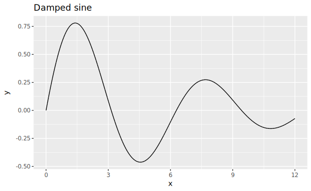</a></td>
    <td><a href="hgg-tutorials/readme-images/ReadmeImages.hs#L102">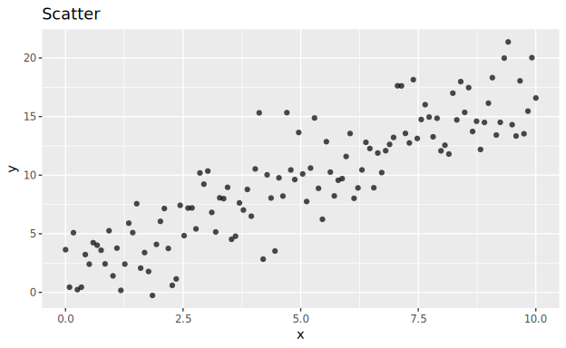</a></td>
    <td><a href="hgg-tutorials/readme-images/ReadmeImages.hs#L107">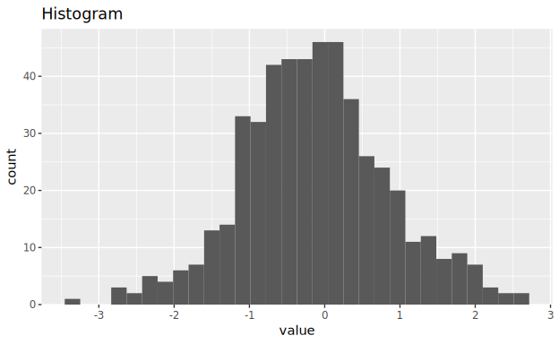</a></td>
    <td><a href="hgg-tutorials/readme-images/ReadmeImages.hs#L112">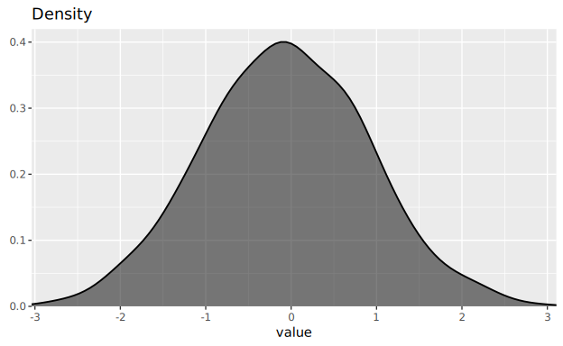</a></td>
  </tr>
  <tr>
    <td><a href="hgg-tutorials/readme-images/ReadmeImages.hs#L124">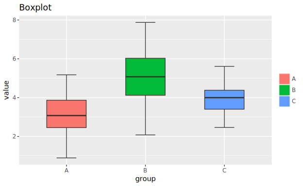</a></td>
    <td><a href="hgg-tutorials/readme-images/ReadmeImages.hs#L129">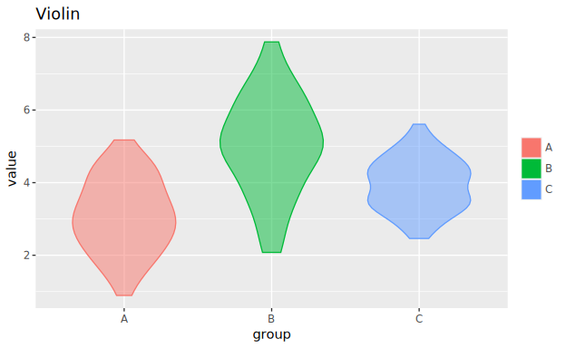</a></td>
    <td><a href="hgg-tutorials/readme-images/ReadmeImages.hs#L151">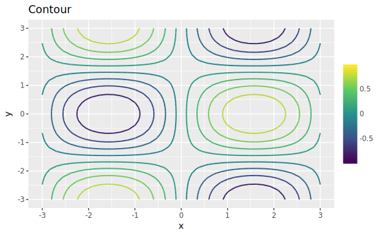</a></td>
    <td><a href="hgg-tutorials/readme-images/ReadmeImages.hs#L156">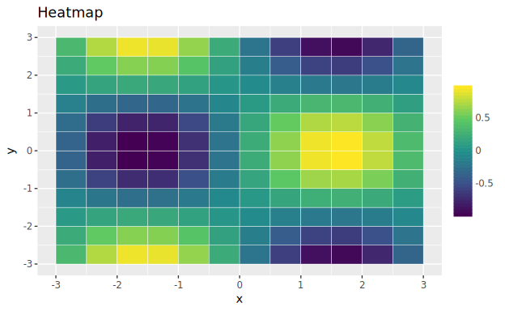</a></td>
  </tr>
  <tr>
    <td><a href="hgg-tutorials/readme-images/ReadmeImages.hs#L215">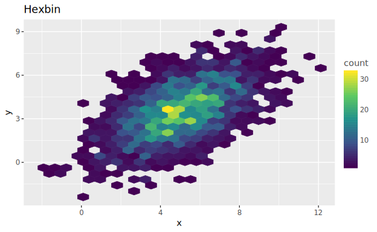</a></td>
    <td><a href="hgg-tutorials/readme-images/ReadmeImages.hs#L167">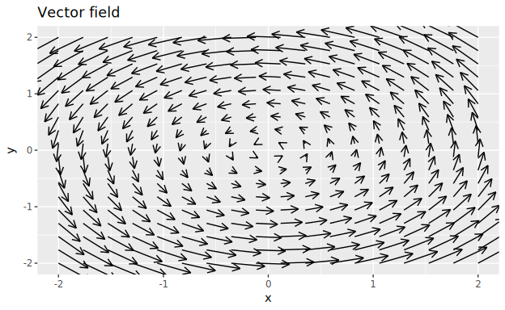</a></td>
    <td><a href="hgg-tutorials/readme-images/ReadmeImages.hs#L177">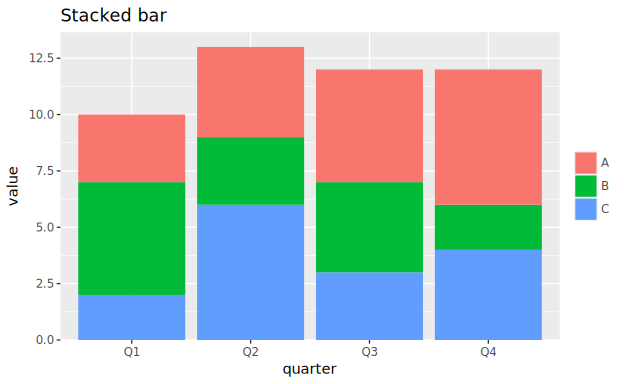</a></td>
    <td><a href="hgg-tutorials/readme-images/ReadmeImages.hs#L182">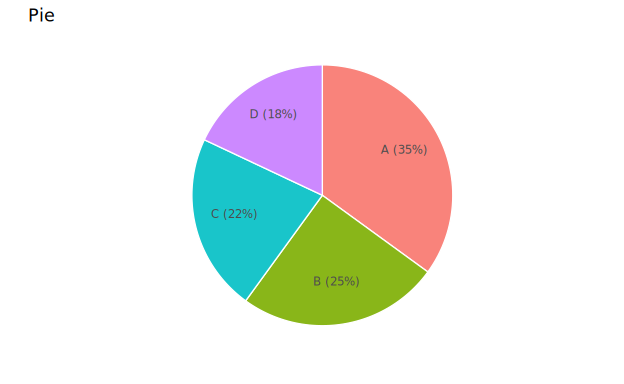</a></td>
  </tr>
  <tr>
    <td><a href="docs/api-guide/04-decoration.md#facet">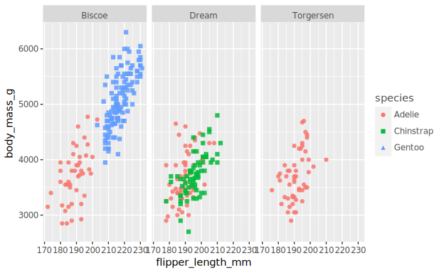</a></td>
    <td><a href="hgg-tutorials/readme-images/ReadmeImages.hs#L139">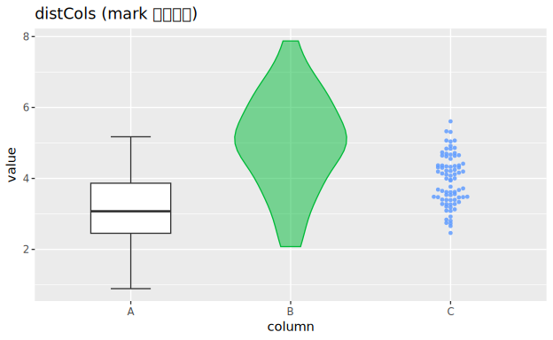</a></td>
    <td><a href="hgg-tutorials/readme-images/ReadmeImages.hs#L188">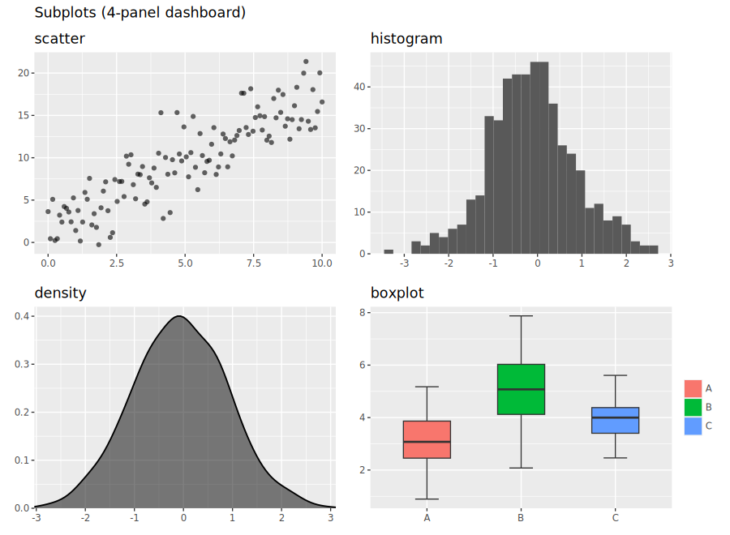</a></td>
    <td><a href="hgg-tutorials/readme-images/ReadmeImages.hs#L204">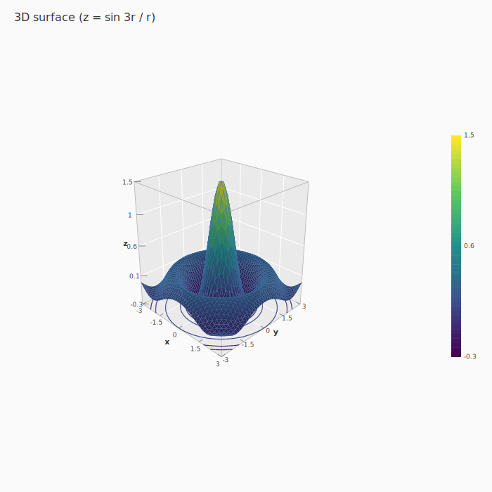</a></td>
  </tr>
  <tr>
    <td><a href="hgg-tutorials/readme-images/ReadmeImages.hs#L226">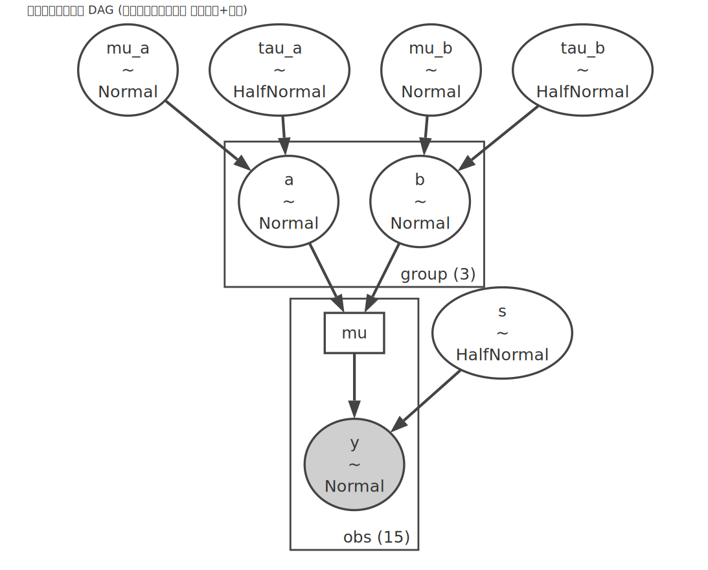</a></td>
  </tr>
</table>

Click any figure to jump to its **generating code**
([`hgg-tutorials/readme-images/ReadmeImages.hs`](hgg-tutorials/readme-images/ReadmeImages.hs));
the facet figure comes from the [R4DS tutorial](docs/tutorials/01-visualize/README.md).
The full API reference lives in the [api-guide](docs/api-guide/02-layers.md).
All 24 penguins figures with reproduction code are in
[R for Data Science, chapter 1](docs/tutorials/01-visualize/README.md).

## Installation

The quickest way is the umbrella package
[`hgg`](https://hackage.haskell.org/package/hgg) — it brings in the core,
the dataframe binding and the SVG backend, and one `import Graphics.Hgg`
covers everything in the quick start below.

```
build-depends: hgg
```

Optional backends are enabled with manual cabal flags — in your `cabal.project`:

```
constraints: hgg +pdf +png +latex +3d
```

(`pdf` = `hgg-pdf`, `png` = `hgg-rasterific` with Japanese font support,
`latex` = `hgg-latex` TikZ output, `3d` = `hgg-3d`.)

Alternatively, skip the umbrella and pick packages directly (the core comes
in as a dependency):

```
build-depends: hgg-svg          -- core + SVG backend
             , hgg-dataframe     -- (optional) DataFrame integration
```

For PDF use `hgg-pdf`, for PNG (Japanese fonts supported) `hgg-rasterific`,
for Jupyter inline display `hgg-ihaskell`.

## Quick start

The shortest form is one line (`Graphics.Hgg.Quick` — one figure, no decisions beyond the data).

```haskell
import Graphics.Hgg.Quick

main :: IO ()
main = quickScatter "scatter.svg" [1,2,3,4,5] [1,4,9,16,25]
```

To add decorations, use `Graphics.Hgg.Easy` (direct values + `overlay`).

```haskell
import Graphics.Hgg.Easy
import Graphics.Hgg.Backend.SVG (saveSVG)
import Graphics.Hgg.Unit (px, (*~))

main :: IO ()
main = saveSVG "easy.svg" $
     overlay [ points [1,2,3,4,5] [1,4,9,16,25] ]
  <> title "y = x²" <> xLabel "x" <> yLabel "y"
  <> widthUnit (600 *~ px) <> heightUnit (400 *~ px)
```

To work with **column names**, bind a data source with `|>>` (the idiomatic
style). Put a value that has columns on the left of `|>>` (below: inline
`[(name, ColData)]`; with `hgg-dataframe` you can pass a `DataFrame` directly)
and refer to columns by name in the spec on the right, e.g. `scatter "x" "y"`.
`|>>` binds more loosely than `<>`, so no outer parentheses are needed even
with several layers. The next section shows `|>>` on real data
(the palmerpenguins CSV).

```haskell
import Graphics.Hgg.Spec
import Graphics.Hgg.Frame       ((|>>))
-- import Graphics.Hgg.DataFrame       ((|>>))
import Graphics.Hgg.Backend.SVG (saveSVGBound)
import qualified Data.Vector as V
import Data.Text (Text)

main :: IO ()
main = saveSVGBound "bound.svg" $
     cols |>> layer (scatter "x" "y")
  <> title "y = x²" <> xLabel "x" <> yLabel "y"
  where
    cols = [ ("x", NumData (V.fromList [1,2,3,4,5]))
           , ("y", NumData (V.fromList [1,4,9,16,25])) ] :: [(Text, ColData)]
```
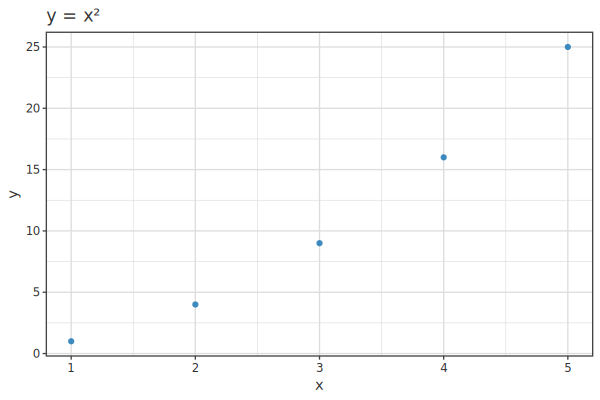


## A taste of the grammar

A plot is the empty `purePlot` plus `layer (mark …)` pieces combined with `<>`.
Data is bound with `|>>`; colour and shape are given inside the mark with
`colorBy`/`shapeBy` (below, `raw` is palmerpenguins:
`raw <- DF.readCsv "penguins.csv"`).

**1. Scatter** — a `scatter` mark with column names produces axes and points.

```haskell
saveSVGBound "04-scatter.svg" $
  raw |>> layer (scatter "flipper_length_mm" "body_mass_g" <> alpha 0.85)
      <> xLabel "flipper_length_mm" <> yLabel "body_mass_g"
      <> theme ThemeGrey
```


**2. Colour by species** — add `colorBy "species"` to the mark.

```haskell
saveSVGBound "05-color.svg" $
  raw |>> layer (scatter "flipper_length_mm" "body_mass_g"
                 <> colorBy "species" <> alpha 0.85)
      <> xLabel "flipper_length_mm" <> yLabel "body_mass_g"
      <> legendTitle "species"
      <> theme ThemeGrey
```

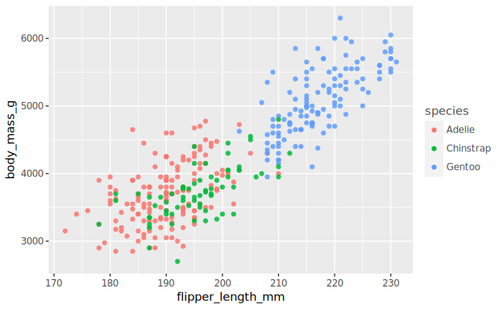

**3. Overlay a regression line and labels** — keep adding layers and decorations with `<>`.

```haskell
saveSVGBoundStats "09-final.svg" $
  raw |>> layer (scatter "flipper_length_mm" "body_mass_g"
                 <> colorBy "species" <> shapeBy "species" <> alpha 0.85)
      <> layer (statLm "flipper_length_mm" "body_mass_g" <> color smoothBlue)
      <> palette okabeIto
      <> title "Body mass and flipper length"
      <> subtitle "Dimensions for Adelie, Chinstrap, and Gentoo Penguins"
      <> xLabel "Flipper length (mm)" <> yLabel "Body mass (g)"
      <> legendTitle "Species"
      <> theme ThemeGrey
```


The full step-by-step walkthrough is in
[R for Data Science, chapter 1](docs/tutorials/01-visualize/README.md).

## What you can do

- **Layer/mark declarative API** — scatter, line, bar, histogram, boxplot, violin,
  density, band, forest, heatmap, contour, vector field, DAG, MCMC diagnostics, …
- **DataFrame integration** — write `df |>> layer (scatter "x" "y")` with column names
  (NA rows are dropped automatically, i.e. `na.rm`)
- **Backends** — SVG / PDF / PNG (Japanese fonts supported) / LaTeX (TikZ) / Jupyter (iHaskell) inline
- **3D** — response surfaces (RSM) and generic 3D plots (CPU projection)
- **Statistical integration** — `toPlot` / `statLm` / HBM extractors draw
  hanalyze's fitted models directly
- **Full decoration set** — themes / scales / facets / subplots / coordinate systems /
  reference lines / legends (ggplot-alike)

## Design principles

- **Backend-independent core** — `hgg-core` depends only on base / vector / text /
  containers. Render targets (SVG/PDF/PNG) are separate packages.
- **Declarative and pure** — a plot is a pure value, `VisualSpec`. The only side
  effect is the final `saveSVG`. Partial specs are reusable values.
- **Two-tier Monoid API** — `Layer` (marks, aesthetics) + `VisualSpec` (title,
  theme, facets). ggplot-style `<>` composition; the types tell you where each
  piece belongs.

## Documentation

- 📚 **[API Reference](docs/api-guide/README.md)** — organised by topic (quickstart / layers /
  decoration / backends / dataframe / analyze / 3d / appendix)
- 📗 **[Tutorial: R for Data Science, chapter 1](docs/tutorials/01-visualize/README.md)** —
  walkthrough of explanation → code → figure (all 24 figures)
- [Getting Started](docs/getting-started.md) / [ggplot2 Migration Guide](docs/migration-from-ggplot.md)
- [Vega-Lite Comparison](docs/comparison-vega-lite.md) / [Module Structure](docs/modules.md)

## Packages

| Package | Role |
|---|---|
| `hgg-core` | Spec / Layout / Render / Palette |
| `hgg-svg` | SVG backend |
| `hgg-pdf` | PDF backend |
| `hgg-rasterific` | PNG backend (Japanese fonts supported) |
| `hgg-latex` | LaTeX (TikZ) backend |
| `hgg-frame` | `class PlotData` + the `df \|>> spec` binding |
| `hgg-dataframe` | dataframe → Resolver bridge |
| `hgg-3d` | 3D plots (CPU projection) |
| `hgg-ihaskell` | iHaskell (Jupyter) inline display |
| `hgg-custom` | custom marks (dendrogram etc.) |
| `hgg-analyze-bridge` | direct rendering of hanalyze fitted models / ModelGraph |
| `hgg-semi` | semiconductor-domain charts (wafer map / control chart / Pareto etc.) |
| `hgg-doe` | design-of-experiments (DoE) chart helpers |
| `hgg-tutorials` | figure generators for the docs (not a library) |

For which packages are published to Hackage and how, see [RELEASING.md](RELEASING.md).

## Building from source

```bash
cabal build all
cabal test all
```

Developed on GHC 9.6.7; GHC 9.4 / 9.6 / 9.8 are the targets.

## License

[BSD-3-Clause](LICENSE) (same as hanalyze).
