# 05. レイヤ — グラフィックスの文法

> 一次情報: **R for Data Science 2e, Ch.9 "Layers"**
> <https://r4ds.hadley.nz/layers>
> データ: **mpg**(ggplot2 の車燃費データ、234 台)

「あらゆるプロットは **データ + geom + aes(マッピング) + stat + position + 座標系 +
facet + theme** の組み合わせで一意に表せる」 — これがグラフィックスの文法です。
この章は mpg を使って各要素を一通り描きます。実行コードは [`Layers.hs`](Layers.hs)。

## 実行

```sh
cd docs/tutorials/05-layers
cabal run tut-05-layers
```

`01-aes-color.svg` 〜 `14-coord-polar.svg` の 14 枚が生成されます。

---

## 1. 美的マッピング(aes)

変数を色・形などの視覚属性に対応づけます。`color`/`shapeBy` は ggplot の
`aes(color=)`/`aes(shape=)` に対応。`shapeBy` はカテゴリごとに ○△□… を自動割当します。

| R | hgg |
|---|---|
| `aes(color = class)` | `color "class"` |
| `aes(shape = drv)` | `shapeBy "drv"` |
| `geom_point(color = "blue")`(aes の外) | `colorStatic "#2c7fb8"` |

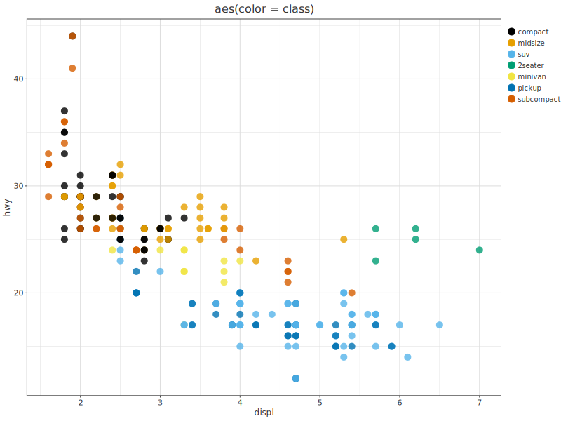
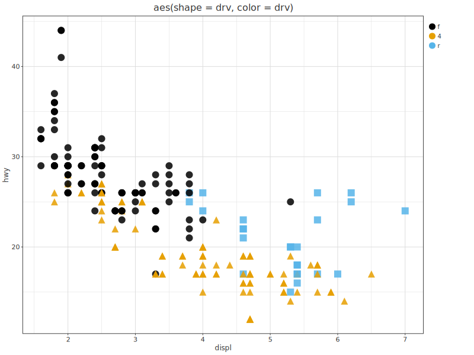
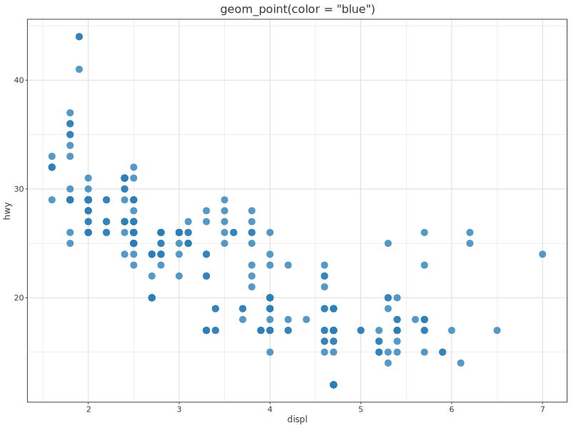

> R4DS は `aes(size = class)` や `aes(alpha = class)`(カテゴリ)も**警告付きの悪い例**
> として示します。hgg にも `sizeBy` はありますが連続量向きなので、ここでは省略します。

## 2. 幾何オブジェクト(geom)

同じデータでも geom を変えると違う側面が見えます。複数の geom を重ねられます。

| R | hgg |
|---|---|
| `geom_point() + geom_smooth(aes(linetype = drv))` | `layer (scatter …) <> layer (statSmooth … <> linetypeBy "drv")` |
| `geom_histogram()` / `geom_boxplot()` | `histogram "hwy"` / `boxplotBy "drv" "hwy"` |

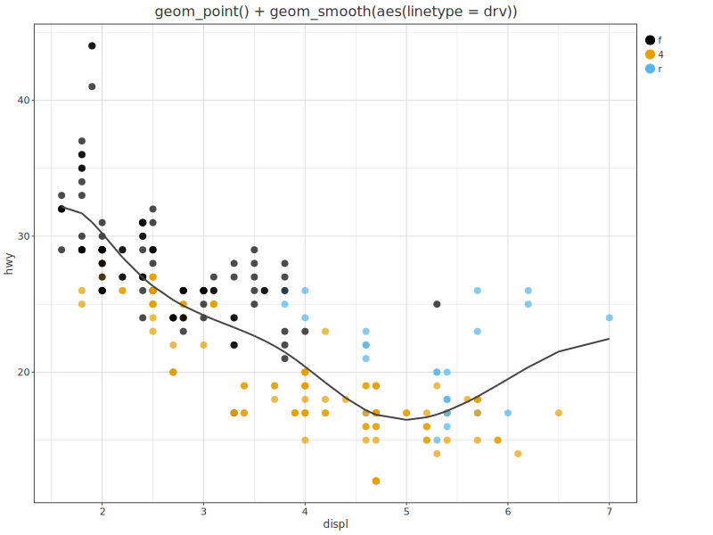
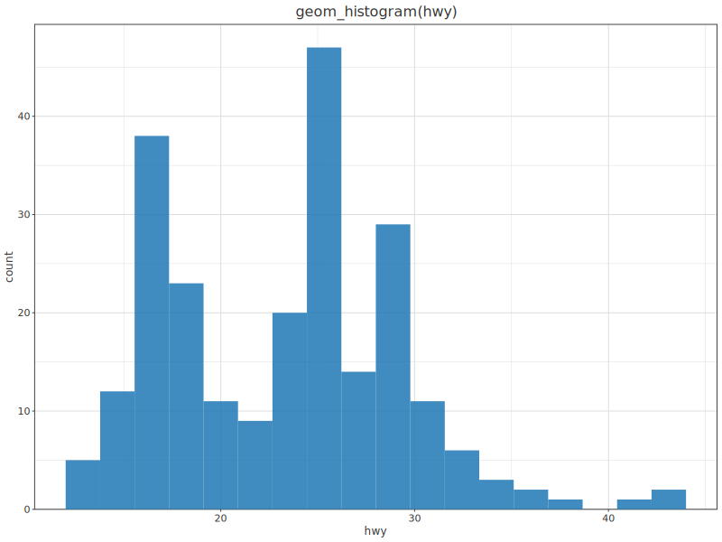
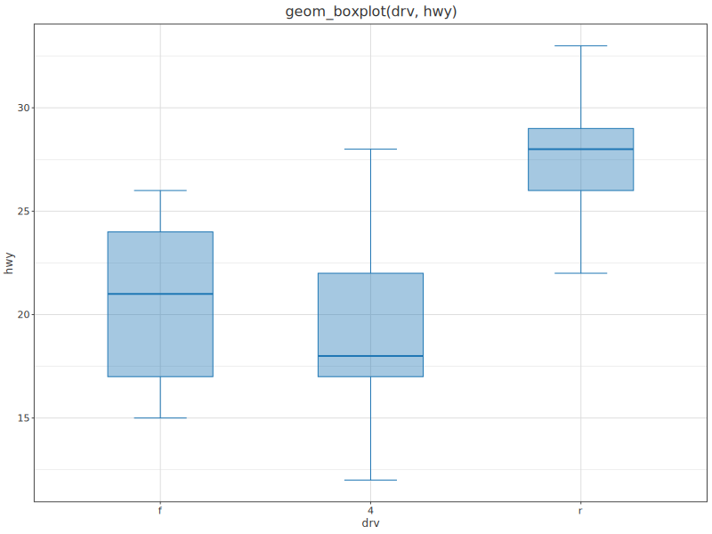

平滑線は stat レイヤなので `saveSVGBoundStats` で描きます。`linetypeBy "drv"` で
駆動方式ごとに線種を分けています。

## 3. ファセット(facet)

カテゴリでパネルに分割します。

| R | hgg |
|---|---|
| `facet_wrap(~cyl)` | `facetWrap "cyl" 2` |
| `facet_grid(drv ~ cyl)` | `facetGrid "drv" "cyl"` |

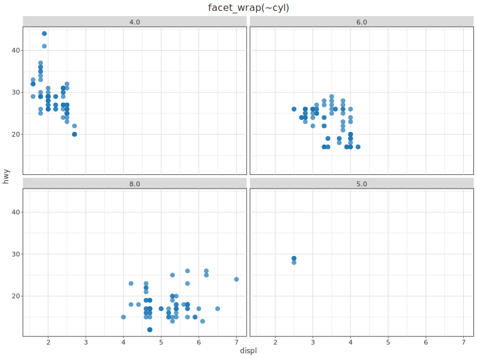
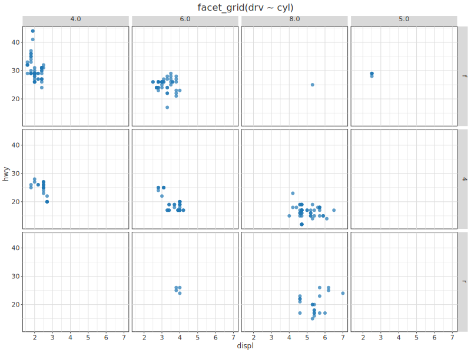

## 4 + 5. 統計変換(stat)と位置調整(position)

`geom_bar` は内部でカテゴリを数えます(`stat_count`)。hgg の `bar` は x,y を
要求するので件数を `groupBy`+`aggregate` で先に集計します。群分け(`color`)があるとき
`position` で積み方を選べます。

| R | hgg |
|---|---|
| `geom_bar()`(件数) | 集計してから `bar "drv" "n"` |
| `position = "stack"` / `"dodge"` / `"fill"` | `position PosStack` / `PosDodge` / `PosFill` |
| `geom_jitter()` | `scatter … <> jitterX 0.02 <> jitterY 0.02` |

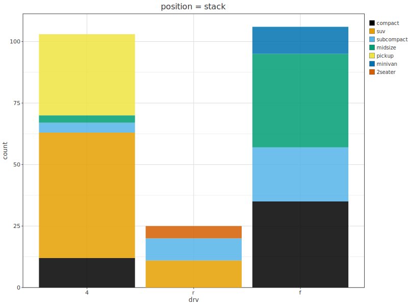
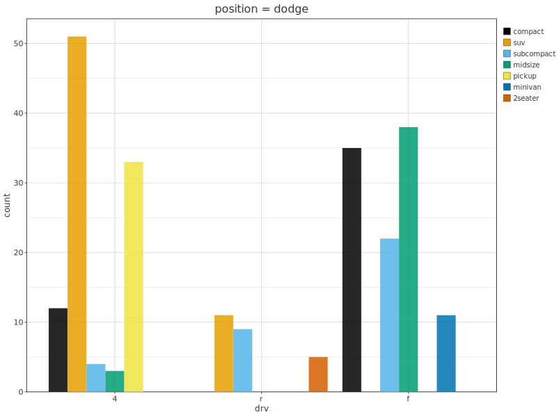
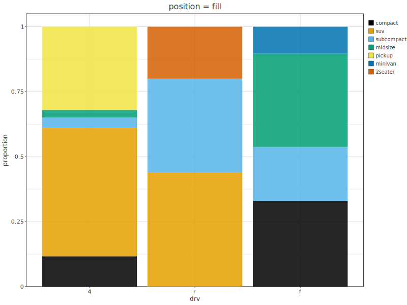
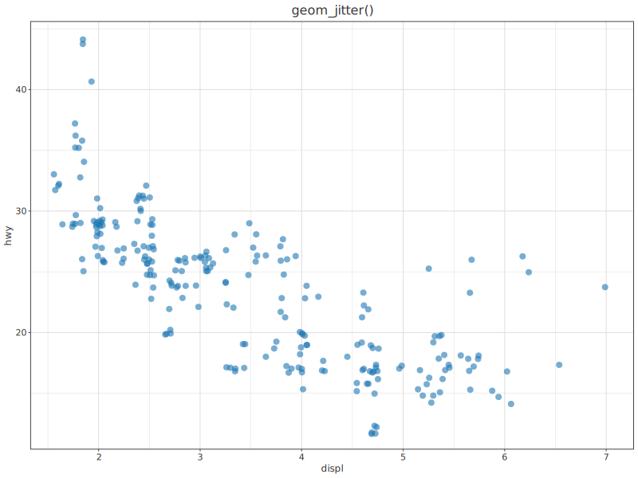

`stack` は積み上げ、`dodge` は横並び、`fill` は各群を合計 1 に正規化(割合比較)。
`jitter` は点を少しずらして重なりを避けます。

## 6. 座標系(coord)

| R | hgg |
|---|---|
| `coord_flip()` | `coordFlip` |
| `coord_polar()`(棒 → Coxcomb) | `coordPolar` |

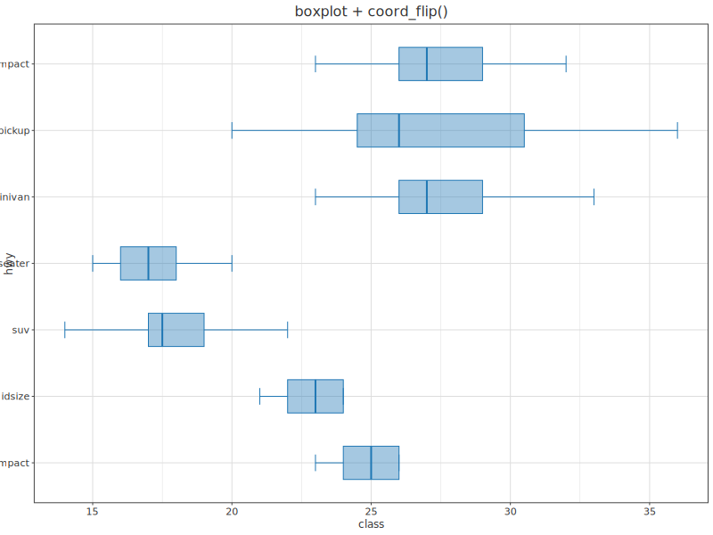
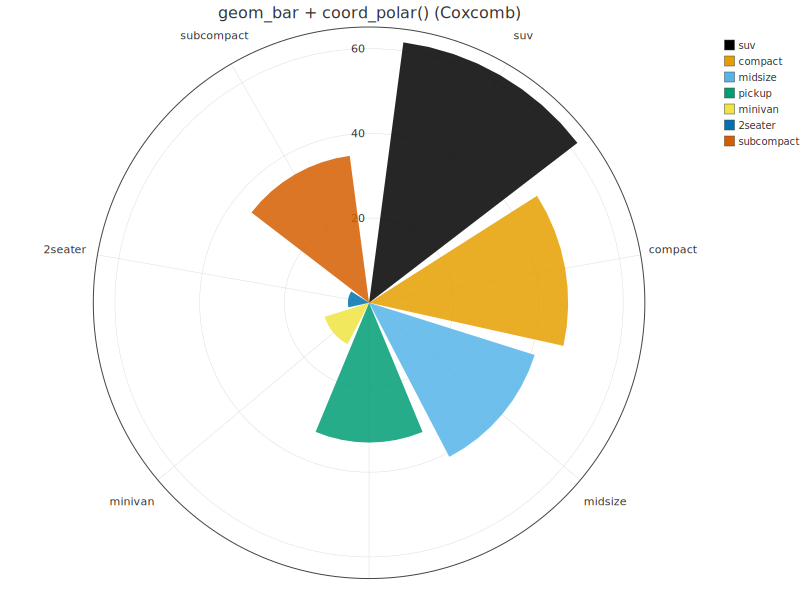

`coord_flip` で箱ひげを横向きに(ラベルが長いとき読みやすい)。`coord_polar` で棒グラフを
極座標に写すと R4DS の Coxcomb(鶏頭図)になります。

---

## この章で出てきた対応表(まとめ)

| ggplot2 | hgg |
|---|---|
| `aes(color=)` / `aes(shape=)` | `color "c"` / `shapeBy "c"` |
| `geom_point(color="blue")` | `colorStatic "…"` |
| `geom_smooth(aes(linetype=g))` | `statSmooth … <> linetypeBy "g"` |
| `geom_histogram` / `geom_boxplot` | `histogram` / `boxplotBy` |
| `facet_wrap(~g)` / `facet_grid(a~b)` | `facetWrap "g" n` / `facetGrid "a" "b"` |
| `geom_bar()`(stat_count) | `groupBy`+`aggregate [count]` → `bar` |
| `position = stack/dodge/fill` | `position PosStack/PosDodge/PosFill` |
| `geom_jitter()` | `jitterX`/`jitterY` |
| `coord_flip()` / `coord_polar()` | `coordFlip` / `coordPolar` |

前章 → [`04-import`](../04-import/)。
次章 → [`06-eda`](../06-eda/)(Ch10 EDA・diamonds)。
