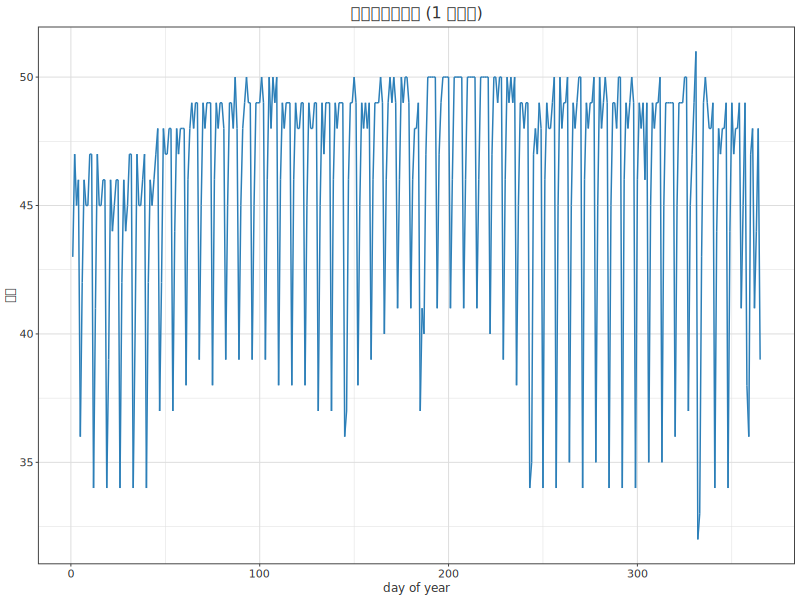
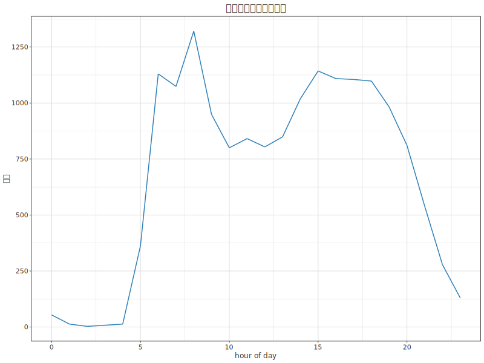
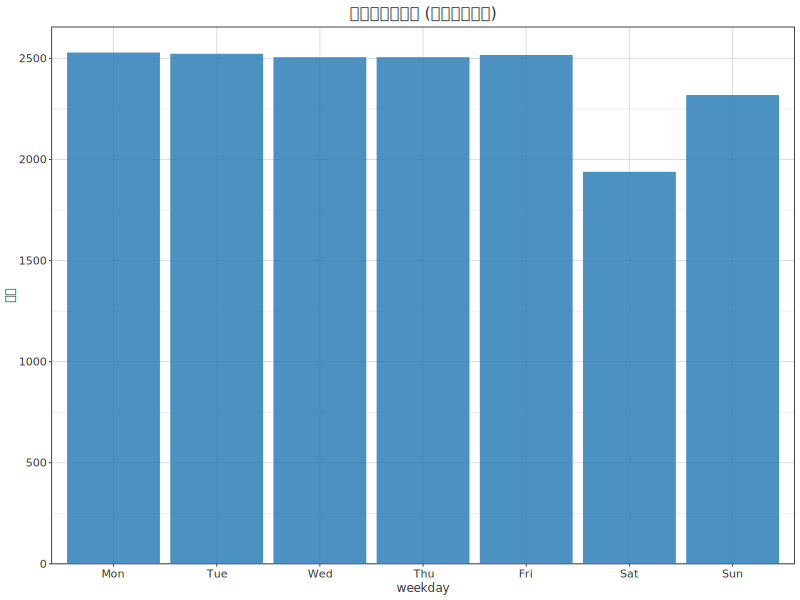
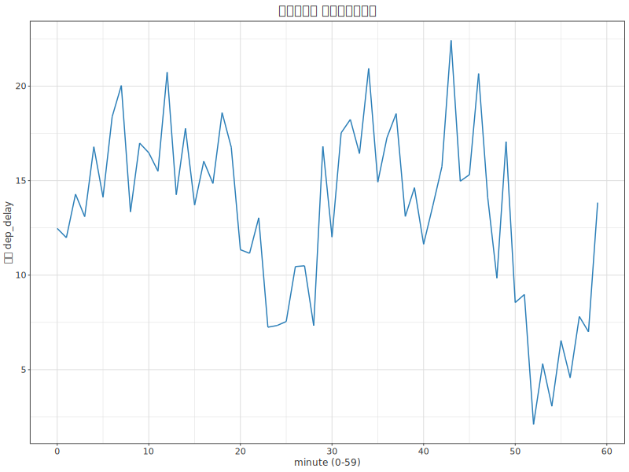
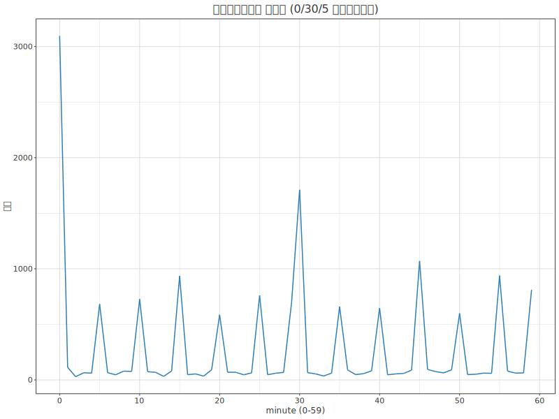

# 08. 日付と時刻 — Dates and times

> 一次情報: **R for Data Science 2e, Ch.17 "Dates and times"**
> <https://r4ds.hadley.nz/datetimes>
> データ: **nycflights13** の `flights`(全 12 月を保つ系統サンプル 1/20 = 16,839 行。
> 実データの部分集合・値不変。出所 [`../_data/_raw/SOURCE.md`](../_data/_raw/SOURCE.md))

時刻の成分(年内の日・時間帯・曜日・分)を取り出し、時間単位で集計して
パターンを見つけます。実行コードは [`Datetimes.hs`](Datetimes.hs)。

## 実行

```sh
cd docs/tutorials/08-datetimes
cabal run tut-08-datetimes
```

## lubridate の代わりに `Data.Time`

R4DS は lubridate(`make_datetime` / `year()` / `wday()` …)で日時を扱いますが、
dataframe にはこれに相当する日時型・関数がありません。本章では Haskell 標準の
**`Data.Time`** で実カレンダー演算します(捏造ではなく実際の暦)。`flights` の
`year`/`month`/`day` から日付を作り、年内通算日や曜日を求めて集計します。

```haskell
import Data.Time.Calendar (fromGregorian, dayOfWeek)
import Data.Time.Calendar.OrdinalDate (toOrdinalDate)

let day_ = fromGregorian (toInteger y) m d
    yday = snd (toOrdinalDate day_)   -- 年内通算日 1..365
    wday = dayOfWeek day_             -- Mon..Sun (Data.Time は 1 始まり)
```

成分の集計は `Data.Map.fromListWith` で行い、結果を `DF.fromNamedColumns` で
DataFrame に組み立てて描きます(R4DS の `group_by(time_unit) |> summarize()` に相当)。

| R (lubridate) | hgg / Data.Time |
|---|---|
| `make_datetime(year, month, day, ...)` | `fromGregorian year month day`(+ HHMM を `div`/`mod 100`) |
| `yday(x)` | `snd (toOrdinalDate day_)` |
| `wday(x, label=TRUE)` | `dayOfWeek day_` |
| `hour(x)` / `minute(x)` | `dep_time \`div\` 100` / `dep_time \`mod\` 100` |
| `group_by(unit) |> summarize(n=n())` | `Data.Map.fromListWith` → `DF.fromNamedColumns` |

---

## 1. 年内の便数推移(`01-by-day.svg`)

年内通算日ごとの便数を折れ線で。週単位の周期(週末が少ない)が鋸歯状に見えます。



## 2. 時間帯分布(`02-by-hour.svg`)

出発時刻の「時」ごとの便数。早朝〜夜(6〜20 時)に集中し、朝と夕方に山ができます。



## 3. 曜日ごとの便数(`03-by-weekday.svg`)

`dayOfWeek` で曜日を求めて棒グラフに。月〜金は多く、土曜が最も少なく、日曜はやや減ります。



## 4. 出発「分」ごとの平均遅延(`04-delay-by-minute.svg`)

出発時刻の「分」(`mod 100`)ごとに `dep_delay` の平均を取ります。実際の出発が多い
:20〜30 分、:50〜60 分あたりで遅延が小さめになる傾向が見えます。



## 5. 予定出発「分」の頻度 — 丸め癖(`05-sched-minute-freq.svg`)

予定出発時刻の「分」の頻度。**0 分**に突出、**30 分**に大きな山、**5 の倍数**にも
小さな山が並びます。人がキリのよい時刻を好む(丸め癖)ことが如実に出ます
(R4DS の Figure 17.1 と同じ発見)。



---

## この章で出てきた対応表(まとめ)

| lubridate / dplyr | hgg / Data.Time |
|---|---|
| `make_datetime(...)` | `fromGregorian` + `div`/`mod 100` |
| `yday` / `wday` / `hour` / `minute` | `toOrdinalDate` / `dayOfWeek` / `div 100` / `mod 100` |
| `group_by(unit) |> summarize` | `Data.Map.fromListWith` → `DF.fromNamedColumns` |
| `geom_freqpoly` / `geom_line` / `geom_bar` | `line` / `bar` |

> 注: `flights` の `time_hour`(ISO 日時文字列)は、dataframe では `Day` 型に
> なり得ますが plot resolver が `Day` を直接扱えないため、本章では
> `year`/`month`/`day`/`dep_time` の整数列から成分を計算しています。

前章 → [`07-communication`](../07-communication/)。
次章 → [`09-missing`](../09-missing/)(Ch18 Missing values)。
