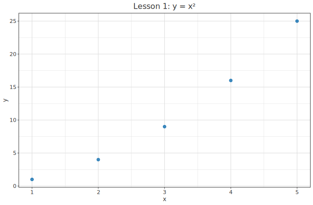
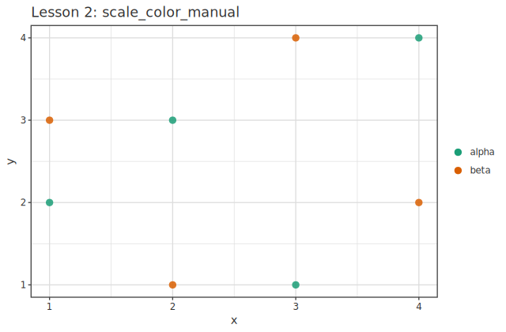

# クイックスタート ─ 30 秒で 1 枚 + 書き方の 3 層

> [📚 索引](README.md) ｜ **01 quickstart** ｜ [02 layers](02-layers.md) ｜ [03 encoding & scale](03-encoding-scale.md) ｜ [04 decoration](04-decoration.md) ｜ [05 backends](05-backends.md) ｜ [06 dataframe](06-dataframe.md) ｜ [07 analyze](07-analyze.md) ｜ [08 3d](08-3d.md) ｜ [09 appendix](09-appendix.md)

hgg で 1 枚出すための最短経路と、 **書き方の 3 層** (Easy / Grammar / DataFrame) を示す。
設定の一覧は [02 layers](02-layers.md) / [03 encoding & scale](03-encoding-scale.md) / [04 decoration](04-decoration.md)、 backend の選択は
[05 backends](05-backends.md)、 列名で書く DataFrame 連携は [06 dataframe](06-dataframe.md)、
回帰・GLM・HBM を描くなら [07 analyze](07-analyze.md) が辞書になる。

このページの構成:
**[30 秒で 1 枚 (Quick 層)](#quickstart-30s)** ｜ **[Easy 層](#easy)** ｜ **[Grammar 層](#grammar)**

> **2 つの黄金律 (これだけ先に覚える)**
>
> 1. 図は **`purePlot <> layer (mark …) <> 設定 …`** の形。 `<>` で部品を足していく
>    (`mark` = `scatter`/`line`/`bar`/… の描画種。 型は `MarkKind`)。
> 2. `<>` には **2 種類**ある。 mark・見た目は **`Layer`** を返し `layer (…)` の**中**で `<>`、
>    タイトル・テーマ・facet 等は **`VisualSpec`** を返し `layer (…)` の**外**で `<>`。
>    → 型を見れば置き場所が分かる ([重畳の仕組み](04-decoration.md#overlay) で詳説)。

| 層 | モジュール | 立ち位置 |
|---|---|---|
| **0. Quick** | `Hgg.Plot.Quick` | `IO` ワンショット。 `quickScatter "out.svg" xs ys` |
| **1. Easy** | `Hgg.Plot.Easy` | `[Double]` 直渡し + `overlay` 既定 |
| **2. Grammar** | `Hgg.Plot.Spec` | ggplot 同型の channel + `<>` 合成 (主役) |
| **3. Typed** | `Hgg.Plot.Spec` + `Resolver` | 型付き channel / scale / Resolver で encoding 制御 |
| **4. Low-level** | `Hgg.Plot.Render` | `Primitive` 直書き (backend 自作・特殊描画) |

> `Easy` は `Spec` を丸ごと再 export + 値直渡しヘルパ。 `Quick` は `Easy` を再 export +
> `IO` 保存ヘルパ。 **どれを import しても下位層の全機能が使える**。

---

## 30 秒で 1 枚 (Quick 層) {#quickstart-30s}

データ以外を何も決めずに 1 枚出す。 `hgg-svg` の `Hgg.Plot.Quick`。

```haskell
import Hgg.Plot.Quick

main :: IO ()
main = do
  quickScatter "scatter.svg" [1,2,3,4,5] [1,4,9,16,25]
  quickLine    "line.svg"    [1,2,3,4,5] [2,3,1,5,4]
  quickBar     "bar.svg"     [1,2,3]     [10,20,15]
  quickHist    "hist.svg"    [1,1,2,3,3,3,4,5,5]
```

`quickScatter / quickLine / quickBar :: FilePath -> [Double] -> [Double] -> IO ()`、
`quickHist :: FilePath -> [Double] -> IO ()`。 複数 geom を 1 枚にするなら
`quickPlot :: FilePath -> [Layer] -> IO ()`。

---

## Easy 層 ─ 値を直接渡す {#easy}

`inline` を書かず `[Double]` を直接渡し、 重畳は `overlay` で包む。 飾りは `<>` で足す。

```haskell
import Hgg.Plot.Easy
import Hgg.Plot.Backend.SVG (saveSVG)
import Hgg.Plot.Unit (px, (*~))   -- px サイズ指定用 (既定単位は mm・省略時 6.5×4in)

main :: IO ()
main = saveSVG "easy.svg" $
     overlay [ points [1,2,3,4,5] [1,4,9,16,25] ]
  <> title "y = x²" <> xLabel "x" <> yLabel "y"
  <> widthUnit (600 *~ px) <> heightUnit (400 *~ px)
```



値直渡しヘルパ: `points` / `lineXY` / `bars` / `hist` / `plotY` (index を x に取る)。
重畳は `overlay [layer群]` (= `plots` も同義)。
→ 動く例: `cabal run tutorial-01-easy`

---

## Grammar ─ ggplot 文法で書く {#grammar}

`purePlot` (空の図) に `layer (mark …)` を足し、 channel は `inline` (数値) /
`inlineCat` (カテゴリ) で作る。 aesthetic は **mark の中で** `<>`。

```haskell
import Hgg.Plot.Spec
import Hgg.Plot.Backend.SVG (saveSVG)
import Data.Text (Text)

main :: IO ()
main = do
  let xs = inline    [1,2,3,4, 1,2,3,4]
      ys = inline    [2,3,1,4, 3,1,4,2]
      gs = inlineCat (concatMap (replicate 4) (["alpha","beta"] :: [Text]))
  saveSVG "grammar.svg" $
       purePlot
    <> layer (scatter xs ys <> colorBy gs <> size 6)   -- ← aesthetic は layer の中
    <> scaleColorManual [("alpha","#1B9E77"), ("beta","#D95F02")]  -- ← scale は外
    <> legend
    <> title "scale_color_manual"
```



ggplot2 でいう `ggplot(d, aes(x,y,color=g)) + geom_point(size=6) +
scale_color_manual(...)`。
→ 動く例: `cabal run tutorial-02-grammar`

