# レイヤとマーク ─ リファレンス

> 🌐 [English](02-layers.md) | **日本語**

> [📚 索引](README.ja.md) ｜ [01 quickstart](01-quickstart.ja.md) ｜ **02 layers** ｜ [03 encoding & scale](03-encoding-scale.ja.md) ｜ [04 decoration](04-decoration.ja.md) ｜ [05 backends](05-backends.ja.md) ｜ [06 dataframe](06-dataframe.ja.md) ｜ [07 analyze](07-analyze.ja.md) ｜ [08 3d](08-3d.ja.md) ｜ [09 appendix](09-appendix.ja.md)

合成単位は **layer**、描画の種類は **mark** (型名 `MarkKind`)、個別関数は `scatter` / `line` / `bar` / …。
mark は `layer (mark <> 修飾子…)` の形で図に重ねる。引数の `ColRef` は **`inline [..]`** (数値)・
**`inlineCat [..]`** (カテゴリ)、または DataFrame 利用時の**列名リテラル** `"weight"` ([06 dataframe](06-dataframe.ja.md))。

このページは **描けるグラフ (mark) のカタログ**に専念する。構成: **[1. 役割別 mark 索引](#index)**(1 行 1 mark・
詳細へ 1 ホップ) → **[2. mark 定型エントリ](#entries)**(mark ごとの統一フォーマット)。

> 全 mark 共通の見た目・channel 修飾子 (`colorBy` / `size` / `shape` / `position` / 固定色 `Color` 等) と
> scale・軸の制御は [03 encoding & scale](03-encoding-scale.ja.md) にまとめてある。各定型エントリの「encoding」欄は
> そのページの修飾子を指す。

> ggplot2 利用者向け: 本ライブラリの **mark** は ggplot の `geom_*` に相当する (例: `scatter` =
> `geom_point`)。「geom」は ggplot 方言で Wilkinson の Grammar of Graphics には無いため、本リファレンスでは
> native の **mark / layer** を用い、「geom」は ggplot 相互参照のみで使う。

> 図について: 図つきの最小例を順次補完中。図が未掲載のエントリも、シグネチャ・encoding・コード例で
> 仕様は完結している。残りの図は `cabal run doc-figures` で生成して追補する。

> **実例で見る**: 多くの mark の実データ作例は [README ギャラリー](../../README.ja.md)
> (クリックで各エントリへ) と [R for Data Science 第 1 章](../tutorials/01-visualize/README.ja.md)
> (penguins 全 24 図 + 再現コード) にあります。

---

<a id="index"></a>

## 1. 役割別 mark 索引

mark を **文法上の役割**でグループ化した索引。各行 = `関数 :: 型 ｜ 1 行説明`。関数名のリンクで
[2. mark 定型エントリ](#entries) へ 1 ホップ。

### 基本 (x, y)

| 関数 | 型 | 説明 |
|---|---|---|
| [`scatter`](#e-xy) / [`line`](#e-xy) / [`step`](#e-xy) | `ColRef -> ColRef -> Layer` | 散布 / 折れ線 / 階段 |
| [`bar`](#e-bar) | `ColRef -> ColRef -> Layer` | 棒 |
| [`scatterPoints`](#e-points) / [`linePoints`](#e-points) | `[Point2] -> Layer` | `Point2 x y` のリストから直接 |
| [`text`](#e-text) / [`label`](#e-text) | `ColRef -> ColRef -> ColRef -> Layer` | (x, y, ラベル列) のテキスト / ラベル |
| [`stem`](#e-stem) | `ColRef -> ColRef -> Layer` | 棒付き点 (lollipop) |
| [`ecdf`](#e-ecdf) | `ColRef -> Layer` | 経験累積分布 (1 列) |

### 分布

| 関数 | 型 | 説明 |
|---|---|---|
| [`histogram`](#e-histogram) / [`freqpoly`](#e-histogram) | `ColRef -> Layer` | ヒストグラム / 度数折れ線 |
| [`density`](#e-density) / [`densityNorm`](#e-density) | `ColRef -> Layer` | 密度 / 正規化密度 |
| [`boxplot`](#e-boxplot) | `ColRef -> Layer` | 箱ひげ (値 1 列) |
| [`violin`](#e-violin) / [`strip`](#e-violin) / [`swarm`](#e-violin) | `ColRef -> Layer` | 値 1 列の分布 |
| [`raincloud`](#e-raincloud) | `ColRef -> Layer` | violin + box + strip の preset |
| [`ridge`](#e-ridge) | `ColRef -> Layer` | joyplot (coord_flip 自動) |
| [`qq`](#e-qq) | `ColRef -> Layer` | QQ プロット |
| [`(<+>)`](#dist-compose) / [`distCols`](#dist-compose) | `Layer -> Layer -> Layer` / `[Layer] -> VisualSpec` | 分布 mark の合成・併置 |

### 区間 / エラー

| 関数 | 型 | 説明 |
|---|---|---|
| [`band`](#e-band) | `ColRef -> ColRef -> ColRef -> Layer` | (x, lo, hi) のリボン |
| [`lineRange`](#e-range) / [`pointRange`](#e-range) / [`crossbar`](#e-range) | `ColRef -> ColRef -> ColRef -> Layer` | (x, y, err) の対称区間 (y±err) |
| [`forest`](#e-forest) | `ColRef -> ColRef -> ColRef -> Layer` | (ラベル, 推定, err) の forest |
| [`funnel`](#e-funnel) | `ColRef -> ColRef -> Layer` | (推定, SE) のファネル |

### 積層 area / 時系列

| 関数 | 型 | 説明 |
|---|---|---|
| [`stream`](#e-stream) | `ColRef -> ColRef -> Layer` | streamgraph (中心化積層 area) |

### 集計 / 統計

| 関数 | 型 | 説明 |
|---|---|---|
| [`statFunction`](#e-statfunction) | `(Double -> Double) -> Double -> Double -> Int -> Layer` | 関数を (lo, hi) を n 分割して曲線化 |
| [`statMean`](#e-statmean) / [`statMedian`](#e-statmean) | `ColRef -> Layer` | 平均 / 中央値の参照 |
| `statLm` / `statSmooth` ([07](07-analyze.ja.md)) | `ColRef -> ColRef -> Layer` | 回帰直線 / 平滑 (analyze が fit・帯つき) |
| [`countXY`](#e-countxy) | `ColRef -> ColRef -> Layer` | (x, y) の出現数集計 |
| [`histogramWide`](#e-histogramwide) | `[ColRef] -> VisualSpec` | 複数列を重ねたヒスト |

> 学習モデル由来の stat (`statLm` / `statSmooth` / `statPoly` 等) は [07 analyze](07-analyze.ja.md) を参照。

### 2 次元場 / 行列

| 関数 | 型 | 説明 |
|---|---|---|
| [`contour`](#e-contour) / [`contourFilled`](#e-contour) | `ColRef -> ColRef -> ColRef -> Layer` | 等値線 / 塗り等高線 |
| [`bin2d`](#e-bin2d) / [`bin2dCount`](#e-bin2d) | `ColRef -> ColRef -> (ColRef ->) Layer` | 2D bin の連続色塗り (z 指定 / 個数) |
| [`hexbin`](#e-hexbin) | `ColRef -> ColRef -> Layer` | 六角ビニング (件数→連続色、 geom_hex) |
| [`heatmap`](#e-heatmap) | `ColRef -> ColRef -> ColRef -> Layer` | カテゴリ grid の塗り |
| [`pie`](#e-pie) | `ColRef -> ColRef -> Layer` | (カテゴリ, 値) の円 |
| [`waterfall`](#e-waterfall) | `ColRef -> ColRef -> Layer` | 累積寄与の滝チャート |
| [`parallelCoords`](#e-parallelcoords) | `[ColRef] -> Layer` | 平行座標 |
| [`pairs`](#e-pairs) | `[ColRef] -> VisualSpec` | 散布図行列 |

### ベクトル場

| 関数 | 型 | 説明 |
|---|---|---|
| [`quiver`](#e-quiver) | `ColRef -> ColRef -> ColRef -> ColRef -> Layer` | (x, y, u, v) の矢印 |

### MCMC / ベイズ診断

| 関数 | 型 | 説明 |
|---|---|---|
| [`trace`](#e-trace) / [`traceLines`](#e-trace) | `ColRef -> ColRef -> (ColRef ->) Layer` | (iter, 値) の trace / chain 別 trace |
| [`ess`](#e-ess) | `ColRef -> ColRef -> Layer` | (iter, ESS) |
| [`autocorr`](#e-autocorr) | `ColRef -> Layer` | 自己相関 |

> `chain :: ColRef -> Layer` は単独の mark ではなく、`trace` / `ess` / `autocorr` に `<>` で足して
> **chain 別に分割**する修飾子 (`traceLines` は chain 列を直接引数で取る)。

### DAG (HBM ModelGraph 等)

| 関数 | 型 | 説明 |
|---|---|---|
| [`dag`](#e-dag) | `[DAGNode] -> [DAGEdge] -> Layer` | ノード + エッジで DAG |
| [`dagFromLists`](#e-dag) | `… -> DAGLayoutAlgorithm -> Layer` | レイアウト指定つき |
| [`dagFromListsWithPlates`](#e-dag) | `… -> [DAGPlate] -> Layer` | plate 枠つき |

> `VisualSpec` を返す `histogramWide` / `pairs` / `distCols` は `layer` で包まず直接 `<>` する (図全体を成す)。

---

<a id="entries"></a>

## 2. mark 定型エントリ

各 mark を**同一テンプレ**で記述: `シグネチャ / 何を描くか / encoding (必須・任意) / オプション (mark 固有) /
最小例 (コード + 図) / 関連・ggplot 対応`。オプション欄は mark 固有の設定があるものだけに付く。

> **最小例のデータ規約**: コードはそのまま `saveSVG "out.svg"` に渡せばコンパイル + 描画できる。データは
> `inline [..]` (数値) / `inlineCat [..]` (カテゴリ) の埋め込みで示す。列名リテラル (`"a"` 等) が出るのは
> DataFrame 利用時の例で、`df |>> …` の列を指す ([06 dataframe](06-dataframe.ja.md))。

---

<a id="e-xy"></a>

### `scatter` / `line` / `step` ─ 点・折れ線・階段

**シグネチャ** `scatter, line, step :: ColRef -> ColRef -> Layer`

**何を描くか** (x, y) を点 (`scatter`)・順に結ぶ線 (`line`)・階段状の線 (`step`) で描く。連続 × 連続の
基本 mark。3 つは同じ引数・encoding を共有する。

**encoding**
- 必須: x, y (2 つの `ColRef`)
- 任意: [`colorBy`](03-encoding-scale.ja.md#encoding) `colorContinuousBy` `sizeBy` `shapeBy` `alpha` `linetype` (`line`/`step`) `jitterX` / `jitterY` `connect`

**最小例**

```haskell
purePlot <> layer (scatter (inline [1,2,3,4,5]) (inline [2,4,3,5,7]))
-- 群ごとに色分けするときは <> colorBy (inlineCat [...]) を足す ([encoding channel](03-encoding-scale.md#encoding))
```

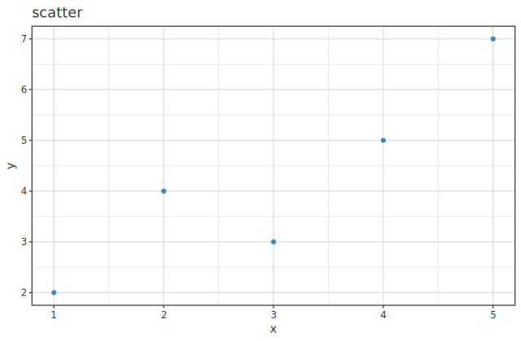

**関連・ggplot** [`scatterPoints` / `linePoints`](#e-points) (`[Point2]` 直接) ｜ 重なり対策は [`jitterX`](03-encoding-scale.ja.md#encoding) ｜
ggplot: `geom_point` / `geom_line` / `geom_step`

---

<a id="e-bar"></a>

### `bar` ─ 棒

**シグネチャ** `bar :: ColRef -> ColRef -> Layer`

**何を描くか** (カテゴリ x, 数値 y) の棒。群分け + 積み方は `position` で制御。

**encoding**
- 必須: x (カテゴリ)・y (高さ)
- 任意: [`colorBy`](03-encoding-scale.ja.md#encoding) `color` `alpha` `position`

**オプション** (mark の中で `<>`)

| オプション | 型 | 意味 | 既定 |
|---|---|---|---|
| `position` | `Position -> Layer` | `PosIdentity` / `PosDodge` (横並び) / `PosStack` (積上げ) / `PosFill` (100%) | `PosStack` |

**最小例**

```haskell
purePlot <> layer (bar (inlineCat ["A","B","C"]) (inline [3,7,5])) <> xLabel "群" <> yLabel "値"
-- 群×系列を横並び (dodge)
let bx = inlineCat ["A","A","B","B","C","C"]; bg = inlineCat ["g1","g2","g1","g2","g1","g2"]
    bv = inline [3,2,5,4,4,6]
in purePlot <> layer (bar bx bv <> colorBy bg <> position PosDodge) <> legend
```

| `bar` | `bar <> colorBy <> position PosDodge` |
|---|---|
| 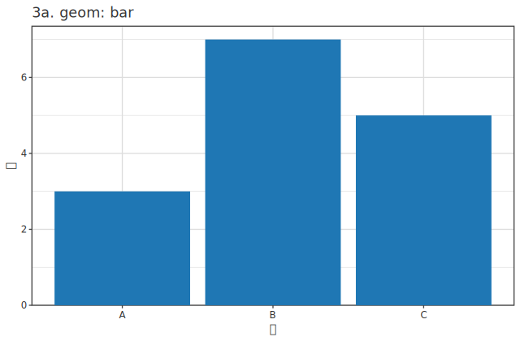 | 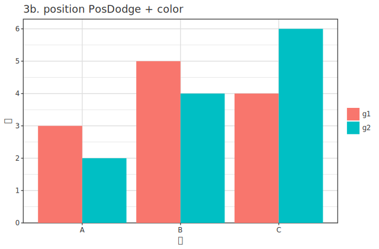 |

**関連・ggplot** [`stem`](#e-stem) (lollipop) ｜ [`histogram`](#e-histogram) (連続値の度数) ｜ [`waterfall`](#e-waterfall) (累積寄与) ｜
ggplot: `geom_col` / `geom_bar(stat="identity")`

---

<a id="e-points"></a>

### `scatterPoints` / `linePoints` ─ `[Point2]` から直接

**シグネチャ** `scatterPoints, linePoints :: [Point2] -> Layer`

**何を描くか** `Point2 x y` のリストから散布 / 折れ線を直接描く。`scatter (inline xs) (inline ys)` と
等価で、(x, y) ペアが手元にあるときの近道。3D の `scatter3DPoints` と対称。

**encoding** 必須: `[Point2]` ／ 任意: [`scatter`](#e-xy) と同じ channel

**最小例**

```haskell
purePlot <> layer (scatterPoints [Point2 1 2, Point2 2 3.5, Point2 3 3, Point2 4 4.2, Point2 5 4])
```

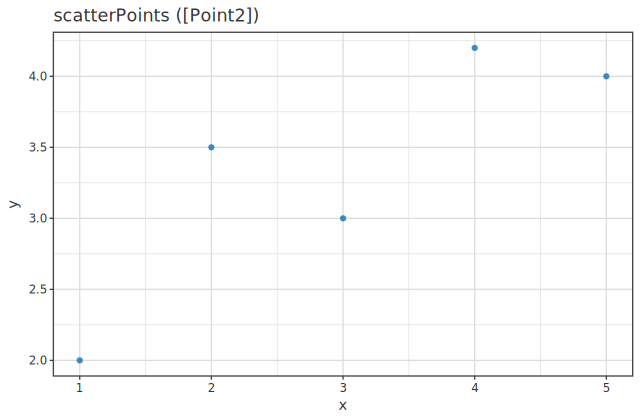

**関連・ggplot** [`scatter` / `line`](#e-xy) (列指定版) ｜ ggplot: `geom_point` / `geom_line`

---

<a id="e-text"></a>

### `text` / `label` ─ テキスト / ラベル

**シグネチャ** `text, label :: ColRef -> ColRef -> ColRef -> Layer`

**何を描くか** (x, y, ラベル列) の位置に文字列を描く。`text` は素のテキスト、`label` は背景枠つき。

**encoding** 必須: x, y, ラベル列 ／ 任意: [`colorBy`](03-encoding-scale.ja.md#encoding) `color` `size` `alpha`

**最小例**

```haskell
let x = inline [1,2,3]; y = inline [2,3,2.5]
    ylab = inline [2.18,3.18,2.68]; nm = inlineCat ["P","Q","R"]   -- ラベルは点の少し上に
in purePlot <> layer (scatter x y <> size 7) <> layer (label x ylab nm)  -- label=枠付き
```

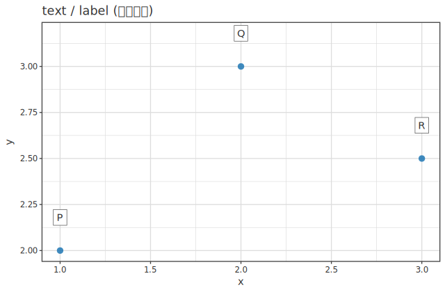

**関連・ggplot** ggplot: `geom_text` / `geom_label`

---

<a id="e-stem"></a>

### `stem` ─ 棒付き点 (lollipop)

**シグネチャ** `stem :: ColRef -> ColRef -> Layer`

**何を描くか** (x, y) を基線から伸びる細い棒 + 先端の点で描く lollipop チャート。bar の軽量な代替。
x は**数値**を取る (カテゴリ軸は非対応)。

**encoding** 必須: x (数値), y ／ 任意: [`colorBy`](03-encoding-scale.ja.md#encoding) `color` `size` `alpha`

**最小例**

```haskell
purePlot <> layer (stem (inline [1,2,3,4,5,6]) (inline [3,7,5,6,4,8]))
```

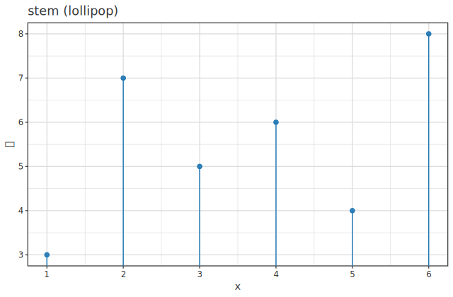

**関連・ggplot** [`bar`](#e-bar) ｜ ggplot: `geom_segment` + `geom_point` 相当

---

<a id="e-ecdf"></a>

### `ecdf` ─ 経験累積分布

**シグネチャ** `ecdf :: ColRef -> Layer`

**何を描くか** 値 1 列の経験累積分布関数 (ECDF) を階段で描く。

**encoding** 必須: 値 1 列 ／ 任意: [`colorBy`](03-encoding-scale.ja.md#encoding) `color`

**最小例**

```haskell
purePlot <> layer (ecdf (inline [3,1,4,1,5,9,2,6,5,3,5,8,9,7,9]))
```

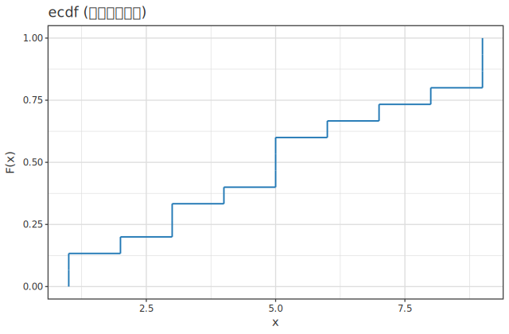

**関連・ggplot** [`qq`](#e-qq) ｜ ggplot: `stat_ecdf`

---

<a id="e-histogram"></a>

### `histogram` / `freqpoly` ─ ヒストグラム / 度数折れ線

**シグネチャ** `histogram, freqpoly :: ColRef -> Layer`

**何を描くか** 値 1 列を bin に区切り、度数を棒 (`histogram`) または折れ線 (`freqpoly`) で描く。

**encoding** 必須: 値 1 列 ／ 任意: [`colorBy`](03-encoding-scale.ja.md#encoding) `color` `alpha` `position`

**オプション** (mark の中で `<>`)

| オプション | 型 | 意味 | 既定 |
|---|---|---|---|
| `binCount` | `Int -> Layer` | bin 数 | 自動 |
| `binWidth` | `Double -> Layer` | bin 幅 (binCount と排他) | ─ |
| `histogramDensity` | `Bool -> Layer` | 度数→密度スケール | `False` |
| `histBorder` | `Bool -> Layer` | 棒の枠線 | `False` |

**最小例**

```haskell
purePlot <> layer (histogram (inline [1,2,2,3,3,3,4,4,5,2,3,4,3,5,4,3,2,4,3,5]) <> binCount 8)
```

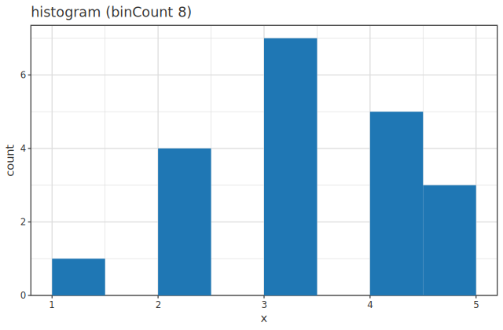

**関連・ggplot** [`density`](#e-density) (滑らかな代替) ｜ [`histogramWide`](#e-histogramwide) (複数列重ね) ｜
ggplot: `geom_histogram` / `geom_freqpoly`

---

<a id="e-density"></a>

### `density` / `densityNorm` ─ 密度推定

**シグネチャ** `density, densityNorm :: ColRef -> Layer`

**何を描くか** 値 1 列のカーネル密度。`densityNorm` は最大 1 に正規化。群比較は `<> colorBy "g"`。

**encoding** 必須: 値 1 列 ／ 任意: [`colorBy`](03-encoding-scale.ja.md#encoding) `color` `alpha`

**オプション** (mark の中で `<>`)

| オプション | 型 | 意味 | 既定 |
|---|---|---|---|
| `densityFill` | `Bool -> Layer` | 曲線下を塗る | `False` |
| `histogramDensity` | `Bool -> Layer` | 度数→密度スケール (`histogram` 重畳時) | `False` |

**最小例**

```haskell
purePlot <> layer (density (inline [1,2,2,3,3,3,4,4,5,3,4,2]) <> densityFill True <> alpha 0.4)
```

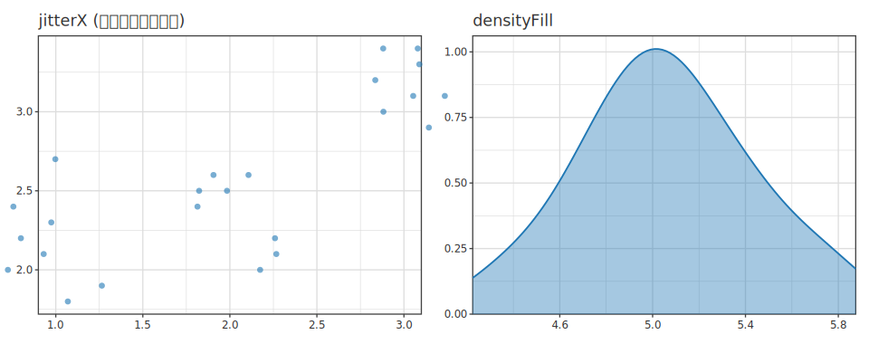

**関連・ggplot** [`histogram`](#e-histogram) ｜ [`violin`](#e-violin) / [`ridge`](#e-ridge) (群別密度) ｜
ggplot: `geom_density`

---

<a id="e-boxplot"></a>

### `boxplot` ─ 箱ひげ図

**シグネチャ** `boxplot :: ColRef -> Layer`

**何を描くか** 値 1 列の五数要約 (箱 + ひげ + 外れ値)。群分けは `<> groupBy "g"` (色なし) または
`<> colorBy "g"` (色つき・dodge)。複数列の併置は [`distCols`](#dist-compose)。

**encoding** 必須: 値 1 列 ／ 任意: [`groupBy`](03-encoding-scale.ja.md#encoding) [`colorBy`](03-encoding-scale.ja.md#encoding) `color` `markWidth`

**最小例**

```haskell
purePlot <> layer (boxplot (inline [4,5,6,5,7, 8,9,7,10,9, 5,6,7,6,8])
                           <> colorBy (inlineCat (concatMap (replicate 5) ["a","b","c"])))
         <> legend
```

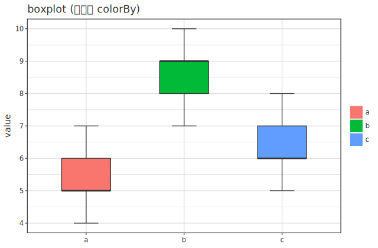

**関連・ggplot** [`violin`](#e-violin) / [`raincloud`](#e-raincloud) ｜ 併置は [`distCols`](#dist-compose) ｜
ggplot: `geom_boxplot`

---

<a id="e-violin"></a>

### `violin` / `strip` / `swarm` ─ 値 1 列の分布

**シグネチャ** `violin, strip, swarm :: ColRef -> Layer`

**何を描くか** 値 1 列の分布を violin (左右対称密度)・strip (素のドット)・swarm (重なり回避ドット) で描く。
群比較は `<> groupBy "g"` / `<> colorBy "g"`。

**encoding** 必須: 値 1 列 ／ 任意: [`groupBy`](03-encoding-scale.ja.md#encoding) [`colorBy`](03-encoding-scale.ja.md#encoding) `color` `alpha` `markWidth` `side` `nudge`

**最小例**

```haskell
let v = inline [4,5,6,5,7, 8,9,7,10,9, 5,6,7,6,8]
    g = inlineCat (concatMap (replicate 5) ["a","b","c"])
in subplots [ layer (violin v <> colorBy g)               <> title "violin"
            , layer (strip  v <> colorBy g <> jitterX 0.15) <> title "strip"
            , layer (swarm  v <> colorBy g)               <> title "swarm" ]
   <> subplotCols 3 <> legend
```

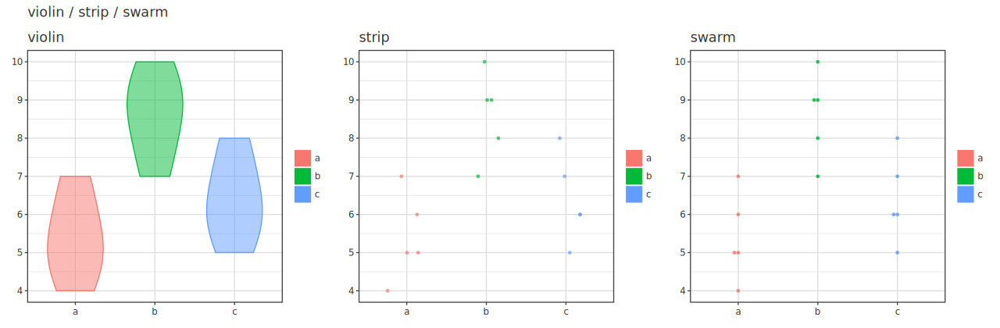

**関連・ギャラリー** [`boxplot`](#e-boxplot) / [`raincloud`](#e-raincloud) ｜ 合成は [`<+>`](#dist-compose) ｜
ggplot: `geom_violin` / `geom_jitter` / `ggbeeswarm::geom_quasirandom`

---

<a id="e-raincloud"></a>

### `raincloud` ─ raincloud preset

**シグネチャ** `raincloud :: ColRef -> Layer`

**何を描くか** `violin <+> boxplot <+> strip` を 1 layer に重ねた preset (half-violin + 箱 + 生データ点)。
内部は [`<+>`](#dist-compose) 合成なので、ずらしは `nudge`、各レーンに `colorBy` を載せられる。

**encoding** 必須: 値 1 列 ／ 任意: [`groupBy`](03-encoding-scale.ja.md#encoding) [`colorBy`](03-encoding-scale.ja.md#encoding) `nudge`

**最小例**

```haskell
purePlot <> layer (raincloud (inline [4,5,6,5,7, 8,9,7,10,9, 5,6,7,6,8])
                             <> colorBy (inlineCat (concatMap (replicate 5) ["a","b","c"])))
         <> legend
```

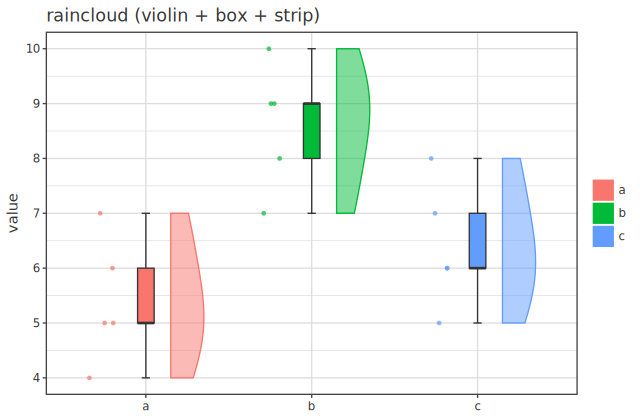

**関連・ggplot** [`violin`](#e-violin) / [`boxplot`](#e-boxplot) ｜ 合成の仕組みは [`<+>`](#dist-compose) ｜
ggplot: `ggrain::geom_rain` 相当

---

<a id="e-ridge"></a>

### `ridge` ─ joyplot

**シグネチャ** `ridge :: ColRef -> Layer`

**何を描くか** 群ごとの密度を少しずつ縦にずらして重ねる joyplot。値 1 列 + 群、coord_flip は自動。

**encoding** 必須: 値 1 列 ／ 任意: [`groupBy`](03-encoding-scale.ja.md#encoding) [`colorBy`](03-encoding-scale.ja.md#encoding) `alpha`

**最小例**

```haskell
purePlot <> layer (ridge (inline [1,2,2,3, 3,4,4,5, 5,6,6,7])
                         <> colorBy (inlineCat ["a","a","a","a","b","b","b","b","c","c","c","c"]))
         <> legend
```

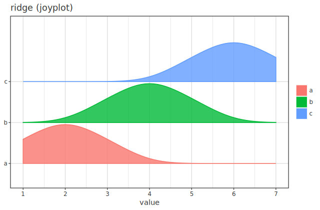

**関連・ggplot** [`density`](#e-density) / [`violin`](#e-violin) ｜ ggplot: `ggridges::geom_density_ridges`

---

<a id="e-qq"></a>

### `qq` ─ QQ プロット

**シグネチャ** `qq :: ColRef -> Layer`

**何を描くか** 値 1 列の分位点を理論正規分位点に対してプロットし、正規性を視覚評価する。

**encoding** 必須: 値 1 列 ／ 任意: [`colorBy`](03-encoding-scale.ja.md#encoding) `color`

**最小例**

```haskell
purePlot <> layer (qq (inline [-1.2,-0.3,0.1,0.5,-0.8,1.4,0.2,-0.1,0.9,-0.5,0.3,-0.6,1.1,-0.2,0.7]))
```

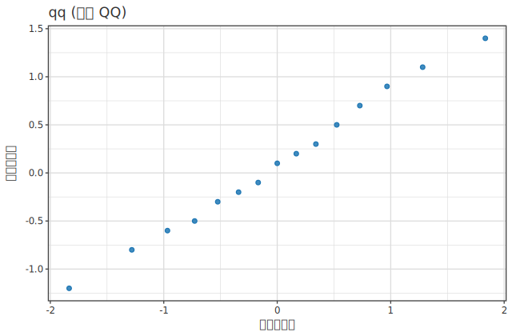

**関連・ggplot** [`ecdf`](#e-ecdf) ｜ ggplot: `stat_qq`

---

<a id="dist-compose"></a>

### `(<+>)` / `distCols` ─ 分布 mark の合成・併置

**シグネチャ** `(<+>) :: Layer -> Layer -> Layer` ／ `distCols :: [Layer] -> VisualSpec`

**何を描くか** `<+>` は分布 mark を 1 つの `Layer` に束ねる。スロット (横位置) は各マークの**値列**で決まる:
**同じ値列**→重畳 (`raincloud` はこの preset = `violin <+> box <+> strip`)、**別の値列**→横並び
(= `distCols`・列名が x 軸ラベル)。`distCols [a,b,c]` は `a <+> b <+> c` を `layer` で包む糖衣で、
別 mark を混在でき y 軸を全列で共有する。合成 layer の値列レーン一覧は `compositeLanes :: Layer -> [ColRef]`。

**encoding** 各レーン (= 構成 Layer) に [`colorBy`](03-encoding-scale.ja.md#encoding) を載せると、そのレーン内で群ごとに分割 + 彩色
(既存の dodge 機構を流用)。ずらしは `nudge`。

**最小例**

```haskell
distCols [ boxplot "a", violin "c", boxplot "d" ] <> yLabel "value"   -- 別列を別 mark で併置
distCols [ boxplot "a" <> colorBy "g", boxplot "c" ] <> legend         -- レーンに colorBy で dodge
```

| `distCols` 併置 | `distCols × colorBy` |
|---|---|
| 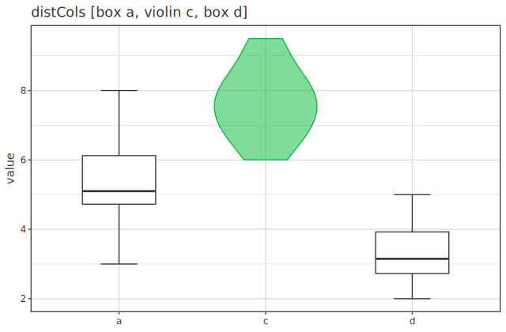 | 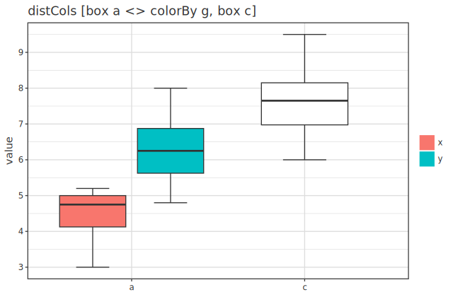 |

> **制限**: レーンに `<> groupBy "g"` (色なし群分け) を付けても現状は無視される (横位置がレーン名で確定するため)。
> 群分割が要るときは `<> colorBy "g"` を使う。別レーンで異なる `colorBy` 列を使うと凡例が曖昧になる。

**関連・ggplot** 重畳 preset は [`raincloud`](#e-raincloud) ｜ 単体分布は [`boxplot`](#e-boxplot) / [`violin`](#e-violin) ｜
ggplot: 複数 `geom_*` の重ね + `position_nudge`

---

<a id="e-band"></a>

### `band` ─ リボン

**シグネチャ** `band :: ColRef -> ColRef -> ColRef -> Layer`

**何を描くか** (x, lo, hi) の帯。信頼区間・予測区間の塗りに。`line` と重ねて中心線 + 帯にするのが定番。

**encoding** 必須: x, lo, hi ／ 任意: [`colorBy`](03-encoding-scale.ja.md#encoding) `color` `alpha`

**最小例**

```haskell
let x  = inline [1,2,3,4,5]
    y  = inline [2,3,2.5,4,3.5]
    lo = inline [1.5,2.4,2.0,3.4,3.0]
    hi = inline [2.5,3.6,3.0,4.6,4.0]
in purePlot <> layer (band x lo hi <> alpha 0.3) <> layer (line x y)
```

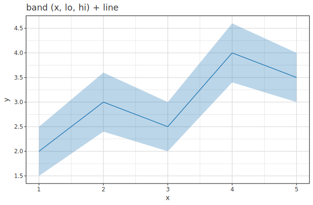

**関連・ggplot** `statLm` ([07](07-analyze.ja.md)・回帰帯) ｜ [`lineRange`](#e-range) (離散区間) ｜
ggplot: `geom_ribbon`

---

<a id="e-range"></a>

### `lineRange` / `pointRange` / `crossbar` ─ 区間

**シグネチャ** `lineRange, pointRange, crossbar :: ColRef -> ColRef -> ColRef -> Layer`

**何を描くか** (x, y, err) の対称区間 (`y ± err`)。`lineRange` は縦線、`pointRange` は中央点つき縦線、
`crossbar` は箱状の区間。

**encoding** 必須: x, y (中心), err (対称半幅) ／ 任意: [`colorBy`](03-encoding-scale.ja.md#encoding) `color`

**最小例**

```haskell
-- (x, 中心 y, 対称半幅 err)
let c = inlineCat ["A","B","C"]; y = inline [2,3,2.5]; e = inline [0.4,0.6,0.3]
in subplots [ layer (lineRange  c y e) <> title "lineRange"
            , layer (pointRange c y e) <> title "pointRange"
            , layer (crossbar   c y e) <> title "crossbar" ]
   <> subplotCols 3
```

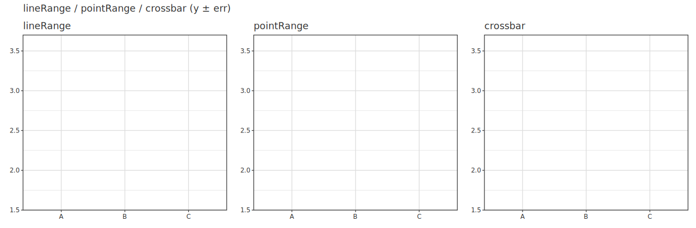

**関連・ggplot** [`band`](#e-band) (連続帯) ｜ [`forest`](#e-forest) ｜
ggplot: `geom_linerange` / `geom_pointrange` / `geom_crossbar`

---

<a id="e-forest"></a>

### `forest` ─ forest plot

**シグネチャ** `forest :: ColRef -> ColRef -> ColRef -> Layer`

**何を描くか** (ラベル, 推定値, err) を横方向の点 + 対称区間 (`推定 ± err`) で並べる forest plot。
メタ解析・係数比較に。

**encoding** 必須: ラベル (カテゴリ), 推定, err (対称半幅) ／ 任意: [`colorBy`](03-encoding-scale.ja.md#encoding) `color`

**オプション** (mark の中で `<>`)

| オプション | 型 | 意味 | 既定 |
|---|---|---|---|
| `forestNull` | `Double -> Layer` | 帰無線の位置 (縦の基準線) | `0` |

**最小例**

```haskell
purePlot <> layer (forest (inlineCat ["b0","b1","b2","b3"]) (inline [0.2,-0.1,0.4,0.05]) (inline [0.15,0.2,0.1,0.12])
                          <> forestNull 0)
```

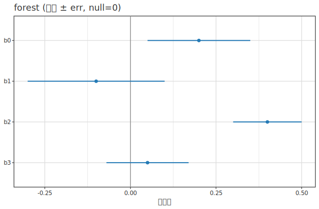

**関連・ggplot** [`pointRange`](#e-range) ｜ [`funnel`](#e-funnel) ｜ ggplot: `geom_pointrange` + `coord_flip`

---

<a id="e-funnel"></a>

### `funnel` ─ funnel plot

**シグネチャ** `funnel :: ColRef -> ColRef -> Layer`

**何を描くか** (推定値, SE) の散布 + 期待される漏斗状の境界。メタ解析の出版バイアス検査に。

**encoding** 必須: 推定, SE ／ 任意: [`colorBy`](03-encoding-scale.ja.md#encoding) `color`

**最小例**

```haskell
purePlot <> layer (funnel (inline [0.1,0.2,-0.1,0.15,0.05,0.12,-0.05,0.18])
                          (inline [0.05,0.1,0.08,0.12,0.2,0.06,0.15,0.09]))
```

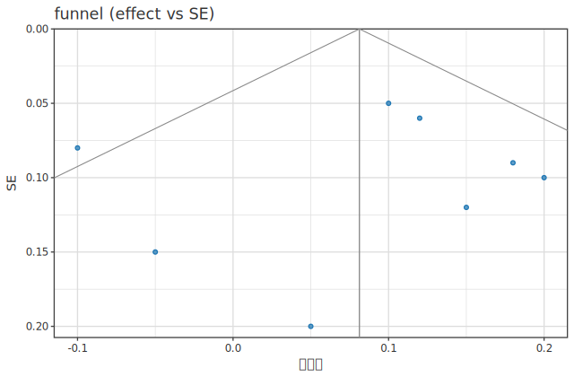

**関連・ggplot** [`forest`](#e-forest) ｜ ggplot 標準 geom なし (`metafor::funnel` 相当)

---

<a id="e-stream"></a>

### `stream` ─ streamgraph

**シグネチャ** `stream :: ColRef -> ColRef -> Layer`

**何を描くか** (x, y) の中心化積層 area (streamgraph)。系列分割は `<> colorBy "series"`。

**encoding** 必須: x, y ／ 任意: [`colorBy`](03-encoding-scale.ja.md#encoding) (系列) `alpha`

**最小例**

```haskell
let x = inline [1,2,3, 1,2,3, 1,2,3]
    y = inline [2,3,4, 1,2,1, 3,2,3]
    s = inlineCat ["a","a","a","b","b","b","c","c","c"]
in purePlot <> layer (stream x y <> colorBy s) <> legend
```

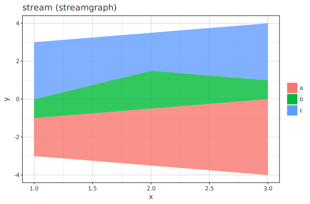

**関連・ggplot** ggplot: `ggstream::geom_stream` 相当 / `geom_area(position="stack")`

---

<a id="e-statfunction"></a>

### `statFunction` ─ 関数曲線

**シグネチャ** `statFunction :: (Double -> Double) -> Double -> Double -> Int -> Layer`

**何を描くか** 渡した関数を (lo, hi) を n 分割した格子上で評価し、滑らかな曲線にする。理論曲線の重ね描きに。

**encoding** 必須: 関数, lo, hi, 分割数 ／ 任意: `color` `linetype`

**最小例**

```haskell
purePlot <> layer (scatter (inline [1,3,5,7,9]) (inline [3,7,10,16,18]))
         <> layer (statFunction (\x -> 2*x + 1) 0 10 100)
```

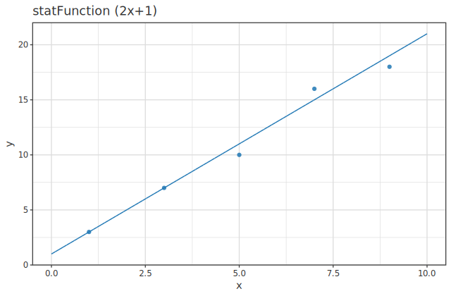

**関連・ggplot** `statLm` ([07](07-analyze.ja.md)・データ由来の回帰) ｜ ggplot: `stat_function`

---

<a id="e-statmean"></a>

### `statMean` / `statMedian` ─ 参照線

**シグネチャ** `statMean, statMedian :: ColRef -> Layer`

**何を描くか** 値 1 列の平均 / 中央値を参照線として描く。

**encoding** 必須: 値 1 列 ／ 任意: `color` `linetype`

**最小例**

```haskell
let xs = inline [1,2,2,3,3,3,4,4,5]
in purePlot <> layer (histogram xs) <> layer (statMean xs <> linetype LtDashed)
```

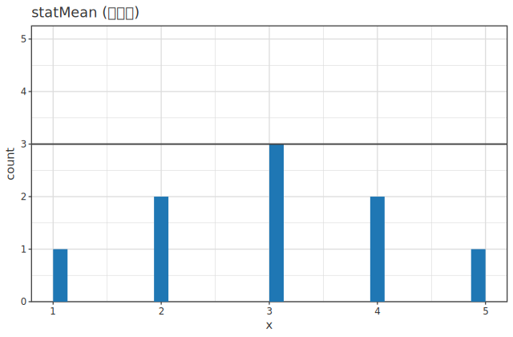

**関連・ggplot** [04 decoration](04-decoration.ja.md) の参照線 ｜ ggplot: `geom_vline(xintercept = mean(x))`

---

<a id="e-countxy"></a>

### `countXY` ─ 出現数集計

**シグネチャ** `countXY :: ColRef -> ColRef -> Layer`

**何を描くか** (x, y) の組合せごとの出現数を集計し、点サイズ等で表す。カテゴリ × カテゴリの頻度に。

**encoding** 必須: x, y ／ 任意: `color` `size`

**最小例**

```haskell
purePlot <> layer (countXY (inlineCat ["A","A","B","A","B","B","A","B","B"])
                           (inlineCat ["x","y","x","x","y","y","y","x","y"]))
```

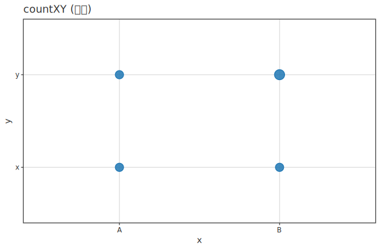

**関連・ggplot** [`bin2dCount`](#e-bin2d) (連続値版) ｜ ggplot: `geom_count`

---

<a id="e-histogramwide"></a>

### `histogramWide` ─ 複数列ヒスト

**シグネチャ** `histogramWide :: [ColRef] -> VisualSpec`

**何を描くか** 複数列を重ねたヒストグラム。図全体を成すので `layer` で包まず直接 `<>`。

**encoding** 必須: 列リスト ／ 任意: 図側の `legend` 等

**最小例**

```haskell
purePlot <> histogramWide [ inline [1,2,2,3,3,2,3], inline [2,3,3,4,4,3,4], inline [3,4,4,5,5,4,5] ] <> legend
```

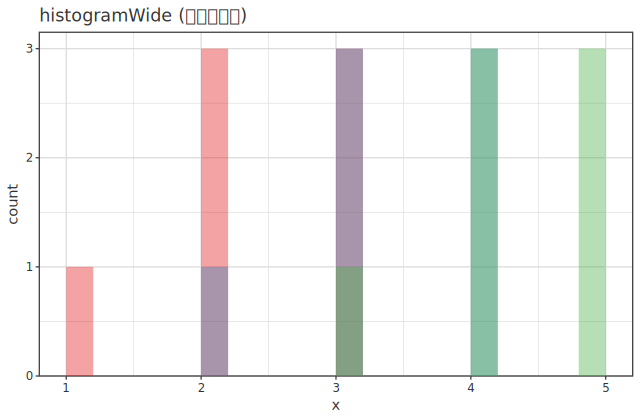

**関連・ggplot** [`histogram`](#e-histogram) + `colorBy` ｜ ggplot: long 形式 + `geom_histogram(position="identity")`

---

<a id="e-contour"></a>

### `contour` / `contourFilled` ─ 等高線

**シグネチャ** `contour, contourFilled :: ColRef -> ColRef -> ColRef -> Layer`

**何を描くか** 連続 `(x, y, z)` の場を marching squares の等値線 (`contour`) または塗り等高線
(`contourFilled`) で描く。同じ引数のまま [`bin2d`](#e-bin2d) に替えると grid セルを塗る。

**encoding** 必須: x, y, z ／ 任意: `color` (単色等値線時)

**オプション** (mark の中で `<>`)

| オプション | 型 | 意味 | 既定 |
|---|---|---|---|
| `contourLevels` | `Int -> Layer` | 等値線の本数 (z を等分) | 自動 |
| `contourBreaks` | `[Double] -> Layer` | 明示水準を指定 | ─ |

**最小例**

```haskell
let pts = [ (x, y) | x <- [0,0.4..6.0], y <- [0,0.4..6.0] ] :: [(Double, Double)]
    gx  = inline (map fst pts); gy = inline (map snd pts)
    gz  = inline [ exp (-(((x-3)**2)+((y-3)**2))/4)
                 + 0.4*exp (-(((x-1.2)**2)+((y-4.5)**2))/1.5) | (x, y) <- pts ]
in purePlot <> layer (contour gx gy gz)              -- 本数指定は <> contourLevels 8 等
```

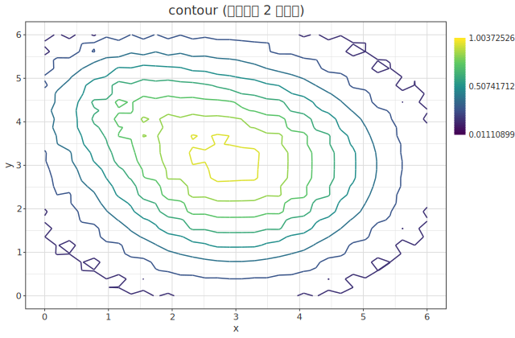

**関連・ggplot** [`bin2d`](#e-bin2d) / [`heatmap`](#e-heatmap) ｜ ベクトル場は [`quiver`](#e-quiver) ｜
ggplot: `geom_contour` / `geom_contour_filled`

---

<a id="e-bin2d"></a>

### `bin2d` / `bin2dCount` ─ 2D bin 塗り

**シグネチャ** `bin2d :: ColRef -> ColRef -> ColRef -> Layer` ／ `bin2dCount :: ColRef -> ColRef -> Layer`

**何を描くか** (x, y) を 2D bin に区切り、z 値 (`bin2d`) または個数 (`bin2dCount`) で grid セルを連続色塗り。

**encoding** 必須: x, y (`bin2d` は + z) ／ 任意: なし

**オプション** (mark の中で `<>`)

| オプション | 型 | 意味 | 既定 |
|---|---|---|---|
| `binCount` | `Int -> Layer` | bin 分割数 | 自動 |

**最小例**

```haskell
let pts = [ (x, y) | x <- [0,0.4..6.0], y <- [0,0.4..6.0] ] :: [(Double, Double)]
    gx  = inline (map fst pts); gy = inline (map snd pts)
    gz  = inline [ exp (-(((x-3)**2)+((y-3)**2))/4)
                 + 0.4*exp (-(((x-1.2)**2)+((y-4.5)**2))/1.5) | (x, y) <- pts ]
in purePlot <> layer (bin2d gx gy gz)                -- contour と同データ・bin 数は <> binCount n
```

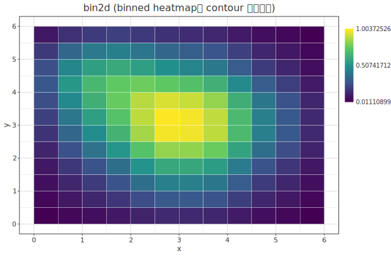

**関連・ggplot** [`contour`](#e-contour) / [`heatmap`](#e-heatmap) ｜ [`countXY`](#e-countxy) (カテゴリ版) ｜
ggplot: `geom_bin2d`

---

<a id="e-hexbin"></a>

### `hexbin` ─ 六角ビニング

**シグネチャ** `hexbin :: ColRef -> ColRef -> Layer`

**何を描くか** 連続 (x, y) を**六角格子**に区切り、各セルに入った**点の個数**を連続色 (Viridis) で塗る。
散布図が過密で潰れるときの密度可視化に。`bin2d` の矩形セルを六角形に替えた版 (= モアレが出にくい)。

**encoding** 必須: x, y ／ 任意: なし

**オプション** (mark の中で `<>`)

| オプション | 型 | 意味 | 既定 |
|---|---|---|---|
| `hexbinBins` | `Int -> Layer` | x 方向のセル分割数 (= ggplot `bins`) | 30 |

**最小例**

```haskell
let pts = [ (x, y) | i <- [0..299 :: Int]
                   , let fi = fromIntegral i
                         x  = fromIntegral (i `mod` 20) * 0.3 + sin fi * 0.18
                         y  = fromIntegral (i `mod` 20) * 0.25 + cos (fi*1.3) * 0.6 ]
    hx = inline (map fst pts); hy = inline (map snd pts)
in purePlot <> layer (hexbin hx hy <> hexbinBins 12)   -- 件数 colorbar は自動で右に出る
```

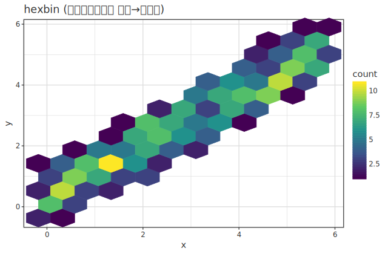

**関連・ggplot** [`bin2d`](#e-bin2d) (矩形セル版) / [`heatmap`](#e-heatmap) ｜ [`countXY`](#e-countxy) (カテゴリ版) ｜
ggplot: `geom_hex`

---

<a id="e-heatmap"></a>

### `heatmap` ─ カテゴリ grid 塗り

**シグネチャ** `heatmap :: ColRef -> ColRef -> ColRef -> Layer`

**何を描くか** (カテゴリ x, カテゴリ y, z) の grid を z の連続色で塗る。相関行列・混同行列などに。

**encoding** 必須: x, y, z ／ 任意: なし

**最小例**

```haskell
let cs  = ["A","B","C"]
    pts = [ (a, b) | a <- cs, b <- cs ]
    hx  = inlineCat (map fst pts); hy = inlineCat (map snd pts)
    hz  = inline [ 1,0.3,0.1, 0.3,1,0.5, 0.1,0.5,1 ]
in purePlot <> layer (heatmap hx hy hz)
```

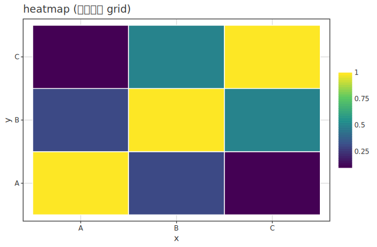

**関連・ggplot** [`bin2d`](#e-bin2d) (連続 bin 版) ｜ ggplot: `geom_tile` / `geom_raster`

---

<a id="e-pie"></a>

### `pie` ─ 円グラフ

**シグネチャ** `pie :: ColRef -> ColRef -> Layer`

**何を描くか** (カテゴリ, 値) を扇形に分ける円グラフ。

**encoding** 必須: カテゴリ, 値 ／ 任意: [`colorBy`](03-encoding-scale.ja.md#encoding)

**最小例**

```haskell
purePlot <> layer (pie (inlineCat ["A","B","C"]) (inline [30,50,20])) <> legend
```

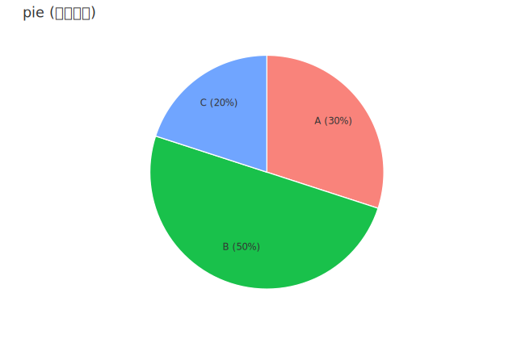

**関連・ggplot** [`bar`](#e-bar) (推奨代替) ｜ ggplot: `geom_bar` + `coord_polar`

---

<a id="e-waterfall"></a>

### `waterfall` ─ 滝チャート

**シグネチャ** `waterfall :: ColRef -> ColRef -> Layer`

**何を描くか** (カテゴリ, 増減量) の累積寄与を段差状の棒で描く。収支・要因分解に。

**encoding** 必須: カテゴリ, 値 ／ 任意: `color`

**最小例**

```haskell
purePlot <> layer (waterfall (inlineCat ["start","Q1","Q2","Q3"]) (inline [100,30,-20,15]))
```

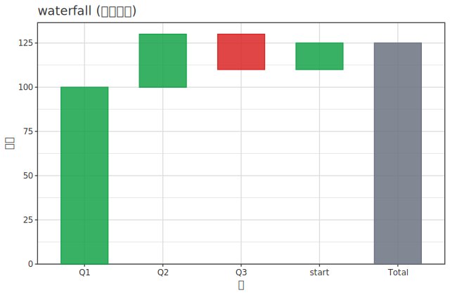

**関連・ggplot** [`bar`](#e-bar) ｜ ggplot 標準 geom なし (`waterfalls::geom_waterfall` 相当)

---

<a id="e-parallelcoords"></a>

### `parallelCoords` ─ 平行座標

**シグネチャ** `parallelCoords :: [ColRef] -> Layer`

**何を描くか** 複数の数値列を縦軸として並べ、各行を折れ線で結ぶ平行座標プロット。多変量の傾向比較に。

**encoding** 必須: 列リスト ／ 任意: [`colorBy`](03-encoding-scale.ja.md#encoding) `alpha`

**最小例**

```haskell
purePlot <> layer (parallelCoords [ inline [1,2,3], inline [4,5,4], inline [2,1,3], inline [5,4,5] ]
                                  <> colorBy (inlineCat ["a","b","a"])) <> legend
-- df 利用時は列名で渡すと各軸にその列名が出る (inline は軸名なし)・[06](06-dataframe.md)
```

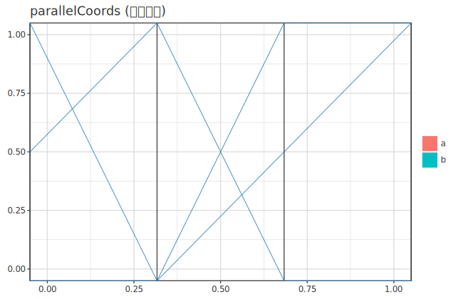

**関連・ggplot** [`pairs`](#e-pairs) ｜ ggplot: `GGally::ggparcoord`

---

<a id="e-pairs"></a>

### `pairs` ─ 散布図行列

**シグネチャ** `pairs :: [ColRef] -> VisualSpec`

**何を描くか** 列リストの全ペアの散布図 + 対角の分布を格子状に並べる (SPLOM)。図全体を成すので直接 `<>`。

**encoding** 必須: 列リスト ／ 任意: [`colorBy`](03-encoding-scale.ja.md#encoding)

**最小例**

```haskell
purePlot <> pairs [ inline [1,2,3,4,5], inline [2,1,4,3,5], inline [1,3,2,5,4] ]
-- df 利用時は列名で渡すと各行・列にその列名が出る (inline は軸名なし)
```

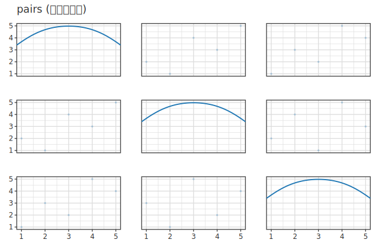

**関連・ggplot** [`parallelCoords`](#e-parallelcoords) ｜ ggplot: `GGally::ggpairs`

---

<a id="e-quiver"></a>

### `quiver` ─ ベクトル場

**シグネチャ** `quiver :: ColRef -> ColRef -> ColRef -> ColRef -> Layer`

**何を描くか** 各点 `(x, y)` に成分 `(u, v)` の矢印 (= matplotlib `quiver`)。勾配場・流れ場・residual 方向に。
矢印長は autoscale (最長矢印がデータ対角の ~8%)。

**encoding** 必須: x, y, u, v ／ 任意: `color`

**オプション** (mark の中で `<>`)

| オプション | 型 | 意味 | 既定 |
|---|---|---|---|
| `arrowScale` | `Double -> Layer` | 矢印長の倍率 | `1.0` |
| `arrowColorByMagnitude` | `Layer` | `\|u,v\|` の連続色 (viridis) | 単色 |

**最小例**

```haskell
let g  = [ (x, y) | x <- [-3,-2..3], y <- [-3,-2..3 :: Double] ]
    gx = inline (map fst g); gy = inline (map snd g)
    gu = inline [ -y/3 - x/6 | (x, y) <- g ]    -- 渦巻き場
    gv = inline [  x/3 - y/6 | (x, y) <- g ]
in purePlot <> layer (quiver gx gy gu gv <> arrowColorByMagnitude)  -- 単色なら省略・倍率 <> arrowScale 1.2
```

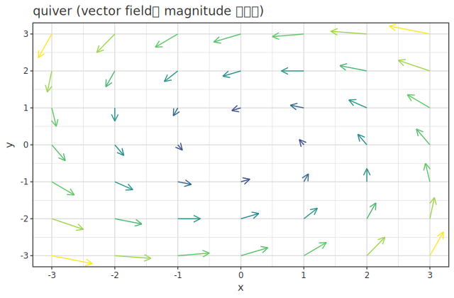

**関連・ggplot** 3D 版は [08 3d](08-3d.ja.md) の `quiver3D` ｜ ggplot: `geom_segment(arrow=…)`

---

<a id="e-trace"></a>

### `trace` / `traceLines` ─ MCMC trace

**シグネチャ** `trace :: ColRef -> ColRef -> Layer` ／ `traceLines :: ColRef -> ColRef -> ColRef -> Layer`

**何を描くか** (iter, 値) の MCMC trace。`traceLines` は (iter, 値, chain) で chain 別に色分けして描く。
HBM 抽出子 [`traceOf`](07-analyze.ja.md#hbm-plotting) が自動生成するのが普通。

**encoding** 必須: iter, 値 (`traceLines` は + chain) ／ 任意: [`colorBy`](03-encoding-scale.ja.md#encoding) `alpha`

**最小例**

```haskell
let n  = 120 :: Int; is = [1..n]
    v1 = [ 1.0 + 0.3*sin (fromIntegral i/9) + 0.1*sin (fromIntegral i*7.1) | i <- is ]
    v2 = [ 1.3 + 0.3*sin (fromIntegral i/9) + 0.1*sin (fromIntegral i*3.3) | i <- is ]
    it = inline (map fromIntegral (is ++ is)); val = inline (v1 ++ v2)
    ch = inlineCat (replicate n "1" ++ replicate n "2")
in subplots [ layer (trace (inline (map fromIntegral is)) (inline v1)) <> title "trace (1 chain)"
            , layer (traceLines it val ch)                             <> title "traceLines (chain 別)" ]
   <> subplotCols 2 <> legend
```

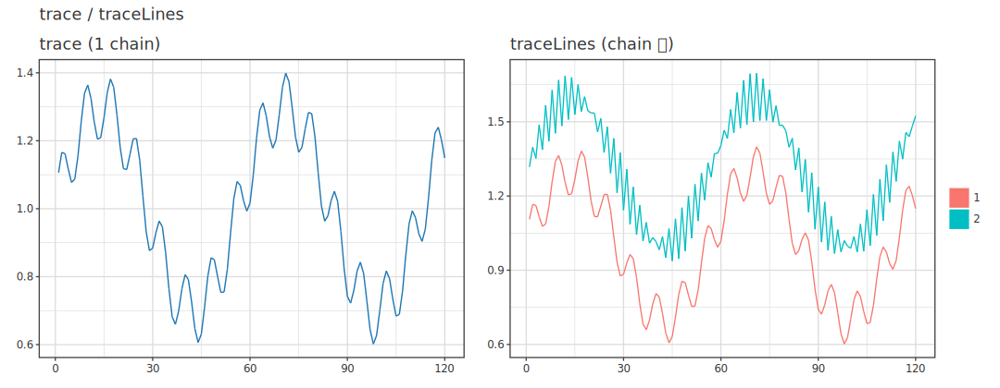

**関連・ggplot** [`ess`](#e-ess) / [`autocorr`](#e-autocorr) ｜ HBM 診断は [07 analyze](07-analyze.ja.md#hbm-plotting) ｜
ArviZ: `plot_trace`

---

<a id="e-ess"></a>

### `ess` ─ 有効サンプルサイズ

**シグネチャ** `ess :: ColRef -> ColRef -> Layer`

**何を描くか** (iter, ESS) を描き、サンプリング効率の推移を見る。

**encoding** 必須: iter, ESS ／ 任意: `color`

**最小例**

```haskell
purePlot <> layer (ess (inline [100,200,300,400,500,600]) (inline [80,150,210,260,300,330]))
```

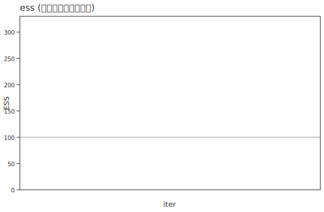

**関連・ggplot** [`trace`](#e-trace) / [`autocorr`](#e-autocorr) ｜ ArviZ: `plot_ess`

---

<a id="e-autocorr"></a>

### `autocorr` ─ 自己相関

**シグネチャ** `autocorr :: ColRef -> Layer`

**何を描くか** MCMC サンプル列の自己相関をラグ別に描く。

**encoding** 必須: 値 1 列 ／ 任意: `color`

**オプション** (mark の中で `<>`)

| オプション | 型 | 意味 | 既定 |
|---|---|---|---|
| `autocorrMaxLag` | `Int -> Layer` | 最大ラグ | 自動 |

**最小例**

```haskell
-- AR(1) 風の減衰系列 (rnd は決定的擬似乱数)
let rnd i = let h = sin (fromIntegral i * 12.9898) * 43758.5453 in h - fromIntegral (floor h :: Int)
    series = scanl (\prev i -> 0.85*prev + (rnd i - 0.5)) 0 [1..300::Int]
in purePlot <> layer (autocorr (inline series) <> autocorrMaxLag 40)
```

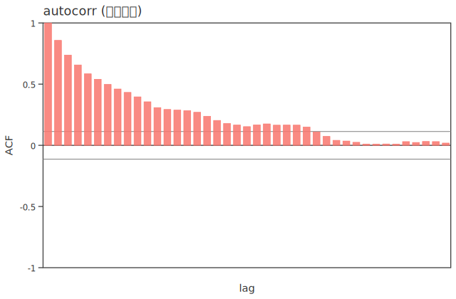

**関連・ggplot** [`trace`](#e-trace) / [`ess`](#e-ess) ｜ ArviZ: `plot_autocorr`

---

<a id="e-dag"></a>

### `dag` / `dagFromLists` / `dagFromListsWithPlates` ─ 確率モデル構造図

**シグネチャ** `dag :: [DAGNode] -> [DAGEdge] -> Layer` (= `dagFromLists … LayoutManual`)

**何を描くか** ノードとエッジを直接並べて DAG を描く。HBM からは [`dagOf`](07-analyze.ja.md#hbm-plotting) が
自動生成するのが普通だが、手で組むこともできる。

**encoding** 必須: `[DAGNode]`・`[DAGEdge]` ／ 任意: `size` (ノード径)

**オプション / 関連コンストラクタ**

| 関数 | 型 | 用途 |
|---|---|---|
| `dagFromLists` | `… -> DAGLayoutAlgorithm -> Layer` | レイアウト指定 (`LayoutManual` / `LayoutHierarchical`) |
| `dagFromListsWithPlates` | `… -> [DAGPlate] -> Layer` | plate 枠つき (繰り返し構造) |
| `dagNode` | `Text -> Text -> DAGNodeKind -> Double -> Double -> DAGNode` | ノード (id, label, 種別, x, y) |
| `dagNodeDist` | `… -> Text -> Double -> Double -> DAGNode` | 分布名つきノード |
| `dagEdge` | `Text -> Text -> DAGEdge` | エッジ (from-id → to-id) |

`DAGNodeKind` = `NodeLatent` (白楕円) / `NodeObserved` (灰楕円) / `NodeDeterministic` (白四角) /
`NodeData` / `NodeOther` (PyMC `model_to_graphviz` 慣例)。座標は `LayoutManual` 時 `[0,1]` 正規化空間。
`DAGPlate` はレコード: `DAGPlate { dpLabel = "obs (N)", dpNodeIds = ["mu","y"] }`。

**最小例**

```haskell
import Hgg.Plot.Spec   -- dag, dagNode, dagNodeDist, dagEdge, DAGNodeKind (..), ...

let nodes = [ dagNodeDist "a"  "a"  NodeLatent        "Normal(0,10)"  0.15 0.0
            , dagNodeDist "b"  "b"  NodeLatent        "Normal(0,10)"  0.45 0.0
            , dagNodeDist "s"  "s"  NodeLatent        "HalfNormal(1)" 0.85 0.0
            , dagNode     "mu" "mu" NodeDeterministic               0.30 0.5
            , dagNodeDist "y"  "y"  NodeObserved      "Normal(mu,s)"  0.45 1.0 ]
    edges = [ dagEdge "a" "mu", dagEdge "b" "mu", dagEdge "mu" "y", dagEdge "s" "y" ]
purePlot <> layer (dag nodes edges <> size 22) <> title "手書き DAG"
```

| `dag` (手書き) | `dagFromListsWithPlates` (plate 枠) |
|---|---|
| 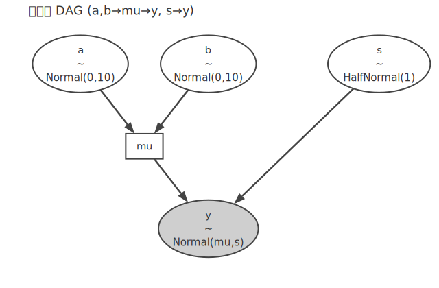 | 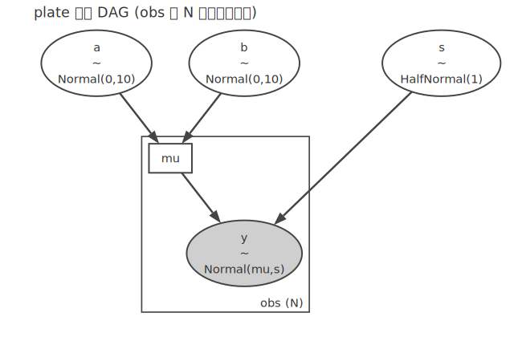 |

**関連・ggplot** HBM 自動生成は [`dagOf`](07-analyze.ja.md#hbm-plotting) ｜ 関連型: `DAGNode` / `DAGEdge` /
`DAGPlate` / `DAGSpec` / `DAGNodeKind` / `DAGLayoutAlgorithm` ｜ `edge :: Text -> Layer` ([encoding](03-encoding-scale.ja.md#encoding)) は別物
(DAG エッジは `dagEdge`) ｜ ggplot 対応: なし (PyMC `model_to_graphviz` 相当)
