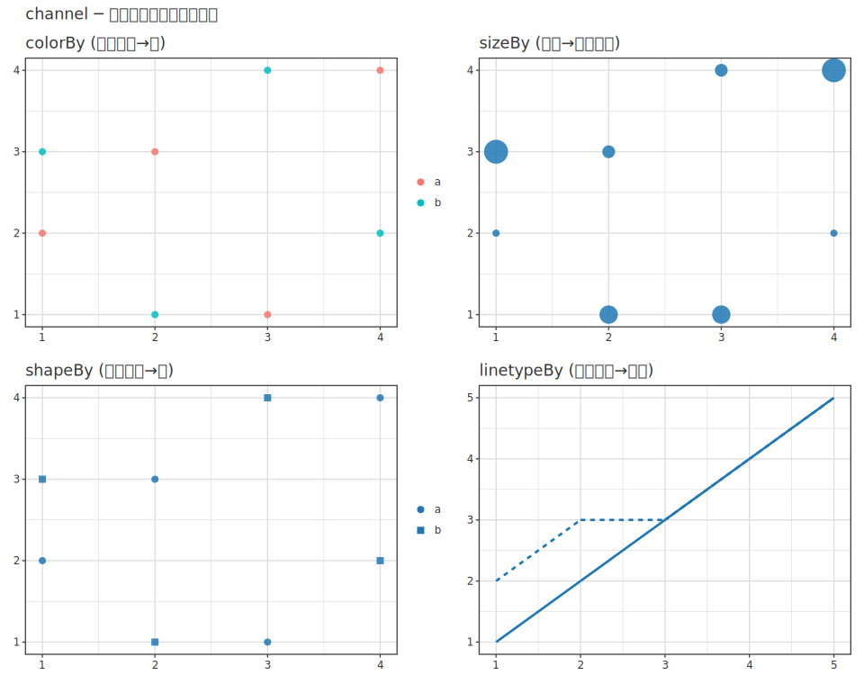
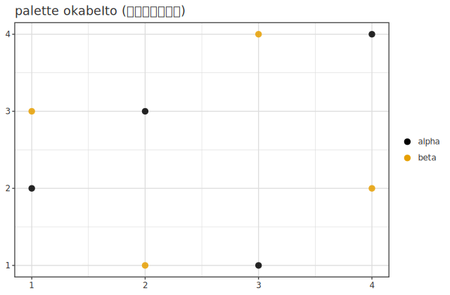
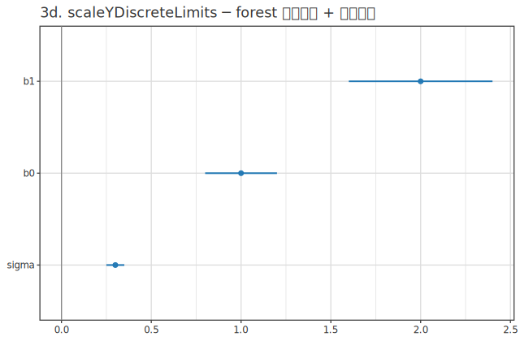
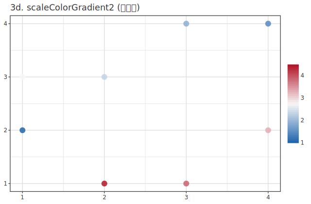
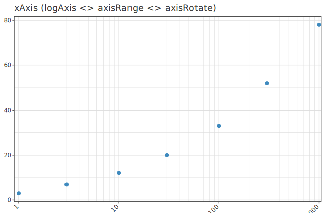
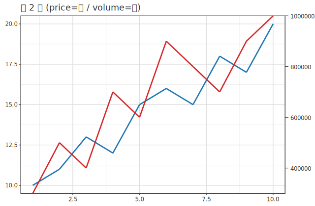

# encoding & scale — Channels and Scales

> 🌐 **English** | [日本語](03-encoding-scale.ja.md)

> [📚 Index](README.md) | [01 quickstart](01-quickstart.md) | [02 layers](02-layers.md) | **03 encoding & scale** | [04 decoration](04-decoration.md) | [05 backends](05-backends.md) | [06 dataframe](06-dataframe.md) | [07 analyze](07-analyze.md) | [08 3d](08-3d.md) | [09 appendix](09-appendix.md)

Covers **encoding (channel)** — mapping data columns to visual attributes — and **scale** — controlling the appearance of that mapping on a single page. The question "which columns go to color, size, and shape" (channel) and "how to display that color and size" (palette / gradient / limits / axis breaks) are related topics, so they are unified into one reference.

- **channel** is added inside the **mark using `<>`** (`layer (scatter x y <> colorBy "g")`). Each mark's "encoding" section ([02 layers](02-layers.md)) references the modifiers here.
- **scale / axis** is a figure-wide setting, so it is `<>` **outside the `layer (…)`** (returns `VisualSpec`). Pure cosmetic font / grid / background color is on the theme side of [04 decoration](04-decoration.md#theme).

Structure of this page:
**[1. encoding channel](#channel)** | **[2. scale / palette](#scale)** | **[3. position scale (axes)](#axis)**

---

<a id="encoding"></a>
<a id="channel"></a>

## 1. encoding channel

Visual attribute and channel modifiers common to all marks. **Added inside the mark using `<>`** (`layer (scatter x y <> colorBy "g")`). The "encoding" section of each standard entry ([02 layers](02-layers.md#entries)) references the modifiers here.

Example: mapping the same scatter in 4 channels (mapping column values to color, size, shape, linetype):

```haskell
let xs = inline [1,2,3,4, 1,2,3,4]; ys = inline [2,3,1,4, 3,1,4,2]
    g  = inlineCat (replicate 4 "a" ++ replicate 4 "b"); sz = inline [1,2,3,4, 4,3,2,1]
    lx = inline [1,2,3,4,5, 1,2,3,4,5]; ly = inline [1,2,3,4,5, 2,3,3,4,5]
    lg = inlineCat (replicate 5 "p" ++ replicate 5 "q")
in subplots [ layer (scatter xs ys <> colorBy g  <> size 6)    -- category → color
            , layer (scatter xs ys <> sizeBy sz)               -- numeric → point size
            , layer (scatter xs ys <> shapeBy g <> size 6)     -- category → shape
            , layer (line lx ly <> linetypeBy lg <> stroke 2) ] -- category → linetype
   <> subplotCols 2 <> legend
```



### Color

| Modifier | Type | Meaning |
|---|---|---|
| `colorBy` | `ColRef -> Layer` | Color-code by categorical column (pass column) |
| `color` | `Color -> Layer` | Fixed single color (`color (fromHex "#dc2626")` / [Color type](#color-type)) |
| `colorContinuousBy` | `ColRef -> Layer` | Continuous gradient (numeric column) |
| `colorRGBA` | `Text -> Layer` | Expand 8-digit RGBA hex to `color <> alpha` ([details](#color-type)) |
| `colorCats` | `[Text] -> Layer` | Explicitly specify color assignment order for groups (category → palette index) |

### Size, Shape, Line

| Modifier | Type | Meaning |
|---|---|---|
| `alpha` / `size` / `stroke` | `Double -> Layer` | Opacity (0–1) / point size / line width |
| `alphaBy` / `sizeBy` | `ColRef -> Layer` | Continuous opacity / point size by numeric column |
| `shape` / `shapeBy` | `MarkShape -> Layer` / `ColRef -> Layer` | Fixed shape / shape by category |
| `linetype` / `linetypeBy` | `LineType -> Layer` / `ColRef -> Layer` | Fixed linetype / linetype by category |
| `shapeMapEntry` | `Text -> MarkShape -> Layer` | Single mapping of specific category → shape |
| `edgeOn` / `edge` / `edgeWidth` | `Layer` / `Text -> Layer` / `Double -> Layer` | Add **edge** to scatter points (default: no edge = ggplot filled points shape 19). `edgeOn` is 1px edge in point color, `edge "#333"` specifies edge color, `edgeWidth 1.5` specifies edge width. Transparency by alpha-prefixed hex for edge color (`edge "#00000044"`). Different from `stroke` (line width) |
| `hollow` | `Layer` | Hollow marker (ggplot `shape="circle open"`). Makes fill transparent and shows outline only in point color. Use `size` for outline radius and `stroke` for outline width. Layer on top of points for emphasis. |

### Position, Grouping, Connection

| Modifier | Type | Meaning |
|---|---|---|
| `position` | `Position -> Layer` | Stacking method (`PosIdentity` / `PosDodge` / `PosStack` / `PosFill`) |
| `groupBy` | `ColRef -> Layer` | Grouping without color (slot splitting for distribution marks) |
| `nudge` | `Double -> Layer` | Offset within same slot for distribution marks (raincloud etc.) |
| `markWidth` | `Double -> Layer` | Width of distribution mark (box/violin width) |
| `side` | `Side -> Layer` | One-sided rendering (half-violin etc.) |
| `jitterX` / `jitterY` | `Double -> Layer` | Jitter points along axis (overlap avoidance) |
| `errorX` / `errorY` | `ColRef -> Layer` | Error bar column |
| `connect` / `connectOrder` / `connectGroup` | `Layer` / `ColRef -> Layer` | Connection lines for points (enable / order column / group column) |
| `connectColor` / `connectWidth` | `Text -> Layer` / `Double -> Layer` | Connection line color / width |
| `hoverCols` | `[ColRef] -> Layer` | hover tooltip columns |

> Related types: `ConnectSpec` (connection lines) / `MarkShape` / `ShapeMapEntry` (shapes) / `Categorical` (category encoding).
> See [04 decoration](04-decoration.md#enum-tables) for lists of enum types (`Position` / `LineType` / `MarkShape` / `Side`).

<a id="color-type"></a>

### Specifying fixed colors — `Color` type

Fixed colors (`color` / `colorRGBA`) are passed using the type-safe `Color` (`Graphics.Hgg.Color`). Constructors are `fromHex :: Text -> Color` (`fromHex "#dc2626"` · 3-digit supported · invalid raises `error`), `fromHexMaybe` (total), and `rgb :: Word8 -> Word8 -> Word8 -> Color`. R's 657 color names are available as constants in `Graphics.Hgg.Color.Named` (`import qualified … as N` · `color N.steelblue`). When pasting 8-digit RGBA hex directly, use `colorRGBA "#88888855"` (= `color (fromHex "#888888") <> alpha (85/255)` · total version `colorRGBAMaybe`). Internal helpers are `fromHexA` / `fromHexAMaybe :: Text -> (Maybe) (Color, Double)`. 3D version at [08 3d](08-3d.md).

---

## 2. scale / palette {#scale}

Controls the **appearance** of colors and sizes assigned by channel. Color dictionaries, diverging gradients, size ranges, categorical selection on discrete axes, etc. All return `VisualSpec` and are combined with `<>` outside the figure.

| Setting | Type (what to pass) | Meaning |
|---|---|---|
| `scaleColorManual` | `[(Text, Text)] -> VisualSpec` | Category → color dictionary (`[("A","#1B9E77")]`) |
| `scaleColorGradient2` | `Text -> Text -> Text -> Double -> VisualSpec` | Diverging gradient (lo, mid, hi color, midpoint value) |
| `scaleSize` | `Double -> Double -> VisualSpec` | Radius range for `sizeBy` (lo, hi) |
| `palette` / `continuousPalette` | `[Text] -> VisualSpec` | Series color / continuous color specified as hex color list |
| `paletteGGplot` | `VisualSpec` | ggplot default hue palette (no arguments) |
| `scaleXDiscreteLimits` / `scaleYDiscreteLimits` | `[Text] -> VisualSpec` | Discrete axis category selection + order |
| Pre-made palettes `okabeIto` / `tolBright` / `brewerDark2` / `brewerSet2` | `[Text]` | Color list to pass to `palette` (Okabe-Ito is color-blind friendly) |

Pre-made palettes are just `[Text]` (list of color hexes), so pass them to `palette`. Example: assigning series colors using Okabe-Ito, which is friendly to color vision diversity:

```haskell
purePlot <> layer (scatter xs ys <> colorBy gs) <> palette okabeIto <> legend
```



> Helpers: `orderedCats :: [Text] -> [Text]` (normalize category order) / `themeSeriesPalette :: ThemeName -> [Text]` (extract series colors for a theme) / `viridisStops3D :: [Text]` (color stop list for viridis colormap) can also be passed to `palette` / `continuousPalette`. Related type: `ColorEnc` (color encoding).

**Discrete axis category selection + reordering** (`scaleXDiscreteLimits` / `scaleYDiscreteLimits`、= ggplot `scale_x_discrete(limits=)`): enumerated order becomes display order; row selection and reordering in `forest` is also done with the y-axis version (`<> scaleYDiscreteLimits ["b1_0","sigma"]`).

> `scale*DiscreteLimits` **drops rows for out-of-range categories** (discrete version of continuous axis's `axisRange`). Operates on aesthetic basis, orthogonal to `coord_flip` (after flip, x/y still refer to data axes). Applies only to layers where the encoding on that axis is a string column (`inlineCat` / `TxtData`).



Example (`colorContinuousBy` + `scaleColorGradient2`):

```haskell
purePlot <> layer (scatter xs ys <> colorContinuousBy zs <> size 9)
  <> scaleColorGradient2 "#2166AC" "#F7F7F7" "#B2182B" 3.0   -- lo mid hi midpoint
  <> legend
```



---

## 3. position scale — Axis Control {#axis}

**Position scale** for x / y = controlling the axes themselves. Scale transformation (log / sqrt / time), display range, ticks, secondary axes, etc. are composed with `AxisSpec`. Since axes serve as both scale (data → position mapping) and cosmetic, axes are placed here (pure cosmetic font / grid color is on the theme side of [04 decoration](04-decoration.md#theme)).

### Fine-grained axis control (passing `AxisSpec` to `xAxis` / `yAxis`)

Pass **`AxisSpec`** to `xAxis :: AxisSpec -> VisualSpec` / `yAxis`. Since `AxisSpec` is a Monoid, combine builders using `<>`:

| AxisSpec builder | Effect |
|---|---|
| `logAxis` / `sqrtAxis` / `linearAxis` | Scale (log / sqrt / linear = default) |
| `timeAxis "%Y-%m"` | Time axis (strftime format) |
| `axisRange lo hi` / `axisMin v` / `axisMax v` | Display range |
| `axisBreaksAt [..]` / `axisBreaksLabeled [(v,"…"),..]` | Tick positions / positions + labels |
| `axisBreak from to` | Axis break (omit) interval |
| `axisTickLabels ["a","b",..]` | Explicitly specify tick labels |
| `axisFormat fmt` (`AxisFormat`) / `axisRotate 45` | Number format / label rotation angle |
| `hideTicks` | Hide ticks |

> Related types: `AxisSpec` (Monoid) / `AxisFormat` / `AxisKind` (linear/log/sqrt/time) / `AxisBreak` / `YAxisSide` (left/right).

```haskell
-- x is log, range 1–1000, labels 45°; y is 0–100
purePlot <> layer (scatter "x" "y")
  <> xAxis (logAxis <> axisRange 1 1000 <> axisRotate 45)
  <> yAxis (axisRange 0 100)
```



### Secondary axis (right y-axis)

Add an independent y-axis on the right with `yAxisRight :: AxisSpec -> VisualSpec` and attach `toRightY` **inside** the layer that should be on that axis (default is left axis; explicitly specify with `toLeftY`). Use when overlaying two series with different units:

```haskell
purePlot
  <> layer (line "t" "price")                  -- left axis (default)
  <> layer (line "t" "volume" <> toRightY)     -- assign to right axis
  <> yAxisRight (axisRange 0 1000000)
```



> **Coordinate transformation** (`coordFlip` / `coordPolar` / `reverseX` / `reverseY` / `coordCartesian*`) changes drawing coordinates rather than replacing axis ranges themselves, so see [coordinate systems in 04 decoration](04-decoration.md#coord).

---

> **Related pages**: Which channels each mark accepts is in [02 layers](02-layers.md) standard entries. Figure decoration such as theme, facet, and reference lines is in [04 decoration](04-decoration.md). DataFrame integration for writing channels by column name is in [06 dataframe](06-dataframe.md).
