# 装飾 ─ ラベル / theme / facet / subplot / 座標 / 参照線 / 重畳

> [📚 索引](README.md) ｜ [01 quickstart](01-quickstart.md) ｜ [02 layers](02-layers.md) ｜ [03 encoding & scale](03-encoding-scale.md) ｜ **04 decoration** ｜ [05 backends](05-backends.md) ｜ [06 dataframe](06-dataframe.md) ｜ [07 analyze](07-analyze.md) ｜ [08 3d](08-3d.md) ｜ [09 appendix](09-appendix.md)

図全体の設定 (いずれも `VisualSpec`・`purePlot <> … <> これ` の**外**で `<>`) を topic 別に並べる。
mark 自身の見た目・channel は [03 encoding & scale](03-encoding-scale.md#encoding)、色やサイズの
scale・軸の制御も同ページを参照。

このページの構成 (topic 索引):
**[タイトル・ラベル](#labels)** ｜ **[theme](#theme)** ｜
**[facet](#facet)** ｜ **[subplot](#subplots)** ｜ **[座標系](#coord)** ｜
**[凡例・参照線・補助](#guides)** ｜ **[列挙型 早見表](#enum-tables)** ｜
**[重畳の書き方](#overlay)** ｜ **[高度な図](#advanced-layering)**

> 各 topic は **設定関数の表 (型・意味)** → **デモ (コード + 図)** の順で揃えてある。取りうる値が
> 決まっている設定 (`position` / `theme` / `legendPos` 等) の全値は [列挙型 早見表](#enum-tables) に集約。

## タイトル・ラベル {#labels}

| 設定 | 型 (何を渡すか) | 意味 |
|---|---|---|
| `title` / `subtitle` / `caption` / `tag` | `Text -> VisualSpec` | タイトル / 副題 / 脚注 / タグ |
| `xLabel` / `yLabel` | `Text -> VisualSpec` | 軸ラベル |
| `legendTitle` | `Text -> VisualSpec` | 凡例タイトル |
| `labs` | `Labs -> VisualSpec` | タイトル類を一括指定 (`emptyLabs { labsTitle = Just …, … }`) |
| `width` / `height` | `Length -> VisualSpec` | 図サイズ。bare リテラルは **pt** (`width 600` = 600pt・`Num Length` 既定単位) |
| `widthMm` / `heightMm` | `Double -> VisualSpec` | 図サイズを **mm** 直指定 (`widthMm 180` = 180mm) |
| `widthUnit` / `heightUnit` | `Length -> VisualSpec` | 単位明示。`widthUnit (7 *~ inch)` / `widthUnit (800 *~ px)` |
| `dpi` | `Double -> VisualSpec` | ラスタ出力の dpi (既定 96)。px=pt×dpi/72。PDF は無視 |
| `aspectRatio` | `Double -> VisualSpec` | 縦横比 |

> **pt 単位系**: 図サイズは物理 pt 空間でレイアウトし、出力境界で 1 度だけ
> dpi を掛けて device px 化する。`width`/`height` の bare リテラルは **pt** (`Num Length` の
> `fromInteger` 既定単位)、mm で書きたいときは `widthMm`/`heightMm`、未指定時の既定図は
> **6.5×4in (468×288pt・横長)**。px 値で旧来の出力を得たい場合は `widthUnit (N *~ px)`。
> SVG はベクタなので FHD+/HiDPI でも鮮明 (px 数に依存しない)。

デモ (`labs` 一括):

```haskell
purePlot <> layer (scatter xs ys <> size 6)
  <> labs (emptyLabs { labsTitle = Just "title", labsSubtitle = Just "subtitle"
                     , labsCaption = Just "caption", labsX = Just "x 軸", labsY = Just "y 軸" })
```

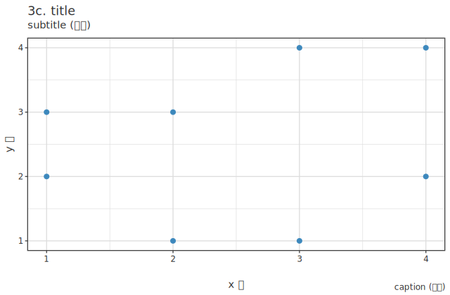

## theme ─ `theme :: ThemeName -> VisualSpec` {#theme}

```haskell
<> theme ThemeMinimal
```

選べる `ThemeName` は **13 種**。 同じ散布を各テーマで描いた一覧:

| テーマ | 見た目 |
|---|---|
| `ThemeDefault` / `ThemeMinimal` | 既定 / 枠なし最小 |
| `ThemeDark` / `ThemeLight` | 暗 / 明 |
| `ThemeGrey` / `ThemeBW` | 灰パネル / 白黒 |
| `ThemeClassic` / `ThemeVoid` / `ThemeLinedraw` | 軸線のみ / 枠なし / 細線 |
| `ThemeNoir` / `ThemeLumen` | ブランド暗 / 明 |
| `ThemeCanvas` / `ThemeCanvasDark` | 羊皮紙 (明 / 暗) |

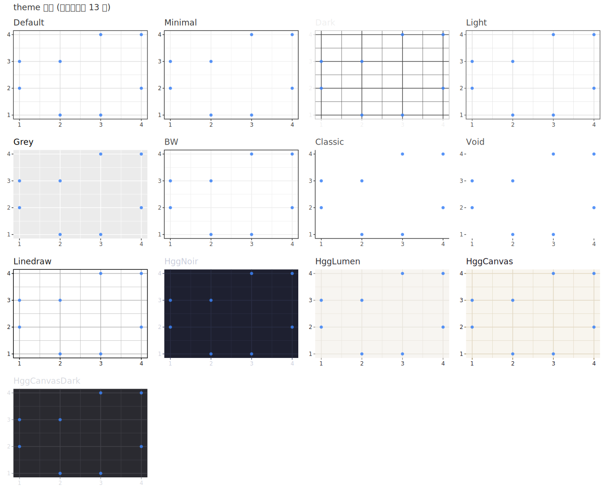

> **theme と系列色 (palette) は独立**: `theme` はパネル背景・grid・軸線・文字色など**図全体の
> 見た目**を決める。一方 `colorBy` で群を塗り分ける**系列色**は [palette / scaleColorManual](03-encoding-scale.md#scale)
> が決め、theme とは別軸で組み合わせる (どの theme でも任意の palette を載せられる)。theme 既定の
> 系列色は `themeSeriesPalette :: ThemeName -> [Text]` で取り出せる ([03 encoding & scale](03-encoding-scale.md#scale))。

```haskell
-- 1 テーマを適用
purePlot <> layer (scatter xs ys <> color (fromHex "#38bdf8") <> size 6) <> theme ThemeDark
```

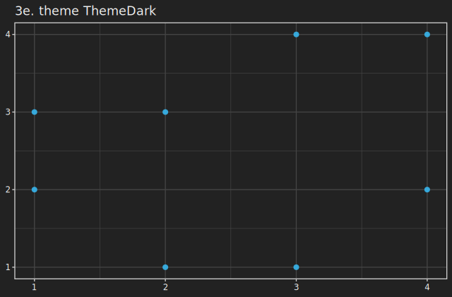

> **既定は ggplot 準拠**: プロットタイトルは**左寄せ** (全テーマ共通)、 凡例は**右・縦中央**
> ([凡例の節](#guides))。 `ThemeGrey` は灰パネル + 白 grid + tick grey20 + タイトル黒 + 凡例キー
> grey95 まで ggplot `theme_grey()` に揃えてある。 いずれも下記の要素上書きで変更できる。

### 要素単位の上書き

`theme` プリセットの後に、 個別要素を `<>` で部分上書きできる (ggplot の `theme(...)` 相当)。
いずれも `VisualSpec` を返す:

| 設定 | 型 (何を渡すか) | 意味 |
|---|---|---|
| `themeGrid` | `Bool -> VisualSpec` | グリッド線の on/off |
| `gridColor` / `panelFill` / `plotBg` | `Text -> VisualSpec` | グリッド色 / パネル背景 / 図全体背景 (色 hex) |
| `axisColor` / `textColor` / `stripFill` | `Text -> VisualSpec` | 軸線の色 / 文字色 / strip 背景 (色 hex) |
| `themeAxisLine` / `panelBorder` / `themeStrip` | `Bool -> VisualSpec` | 軸線 (下・左) / プロット枠線 / facet strip の on/off |
| `themeAxisTextAngle` | `Double -> VisualSpec` | tick ラベルの回転角 (度) |
| `titleHjust` | `Double -> VisualSpec` | プロットタイトルの水平揃え (`0`=左 [既定]・`0.5`=中央・`1`=右) |
| `titleColor` / `tickColor` / `legendKeyBg` | `Text -> VisualSpec` | タイトル文字色 / 軸目盛線 (tick mark) の色 / 凡例キー背景 (色 hex。`""` で塗らない) |
| `titleFont` / `axisLabelFont` / `tickFont` / `legendFont` | `FontSpec -> VisualSpec` | 各テキストのフォント (下記 combinator で組む) |

**フォント**は `FontSpec` を返す combinator (`fontSize`/`fontFamily`/`fontWeight`/`fontItalic`/
`fontColor`) を `<>` で組み、 `titleFont` 等に渡す (素の空値は `emptyFontSpec`):

```haskell
-- ThemeMinimal をベースに要素を部分上書き: タイトル太字 18px・tick 灰色・枠線・grid オフ・tick 45°
purePlot <> layer (scatter xs ys <> size 6)
  <> theme ThemeMinimal
  <> titleFont (fontSize 18 <> fontWeight "bold")   -- FontSpec を <> で合成
  <> tickFont  (fontSize 10 <> fontColor "#64748b")
  <> panelBorder True
  <> themeGrid False
  <> themeAxisTextAngle 45
```

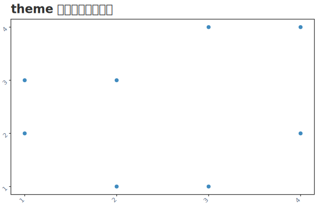

facet 図 ([facet](#facet)) では strip (見出し帯) も上書きできる:

```haskell
purePlot <> layer (scatter "x" "y" <> colorBy "g") <> facet "g"
  <> themeStrip True <> stripFill "#eef2ff"          -- strip を薄青背景に
```

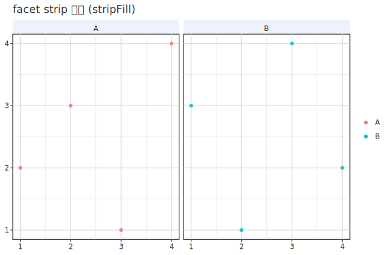

→ 動く例: `cabal run tutorial-05-theme`

> 各 font setter には `ThemeOverride` 経由の同名 `theme*Font` 版もある
> (`themeTitleFont`/`themeAxisLabelFont`/`themeTickFont`/`themeLegendFont`)。 描画では
> override (`theme*Font`) が setter (`titleFont` 系) より優先されるが、 **レイアウトの文字高
> 確保は `titleFont` 系のみが効く**ので、 単独で使うなら `titleFont` 系を推奨。

### theme と subplot の関係

[subplot](#subplots) と組み合わせたとき、 **`theme` を外側 (subplots の外) に置くと全 panel に伝播**する
(各 panel がそれぞれそのテーマで描かれる)。 panel ごとに違うテーマにしたいときは、 各 panel の
`VisualSpec` の中で個別に `theme` を足す (上の [テーマ一覧](#theme) はこの「panel 別 theme」 の例)。

```haskell
-- 外側 theme: 全 panel が ThemeDark に
subplots [ layer (scatter "x" "y") <> title "散布"
         , layer (bar "g" "y")     <> title "棒" ]
  <> subplotCols 2 <> theme ThemeDark
```

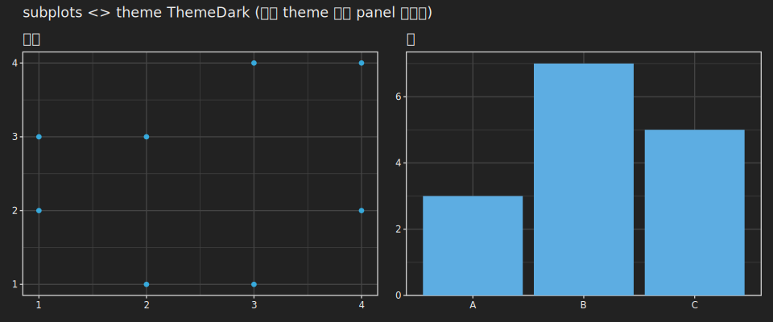

## facet (小分け) {#facet}

1 つの列の値でデータを小分けして複数 panel に並べる (ggplot `facet_*` 相当)。
**全オプション**:

```haskell
<> facet "g"                      -- 列 g で単純分割 (1 行 N 列)
<> facetWrap "g" 3                -- 列 g で分割し 3 列で折り返し
<> facetCols 3                    -- 列数だけ指定 (facet と併用)
<> facetGrid "row" "col"          -- row × col の 2 次元 cross 配置
<> facetScales FacetFreeY         -- 軸を panel ごとに自由化 (FacetFixed[既定]/FacetFreeX/FacetFreeY/FacetFree)
<> facetSpace SpaceFree           -- free 軸の panel サイズを data 範囲に比例配分 (facetGrid のみ有効)
```

| 関数 | 型 (何を渡すか) | 役割 (ggplot 対応) |
|---|---|---|
| `facet` | `ColRef -> VisualSpec` | 列で単純分割 (`facet_wrap(~g)`) |
| `facetWrap` | `ColRef -> Int -> VisualSpec` | 列で分割・n 列折返し (`facet_wrap(~g, ncol=n)`) |
| `facetCols` | `Int -> VisualSpec` | 列数のみ・`facet` と併用 (`ncol=n`) |
| `facetGrid` | `ColRef -> ColRef -> VisualSpec` | r × c の 2 次元 (`facet_grid(r ~ c)`) |
| `facetScales` | `FacetScales -> VisualSpec` | 軸の共有方式 (`scales="free_y"` 等・下記列挙型) |
| `facetSpace` | `FacetSpace -> VisualSpec` | panel サイズ配分・grid 限定 (`space="free"`) |

> `FacetScales` = `FacetFixed` / `FacetFreeX` / `FacetFreeY` / `FacetFree`。
> `FacetSpace` = `SpaceFixed` / `SpaceFreeX` / `SpaceFreeY` / `SpaceFree`。
> 完全に別の spec を panel に並べたい場合 (facet でなく独立図の並置) は [subplot](#subplots) を使う。

デモ (`facetWrap "g" 2`)。 facet 列は名前参照なので `Resolver` (または DataFrame) で
`"g"` を供給する:

```haskell
-- r は "x"/"y"/"g" を返す Resolver
saveSVGWith "out.svg" r $
  purePlot <> layer (scatter "x" "y" <> colorBy "g" <> size 6) <> facetWrap "g" 2
```

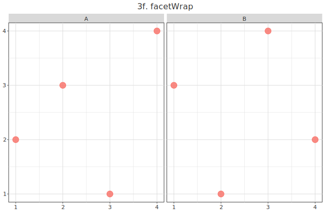

## subplot (独立図の並置) {#subplots}

`facet` が **1 つの列でデータを小分け**するのに対し、 `subplots` は **完全に別の `VisualSpec` を
並べる** (ggplot にはない・matplotlib `subplots` / patchwork 相当)。 図ごとに mark も軸も別でよい。

```haskell
<> subplots [ spec1, spec2, spec3 ]   -- 独立図のリストを並置
<> subplotCols 2                       -- 2 列で折り返し (既定は 1 行 N 列)
```

| 関数 | 型 (何を渡すか) | 役割 |
|---|---|---|
| `subplots` | `[VisualSpec] -> VisualSpec` | 各 `VisualSpec` を独立 panel として並べる |
| `subplotCols` | `Int -> VisualSpec` | 並置の折り返し列数 |
| `selectPanels` | `[Text] -> VisualSpec` | panel を title 名で選択 + 並べ替え |
| `repeatFields` | `[Text] -> (Text -> VisualSpec) -> VisualSpec` | フィールド名を反復し各 view を生成 (Vega-Lite `repeat`) |
| `hconcat` / `vconcat` | `[VisualSpec] -> VisualSpec` | 横 / 縦並び (演算子 `<->` / `<:>` も) |

**フィールド反復 (`repeatFields`)**: 同じ作図テンプレートを複数フィールドに適用したいときは、
`subplots` に手で並べる代わりに `repeatFields` を使う (Vega-Lite の `repeat` 相当・明示形)。
生成関数にフィールド名が渡るので、 各 view で別の列を使える:

```haskell
<> repeatFields ["height", "weight", "age"] (\f -> layer (hist f) <> title f)
<> subplotCols 3                                  -- 3 列に並べる
```

**panel の名前選択 (`selectPanels`)**: `repeatFields` が「名前リスト → panel 群」
なのに対し、 その**逆方向** = でき上がった panel 群から **名前 (= 各 panel の `title`) で
一部だけ選ぶ**。 列挙順がそのまま表示順になる (選択 + 並べ替えを兼ねる)。 多パラメータの
診断 grid (例: analyze 連携の HBM trace) から注目パラメータだけ見るときに使う:

```haskell
<> subplots panels <> selectPanels ["b1_0", "b1_1", "sigma"] <> subplotCols 1
-- title が一致しない名前は無視。 未指定なら従来通り全 panel。
```

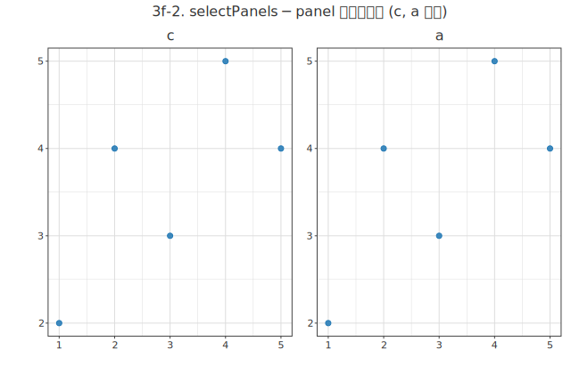

各 panel はそれ自身が完全な図なので、 `title` / `theme` / mark を panel 単位で `<>` できる:

```haskell
saveSVG "dash.svg" $
  subplots [ layer (scatter "x" "y") <> title "散布"
           , layer (line    "x" "y") <> title "折れ線"
           , layer (bar     "g" "y") <> title "棒" ]
  <> subplotCols 3 <> title "ダッシュボード"
```

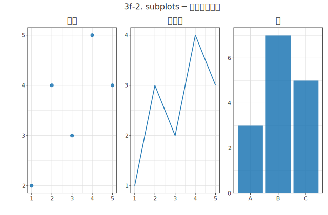

**入れ子 (nested subplots)**: panel の中身自体に `subplots` を持たせると、 入れ子グリッドになる
左に主図 1 つ・右に小図 2 段、 のような非対称レイアウトが組める:

```haskell
subplots [ layer (scatter "x" "y") <> title "主図"
         , subplots [ layer (histogram "x") <> title "x 分布"
                    , layer (histogram "y") <> title "y 分布" ] <> subplotCols 1 ]
<> subplotCols 2
```

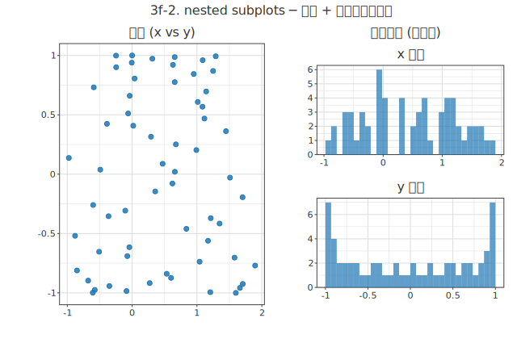

> HBM 診断を 1 枚に並べた入れ子ダッシュボードの実例は
> [analyze 連携の HBM ダッシュボード](07-analyze.md#hbm-plotting) を参照。

**concat 合成 (`hconcat` / `vconcat` + 演算子)**: `subplots` + `subplotCols` の薄ラッパとして、
Vega-Lite の `hconcat`/`vconcat` 相当と patchwork 風の中置演算子を用意している。

| 関数 / 演算子 | 役割 |
|---|---|
| `hconcat [a, b, c]` | 横並び (1 行 n 列・`subplots ss <> subplotCols (length ss)`) |
| `vconcat [a, b]` | 縦並び (n 行 1 列・`subplots ss <> subplotCols 1`) |
| `a <-> b` | 横結合演算子 (`infixl 6`) |
| `a <:> b` | 縦結合演算子 (`infixl 5`) |

演算子は **同方向チェーンを平坦化**する。 `a <-> b <-> c` は 3 等分列 (二項ネストで左セルが
`a,b` に割れたりしない) になり、 異なる方向を混ぜると入れ子になる。 たとえば
**1 行目を 3 列・2 行目を全幅 (1 行目セルの 3 倍幅)** は次の 1 行で書ける:

```haskell
saveSVG "concat.svg" $
  (a <-> b <-> c) <:> d          -- = vconcat [hconcat [a, b, c], d] と同値
```

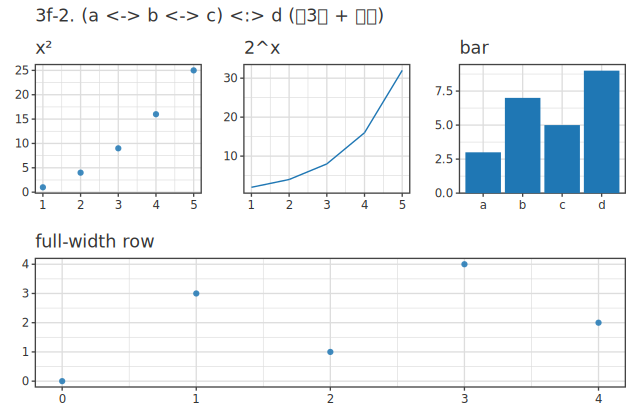

> **整列 (統一グリッド)**: ネストや span を含む並置は、内部で **1 枚の統一グリッド**へ
> 平坦化され、各 panel に `(行, 行span, 列, 列span)` が割り当てられる。これにより
> **行をまたいでも panel の端が揃う** ─ 上の例では 2 行目の全幅 `d` の左端が 1 行目左 `a` の
> 左端 (col0) と一致し、`d` は 1 行目 3 列ぶんを span してフル幅に伸びる。入れ子
> (nested subplots) の小図も、外側グリッドの割当セルいっぱいに広がって端が揃う


> **高度な helper (通常は不要)**: `selectedSubplots :: VisualSpec -> [VisualSpec]` =
> `selectPanels` 適用後の panel を取り出す。 `bakeSpec :: Resolver -> VisualSpec -> VisualSpec` =
> spec に Resolver を焼き込む (subplot / HBM 抽出子の内部で使用)。 `applyDiscreteLimits` =
> 離散 limits を解決。 facet の述語 `freeScaleX`/`freeScaleY` (`FacetScales -> Bool`)・
> `freeSpaceX`/`freeSpaceY` (`FacetSpace -> Bool`) は `facetScales` ([facet](#facet)) の判定用。

## 座標系 {#coord}

```haskell
<> coordFlip          -- x↔y 反転 (横棒グラフ等)
<> coordPolar         -- 極座標 (x 角度)
<> coordPolarY        -- 極座標 (y 角度)
<> reverseX           -- x 軸反転
<> reverseY           -- y 軸反転 (reverseX の y 版)
<> coordCartesianX lo hi   -- x 方向だけ表示範囲をズーム (範囲外データは捨てない)
<> coordCartesianY lo hi   -- y 方向だけズーム
<> coordCartesian x0 x1 y0 y1   -- 4 辺をまとめて指定
```

> **型**: `coordFlip` / `coordPolar` / `coordPolarY` / `reverseX` / `reverseY` は `VisualSpec` (引数なし)。
> `coordCartesianX` / `coordCartesianY :: Double -> Double -> VisualSpec`、
> `coordCartesian :: Double -> Double -> Double -> Double -> VisualSpec` (x0 x1 y0 y1)。
> `coordCartesian*` は **データを捨てずに見える範囲だけ**変える (ggplot `coord_cartesian(xlim=)` 相当)。
> 範囲外の行ごと落とす `axisRange` (下記 [補助](#guides)) とは別物。

デモ (`coordFlip` で横棒):

```haskell
purePlot <> layer (bar (inlineCat ["A","B","C"]) (inline [3,7,5])) <> coordFlip
```

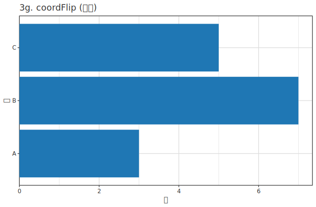

## 凡例・参照線・補助 {#guides}

```haskell
<> legend                         -- 凡例 ON
<> legendOff                      -- OFF
<> legendPos LegendBottom         -- 位置 (Right/Bottom/None/Inside*)
<> legendNcol 2                   -- 凡例を 2 列に (行数なら legendNrow 1)
<> legendReverse                  -- 凡例の並びを逆転
<> guideColorNone                 -- 色の凡例だけ隠す
<> refIdentity                    -- y=x 線
<> refHorizontal 0                -- 水平線 y=0
<> refVertical 1.0                -- 垂直線 x=1
<> refLine (RefLinear 2 1)        -- 任意 y = 2x + 1
<> marginalX                      -- x 周辺ヒストグラム (marginalY / marginal も)
```

> **型**: `legend` / `legendOff` / `legendReverse` / `guideColorNone` / `refIdentity` /
> `marginalX` / `marginalY` / `marginal` は `VisualSpec` (引数なし)。
> `legendPos :: LegendPosition -> VisualSpec` ([列挙型](#enum-tables))・`legendNcol` / `legendNrow :: Int -> VisualSpec`・
> `refHorizontal` / `refVertical :: Double -> VisualSpec`・`refLine :: ReferenceLine -> VisualSpec`。

> **既定の凡例位置は `LegendRightCenter`** (パネル右・縦中央揃え = ggplot `legend.position="right"`
> 相当)。 上揃えにしたいなら `legendPos LegendRight`、 下なら `LegendBottom`。

デモ (`refHorizontal` + `refVertical` + `legend`):

```haskell
purePlot <> layer (scatter xs ys <> colorBy gs <> size 6)
  <> refHorizontal 2.5 <> refVertical 2.5 <> legend
```

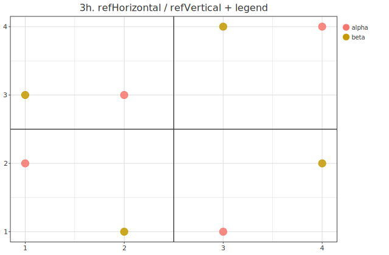

> **凡例幅は自動 (content-based)**: 右 (`LegendRight`) / 下 (`LegendBottom`) 凡例の幅は
> ggplot と同じく**最長ラベルに追従**して自動で伸縮する (固定予約ではない)。 短いラベル
> (`x` / `y` 等) なら右余白が詰まりプロット領域が広がり、 長いラベルや全角でもはみ出さない。
> 幅見積りは字種別 advance 近似 (全角 = 1.0em・大文字 ≒ 0.70em・細字 `i`/`l` ≒ 0.30em 等) で、
> backend 非依存に揃えてある (SVG / PNG / PDF / Canvas で同一)。

### 注釈・図中図・周辺分布

`annotText` / `annotArrow` / `annotRect` / `annotLine` は **そのまま `VisualSpec`** で `<>` で足す
(低レベルに `Annotation` を渡す `annotate` もある)。 図中図は `inset` / `insetAt` / `insetElement`、
周辺分布は `marginalX` / `marginalY`:

```haskell
purePlot <> layer (scatter "x" "y")
  <> annotText 2.0 5.0 "外れ値"                          -- (x,y) にテキスト
  <> annotArrow 1.5 4.5 2.0 5.0                          -- (x0,y0)→(x1,y1) 矢印
  <> annotRect 0 0 1 1 "領域A"                           -- 矩形 + ラベル
  <> marginalX                                           -- x 周辺ヒストグラム
  <> insetAt 0.7 0.7 0.25 0.25 (layer (histogram "x"))   -- 右上 (0.7,0.7) に 25% 角の小図
```

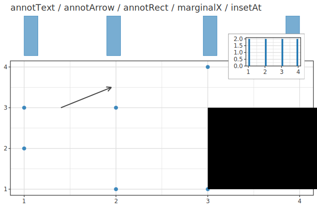

> **`Pos` 版** (`annotTextP` / `annotArrowP` / `annotRectP` / `annotLineP`): 座標を生の
> `Double` ではなく `Pos` で渡し、軸ごとに npc (`PNpc 0.95` = panel 幅の 95%)・data 値
> (`PNative 3.0`)・絶対長を混在できる。「右端 npc・y は data 値」のような枠相対の注釈に使う。
> 例: `annotTextP (PNpc 0.95) (PNative 3.0) "R²"`、
> `annotRectP (PNpc 0.0) (PNative 1.0) (PNpc 1.0) (PNative 2.0) "grey"` (x 全幅・y は data 1..2 の帯)。

> 関連型: `LegendSpec` (凡例)・`Annotation` / `AnnotCoord` (注釈・座標系)・`Inset` (図中図)・
> `MarginalKind` / `MarginalSpec` (周辺分布)・`Labs` ([タイトル・ラベル](#labels) の一括指定)。

## 値で選ぶ設定 (列挙型) の早見表 {#enum-tables}

取りうる値が決まっている設定 (`position` など) はここに **全部** 挙げる。 定義 = 最終的な真実は
モジュール **`Hgg.Plot.Spec`** が最終的な定義 (値が増えたらソースが正)。

| 設定関数 | 型 | 取りうる値 (すべて) |
|---|---|---|
| `position` | `Position` | `PosIdentity` / `PosDodge` / `PosStack` / `PosFill` |
| `linetype` / `linetypeBy` | `LineType` | `LtSolid` / `LtDashed` / `LtDotted` / `LtDotDash` / `LtLongDash` / `LtTwoDash` |
| `theme` | `ThemeName` | `ThemeDefault` / `ThemeMinimal` / `ThemeDark` / `ThemeLight` / `ThemeGrey` / `ThemeBW` / `ThemeClassic` / `ThemeVoid` / `ThemeLinedraw` / `ThemeNoir` / `ThemeLumen` / `ThemeCanvas` / `ThemeCanvasDark` (13 種) |
| `facetScales` | `FacetScales` | `FacetFixed` / `FacetFreeX` / `FacetFreeY` / `FacetFree` |
| `legendPos` | `LegendPosition` | `LegendRight` / `LegendBottom` / `LegendNone` / `LegendInsideTopRight` / `LegendInsideTopLeft` / `LegendInsideBottomRight` / `LegendInsideBottomLeft` |
| 座標系 (`coordFlip` / `coordPolar` …) | `Coord` | `CoordCartesian` / `CoordFlip` / `CoordPolarX` / `CoordPolarY` |
| `refLine` | `ReferenceLine` | `RefIdentity` / `RefHorizontalAt c` / `RefVerticalAt c` / `RefLinear slope intercept` |

> 例: 積み上げ棒 `<> position PosStack`、 横並び `<> position PosDodge`、 100% 積み上げ
> `<> position PosFill`。 破線 `<> linetype LtDashed`。 凡例を内側右上 `<> legendPos LegendInsideTopRight`。

## 重畳の正しい書き方 (`<>` の仕組み) {#overlay}

`<>` が 2 階層あることの実害は **重畳**で出る。

```haskell
-- ✅ 2 つの mark を重ねる: 各々を layer で包んで <>
purePlot
  <> layer (scatter xs ys <> alpha 0.85 <> size 5)
  <> layer (line    xs fit <> color (fromHex "#dc2626") <> stroke 2)

-- ❌ これは重ならない (= scatter と line のプロパティが合成され 1 つの mark になる)
purePlot
  <> layer (scatter xs ys <> line xs fit)
```

理由: `scatter`・`line` は `Layer` を返し、 `Layer` の `<>` は **同一 layer への
プロパティ合成** (色や太さの上書き) であって「2 図を重ねる」 意味ではない。
重畳は各々を `layer` で `VisualSpec` 化してから足す。 後に書いた layer が上に乗る。

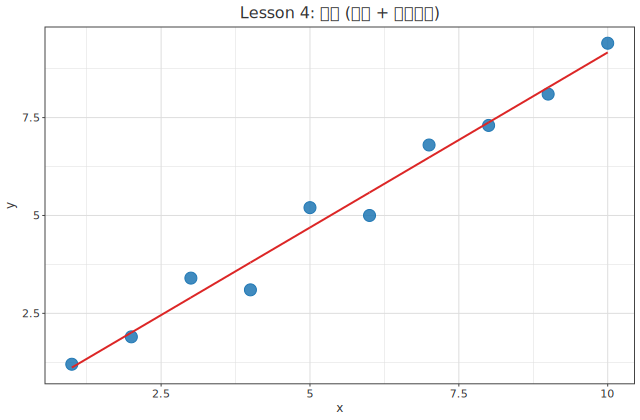

Easy 層の `overlay [a, b]` (= `foldMap layer`) はこの定型を 1 語にしたもの。

> **色と凡例の整合**: `colorBy (ColByName …)` を持つ layer を重畳した場合、
> glyph の色と凡例 swatch は**全 layer のカテゴリ union** という同じ正本から
> 引かれる (カテゴリの初出順に palette を割当)。 layer ごとに色が振り直されて
> 凡例とズレることはない。 順序を明示したいときは `colorCats [..]` が優先される。

## 高度な図 (設定の積層) {#advanced-layering}

`<>` で設定を積み重ねると、 1 枚に多くの encoding / 装飾を載せられる。 下は
**連続色 gradient + 点サイズ encoding + 回帰直線 overlay + 参照線 + theme + labs +
凡例**を 1 図に重ねた例 (本ページ各設定の組合せ)。 df 連携 ([06 dataframe](06-dataframe.md) で詳説) で書くと、
encoding はすべて列名で済み、 同じ列 (`"y"`) を色にも使い回せる:

```haskell
import           Hgg.Plot.Easy             -- Spec を re-export (scatter/layer/ColData…)
import           Hgg.Plot.Frame            ((|>>))
import           Hgg.Plot.Backend.SVG      (saveSVGBound)
import qualified Data.Map.Strict as M
import qualified Data.Vector     as V

num :: [Double] -> ColData ; num = NumData . V.fromList

-- x / y / sz (点サイズ用) / fit (回帰直線の予測値) を 1 つの df に
df :: M.Map Text ColData
df = M.fromList [ ("x", num xs), ("y", num ys), ("sz", num sz), ("fit", num fit) ]

main :: IO ()
main = saveSVGBound "advanced.svg" $
  df |>>
     ( layer ( scatter "x" "y"            -- 散布
               <> colorContinuousBy "y"     -- 連続色 (Viridis gradient・y 列を流用)
               <> sizeBy "sz"             -- 点サイズを列の値で
               <> alpha 0.85 )
     <> layer ( line "x" "fit"            -- 回帰直線 overlay
                <> color (fromHex "#ef4444") <> stroke 2 )
     <> scaleSize 4 16                     -- サイズ range
     <> refHorizontal 1.0                  -- 水平参照線
     <> theme ThemeMinimal
     <> legend
     <> labs (emptyLabs
          { labsTitle    = Just "連続色 + サイズ + 回帰 + 参照線"
          , labsSubtitle = Just "colorContinuousBy / sizeBy / line overlay / refHorizontal"
          , labsCaption  = Just "<> で設定を積層"
          , labsX = Just "x", labsY = Just "y" }) )
```

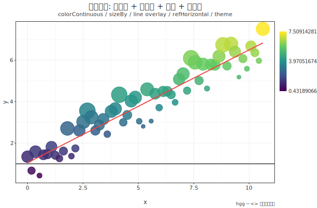

ポイント: **encoding (色・サイズ) は mark の中で `<>`**、 **scale・theme・参照線・labs は
図の外で `<>`** ([02 layers](02-layers.md) の戻り型ルール)。 重畳は mark ごとに `layer`
([重畳](#overlay))。 → 図の生成コードは `hgg-svg/examples/DocFigures.hs`
(`cabal run doc-figures` で本ガイドの全図を再生成)。

