# Decoration — Labels / theme / facet / subplot / coordinates / reference lines / overlay

> 🌐 **English** | [日本語](04-decoration.ja.md)

> [📚 Index](README.md) | [01 quickstart](01-quickstart.md) | [02 layers](02-layers.md) | [03 encoding & scale](03-encoding-scale.md) | **04 decoration** | [05 backends](05-backends.md) | [06 dataframe](06-dataframe.md) | [07 analyze](07-analyze.md) | [08 3d](08-3d.md) | [09 custom marks](09-custom-marks.md) | [10 appendix](10-appendix.md)

Figure-wide settings (all are `VisualSpec` · `<>` **outside** `purePlot <> … <> this`) are organized by topic. Mark appearance and channels are in [03 encoding & scale](03-encoding-scale.md#encoding); color and size scale and axis control are also there.

Structure of this page (topic index):
**[Title & Labels](#labels)** | **[theme](#theme)** |
**[facet](#facet)** | **[subplot](#subplots)** | **[Coordinates](#coord)** | **[Ternary coordinates](#ternary)** |
**[Legend, reference lines, helpers](#guides)** | **[Enum values quick reference](#enum-tables)** |
**[Layering correctly](#overlay)** | **[Advanced figures](#advanced-layering)**

> Each topic follows the pattern: **setting function table (type · meaning)** → **example (code + figure)**. All settings with fixed values (`position` / `theme` / `legendPos` etc.) are consolidated in [Enum values quick reference](#enum-tables).

## Title & Labels {#labels}

| Setting | Type (what to pass) | Meaning |
|---|---|---|
| `title` / `subtitle` / `caption` / `tag` | `Text -> VisualSpec` | Title / subtitle / caption / tag |
| `xLabel` / `yLabel` | `Text -> VisualSpec` | Axis labels |
| `legendTitle` | `Text -> VisualSpec` | Legend title |
| `labs` | `Labs -> VisualSpec` | Batch-specify labels (`emptyLabs { labsTitle = Just …, … }`) |
| `width` / `height` | `Length -> VisualSpec` | Figure size. Bare literals are **pt** (`width 600` = 600pt · `Num Length` default unit) |
| `widthMm` / `heightMm` | `Double -> VisualSpec` | Specify figure size in **mm** (`widthMm 180` = 180mm) |
| `widthUnit` / `heightUnit` | `Length -> VisualSpec` | Explicit unit. `widthUnit (7 *~ inch)` / `widthUnit (800 *~ px)` |
| `dpi` | `Double -> VisualSpec` | DPI for raster output (default 96). px=pt×dpi/72. PDF ignores this |
| `aspectRatio` | `Double -> VisualSpec` | Aspect ratio |

> **pt unit system**: Figure size is laid out in physical pt space; DPI is applied once at output boundary to convert to device px. Bare literals for `width`/`height` are **pt** (`Num Length`'s default `fromInteger` unit). For mm, use `widthMm`/`heightMm`. Default unspecified figure is **6.5×4in (468×288pt · landscape)**. For px-based legacy output, use `widthUnit (N *~ px)`. SVG is vector, so crisp at FHD+/HiDPI (independent of px count).

Example (batch `labs`):

```haskell
purePlot <> layer (scatter xs ys <> size 6)
  <> labs (emptyLabs { labsTitle = Just "title", labsSubtitle = Just "subtitle"
                     , labsCaption = Just "caption", labsX = Just "x axis", labsY = Just "y axis" })
```

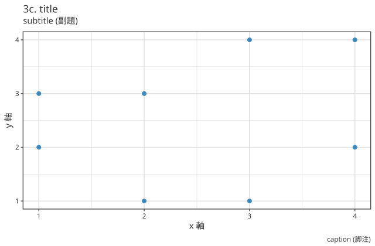

## theme — `theme :: ThemeName -> VisualSpec` {#theme}

```haskell
<> theme ThemeMinimal
```

**13 choices** for `ThemeName`. Gallery showing the same scatter in each theme:

| Theme | Appearance |
|---|---|
| `ThemeDefault` / `ThemeMinimal` | Default / minimal frameless |
| `ThemeDark` / `ThemeLight` | Dark / light |
| `ThemeGrey` / `ThemeBW` | Grey panel / black & white |
| `ThemeClassic` / `ThemeVoid` / `ThemeLinedraw` | Axis lines only / fully void (no axis lines, ticks, or axis text) / fine lines |
| `ThemeNoir` / `ThemeLumen` | Brand dark / light |
| `ThemeParchment` / `ThemeParchmentDark` | Parchment (light / dark) |

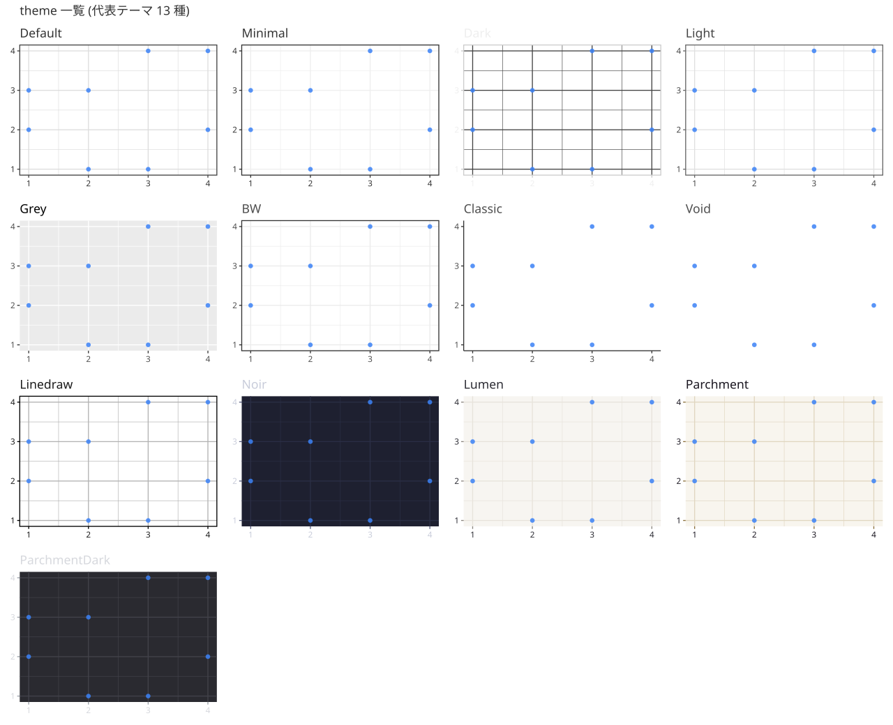

> **theme and series colors (palette) are independent**: `theme` sets the **overall appearance** — panel background, grid, axis lines, text color. Series colors for color-coding groups with `colorBy` are determined by [palette / scaleColorManual](03-encoding-scale.md#scale) and combine with theme on a separate axis (any palette can overlay any theme). Extract default series colors for a theme with `themeSeriesPalette :: ThemeName -> [Text]` ([03 encoding & scale](03-encoding-scale.md#scale)).

```haskell
-- Apply one theme
purePlot <> layer (scatter xs ys <> color (fromHex "#38bdf8") <> size 6) <> theme ThemeDark
```

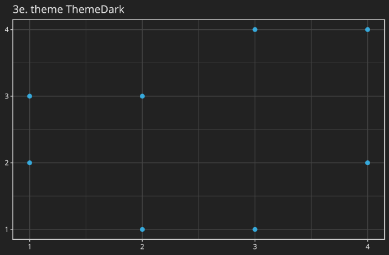

> **Default is ggplot-aligned**: Plot title is **left-aligned** (all themes), legend is **right · vertically centered** ([Legend section](#guides)). `ThemeGrey` matches ggplot `theme_grey()` down to grey panel + white grid + tick grey20 + black title + legend key grey95. All are customizable via element override below.

### Element-level overrides

After `theme` preset, override individual elements with `<>` (ggplot `theme(...)` equivalent). All return `VisualSpec`:

| Setting | Type (what to pass) | Meaning |
|---|---|---|
| `themeGrid` | `Bool -> VisualSpec` | Grid lines on/off (major/minor together) |
| `themeGridMajor` / `themeGridMinor` | `Bool -> VisualSpec` | **Individual** on/off for major / minor grid lines (individual > combined `themeGrid` > preset) |
| `gridColor` / `panelFill` / `plotBg` | `Text -> VisualSpec` | Grid color / panel background / overall background (color hex) |
| `themePlotBg` | `Bool -> VisualSpec` | Whether to **paint** the overall background (plot.background). `False` = transparent (ggplot `plot.background = element_blank()` / cowplot `fill = NA` equivalent; the color itself is set with `plotBg` above) |
| `axisColor` / `textColor` / `stripFill` | `Text -> VisualSpec` | Axis line color / text color / strip background (color hex) |
| `themeAxisLine` / `panelBorder` / `themeStrip` | `Bool -> VisualSpec` | Axis lines (bottom/left) / plot frame / facet strip on/off |
| `themeAxisText` / `themeAxisTitle` | `Bool -> VisualSpec` | Tick label text (axis.text) / axis title (axis.title) on/off (`False` = element_blank equivalent, margin reservation drops too; default is `False` only for `ThemeVoid`) |
| `themeAxisTextAngle` | `Double -> VisualSpec` | Tick label rotation (degrees, both axes) |
| `themeAxisTextAngleX` / `themeAxisTextAngleY` | `Double -> VisualSpec` | Rotation for x / y axis only (wins over the shared version; per-axis `axisRotate` wins over both) |
| `themeTickLength` | `Double -> VisualSpec` | Axis tick mark length in pt (default 2.75 = ggplot `axis.ticks.length`) |
| `themeTickDir` | `TickDir -> VisualSpec` | Tick direction ([enum](#enum-tables); `TickIn` pulls labels closer to the axis) |
| `themeGridWidth` | `Double -> VisualSpec` | Major grid line width in pt (ggplot `panel.grid = element_line(linewidth=)`). When set, polar / ternary grids use the same width. Unset falls back to per-coordinate defaults (Cartesian major 1.0, polar / ternary 0.5) |
| `themeGridMinorWidth` | `Double -> VisualSpec` | Minor grid line width in pt (`panel.grid.minor`). Unset follows major × 0.5 (ggplot `rel(0.5)`) |
| `themeAxisLineWidth` | `Double -> VisualSpec` | Line width in pt for axis lines, the plot frame, and ternary triangle edges (ggplot `axis.line` / `panel.border`; default 1.0; tick marks are unaffected) |
| `themePlotMargin` | `Double -> Double -> Double -> Double -> VisualSpec` | Outer plot margin t r b l (pt, same order as ggplot `margin(t,r,b,l)`). When set, **replaces** the automatic outer margin (5.5pt per side) |
| `themeLegendPos` | `LegendPosition -> VisualSpec` | Bake legend position into a theme (figure-level `legendPos` wins if specified) |
| `themeLegendKeySize` | `Double -> VisualSpec` | Legend key side length (pt, ggplot `legend.key.size` equivalent). Also sets the legend row pitch = line spacing, and propagates to margin reservation (default = 1.2 lines, 17.34pt at base 11) |
| `titleHjust` | `Double -> VisualSpec` | Plot title horizontal alignment (`0`=left [default] · `0.5`=center · `1`=right) |
| `titleColor` / `tickColor` / `legendKeyBg` | `Text -> VisualSpec` | Title text color / axis tick mark color / legend key background (color hex; `""` for no fill) |
| `themeBaseFontSize` | `Double -> VisualSpec` | Base font size (pt, ggplot `base_size` equivalent, default 11). Default sizes of all text slots and spacing derive from it (see note below) |
| `themeFontFamily` | `Text -> VisualSpec` | Font family for **all text slots at once** (ggplot `theme(text = element_text(family=…))` equivalent; see note below) |
| `titleFont` / `axisLabelFont` / `tickFont` / `legendFont` | `FontSpec -> VisualSpec` | Font for each text (compose with combinator below) |

**Fonts** are composed with combinators (`fontSize`/`fontFamily`/`fontWeight`/`fontItalic`/`fontColor`) returning `FontSpec` and combined with `<>` to pass to `titleFont` etc. (empty default is `emptyFontSpec`):

```haskell
-- Override elements on ThemeMinimal base: bold 18px title, grey 10px ticks, frame, grid off, 45° ticks
purePlot <> layer (scatter xs ys <> size 6)
  <> theme ThemeMinimal
  <> titleFont (fontSize 18 <> fontWeight "bold")   -- compose FontSpec with <>
  <> tickFont  (fontSize 10 <> fontColor "#64748b")
  <> panelBorder True
  <> themeGrid False
  <> themeAxisTextAngle 45
```

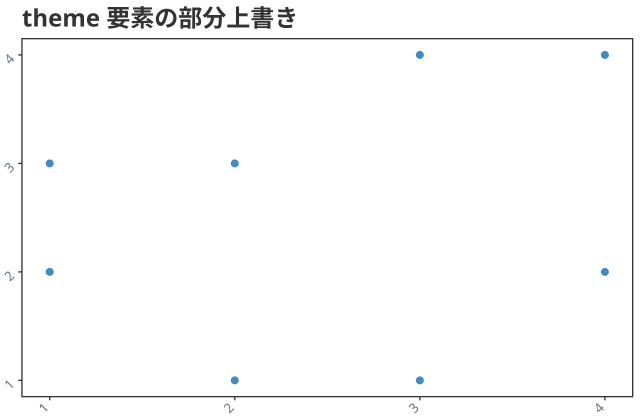

The **width** of grid lines and axis lines is controlled by `themeGridWidth` /
`themeGridMinorWidth` / `themeAxisLineWidth` (ggplot `element_line(linewidth=)`
equivalent). `themeGridWidth` applies to Cartesian major grids and also unifies
polar / ternary grids to the same width; minor follows major × 0.5 unless set
explicitly. `themeAxisLineWidth` thickens axis lines, the plot frame, and the
three ternary edges together (tick marks are unaffected):

```haskell
purePlot <> layer (scatter xs ys <> size 5)
  <> theme ThemeMinimal <> gridColor "#9ca3af" <> panelBorder True
  <> themeGridWidth 2.5      -- major grid at 2.5pt (minor follows at 1.25pt)
  <> themeAxisLineWidth 2.0  -- axis lines / frame at 2.0pt
```

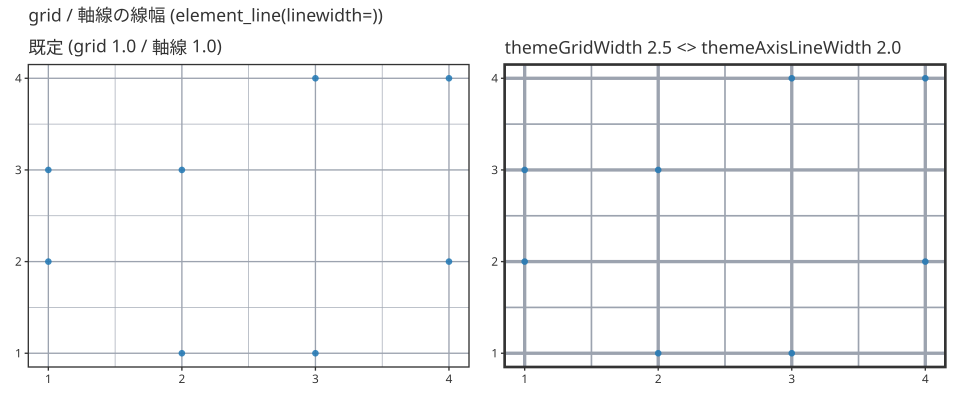

For facet figures ([facet](#facet)), the strip (header bar) is also customizable:

```haskell
purePlot <> layer (scatter "x" "y" <> colorBy "g") <> facet "g"
  <> themeStrip True <> stripFill "#eef2ff"          -- set strip to light blue background
```

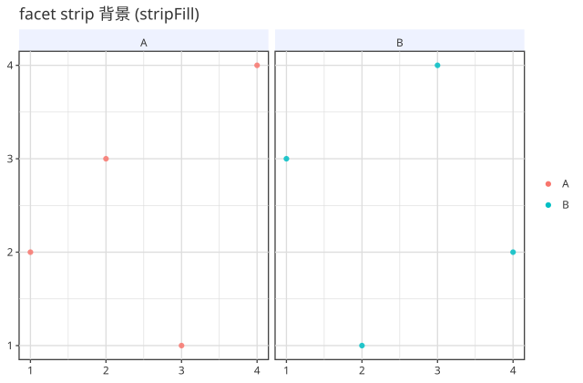

→ Working example: `cabal run tutorial-05-theme`

> Each font setter has a `ThemeOverride` equivalent via `theme*Font` (`themeTitleFont`/`themeAxisLabelFont`/`themeTickFont`/`themeLegendFont`). In rendering, override (`theme*Font`) takes priority, but **layout character height is only affected by `titleFont` series**, so prefer `titleFont` for standalone use.

> **Default text sizes and spacing derive from the base size**: from `themeBaseFontSize`
> (default 11pt), default slot sizes derive by relative factors (title ×1.2 · axis.title ×1 ·
> axis.text ×0.8 · legend.title ×1 · legend.text ×0.8), and spacing such as tick length
> (base/4 = 2.75pt) and outer margin (half_line = base/2 = 5.5pt) follows the same base
> (ggplot `theme_grey(base_size=)` equivalent). An explicit `fontSize` on a per-slot font
> setter wins.

> **Setting the font family in one place**: `themeFontFamily "Noto Sans CJK JP"` applies
> just the family to all theme text slots (title series / axis.title / axis.text / legend).
> A per-slot `FontSpec` `fontFamily` wins, and font sizes baked in by presets are left
> untouched. How the family resolves to an actual font is backend-specific: SVG passes it
> through to CSS `font-family`, PNG resolves it to a font file (falls back to the default
> font with a warning if absent, [05 backends](05-backends.md#be-png)), and PDF rounds to
> the Helvetica/Times/Courier trio ([05 backends](05-backends.md#be-pdf)). Annotation text
> (`annotText` etc.) is not affected (stays at the default sans-serif).

### Custom themes and cowplot-style presets {#theme-presets}

Every override setter above returns a `VisualSpec`, so **bundling them with `<>` under a
name gives you a "custom theme"** (no need to grow the ThemeName enum):

```haskell
myTheme :: VisualSpec
myTheme = theme ThemeMinimal <> themeGridMinor False <> titleHjust 0.5
-- usage: purePlot <> layer ... <> myTheme  (append more setters to override individually)
```

As worked examples of this pattern, presets equivalent to three themes from the R
**cowplot** package ship out of the box. Each preset has a **Sized variant**
(`Double -> VisualSpec`) taking cowplot's `font_size` argument; the plain name is the
14pt application (= cowplot default, `themeCowplot = themeCowplotSized 14`):

| preset / Sized variant | Equivalent (cowplot) | Contents |
|---|---|---|
| `themeCowplot` / `themeCowplotSized n` | `theme_cowplot(font_size = n)` | no grid, black bottom/left axis lines, outward ticks, black text, bold title, transparent background |
| `themeMinimalGrid` / `themeMinimalGridSized n` | `theme_minimal_grid(font_size = n)` | major grid (grey85) only; no axis lines / frame / ticks; transparent background |
| `themeMap` / `themeMapSized n` | `theme_map(font_size = n)` | removes axis lines, grid, frame, tick marks and **axis text (axis.text / axis.title)** (maps, diagrams); facet strip stays at grey80; transparent background |

> **Sized scaling rule**: from `font_size = n` derive the text sizes — title `n×16/14`
> bold, axis.title `n`, axis.text / legend `n×12/14` — together with tick length `n/4`,
> outer margin `n/2` and legend key `1.1×n` (cowplot's explicit `legend.key.size`).
> **Use the Sized variant to change size** — appending `themeBaseFontSize` after a preset
> only rescales spacing; the text sizes the preset baked in stay put. Note all three
> presets set `themePlotBg False` (cowplot's `rect fill = NA`), so the overall background
> is transparent (append `themePlotBg True` if you need white).

```haskell
purePlot <> layer (scatter xs ys) <> themeCowplot
-- change size with the Sized variant: themeCowplotSized 12
-- override individually by appending: themeCowplot <> themeTickLength 5 <> themeLegendPos LegendBottom
```

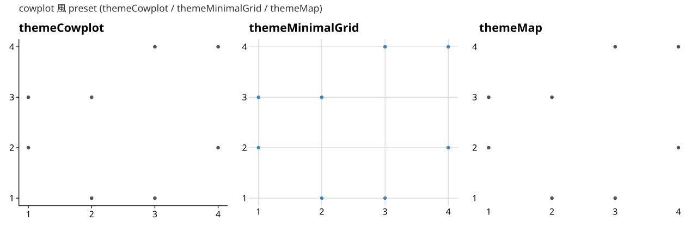

> For cowplot's `plot_grid()` (relative panel widths + "A"/"B" tags) use
> `subplotWidths` / `subplotTags` in [subplot](#subplots).

### theme and subplot relationship

When combined with [subplot](#subplots), **placing `theme` outside (outside subplots) propagates to all panels** (each panel is rendered with that theme). To use different themes per panel, add `theme` individually inside each panel's `VisualSpec` (the [theme gallery](#theme) above is an example of this "per-panel theme").

```haskell
-- Outer theme: all panels are ThemeDark
subplots [ layer (scatter "x" "y") <> title "scatter"
         , layer (bar "g" "y")     <> title "bar" ]
  <> subplotCols 2 <> theme ThemeDark
```

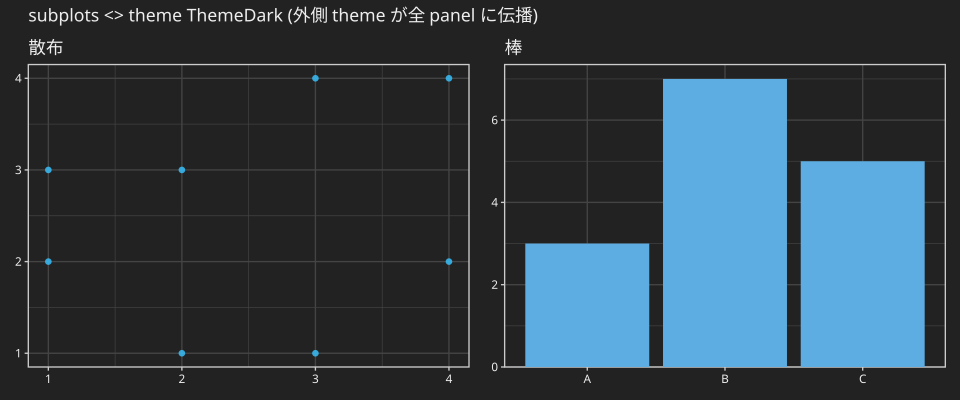

## facet (partitioning) {#facet}

Partition data by one column value and arrange in multiple panels (ggplot `facet_*` equivalent).
**All options**:

```haskell
<> facet "g"                      -- Simple partition by column g (1 row N cols)
<> facetWrap "g" 3                -- Partition by g and wrap at 3 cols
<> facetCols 3                    -- Specify column count only (use with facet)
<> facetGrid "row" "col"          -- 2D cross-layout (row × col)
<> facetScales FacetFreeY         -- Free axes per panel (FacetFixed[default]/FacetFreeX/FacetFreeY/FacetFree)
<> facetSpace SpaceFree           -- Proportional panel sizes to data range for free axes (facetGrid only)
```

| Function | Type (what to pass) | Role (ggplot equivalent) |
|---|---|---|
| `facet` | `ColRef -> VisualSpec` | Simple partition by column (`facet_wrap(~g)`) |
| `facetWrap` | `ColRef -> Int -> VisualSpec` | Partition by column, wrap at n cols (`facet_wrap(~g, ncol=n)`) |
| `facetCols` | `Int -> VisualSpec` | Column count only · use with `facet` (`ncol=n`) |
| `facetGrid` | `ColRef -> ColRef -> VisualSpec` | 2D r × c layout (`facet_grid(r ~ c)`) |
| `facetScales` | `FacetScales -> VisualSpec` | Axis sharing mode (`scales="free_y"` etc. · enum below) |
| `facetSpace` | `FacetSpace -> VisualSpec` | Panel size allocation · grid only (`space="free"`) |

> `FacetScales` = `FacetFixed` / `FacetFreeX` / `FacetFreeY` / `FacetFree`.
> `FacetSpace` = `SpaceFixed` / `SpaceFreeX` / `SpaceFreeY` / `SpaceFree`.
> To arrange completely separate specs in panels (independent figures, not facet), use [subplot](#subplots).

Example (`facetWrap "g" 2`). Facet and encoding columns can be inline (`inline` / `inlineCat`) or name references — inline encodings are split per panel correctly (inline columns must have the same length as the facet column; mismatched columns are left unsplit and reported with a warning). With name references, supply `"g"` via `Resolver` (or DataFrame):

```haskell
-- r is a Resolver returning "x"/"y"/"g"
saveSVGWith "out.svg" r $
  purePlot <> layer (scatter "x" "y" <> colorBy "g" <> size 6) <> facetWrap "g" 2
```

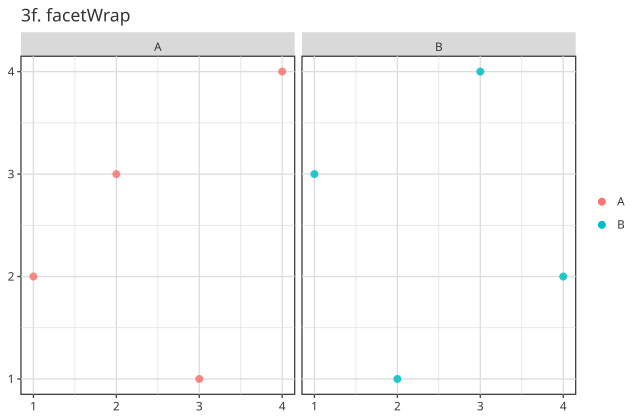

## subplot (independent figure composition) {#subplots}

Where `facet` **partitions data by one column**, `subplots` **composes completely separate `VisualSpec`s** (not in ggplot; like matplotlib `subplots` / patchwork). Marks and axes differ per figure.

```haskell
<> subplots [ spec1, spec2, spec3 ]   -- Compose list of independent figures
<> subplotCols 2                       -- Wrap at 2 cols (default is 1 row N cols)
```

| Function | Type (what to pass) | Role |
|---|---|---|
| `subplots` | `[VisualSpec] -> VisualSpec` | Arrange each `VisualSpec` as independent panel |
| `subplotCols` | `Int -> VisualSpec` | Wrap column count |
| `subplotWidths` / `subplotHeights` | `[Double] -> VisualSpec` | Relative column / row sizes (cowplot `rel_widths` / `rel_heights`; missing entries filled with 1, all 1 = equal split) |
| `subplotTags` | `TagStyle -> VisualSpec` | Auto-label each panel "A"/"B"… at the top left (a panel's own `tag` wins; [enum](#enum-tables)) |
| `selectPanels` | `[Text] -> VisualSpec` | Select + reorder panels by title name |
| `repeatFields` | `[Text] -> (Text -> VisualSpec) -> VisualSpec` | Iterate field names and generate views (Vega-Lite `repeat`) |
| `hconcat` / `vconcat` | `[VisualSpec] -> VisualSpec` | Horizontal / vertical composition (operators `<->` / `<:>` too) |

**Field iteration (`repeatFields`)**: To apply the same plot template to multiple fields without manually arranging in `subplots`, use `repeatFields` (Vega-Lite `repeat` equivalent · explicit form). Field name is passed to generator function, so each view uses different columns:

```haskell
<> repeatFields ["height", "weight", "age"] (\f -> layer (hist f) <> title f)
<> subplotCols 3                                  -- Arrange in 3 cols
```

**Panel name selection (`selectPanels`)**: Inverse of `repeatFields`: from completed panel list, **select subset by name** (= each panel's `title`). Enumeration order becomes display order (selection + reordering combined). Use for multi-parameter diagnostic grids (e.g., HBM trace from analyze integration) showing only parameters of interest:

```haskell
<> subplots panels <> selectPanels ["b1_0", "b1_1", "sigma"] <> subplotCols 1
-- Unmatched title names are ignored. Unspecified uses all panels as before.
```

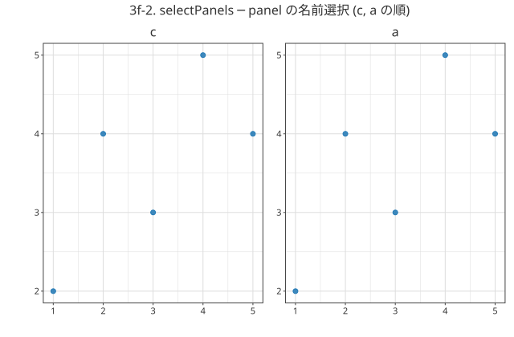

Each panel is complete figure, so `title` / `theme` / marks are combined per panel with `<>`:

```haskell
saveSVG "dash.svg" $
  subplots [ layer (scatter "x" "y") <> title "scatter"
           , layer (line    "x" "y") <> title "line"
           , layer (bar     "g" "y") <> title "bar" ]
  <> subplotCols 3 <> title "dashboard"
```

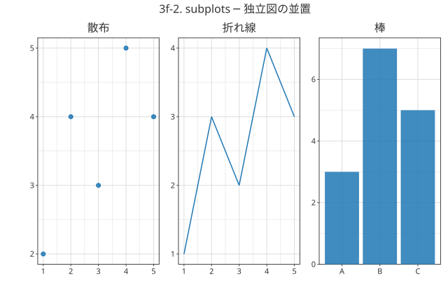

**Nesting (nested subplots)**: When panel content itself contains `subplots`, creates nested grid. Asymmetric layouts like one main figure left, small figures 2-high right:

```haskell
subplots [ layer (scatter "x" "y") <> title "main"
         , subplots [ layer (histogram "x") <> title "x distribution"
                    , layer (histogram "y") <> title "y distribution" ] <> subplotCols 1 ]
<> subplotCols 2
```

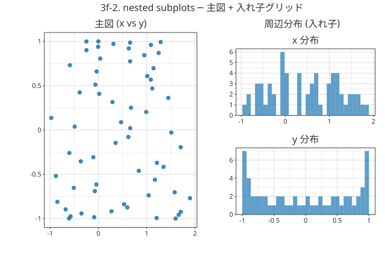

> Working nested dashboard example with HBM diagnostics in one frame is at [HBM plotting with analyze integration](07-analyze.md#hbm-plotting).

**Concat composition (`hconcat` / `vconcat` + operators)**: Thin wrappers around `subplots` + `subplotCols` providing Vega-Lite `hconcat`/`vconcat` equivalent and patchwork-style infix operators.

| Function / Operator | Role |
|---|---|
| `hconcat [a, b, c]` | Horizontal (1 row n cols · `subplots ss <> subplotCols (length ss)`) |
| `vconcat [a, b]` | Vertical (n rows 1 col · `subplots ss <> subplotCols 1`) |
| `a <-> b` | Horizontal merge operator (`infixl 6`) |
| `a <:> b` | Vertical merge operator (`infixl 6` · same precedence as `<->`) |

Operators **flatten same-direction chains**. `a <-> b <-> c` becomes 3-equal-width columns (binary nesting doesn't split left cell into `a,b`); mixing directions nests. For example, **row 1 with 3 cols, row 2 full-width** (3× row 1 cell width) in one line:

```haskell
saveSVG "concat.svg" $
  (a <-> b <-> c) <:> d          -- = vconcat [hconcat [a, b, c], d]
```

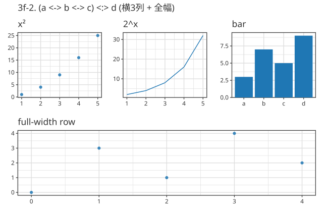

> **Alignment (unified grid)**: Compositions with nesting or spans internally flatten to **single unified grid**, assigning each panel `(row, rowspan, col, colspan)`. This means **panel edges align across rows** — in the example above, row 2 full-width `d` left edge aligns with row 1 left `a` (col0), and `d` spans 3 columns for full width. Nested subplots also expand to fill outer grid cell.

**Relative sizes + panel tags (cowplot `plot_grid()` equivalent)**: specify column/row
width ratios with `subplotWidths` / `subplotHeights`, and auto-number panels "A"/"B"…
with `subplotTags`. Tags draw at the same spot as `tag` ([Title & Labels](#labels)) and a
panel's own `tag` wins. Past 26 panels the labels grow digits ("Z" → "AA"):

```haskell
subplots [ layer (scatter "x" "y") <> title "scatter"
         , layer (bar "g" "y")     <> title "bar" ]
<> subplotCols 2 <> subplotWidths [1.3, 1] <> subplotTags TagUpper
```

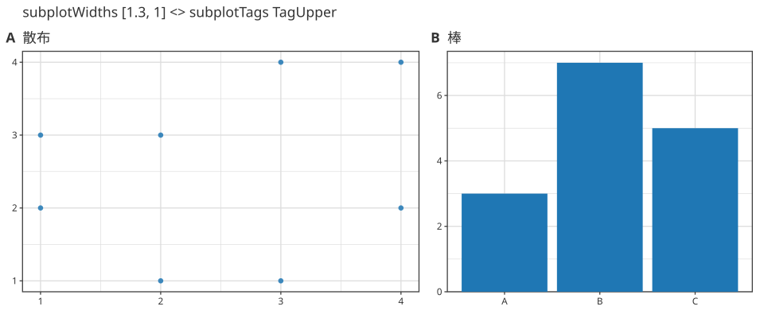

> **Advanced helpers (normally not needed)**: `selectedSubplots :: VisualSpec -> [VisualSpec]` extracts panels after `selectPanels`. `bakeSpec :: Resolver -> VisualSpec -> VisualSpec` bakes Resolver into spec (internal for subplot / HBM extractors). `applyDiscreteLimits` resolves discrete limits. `freeScaleX`/`freeScaleY` (`FacetScales -> Bool`) and `freeSpaceX`/`freeSpaceY` (`FacetSpace -> Bool`) predicates for facet are for testing `facetScales` ([facet](#facet)).

## Coordinates {#coord}

```haskell
<> coordFlip          -- x↔y flip (horizontal bar etc.)
<> coordPolar         -- polar coordinates (x = angle)
<> coordPolarY        -- polar coordinates (y = angle)
<> coordTernary       -- ternary coordinates (3-part composition encX/encY/encZ)
<> reverseX           -- reverse x axis
<> reverseY           -- reverse y axis (y version of reverseX)
<> coordCartesianX lo hi   -- zoom display range x-only (out-of-range data kept)
<> coordCartesianY lo hi   -- zoom display range y-only
<> coordCartesian x0 x1 y0 y1   -- specify all 4 sides
```

> **Types**: `coordFlip` / `coordPolar` / `coordPolarY` / `coordTernary` / `reverseX` / `reverseY` are `VisualSpec` (no arguments).
> `coordPolarWith` / `coordPolarYWith :: Double -> Double -> VisualSpec` (start · direction),
> `coordTernaryWith :: Bool -> Int -> VisualSpec` (clockwise · rotate).
> `coordCartesianX` / `coordCartesianY :: Double -> Double -> VisualSpec`,
> `coordCartesian :: Double -> Double -> Double -> Double -> VisualSpec` (x0 x1 y0 y1).
> `coordCartesian*` **changes only visible range, keeps data** (ggplot `coord_cartesian(xlim=)` equivalent).
> Different from `axisRange` which drops out-of-range rows (see [Helpers](#guides) below).

Example (`coordFlip` for horizontal bar):

```haskell
purePlot <> layer (bar (inlineCat ["A","B","C"]) (inline [3,7,5])) <> coordFlip
```

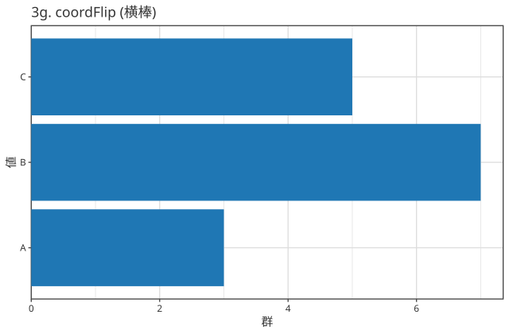

### Ternary coordinates {#ternary}

Maps 3-part **compositional data** onto barycentric coordinates in an equilateral
triangle. The minimal form just passes the 3 parts (`a` top vertex, `b` bottom
left, `c` bottom right) to `ternaryScatter` (mark entry:
[02 layers](02-layers.md#e-ternary)) — **writing `encZ` switches the
coordinate system to ternary automatically**, so `coordTernary` can be omitted:

```haskell
purePlot
  <> layer (ternaryScatter (inline [0.7, 0.2, 0.2, 0.34])   -- a (top vertex)
                           (inline [0.2, 0.7, 0.1, 0.33])   -- b (bottom left)
                           (inline [0.1, 0.1, 0.7, 0.33]))  -- c (bottom right)
  <> xLabel "a" <> yLabel "b" <> zLabel "c"
```

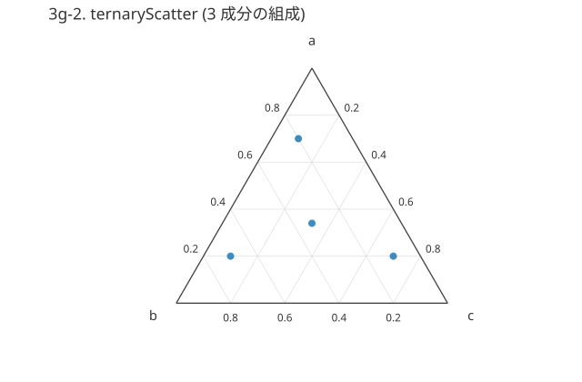

- `ternaryScatter a b c :: ColRef -> ColRef -> ColRef -> Layer` bundles
  `scatter a b <> encZ c`. For a polyline use `ternaryLine`. You can also
  compose the parts yourself with `scatter a b <> encZ c`
  (`encZ :: ColRef -> Layer` is the ternary-only third positional column).
  Vertex titles are set with `xLabel` (a) / `yLabel` (b) / `zLabel` (c)
  (`zLabel :: Text -> VisualSpec`).
- **The coordinate system is inferred from `encZ`**: if any layer carries
  `encZ`, the plot becomes ternary (`encZ` is ternary-only, so there are no
  false positives). Explicit settings (`coordTernary` / `coordTernaryWith`)
  always win. When overlaying points and lines, **attach `encZ` to every
  layer** (a layer without it falls back to `c = 1 - a - b`, which can land on
  a different point).
- **Normalization**: each row is normalized so the parts sum to 1, i.e.
  `(a, b, c) → (a, b, c) / (a+b+c)`. Raw quantities whose sum is not 1 can be
  passed as-is.
- **Degenerate rows are dropped**: rows with a negative part or a sum ≤ 0 are
  treated as missing and **dropped whole** (points are skipped; lines close the gap).
- **Supported marks**: point / line / area (band) / text. Combining any other
  mark with ternary coordinates emits a warning (the diagnostics described in
  [backends](05-backends.md)); rendering continues but the result is unspecified.

**Changing the orientation** — `coordTernaryWith clockwise rotate :: Bool -> Int -> VisualSpec`
changes the cyclic direction of the vertices and the rotation (ggtern's
`theme_clockwise` equivalent; `coordTernary` = `coordTernaryWith False 0`):

```haskell
<> coordTernaryWith true 0     -- clockwise (swaps bottom-left ↔ bottom-right)
<> coordTernaryWith false 120  -- rotate which part sits at the top vertex by 120° (0 / 120 / 240)
```

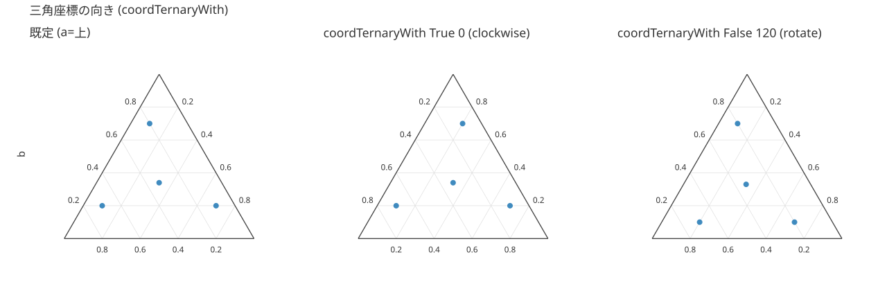

## Legend, reference lines, helpers {#guides}

```haskell
<> legend                         -- Legend ON
<> legendOff                      -- OFF
<> legendPos LegendBottom         -- Position (Right/Bottom/None/Inside*)
<> legendNcol 2                   -- Legend in 2 cols (legendNrow 1 for rows)
<> legendReverse                  -- Reverse legend order
<> guideColorNone                 -- Hide color legend only
<> refIdentity                    -- y=x line
<> refHorizontal 0                -- Horizontal line y=0
<> refVertical 1.0                -- Vertical line x=1
<> refLine (RefLinear 2 1)        -- Arbitrary y = 2x + 1
<> marginalX                      -- x marginal histogram (marginalY / marginal too)
```

> **Types**: `legend` / `legendOff` / `legendReverse` / `guideColorNone` / `refIdentity` / `marginalX` / `marginalY` / `marginal` are `VisualSpec` (no arguments).
> `legendPos :: LegendPosition -> VisualSpec` ([enum](#enum-tables)) / `legendNcol` / `legendNrow :: Int -> VisualSpec` / `refHorizontal` / `refVertical :: Double -> VisualSpec` / `refLine :: ReferenceLine -> VisualSpec`.

> **Default legend position is `LegendRightCenter`** (panel right · vertically centered = ggplot `legend.position="right"` equivalent). For top alignment use `legendPos LegendRight`, bottom use `LegendBottom`.

Example (`refHorizontal` + `refVertical` + `legend`):

```haskell
purePlot <> layer (scatter xs ys <> colorBy gs <> size 6)
  <> refHorizontal 2.5 <> refVertical 2.5 <> legend
```

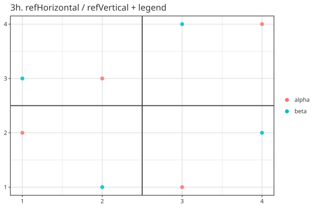

> **Legend width is automatic (content-based)**: Right (`LegendRight`) / bottom (`LegendBottom`) legend widths follow **longest label** automatically (not fixed reservation). Short labels (`x` / `y` etc.) tighten right margin and expand plot area; long labels and full-width characters don't overflow. Width estimation uses per-script advance approximation (full-width = 1.0em · uppercase ≈ 0.70em · thin `i`/`l` ≈ 0.30em etc.), unified across backends (SVG / PNG / PDF / Canvas identical).

### Annotations, insets, marginal distribution

`annotText` / `annotArrow` / `annotRect` / `annotLine` are **added directly as `VisualSpec`** with `<>` (lower-level `annotate` taking `Annotation` also exists). Insets use `inset` / `insetAt` / `insetElement`; marginals use `marginalX` / `marginalY`:

```haskell
purePlot <> layer (scatter "x" "y")
  <> annotText 2.0 5.0 "outlier"                      -- Text at (x,y)
  <> annotArrow 1.5 4.5 2.0 5.0                       -- Arrow (x0,y0)→(x1,y1)
  <> annotRect 0 0 1 1 "region A"                     -- Rectangle + label
  <> marginalX                                        -- x marginal histogram
  <> insetAt 0.7 0.7 0.25 0.25 (layer (histogram "x"))   -- 25% small figure at (0.7,0.7) upper-right
```

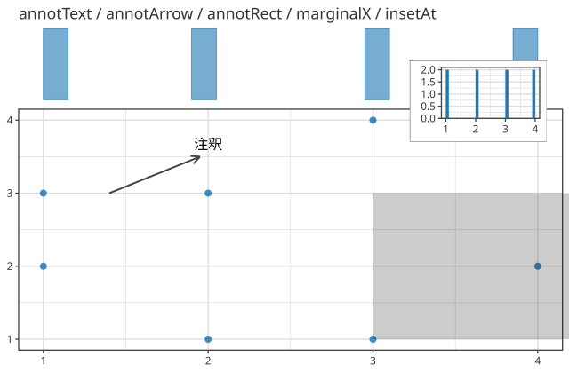

> **`Pos` version** (`annotTextP` / `annotArrowP` / `annotRectP` / `annotLineP`): Pass coordinates as `Pos` instead of raw `Double`, mixing npc (`PNpc 0.95` = panel 95%), data values (`PNative 3.0`), or absolute lengths per axis. Use for panel-relative annotations like "right edge npc, y is data value".
> Examples: `annotTextP (PNpc 0.95) (PNative 3.0) "R²"`,
> `annotRectP (PNpc 0.0) (PNative 1.0) (PNpc 1.0) (PNative 2.0) "grey"` (x full-width, y data band 1..2).

> Related types: `LegendSpec` (legend) / `Annotation` / `AnnotCoord` (annotations, coordinates) / `Inset` (insets) / `MarginalKind` / `MarginalSpec` (marginal distribution) / `Labs` ([Title & Labels](#labels) batch).

## Enum values quick reference {#enum-tables}

Settings with fixed values (`position` etc.) are listed **completely** here. Definition = ultimate truth is module **`Graphics.Hgg.Spec`** (if values grow, source is authoritative).

| Setting Function | Type | All possible values |
|---|---|---|
| `position` | `Position` | `PosIdentity` / `PosDodge` / `PosStack` / `PosFill` |
| `linetype` / `linetypeBy` | `LineType` | `LtSolid` / `LtDashed` / `LtDotted` / `LtDotDash` / `LtLongDash` / `LtTwoDash` |
| `theme` | `ThemeName` | `ThemeDefault` / `ThemeMinimal` / `ThemeDark` / `ThemeLight` / `ThemeGrey` / `ThemeBW` / `ThemeClassic` / `ThemeVoid` / `ThemeLinedraw` / `ThemeNoir` / `ThemeLumen` / `ThemeParchment` / `ThemeParchmentDark` (13 types) |
| `facetScales` | `FacetScales` | `FacetFixed` / `FacetFreeX` / `FacetFreeY` / `FacetFree` |
| `legendPos` / `themeLegendPos` | `LegendPosition` | `LegendRight` / `LegendRightCenter` (default) / `LegendBottom` / `LegendNone` / `LegendInsideTopRight` / `LegendInsideTopLeft` / `LegendInsideBottomRight` / `LegendInsideBottomLeft` |
| `themeTickDir` | `TickDir` | `TickOut` (default, outward) / `TickIn` (inward) / `TickBoth` (both sides) |
| `subplotTags` | `TagStyle` | `TagUpper` ("A"/"B"…) / `TagLower` ("a"/"b"…) / `TagNumeric` ("1"/"2"…) |
| Coordinates (`coordFlip` / `coordPolar` / `coordTernary` …) | `Coord` | `CoordCartesian` / `CoordFlip` / `CoordPolarX` / `CoordPolarY` / `CoordTernary` |
| `refLine` | `ReferenceLine` | `RefIdentity` / `RefHorizontalAt c` / `RefVerticalAt c` / `RefLinear slope intercept` |

> Examples: Stacked bar `<> position PosStack`, side-by-side `<> position PosDodge`, 100% stacked `<> position PosFill`. Dashed line `<> linetype LtDashed`. Legend inside top-right `<> legendPos LegendInsideTopRight`.

## Layering correctly (how `<>` works) {#overlay}

The two levels of `<>` matter for **layering**.

```haskell
-- ✅ Overlay 2 marks: wrap each in layer and <>
purePlot
  <> layer (scatter xs ys <> alpha 0.85 <> size 5)
  <> layer (line    xs fit <> color (fromHex "#dc2626") <> stroke 2)

-- ❌ This doesn't overlay (scatter and line properties merge into 1 mark)
purePlot
  <> layer (scatter xs ys <> line xs fit)
```

Why: `scatter` / `line` return `Layer`; `<>` on `Layer` means **property composition for same layer** (overwrite color, width), not "overlay two figures". Layering requires wrapping each in `layer` to make `VisualSpec`, then combining. Later layer appears on top.

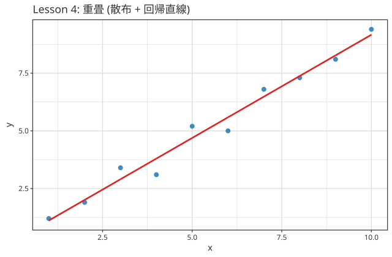

Easy layer's `overlay [a, b]` (= `foldMap layer`) abbreviates this pattern.

> **Color & legend consistency**: When overlaying layers with `colorBy (ColByName …)`, glyph colors and legend swatches come from **union of all layer categories** (palette assigned by first appearance order). Colors don't re-assign per layer, staying consistent with legend. Specify order explicitly with `colorCats [..]` if needed.

## Advanced figures (stacking settings) {#advanced-layering}

Stacking settings with `<>` loads one figure with many encodings / decorations. Below is an example stacking **continuous color gradient + point size encoding + regression line overlay + reference line + theme + labs + legend** (combinations of settings in this page). Written with df integration ([06 dataframe](06-dataframe.md) detailed), encodings use just column names, reusing the same column (`"y"`) for color:

```haskell
import           Graphics.Hgg.Easy             -- re-export Spec (scatter/layer/ColData…)
import           Graphics.Hgg.Frame            ((|>>))
import           Graphics.Hgg.Backend.SVG      (saveSVGBound)
import qualified Data.Map.Strict as M
import qualified Data.Vector     as V

num :: [Double] -> ColData ; num = NumData . V.fromList

-- Bundle x / y / sz (point size) / fit (regression prediction) into one df
df :: M.Map Text ColData
df = M.fromList [ ("x", num xs), ("y", num ys), ("sz", num sz), ("fit", num fit) ]

main :: IO ()
main = saveSVGBound "advanced.svg" $
  df |>>
     ( layer ( scatter "x" "y"            -- scatter
               <> colorContinuousBy "y"     -- continuous color (Viridis gradient, reuse y column)
               <> sizeBy "sz"             -- point size by column values
               <> alpha 0.85 )
     <> layer ( line "x" "fit"            -- regression line overlay
                <> color (fromHex "#ef4444") <> stroke 2 )
     <> scaleSize 4 16                     -- size range
     <> refHorizontal 1.0                  -- horizontal reference line
     <> theme ThemeMinimal
     <> legend
     <> labs (emptyLabs
          { labsTitle    = Just "Continuous color + size + regression + reference"
          , labsSubtitle = Just "colorContinuousBy / sizeBy / line overlay / refHorizontal"
          , labsCaption  = Just "Stack settings with <>"
          , labsX = Just "x", labsY = Just "y" }) )
```

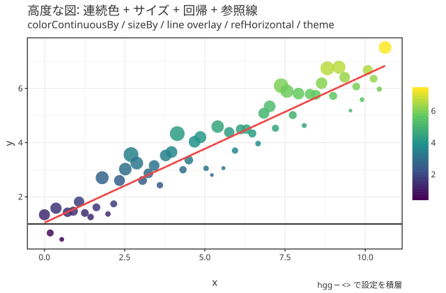

Key point: **encoding (color, size) inside mark with `<>`**, **scale, theme, reference lines, labs outside with `<>`** ([02 layers](02-layers.md) return type rules). Overlay one mark per layer ([Layering](#overlay)). → Figure generation code is `hgg-svg/examples/DocFigures.hs` (run `cabal run doc-figures` to regenerate all guide figures).
