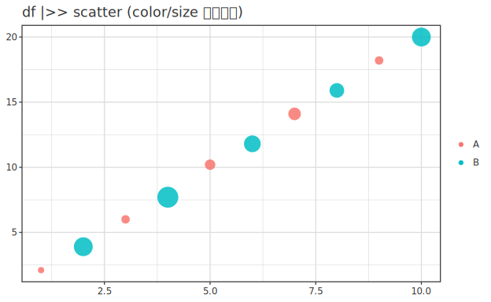
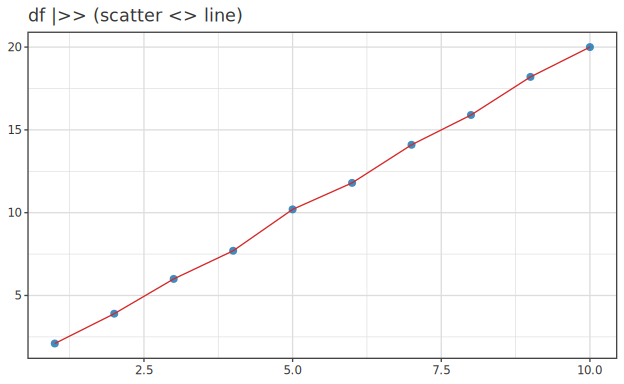
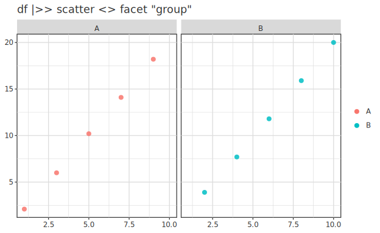
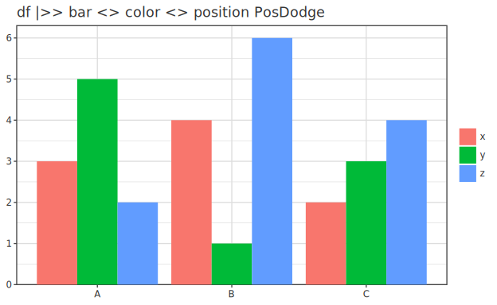

# DataFrame 連携 ─ `df |>> layer …` で列名で書く

> [📚 索引](README.md) ｜ [01 quickstart](01-quickstart.md) ｜ [02 layers](02-layers.md) ｜ [03 encoding & scale](03-encoding-scale.md) ｜ [04 decoration](04-decoration.md) ｜ [05 backends](05-backends.md) ｜ **06 dataframe** ｜ [07 analyze](07-analyze.md) ｜ [08 3d](08-3d.md) ｜ [09 appendix](09-appendix.md)


`hgg-frame` を使うと、 ggplot2 のように **データフレーム + 列名**で書ける。
spec には列「名」 (`scatter "x" "y"`) だけが入り、 実データは `(|>>)` でバインド時に解決。

このページの構成:
**[df を用意する 3 つの方法](#df-sources)** ｜ **[列名で描く](#by-column-name)** ｜
**[CSV (Hackage dataframe)](#df-csv)** ｜ **[列名検証 (純関数)](#df-validate)**

> ⚠️ 演算子は **`|>>`** (`|>` ではない)。 Hackage `dataframe` が `|>` を export
> しており衝突するため。 `import DataFrame` と併用しても衝突しない。
> `|>>` は `<>` より弱い (`infixl 1`) ので `df |>> (layer a <> layer b)` と書ける。
> (4 演算子 `<>` / `|>` / `|>>` / `|->` の役割一覧は [演算子早見表](README.md#演算子早見表)。)

> 📝 **`"x"` と書ける理由 (列名リテラル)**: `scatter "weight" "mpg"` の `"weight"` は
> `ColRef`。 `ColRef` に `IsString` instance (`fromString = ColByName . T.pack`) が
> あるので、 **`{-# LANGUAGE OverloadedStrings #-}` を付ければ** `"weight"` が
> 自動で `ColByName "weight"` になる。 拡張が無いと `ColByName "weight"` と明示が要る。
> 本ガイドの例はすべて `OverloadedStrings` 前提。

### df を用意する 3 つの方法 (`class PlotData`) {#df-sources}

`(|>>)` の左辺は `class PlotData df` の instance なら何でもよい。 標準で 3 つ:

| df の型 | 必要パッケージ | 用途 |
|---|---|---|
| `Map Text ColData` | core のみ (ゼロ依存) | 手元のベクタを即 df 化 |
| `[(Text, ColData)]` | core のみ (ゼロ依存) | assoc-list で順序を保つ |
| `DataFrame` | `hgg-dataframe` | Hackage `dataframe` (CSV 読込・操作) |

列値は `ColData` = `NumData (Vector Double)` / `TxtData (Vector Text)`。 短く書くヘルパを
置くと楽:

```haskell
import           Hgg.Plot.Easy             -- Spec を re-export (scatter/layer/…/ColData)
import           Hgg.Plot.Frame            ((|>>), BoundPlot, bpDiagnostics)
import           Hgg.Plot.Backend.SVG      (saveSVGBound)
import qualified Data.Map.Strict as M
import qualified Data.Vector     as V
import           Data.Text       (Text)

num :: [Double] -> ColData ; num = NumData . V.fromList
txt :: [Text]   -> ColData ; txt = TxtData . V.fromList

df :: M.Map Text ColData
df = M.fromList
  [ ("x",     num [1,2,3,4,5,6,7,8,9,10])
  , ("y",     num [2.1,3.9,6.0,7.7,10.2,11.8,14.1,15.9,18.2,20.0])
  , ("size",  num [2,8,3,9,4,7,5,6,3,8])
  , ("group", txt (take 10 (cycle ["A","B"]))) ]
```

> ⚠️ df の列値は **`ColData` (`NumData`/`TxtData`)**。 `inline`/`inlineCat` は
> mark の引数 (`scatter (inline xs) ys`) 用の **`ColRef`** で、 df の値には使えない
> (型が違う)。 df では上の `num`/`txt` (= `NumData`/`TxtData`) を使う。

## df から描けること = すべての mark・encoding を「列名」で {#by-column-name}

spec 側は列「名」 (`scatter "x" "y"`) だけ。 **どの mark・どの encoding も列名で書ける**。

```haskell
-- (a) 散布図 + group で色分け + size 列で大きさ
df |>> ( layer (scatter "x" "y" <> colorBy "group" <> sizeBy "size" <> alpha 0.85)
       <> title "df |>> scatter (color/size を列名で)" )
```


```haskell
-- (b) 重畳: 同じ df の別 layer を <> (04 decoration の重畳と同じ)
df |>> ( layer (scatter "x" "y" <> size 6)
       <> layer (line "x" "y" <> color (fromHex "#d62728") <> stroke 1) )
```


```haskell
-- (c) facet: 列で小分け (free/fixed scale も VisualSpec で指定可)
df |>> ( layer (scatter "x" "y" <> colorBy "group" <> size 6) <> facet "group" )
```


```haskell
-- (d) 棒グラフ: カテゴリ列 + 群 + position adjustment
dfB |>> ( layer (bar "cat" "val" <> colorBy "grp" <> position PosDodge) )
```


同様に `boxplot "y"` / `histogram "x"` / `violin "y" <> groupBy "g"` / `heatmap "c" "r" "v"` …
[02 layers](02-layers.md#index) の mark はすべて列名引数で df から描ける。

### Hackage `dataframe` (CSV 等) {#df-csv}

`hgg-dataframe` を足すと `DataFrame` がそのまま df になる
(`instance PlotData DataFrame`)。 中間 JSON 変換は不要。

```haskell
import qualified DataFrame              as DF
import           Hgg.Plot.DataFrame ()   -- instance を見せる

main = do
  df <- DF.readCsv "cars.csv"
  saveSVGBound "out.svg" (df |>> layer (scatter "weight" "mpg" <> colorBy "origin"))
```

#### 欠損 (`Maybe` / NA) 列の扱い {#nullable-columns}

`Double` / `Int` / `Text` 列に加え、 **`Maybe Double` / `Maybe Int` 列 (= NA を含む列・
CSV の空セルや欠損)も列名でそのまま描ける**。 ggplot の `aes(col)` + `na.rm` と同型で、
欠損は内部処理されるので**生ベクトルの取り出し (`columnAsList` → `catMaybes` →
`fromNamedColumns` で作り直し) は不要**。

```haskell
-- dep_delay は Maybe Int (NA 多数) だが列名で直接描ける
flights |>> layer (histogram "dep_delay" <> binWidth 15)
```

挙動 (resolver `dfResolver` + render 側):

| mark | 欠損 (NA) の扱い |
|---|---|
| 単一列 (`histogram` / `freqpoly` / `density` / `boxplot` / `ecdf` …) | NA を**落として**集計 (= `na.rm = TRUE`) |
| 多列 (`scatter` / `line`) | x か y が NA の**行を落とす** (行整列は保つ・ggplot の行単位 na.rm) |
| 軸範囲 (range) | NA を無視して min/max を取る |

内部的には NA は `NaN` で運ばれ (列の長さを保ち行整列を壊さない)、 range / binning /
点描画が `NaN` を除外する。 **非 NULL 列はこれらが no-op なので従来と完全に同一**。

> R の `filter(col < x)` 相当 (= 行を絞る) は **DataFrame 側**で行う:
> `df |> DF.filterJust "col" |> DF.filterWhere (F.col @Int "col" .< (x :: DF.Expr Int))`
> (`filter |> ggplot` と同型・[subplot](04-decoration.md#subplots) の patchwork と組み合わせる)。

### バインド時の列名検証 (純関数・例外なし) {#df-validate}

`(|>>)` は **純関数** (例外を投げない)。 バインド時に列名を検証し、 結果を
`BoundPlot` の `bpDiagnostics` に**値として**載せる (存在しない列・型不一致・空 df を検出)。
`saveSVGBound` / `renderBound` は描画時に Error severity の診断を stderr に報告する
(描画は止めない)。 検証を完全に逃がすなら `unBound` で `(Resolver, VisualSpec)` を
取り出し既存 `saveSVG` に直接渡す。

```haskell
let bp = df |>> layer (scatter "x" "wieght")   -- typo!
bpDiagnostics bp
-- [PlotError (ColumnNotFound "wieght" …) (DiagnosticContext {dcLayer = Just 0, dcMark = Just MScatter})]
```
