# analyze 連携 ─ 回帰モデルをそのまま描く

> 🌐 [English](07-analyze.ja.md) | **日本語**

> [📚 索引](README.ja.md) ｜ [01 quickstart](01-quickstart.ja.md) ｜ [02 layers](02-layers.ja.md) ｜ [03 encoding & scale](03-encoding-scale.ja.md) ｜ [04 decoration](04-decoration.ja.md) ｜ [05 backends](05-backends.ja.md) ｜ [06 dataframe](06-dataframe.ja.md) ｜ **07 analyze** ｜ [08 3d](08-3d.ja.md) ｜ [09 appendix](09-appendix.ja.md)

統計ライブラリ **hanalyze** で fit したモデルを、 hgg の layer に
そのまま重ねられる。 回帰・GLM・GP・生存・時系列・ベイズ等 **すべての主要モデルが図になる**。
不確実性 (CI / credible band / 予測区間) は hanalyze が計算した統計的に正しい値。

このページの構成:
**[まず fit する](#fit-data)** ｜ **[ルート1: model-out (`toPlot`)](#route1)** ｜
**[HBM (ベイズ) をプロット](#hbm-plotting)** ｜ **[ルート2: stat-in (`statLm`/`statSmooth`)](#route2)** ｜
**[実例: 複数モデル重畳](#multi-overlay)**

> セットアップ: analyze 側は `flag plot-integration` を on にして `Hanalyze.Plot` を有効化
> (`cabal build --project-file=cabal.project.plot`)。 stat-in 経路は `hgg-analyze-bridge`。

### まず fit する ─ `df |-> spec`(推奨) / 生ベクタ {#fit-data}

描画の前に **モデルを fit** する。 データの渡し方は 2 通り:

- **`df |-> spec`(推奨)** ─ df から **列名で直接** fit。 `df |-> lm "x" "y"` と書く。
  `(|->) :: (ColumnSource d, Fit spec) => d -> spec -> Fitted spec`。 左辺 `df` は `Map Text ColData` /
  assoc / `DataFrame` のいずれでもよい (`class ColumnSource`)。
- **生ベクタ** ─ `lmModel (LA.fromList xs) (LA.fromList ys)` と `LA.Vector` を直接渡す。

**両者は同じモデル値を返す。** `df |-> lm "x" "y"` の結果型は `lmModel` と同じ `LMModel`
(`type Fitted LMSpec = LMModel`)。 違いは **データの渡し方だけ**。 df があるなら生ベクタを
作り直さず `df |-> lm "x" "y"` が素直 (列名検証も付く)。

spec を作る関数の型 (`df |-> spec :: Fitted spec`。 `(|->) :: (ColumnSource d, Fit spec) => d -> spec -> Fitted spec`):

| spec 関数 | 型 (何を渡すか) | `Fitted` (= `toPlot` できる型) |
|---|---|---|
| `lm` | `Text -> Text -> LMSpec` | `LMModel` |
| `glm` | `Family -> LinkFn -> Text -> Text -> GLMSpec` | `GLMModel` |
| `spline` | `SplineKind -> [Double] -> Text -> Text -> SplineSpec` | `SplineModel` |
| `robust` | `RobustEstimator -> Text -> Text -> RobustSpec` | `RobustModel` |
| `quantile` | `[Double] -> Text -> Text -> QuantileSpec` | `QuantileModel` |
| `lmF` | `Text -> LMFormulaSpec` | `MultiLMModel` |
| `glmF` | `Family -> LinkFn -> Text -> GLMFormulaSpec` | `MultiGLMModel` |
| `glmmF` | `Text -> GLMMFormulaSpec` | `(GLMMResultRE, [Text])` |
| `grouped` | `Text -> spec -> GroupedSpec spec` | `GroupedFit spec` |
| `weighted` | `[Double] -> LMSpec -> WeightedLMSpec` | `WeightedLMModel` |
| `hbm` | `HBMConfig -> ModelP () -> HBMSpec` | `HBMModel` |

> **formula**: `lmF` / `glmF` / `glmmF` は R 流の文字列 ─ 主効果 `y ~ x1 + x2`、 交互作用 `x1:x2`
> (`*` で主効果込み)、 混合効果 `(1|g)` / `(x|g)` ─ を取り **多変量モデル**を fit する
> (`df |-> lmF "y ~ x1 + x2"`)。 2 列の `lm`/`glm` は単変数の近道。

`Fitted` はどれも下記**ルート 1** の `toPlot` に渡せる。 以降の例は `df |-> spec` を主に使う。

連携には 2 つのルートがある。

### ルート 1: model-out ─ `toPlot fit` (fit 済みモデル → 図) {#route1}

fit 済みモデルを `toPlot :: m -> VisualSpec` で layer に変換して `<>` で重ねる。 散布図と同じ df に
重ねるなら `df |>> (layer (scatter "x" "y") <> toPlot fit)`、 散布図を持たないモデル
(MCMC / 生存 / PCA 等、 図が自己完結) は **空の df** に束ねる。 下が完全に動く最小例
(fit は上記 `df |-> lm "x" "y"` ─ 生ベクタを作らない):

```haskell
{-# LANGUAGE OverloadedStrings #-}
import qualified Data.Vector              as V
import qualified Numeric.LinearAlgebra    as LA   -- 後の生存/PCA 等で使う (lm/glm は df |-> で不要)
import           Data.Text                (Text)
import           Hgg.Plot.Spec        (ColData (..), layer, scatter)
import           Hgg.Plot.Frame       ((|>>))
import           Hgg.Plot.Backend.SVG (saveSVGBound)
import           Hanalyze.Plot            (toPlot, (|->), lm)

-- 図が自己完結なモデル (散布図に重ねない) 用の空 df
noDf :: [(Text, ColData)]
noDf = []

main :: IO ()
main = do
  let df = [ ("x", NumData (V.fromList [1,2,3,4,5,6,7,8]))
           , ("y", NumData (V.fromList [2.1,3.9,6.2,7.8,10.3,11.7,14.1,16.0])) ]
           :: [(Text, ColData)]
  saveSVGBound "lm.svg" (df |>> (layer (scatter "x" "y") <> toPlot (df |-> lm "x" "y")))
```

> 以降の各モデルは **要点だけ抜粋** する (上の import / `noDf` / `saveSVGBound` を共有)。

`Plottable` instance を持つモデル (= `toPlot` できるもの) は **14 種**:

#### 回帰・平滑系 (散布図 + 当てはめ + 帯)

生ベクタ (`LA.Vector Double`) から直接 fit する構築子の型 (= `df |->` を使わない経路):

| モデル | 構築子の型 (生ベクタ経路) | 帯の意味 |
|---|---|---|
| 線形回帰 LM | `lmModel :: Vector -> Vector -> LMModel` | Wald 信頼帯 |
| GLM | `glmModel :: Family -> LinkFn -> Vector -> Vector -> GLMModel` | μ スケールの**非対称** credible band |
| ガウス過程 GP | `fitGP :: GPModel -> [Double] -> [Double] -> [Double] -> GPResult` | credible band |
| スプライン | `splineModel :: SplineKind -> [Double] -> Vector -> Vector -> SplineModel` | 基底空間の Wald 帯 |
| GAM | `gamModel :: Int -> Int -> Double -> Vector -> Vector -> GAMModel` (次数, ノット数, λ, x, y) | 平滑曲線 (帯なし) |
| ロバスト回帰 | `robustModel :: RobustEstimator -> Vector -> Vector -> RobustModel` | 直線のみ (重みは診断図へ) |
| 分位回帰 | `quantileModel :: [Double] -> Vector -> Vector -> QuantileModel` | 複数分位線 |

> `Vector` = `Numeric.LinearAlgebra.Vector Double`。 `toPlot :: Plottable m => m -> VisualSpec`
> がこれらを図にする。 列名で書ける `df |-> lm "x" "y"` (上表) が同じ結果を返す素直な近道。

> ※ LM / Spline の帯は **回帰平均の信頼区間 (CI)** で、 個々の観測の**予測区間ではない**。
> GLM / GP は credible band。 帯の種類が違うモデルを 1 図に重ねると非対称になる点に注意
> (比較は[実例 (1)](#fit-data) のように帯を出さず線だけ色分けが見やすい)。

```haskell
-- df は "x" "y" 列を持つ (assoc / Map / DataFrame)。 spec 別の追加 import:
--   GLM    : import Hanalyze.Model.GLM    (Family (..), LinkFn (..))
--   Spline : import Hanalyze.Model.Spline (SplineKind (..))
--   Robust : import Hanalyze.Model.Robust (RobustEstimator (..), defaultHuberK)
df |>> (layer (scatter "x" "y") <> toPlot (df |-> lm "x" "y"))                              -- LM
df |>> (layer (scatter "x" "y") <> toPlot (df |-> glm Poisson Log "x" "y"))                 -- GLM
df |>> (layer (scatter "x" "y") <> toPlot (df |-> spline (BSpline 3) [0,2,4,6,8] "x" "y"))  -- Spline (knots=内部ノット)
df |>> (layer (scatter "x" "y") <> toPlot (df |-> lm "x" "y")                               -- OLS vs robust
                                <> toPlot (df |-> robust (Huber defaultHuberK) "x" "y"))
```

| LM (信頼帯) | GLM Poisson (非対称帯) | GP (credible band) |
|---|---|---|
| 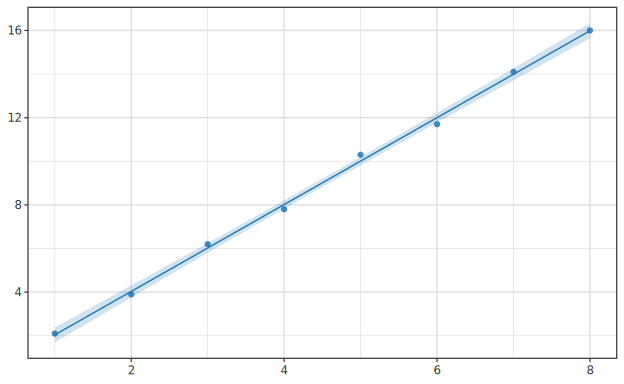 | 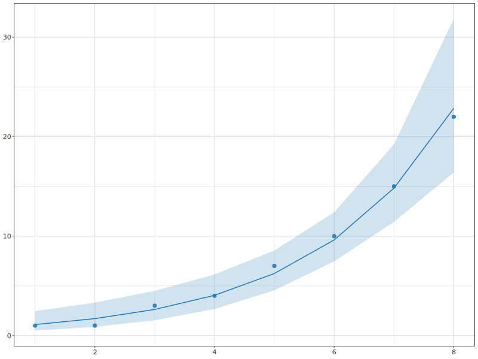 | 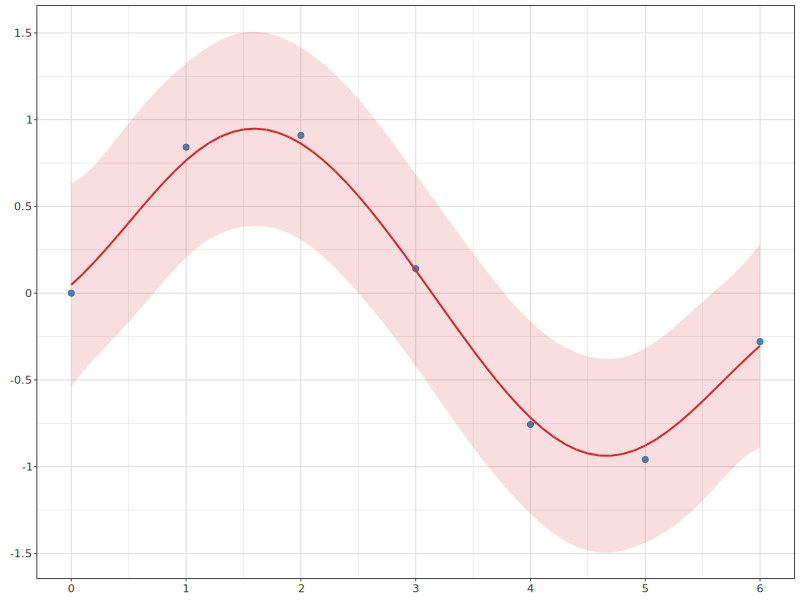 |

| Spline (平滑+帯) | GAM (平滑) | Robust vs OLS | Quantile (複数分位) |
|---|---|---|---|
| 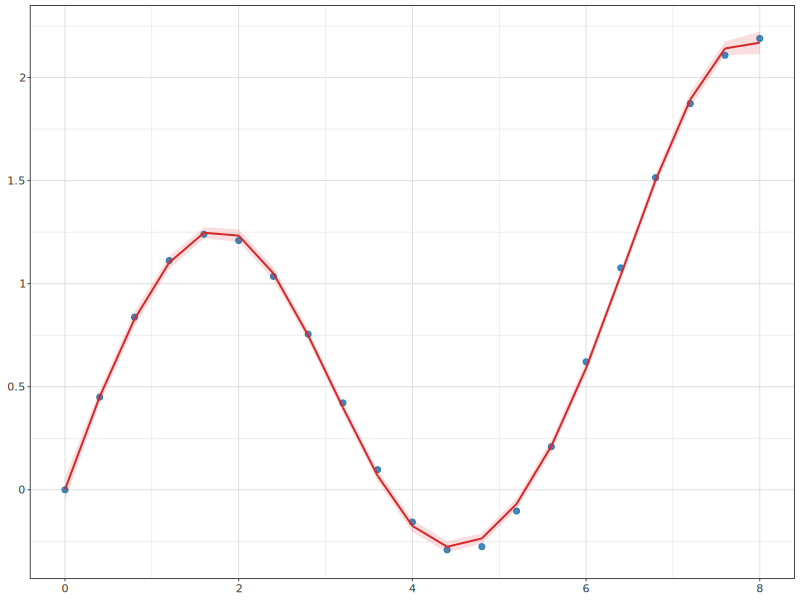 | 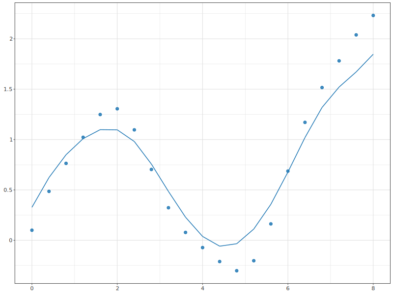 | 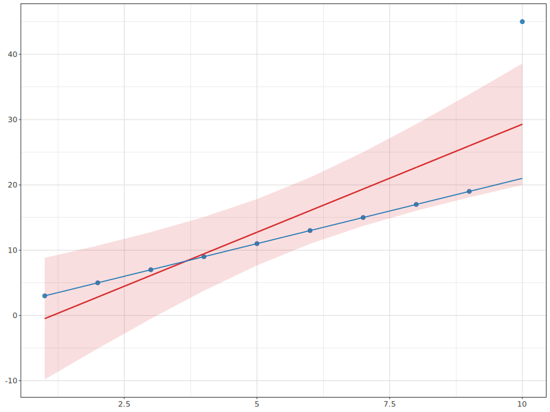 | 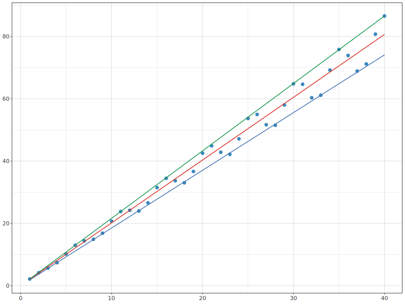 |

#### 回帰系のオプション: grid 評価 / `predAt` / effect plot (回帰・平滑系限定)

> ⚠️ この節の `grid`/`gridRange`/`predAt`/`statLevel`/`holdAt`/`byVar` は **回帰・平滑系
> (`SingleVarModel`/`MultiVarModel` = LM/GLM/Spline/GAM/Robust/Quantile) 限定**。 MCMC chain・
> KM 生存・PCA・RandomForest 等には効かない (これらは grid 評価する「線」 を持たないため)。

`toPlot m` は **訓練点で評価**して回帰線を結ぶ。 疎・不均一なデータだと曲線・帯がカクつくので、
**等間隔 grid で評価**する `statModel` でくるむと滑らかになる (散布図の点は従来通り訓練データ)。
さらに予測点 (`predAt`) や、 多変量モデルの **effect plot** (`statModelMulti`) を `<>` で合成できる。
これらは analyze 側 (`Hanalyze.Plot`) の機能で、 `grid` を上書きしても **fit 自体は変わらない** (評価点だけが変わる)。
`statModel` で包んだものは `ModelSpec` で、 下の設定を `<>` で合成できる ([04 列挙型早見表](04-decoration.ja.md#enum-tables) と同じ要領)。
**単変数モデル共通のオプション** (例 `statModel (df |-> lm "x" "y")`):

いずれも `ModelSpec` を返し `<>` で合成する (`statModel :: SingleVarModel m => m -> ModelSpec`):

| 設定 | 型 (何を渡すか) | 効果 (既定) |
|---|---|---|
| `grid` | `Int -> ModelSpec` | 評価点数 = 滑らかさ (既定 100) |
| `gridRange` | `Double -> Double -> ModelSpec` | 評価範囲 lo hi (既定 = 説明変数 min/max) |
| `bandOn` | `ModelSpec` | 信頼/credible 帯を表示 (引数なし・既定は帯なし) |
| `interval` | `IntervalKind -> ModelSpec` | 帯の種類 (`CI` 平均信頼 / `PI` 予測・要 `bandOn`・LM/GLM のみ PI 可) |
| `statLevel` | `Double -> ModelSpec` | 帯の水準 (既定 0.95・HBM `epred` は 0.94) |
| `predAt` | `Double -> ModelSpec` | 予測点 + CI エラーバー (`<>` で累積 = 複数点) |
| `statColor` / `statFill` | `Color -> ModelSpec` | 回帰線の固定色 / 帯の塗り色 (型安全な `Color`・`statColor (fromHex "#…")` / `statColor N.red`) |
| `statLabel` | `Text -> ModelSpec` | 線に凡例ラベルを付与 (重畳しても凡例に全ラベルが並ぶ) |
| `statEquation` / `statR2` | `ModelSpec` | 回帰式 / R² を凡例ラベルに出す (引数なし・LM のみ) |

> **帯の既定**: 既定は **帯なし** (オプトイン)。
> 帯が要るときだけ `<> bandOn` を足す (ggplot `geom_smooth(se=TRUE)` 流のオプトイン)。
> `LtDashed` 等の線種は `LineType` (`LtSolid`/`LtDashed`/`LtDotted`/`LtDotDash`/`LtLongDash`/`LtTwoDash`)。
>
> 多変量モデル (`statModelMulti`) 専用の `along` / `holdAt` / `byVar` は **下の多変量 effect plot** で別途扱う
> (`along` は動かす変数を指定する**必須**引数)。

```haskell
import           Hanalyze.Plot ( toPlot, statModel, grid, gridRange, bandOn, statLevel
                               , interval, IntervalKind (..), statColor, statLabel, predAt
                               , statModelMulti, along, holdAt, byVar, HoldAgg (..)
                               , lmF, (|->) )
import           Hgg.Plot.Color   (fromHex)   -- statColor は Color を受ける

-- (1) grid 評価: 疎データのガタつき解消。 既定 grid=100 点、 範囲=説明変数 min/max。 既定は帯なし。
df |>> (layer (scatter "x" "y") <> toPlot (statModel smod <> grid 200))    -- 200 点で滑らか (帯なし)
df |>> (layer (scatter "x" "y") <> toPlot (statModel smod <> grid 200 <> gridRange 0 10))
df |>> (layer (scatter "x" "y") <> toPlot (statModel smod <> grid 200 <> bandOn))    -- 帯あり (オプトイン)
df |>> (layer (scatter "x" "y") <> toPlot (statModel smod <> bandOn <> interval PI)) -- 予測区間 (LM/GLM)
df |>> (layer (scatter "x" "y") <> toPlot (statModel smod <> bandOn <> statLevel 0.99)) -- 99% 帯
df |>> (layer (scatter "x" "y") <> toPlot (statModel smod <> statColor (fromHex "#e41a1c") <> statLabel "OLS")) -- 色+凡例

-- (2) predAt: 予測点 + CI エラーバー。 <> でリスト累積 → 複数点。
df |>> ( layer (scatter "x" "y")
       <> toPlot (statModel smod <> grid 200 <> predAt 1 <> predAt 4 <> predAt 7) )
```

| 訓練点評価 (カクつき) | grid 200 (滑らか) | predAt (予測点 + CI) |
|---|---|---|
| 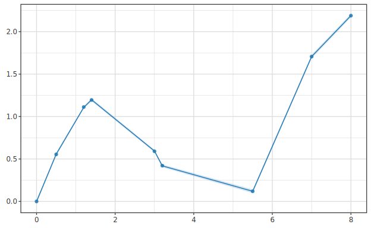 |  | 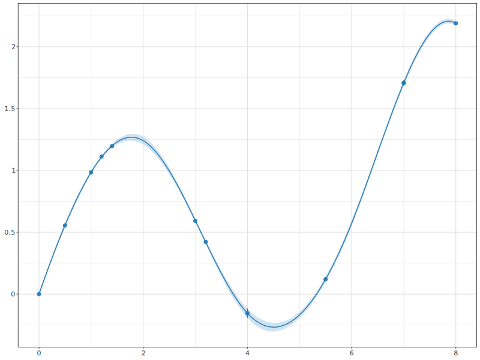 |

**多変量 effect plot** = 説明変数が複数あるモデルで、 1 つ (`along`) を動かし他を固定して効果を可視化する
(R の `ggpredict` / `effects` 相当)。 モデルは **formula で fit** する (`df |-> lmF "y ~ x1 + x2"` /
`glmF`)。 単変数の `statModel` と違い `statModelMulti m (along "x1")` は **along を必須引数**にして、
動かす変数の指定忘れをコンパイル時に弾く。 専用の引数:

`statModelMulti :: MultiVarModel m => m -> AlongSpec -> ModelSpec` (第 2 引数 `along` が必須):

| 引数 | 型 (何を渡すか) | 役割 (既定) |
|---|---|---|
| **`along`** (必須) | `Text -> AlongSpec` | 動かす説明変数 = 横軸 (`statModelMulti m (along "v")` の第 2 引数) |
| `holdAt` | `HoldAgg -> ModelSpec` | 他変数の固定法 (`HoldAgg` 6 種・下表・既定 `Mean`) |
| `byVar` | `Text -> [Double] -> ModelSpec` | 第 2 変数を値ごとに固定し層別曲線を色分け重畳 |

> `along` だけは `statModelMulti` の引数 (型で必須)。 `holdAt`/`byVar` は `<>` で合成する。
> 単変数共通の `grid`/`gridRange`/`statLevel`/`bandOn`/`predAt` も併用できる。

```haskell
-- y ~ x1 + x2 を formula で fit。 df は "y" "x1" "x2" 列を持つ (assoc / Map / DataFrame)。
let effMod = df |-> lmF "y ~ x1 + x2"

-- x1 を動かし、 他変数 (x2) は holdAt で固定 (既定 Mean)。
df |>> (layer (scatter "x1" "y") <> toPlot (statModelMulti effMod (along "x1") <> holdAt Median))

-- byVar = 第2変数を複数値で固定 → 値ごとに 1 曲線を色分け重畳。
df |>> ( layer (scatter "x1" "y")
       <> toPlot (statModelMulti effMod (along "x1") <> grid 100 <> byVar "x2" [1, 5]) )
```

`holdAt` の固定方式 (`HoldAgg`) は **6 種**:

| HoldAgg | 他変数の固定方法 |
|---|---|
| `Mean` (既定) / `Median` | 連続変数の平均 / 中央値 (factor 列は最頻水準に自動振替) |
| `Mode` | 最頻 (連続=丸め最頻、 factor=最頻水準) |
| `Reference` | factor の参照水準 (昇順先頭。 連続は `Mean` に振替) |
| `Marginalize` | 固定せず観測分布で周辺化 (PDP/AME。 全観測行 × grid で重く、 帯は出さない=曲線のみ) |
| `Fixed [(name, v)]` | 明示指定 (部分指定可。 指定の無い変数は `Mean`) |

| effect: byVar (x2=1,5 を色分け) | effect: holdAt Median (x2 中央値固定) |
|---|---|
| 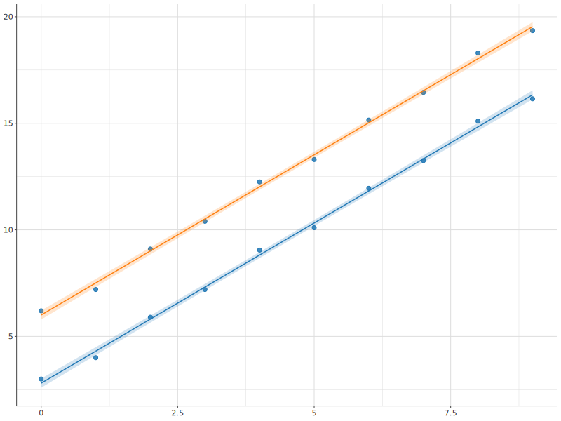 |  |

ポイント:
- **`statModel` (単変数) / `statModelMulti` (多変量) は型クラス `SingleVarModel` / `MultiVarModel` で分離**。
  along は多変量でのみ必須・単変数では不要 (誤用が型で弾かれる)。
- **GLM も多変量対応** (`df |-> glmF family link "y ~ x1 + x2"`)。 帯は μ スケールで非対称。
- grid/predAt/holdAt/byVar はすべて `ModelSpec` の `<>` で合成 (Monoid)。 `toPlot (statModel m)` は
  従来の訓練点評価のまま (grid を足したときだけ grid 評価に切り替わる = 既存挙動は不変)。

#### 群別フィット: `grouped` (群ごとに 1 本ずつ回帰線)

「群 g ごとに別々に回帰して N 本の線を色分け重畳」 は **`df |-> grouped "g" spec`** で fit する
(ggplot `geom_smooth(aes(color=g))` 相当)。 結果は各群の `Fitted spec` を保持する **`GroupedFit spec`**
で、 `toPlot` で N 曲線 + 群凡例 (`ColorByCol`+`scaleColorManual`) を一括描画する。

```haskell
import Hanalyze.Plot ( grouped, groupModels, groupLabels, groupedFullrange
                     , lmDiag, groupedLmDiag, CoefStats (..), (|->), toPlot )

-- 群 "g" で分割し、 各群を lm "x" "y" で fit。 spec は lm/glm/spline/robust/quantile いずれも可。
let gf = df |-> grouped "g" (lm "x" "y")     -- :: GroupedFit LMSpec

df |>> (layer (scatter "x" "y" <> colorBy "g") <> toPlot gf)   -- 群別散布 + 群別回帰線

-- 各群の線を「全群の x 範囲」 まで延長 (ggplot fullrange=TRUE)。 群限定の延長レンダラ。
df |>> (layer (scatter "x" "y" <> colorBy "g") <> groupedFullrange gf)
```

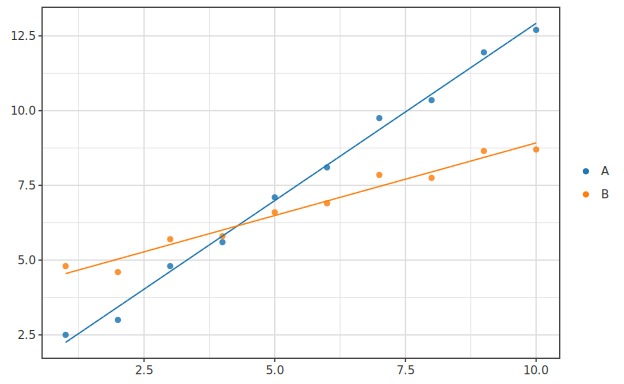

`GroupedFit` は単なる描画仕様ではなく **実結果型**なので、 群間で傾きが本当に違うかを診断できる:

| アクセサ | 返り値 | 用途 |
|---|---|---|
| `groupModels gf` | `[(Text, Fitted spec)]` | 各群の fit 済みモデル (例 `LMModel`) を取り出す |
| `groupLabels gf` | `[Text]` | 群ラベル一覧 |
| `lmDiag m` | `[CoefStats]` | 1 つの `LMModel` の係数診断 (`csSE`/`csTValue`/`csPValue`) |
| `groupedLmDiag gf` | `[(Text, [CoefStats])]` | 全群の係数診断を一括 (`Fitted spec ~ LMModel` 限定) |

> `lmDiag` の SE/t/p は statsmodels OLS と 1e-6 の精度で一致する。 HBM の `forestOf` が群間の
> 係数を視覚比較するのに対し、 `groupedLmDiag` は数値で群間係数を取り出す経路。

#### 重み付き回帰: `weighted` (WLS)

観測ごとに重み `wᵢ` を付けて `Σ wᵢ(yᵢ − ŷᵢ)²` を最小化する **重み付き最小二乗 (WLS)** は
**`df |-> weighted ws (lm "x" "y")`** で fit する (ggplot `geom_smooth(method=lm, aes(weight=w))`
相当)。 不等分散・観測の信頼度差があるデータに使う。 結果は `WeightedLMModel` で、 `toPlot` で
回帰線 + **WLS の信頼帯** (重みを反映) を描く。 散布図は元データ (重みなし) を重ねればよい。

```haskell
import Hanalyze.Plot (weighted, lm, (|->), toPlot, statModel, bandOn, statEquation)

let wm = df |-> weighted ws (lm "x" "y")        -- ws :: [Double] (行順・全て ≥ 0)

df |>> (layer (scatter "x" "y") <> toPlot wm)                       -- WLS 線 (元データ散布に重畳)
df |>> (layer (scatter "x" "y") <> toPlot (statModel wm <> bandOn)) -- WLS 信頼帯つき
```

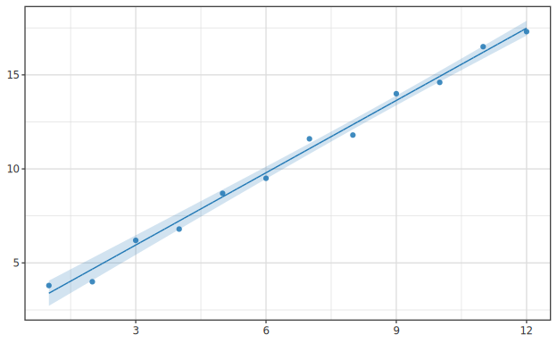

ポイント:
- **CI は WLS で正しい**: grid 評価が「非スケール評価点 × √w スケール設計行列」 で
  `se = t·√(s²·x₀ᵀ(XᵀWX)⁻¹x₀)` を計算する。 statsmodels `WLS().fit()` と β̂ / `mean_ci` / `rsquared`
  が 1e-6 の精度で一致する。 `toPlot` は grid 経路に固定され元データ散布図と整合する。
- **`statEquation`/`statR2`** も使える (R² は statsmodels と同じ **weighted R²** = 重み付き平均で中心化)。
- 全重み 1 なら OLS (`lm`) と一致。 現状 **LM 専用** (`weighted :: [Double] -> LMSpec -> …`・WLS は LM 固有)。

#### 混合効果: random effect の caterpillar plot

混合効果モデル (`glmmF "y ~ x + (1|group)"` で fit した `GLMMResultRE`・random intercept + slope) は、
各 group の **random effect (BLUP) を値で昇順ソート**した **caterpillar plot** で描く。 forest mark
(水平棒) で並べ、 0 (= 固定効果からの偏差ゼロ) に参照線を引く。 group 間のばらつき・外れ群を
一目で読めるのが GLMM 固有の定番図。

```haskell
import Hanalyze.Plot (glmmF, (|->), toPlot, diagnosticPlots)

let (re, _) = df |-> glmmF "y ~ x + (1|group)"   -- (GLMMResultRE, 固定効果係数名)

noDf |>> toPlot re                                -- 第 1 列 (通常 random intercept) の caterpillar
noDf |>> subplots (diagnosticPlots re)            -- 全 r 列 (intercept + slope) を独立図で並置
```

ポイント:
- `toPlot` = random-effect **第 1 列** (通常 intercept) の caterpillar 1 枚。
  `diagnosticPlots` = 全 r 列 (intercept + 各 slope) の caterpillar list。
- **CI 帯は現状なし (点のみ)**: random effect (BLUP) の点推定のみを描く。 group ごとの不確実性帯は
  現バージョンでは出さない (forest mark 自体は対称 CI 表示に対応している)。

| 混合効果 caterpillar (8 群の random intercept・BLUP 昇順) |
|---|
| 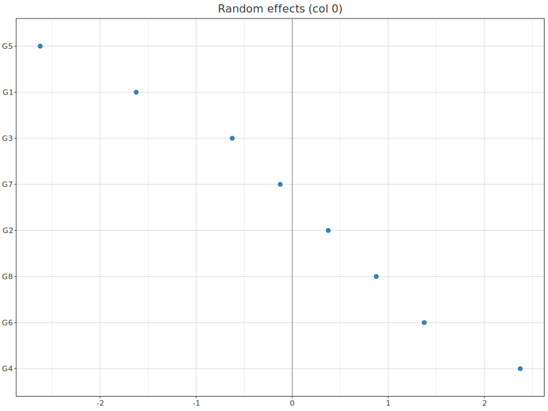 |

#### ベイズ診断 (MCMC)

```haskell
import qualified Data.Map.Strict    as Map
import           Hanalyze.MCMC.Core  (Chain (..))
import           Hanalyze.Plot       (chainModel, toPlot, diagnosticPlots)

-- 通常はサンプラの出力 (Chain) をそのまま使う。 下は draw 列を手で組む例:
let draws = [ 5 + sin (fromIntegral i * 0.31) | i <- [1 .. 200 :: Int] ] :: [Double]
    chain = Chain { chainSamples     = [ Map.singleton "mu" v | v <- draws ]
                  , chainAccepted    = 200, chainTotal = 240
                  , chainEnergy      = [], chainDivergences = [] }
    cmod  = chainModel "mu" chain                                   -- param 名 + Chain
saveSVGBound "trace.svg"   (noDf |>> toPlot cmod)                   -- trace plot
saveSVGBound "density.svg" (noDf |>> (diagnosticPlots cmod !! 1))   -- 周辺事後密度 (診断束の 2 枚目)
```

| MCMC trace | MCMC density |
|---|---|
| 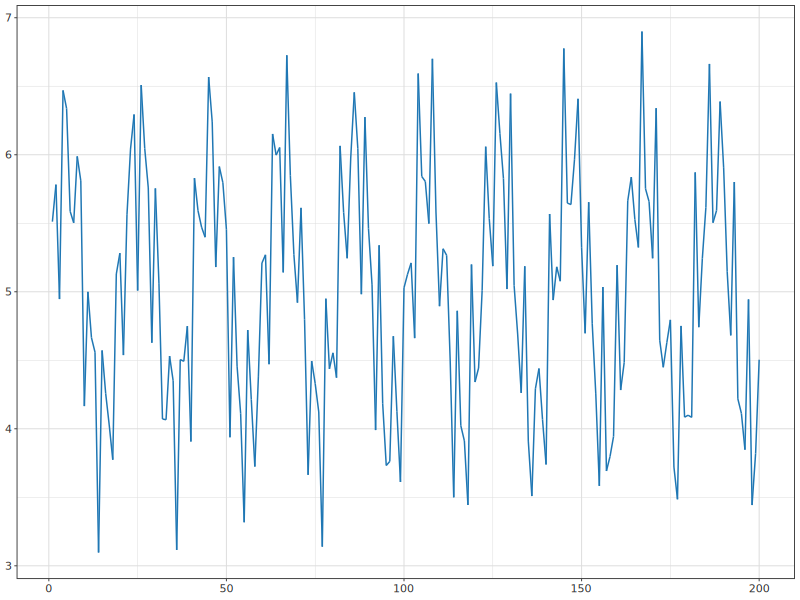 | 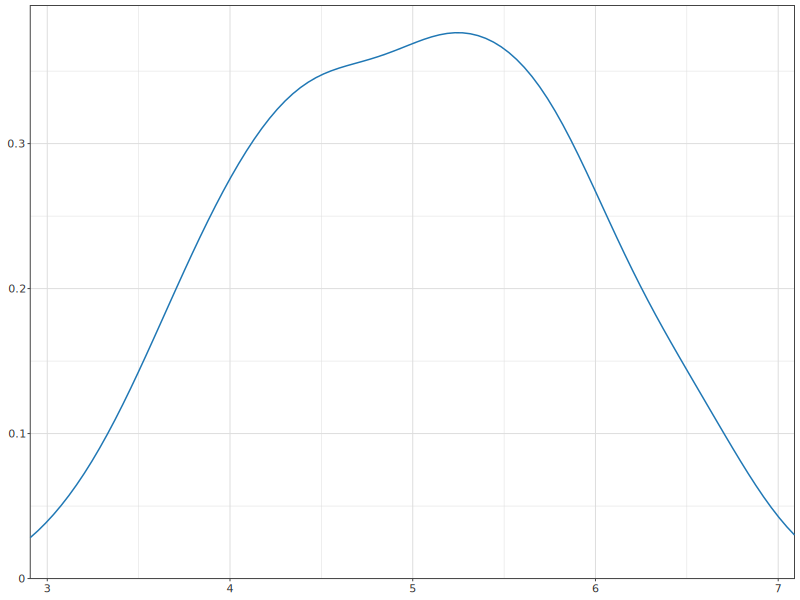 |

#### 生存・時系列

```haskell
import Hanalyze.Model.Survival       (Event (..), SurvSample (..), kaplanMeier)
import Hanalyze.Model.CompetingRisks (CRSample (..), fitCompetingRisks)
import Hanalyze.Plot                 (forecastModel, toPlot)

-- KM 生存曲線: (時刻, Observed | Censored) の列
let kmSamples = [ SurvSample t e
                | (t, e) <- [ (2,Observed),(3,Observed),(5,Censored),(6,Observed)
                            , (8,Observed),(9,Censored),(11,Observed),(12,Observed) ] ]
saveSVGBound "km.svg" (noDf |>> toPlot (kaplanMeier kmSamples))

-- 競合リスク CIF: (時刻, cause)。 cause 0 = 打切り、 1/2 = 各イベント要因
let crSamples = [ CRSample t c
                | (t, c) <- [ (1,1),(2,2),(3,1),(4,0),(5,2),(6,1),(7,2),(8,0) ] ]
saveSVGBound "cif.svg" (noDf |>> toPlot (fitCompetingRisks crSamples))

-- 時系列予測: forecastModel order horizon series (AR(order) を horizon 先まで)
let series = LA.fromList (drop 1 (scanl (\y e -> 10 + 0.6*(y-10) + e) 10
               [ 1.5 * sin (fromIntegral i * 1.3) | i <- [1 .. 60 :: Int] ]))
saveSVGBound "forecast.svg" (noDf |>> toPlot (forecastModel 2 12 series))
```

| KM 生存 | 競合リスク CIF | 時系列予測 |
|---|---|---|
|  | 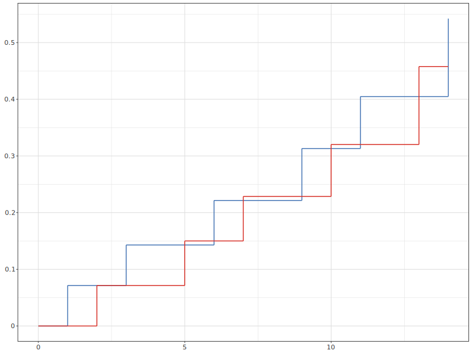 |  |

#### 多変量・木

```haskell
import           Hanalyze.Model.MultiLM      (fitMultiLM)
import           Hanalyze.Model.PCA          (PCAStandardize (..), pca)
import           Hanalyze.Model.RandomForest (defaultRFConfig, fitRF)
import qualified System.Random.MWC           as MWC

-- 多出力線形回帰 → 出力間の残差相関 heatmap (xmat: n×p 設計行列, ymat: n×q 出力)
let n    = 30
    xcol = [ fromIntegral i | i <- [1 .. n] ] :: [Double]
    wig  = [ sin (0.7 * fromIntegral i) | i <- [1 .. n] ]
    xmat = LA.fromColumns [LA.konst 1 n, LA.fromList xcol]                  -- intercept + x
    ymat = LA.fromColumns [ LA.fromList (zipWith (\x w -> 2*x + w)   xcol wig)
                          , LA.fromList (zipWith (\x w -> x + 0.8*w) xcol wig)
                          , LA.fromList (zipWith (\x w -> -x - w)    xcol wig) ]
    mfit = fitMultiLM xmat ymat
saveSVGBound "multilm.svg" (noDf |>> toPlot mfit)

-- PCA → scree plot (rows: 観測 × 変数。 Center = 共分散 PCA)
let rows   = [ [ 5*sin (fromIntegral i*0.3), 1.2*cos (fromIntegral i*0.5)
               , 0.4*sin (fromIntegral i) ] | i <- [1 .. 50 :: Int] ]
    pcaRes = pca Center Nothing (LA.fromLists rows)
saveSVGBound "pca.svg" (noDf |>> toPlot pcaRes)

-- RandomForest → 特徴重要度 bar (fit は IO・乱数 gen が要る)
let xss = [ [ fromIntegral i, sin (fromIntegral i*3.1)
            , fromIntegral ((i*7) `mod` 11) ] | i <- [1 .. 80 :: Int] ]   -- 特徴 [[Double]]
    ys  = [ 3 * fromIntegral i | i <- [1 .. 80 :: Int] ]                  -- 目的 [Double]
gen <- MWC.createSystemRandom
rf  <- fitRF defaultRFConfig xss ys gen
saveSVGBound "rf.svg" (noDf |>> toPlot rf)
```

| MultiLM 残差相関 | PCA scree | RandomForest 重要度 |
|---|---|---|
| 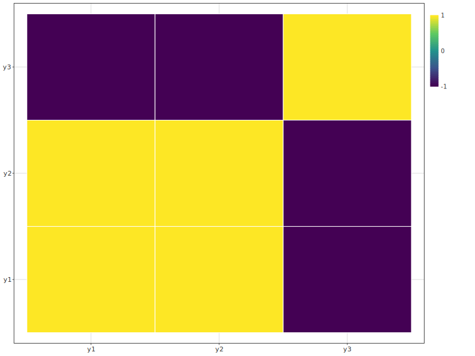 |  | 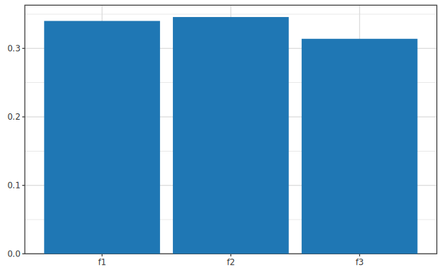 |

#### ルート 1 のベイズ版: HBM (確率プログラム) をプロットする {#hbm-plotting}

ルート 1 の `toPlot` で頻度論モデル (LM/GLM/…) を重ねたのと **同じ要領**で、 **ベイズ階層モデル
(HBM)** も図にできる (HBM はルート 1 限定・stat-in には無い)。 確率プログラム
(`Hanalyze.Model.HBM` の `ModelP`) を `hbmModelPure` で NUTS 学習し、 「学習済 HBM モデル」
`HBMModel` を得る。 これは PyMC の `pm.sample` に相当する。 `hbmModelPure` は
**seed を取り IO 無しで純粋・決定的** (同 seed → 同結果)。 IO 版 `hbmModel` (system 乱数) もある。

```haskell
import Hanalyze.Plot
import Hanalyze.Model.HBM

-- y ~ Normal(a + b·x, s)。 PyMC 同等の DAG (a,b → mu → obs, s → obs):
-- deterministic "mu" を観測ループ内で使うと依存が det 名に再ラベルされ obs の親が
-- {mu, s} になり、 同名 observe "obs" は 1 ノードに統合される。
-- epred は muName="mu" を grid 点 (x=[xi]) で評価する O1 規約のまま動く。
-- 観測ループを plate で囲むと、 繰り返しノード (mu/obs) が DAG で「obs (N)」 の囲み枠 + 個数つきで
--   描かれる (PyMC の plate 相当・N = データ点数)。 plateForM_ が plate+length+forM_ を 1 行に畳む。
model :: ModelP ()
model = do
  x <- dataNamed "x" []          -- placeholder。 hbmModelPure が列名で自動 bind
  y <- dataNamed "y" []
  a <- sample "a" (Normal 0 10)
  b <- sample "b" (Normal 0 10)
  s <- sample "s" (HalfNormal 1)
  plateForM_ "obs" (zip x y) $ \(xi, yi) -> do   -- plate で囲み反復 → DAG に枠+個数
    mu <- deterministic "mu" (a + b * realToFrac xi)
    observe "obs" (Normal mu s) [yi]

-- 純粋: seed を hbmSeed に指定 (or defaultHBM のまま = 既定 seed 42) → 確定 HBMModel
fit :: HBMModel
fit = hbmModelPure defaultHBM model [("x", xs), ("y", ys)]
```

`HBMModel` は確率プログラムゆえ「単一の図」 に一意化できない。 そこで **抽出子**
を明示して描く (`df |>> toPlot (抽出子 fit)`)。 既定の信用区間は **94% HDI**
(ArviZ 流。 頻度論ルートの 95% Wald とは慣例が異なる点に注意・`statLevel` で可変)。

いずれも `HBMModel` を受ける (`fit :: HBMModel`)。 戻り型に注意 (`epred` は `ModelSpec` で `<>` 合成可・
list 返しは `subplots` 等で並べる・単体型は `toPlot` で描く):

| 抽出子 | 型 (何を渡すか → 何が返るか) | 何を描くか (ArviZ 相当) |
|---|---|---|
| `epred` | `HBMModel -> Text -> Text -> ModelSpec` (data 名, 平均 det 名) | 事後予測平均線 + 94% HDI (`az.plot_lm`) |
| `traceOf` | `HBMModel -> [ChainModel]` | 各 latent の trace (`az.plot_trace`) |
| `marginalsOf` | `HBMModel -> [VisualSpec]` | 各 param の周辺事後密度 (`az.plot_posterior`) |
| `forestOf` | `HBMModel -> ForestSpec` | 事後平均 + 94% HDI forest (`az.plot_forest`) |
| `ppcOf` | `HBMModel -> Text -> PPCSpec` (観測ノード名) | 観測 vs 事後予測 (`az.plot_ppc`) |
| `dagOf` | `HBMModel -> DagSpec` | モデル構造 DAG (`pm.model_to_graphviz`) |
| `tracesByChainOf` / `marginalsByChainOf` | `HBMModel -> [VisualSpec]` | chain 別を色分け重畳した trace / 周辺事後 |

```haskell
-- epred は ModelSpec なので grid/statLevel と <> 合成できる (ルート1 と同綴り)。
-- epred の HDI 帯は本体ゆえ常時表示 (ルート1 の bandOn オプトインと違いオプトアウト不可)。
df |>> (layer (scatter "x" "y") <> toPlot (epred fit "x" "mu" <> grid 100 <> statLevel 0.9))

noDf |>> foldMap toPlot (traceOf fit)     -- 全パラメータの trace を重畳
noDf |>> subplots (map toPlot (marginalsOf fit)) <> subplotCols 2  -- 周辺事後を per-param で並置
noDf |>> toPlot (forestOf fit)            -- 係数 forest (94% HDI)
noDf |>> toPlot (dagOf fit)               -- モデル DAG
noDf |>> toPlot (ppcOf fit "obs")         -- ppc は純粋 (y_rep を runST でサンプリング)
```

**パラメータの選択 (= ArviZ `var_names` 相当)**: 抽出子は全パラメータを出すが、
多変数の階層モデルでは注目パラメータだけ見たいことが多い。 per-param grid は
[`selectPanels`](04-decoration.ja.md#subplots) (panel title = パラメータ名)、 forest は
`scaleYDiscreteLimits` (cat 行 = パラメータ名) がそのまま効く — どちらも**選択 + 列挙順**:

```haskell
-- trace grid から 3 変数だけ (この順で縦に)
noDf |>> subplots (tracesByChainOf fit) <> selectPanels ["b1_0", "b1_1", "sigma"]
       <> subplotCols 1
-- forest から群係数だけ (上から b1_0, b1_1, b1_2)
noDf |>> toPlot (forestOf fit) <> scaleYDiscreteLimits ["b1_0", "b1_1", "b1_2"]
```

| epred | forest | ppc | dag |
|---|---|---|---|
| 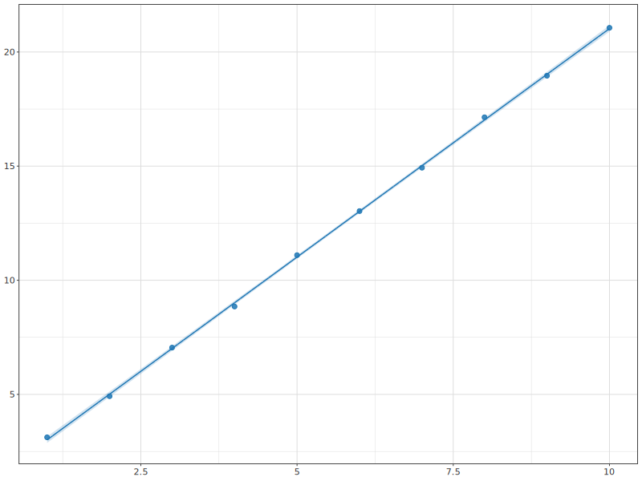 | 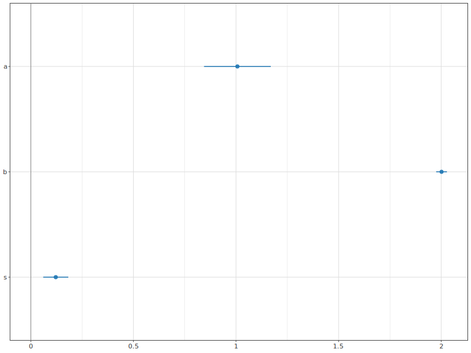 | 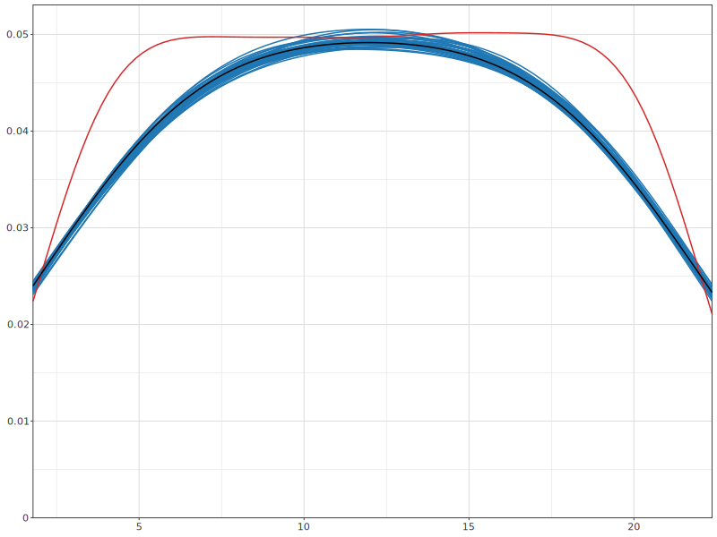 | 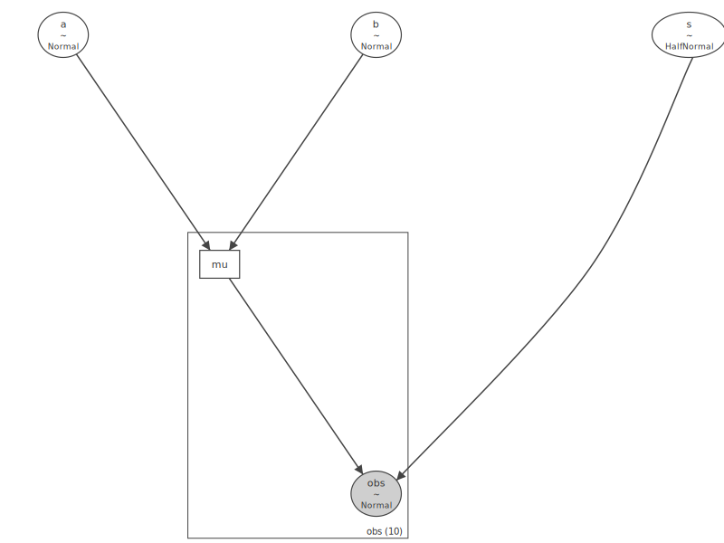 |

> **ppc の 3 色の読み方** (`az.plot_ppc` 同様): **黒線 = 観測データ**の密度、 **薄い青線 (多数) = 各 draw の
> 事後予測複製 y_rep** の密度 (モデルが生む「あり得たデータ」 のばらつき)、 **赤の破線 = 全 y_rep をプール
> した密度** (事後予測の代表分布)。 黒 (観測) が青の束の中に収まり赤と重なるほど、 モデルがデータをよく
> 再現している (= 良い当てはまり)。 黒が青の外れにあると mis-fit のサイン。 `ppcOf` は純粋 (`ppcSeed`
> 既定 42 で再現可能)。 システム乱数を引きたいときだけ IO 版 `ppcOfIO` を使う。

> **DAG のノード形状** (PyMC `model_to_graphviz` 慣例): **白楕円 = 確率的 latent** (`sample`・分布名を併記)、
> **灰楕円 = observed** (`observe`)、 **白四角 = deterministic** (`deterministic`・派生量ゆえ分布名なし)、
> **角丸の囲み枠 = plate** (`plate "名前" N` で囲んだ繰り返し・枠ラベルに「名前 (N)」 で**個数**を表示)。
> ノードは label 文字幅に合わせて**可変サイズ**で描かれる (長い分布名でも枠内に収まる)。 繰り返しノード
> (per-observation の mu/obs 等) は 1 ノードに集約されるが、 plate 枠の個数でデータ点数が読み取れる。

**HBM ダッシュボード (1 枚図) ─ `subplots` の入れ子で**: 抽出子は普通の `VisualSpec` なので
[nested subplots](04-decoration.ja.md#subplots) と組み合わせれば、 PyMC + ArviZ の `az.plot_trace` 群を 1 枚に束ねた
診断ダッシュボードになる。 **`traceOf` / `marginalsOf` は変数ごとに list を返す**ので、 これを
`subplots … <> subplotCols 1` で縦に積むと「変数ぶん縦に並んだ列」 になる。

ネストする**列 layer を個別に定義**してから、 最後に 1 行 5 列で束ねる (DAG は縦長の列に入れると
潰れるので**専用の列を左端**に与える):

```haskell
let ppc = ppcOf fit "obs"   -- 純粋。 IO 版が要るときは ppcOfIO

-- 列: DAG 専用列 (縦長の列に入れると潰れるので 1 列を丸ごと与える)。
let dagCol = toPlot (dagOf fit) <> title "構造 (DAG)"
-- 列: 事後分布 (周辺事後密度) を変数ごとに縦並び (n×1)。 multi-chain は chain 別を色違いで重畳
    postCol  = subplots (marginalsByChainOf fit) <> subplotCols 1 <> title "事後分布 (各変数・chain 重畳)"
-- 列: trace を変数ごとに縦並び (n×1)。 同じく chain 別を色違いで重畳
    traceCol = subplots (tracesByChainOf fit)    <> subplotCols 1 <> title "trace (各変数・chain 重畳)"
-- 列: HDI (forest) と PPC を縦並び (2×1)
    hdiPpcCol = subplots [ toPlot (forestOf fit) <> title "HDI (forest 94%)"
                         , toPlot ppc            <> title "PPC" ] <> subplotCols 1 <> title "HDI / PPC"
-- 列: 事後予測 (epred の "x"/"y" は外側 df で解決)
    epredCol = layer (scatter "x" "y") <> toPlot (epred fit "x" "mu") <> title "事後予測"

-- 最後に 5 つの列を 1 行 5 列で束ねる。 DAG (構造) を左端に。 DAG 列ぶん横幅を 2000px に広げる
-- (画面向けの広い dashboard なので px 指定。要 import Hgg.Plot.Unit (px, (*~)))
df |>> ( subplots [ dagCol, postCol, traceCol, hdiPpcCol, epredCol ] <> subplotCols 5
       <> widthUnit (2000 *~ px) <> heightUnit (600 *~ px)
       <> title "HBM 診断ダッシュボード (構造 / 事後分布 / trace / HDI・PPC / 事後予測)" )
```

> **横の空きについて**: `subplots` は facet と違い **各 panel が独立した完全な図** (それぞれ y 軸の
> 目盛り・ラベル・タイトルを持つ)。 panel 間 spacing 自体は ggplot `panel.spacing` 既定 = `half_line`
> (5.5pt) に準拠するが、 横隣の空きの大半は **隣 panel 自身の y 軸帯** (= patchwork 流の独立図並置)。
> 列が多いほど空きが目立つので `width` を広げると相対的に詰まって見える。

> **multi-chain**: `traceOf` / `marginalsOf` は **全 chain を連結/プールした 1 本**を返す。 chain 別を
> **同じプロットに色違いで重畳** (= ArviZ `plot_trace` 既定) したいときは `tracesByChainOf` /
> `marginalsByChainOf` (どちらも per-param で chain ごとに `color` レイヤを重ねた `VisualSpec` を返す)
> を使う。 chain 間の mixing/収束差が目視できる。

ネスト前の各列 (個別図):

| 事後分布 (各変数・縦) | trace (各変数・縦) | HDI / PPC (縦) |
|---|---|---|
| 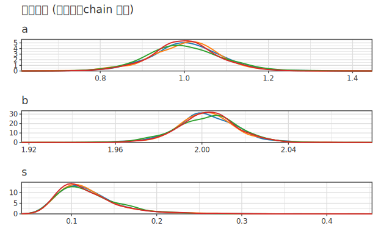 | 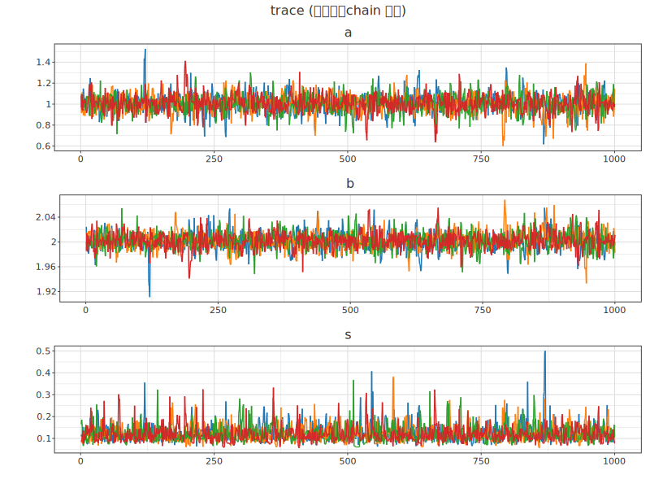 | 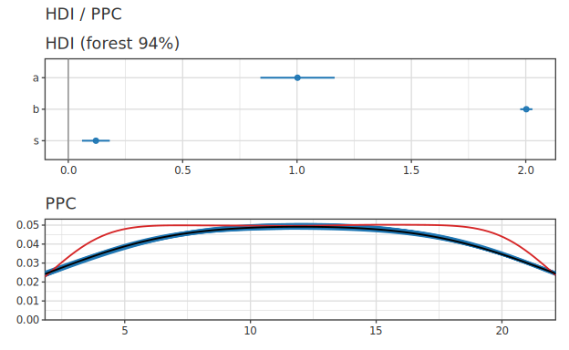 |

束ねた 1 枚図 (= DAG 専用列 + 上の各列 + 事後予測を 1 行 5 列に。 左端が入れ子セルに収まった DAG):

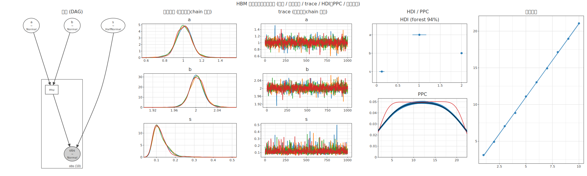

> **注**: HBM 抽出子は analyze 側 `Hanalyze.Plot` が提供する。 DAG (`dagOf`) も**入れ子セルに
> 収まる** (上のダッシュボード左端の DAG 専用列が実例。 縦長の列に積むと潰れるので 1 列を丸ごと
> 与えるとよい)。 `epred`/`traceOf`/`forestOf`/`dagOf`/`ppcOf` はすべて純粋で、 `ppcOf` は `ppcSeed`
> で再現できる。 システム乱数を引きたいときだけ IO 版 `ppcOfIO`/`ppcOfWithIO` を使う。
> `PPCConfig { ppcReps, ppcSeed, ppcCumulative }` で重ねる本数・シード・累積版 (ecdf) を制御できる。

### ルート 2: stat-in ─ `statLm` / `statSmooth` (ggplot 風スタット・イン) {#route2}

ggplot2 の `geom_smooth(method="lm")` のように、 **stat を通常 mark と同じく `layer (…)` で重ねる**
だけ。 回帰計算は bridge (`hgg-analyze-bridge`) が hanalyze に委譲する。 **df は 1 回参照、
装飾も通常 mark と同じ `<>`**:

> **スコープ**: stat-in の stat は **6 種** ─ `statLm` / `statLmLevel` / `statSmooth` /
> `statSmoothCI` / `statPoly` / `statResid`。 GLM / GP / 生存 / ベイズ
> など多彩なモデルを図にしたいときは **ルート 1 (`toPlot`、 14 モデル)** を使う。

```haskell
import           Hgg.Plot.Spec        ( statLm, statLmLevel, statSmooth, statSmoothCI
                                          , statPoly, statResid, colorBy, color, stroke )
import           Hgg.Plot.Color       (fromHex)
import           Hgg.Plot.Bridge.Stat (saveSVGBoundStats)

-- ggplot(df, aes(x,y)) + geom_point() + geom_smooth(method="lm", color="red")  に相当
saveSVGBoundStats "out.svg" $
  df |>> ( layer (scatter "x" "y")
         <> layer (statLm "x" "y" <> color (fromHex "#d62728") <> stroke 2)   -- 回帰線 + 95% 信頼帯
         <> title "fit" )

-- smooth = B-spline 平滑曲線 (knot 数指定、 帯なし)
saveSVGBoundStats "out2.svg" $
  df |>> ( layer (scatter "x" "y") <> layer (statSmooth "x" "y" 8) )
```

**stat 一覧** (いずれも `Layer`・`layer (…)` で包み `<>` で装飾):

| stat | 型 (何を渡すか) | 意味 (ggplot 相当) |
|---|---|---|
| `statLm` | `ColRef -> ColRef -> Layer` | 線形回帰 + 95% 信頼帯 (`geom_smooth(method="lm")`) |
| `statLmLevel` | `ColRef -> ColRef -> Double -> Layer` | 信頼水準指定 (`level=0.99`) |
| `statSmooth` | `ColRef -> ColRef -> Int -> Layer` | B-spline 平滑 (knot n・帯なし) |
| `statSmoothCI` | `ColRef -> ColRef -> Int -> Layer` | B-spline 平滑 + 信頼帯 |
| `statPoly` | `ColRef -> ColRef -> Int -> Layer` | 多項式回帰 (次数 deg) + 帯 |
| `statResid` | `ColRef -> ColRef -> Layer` | 残差 vs fitted 診断散布 (`plot(lm)` #1) |

```haskell
-- 信頼水準を 0.99 に / B-spline に信頼帯 / 二次回帰 / 残差診断
df |>> layer (statLmLevel  "x" "y" 0.99)
df |>> layer (statSmoothCI "x" "y" 6)
df |>> layer (statPoly     "x" "y" 2)
df |>> layer (statResid    "x" "y")            -- 散布図 (fitted, residual)

-- group 別 fit: color で群列を指すと群ごとに回帰線+帯を ggplot hue 色で重畳
--   (= geom_smooth(aes(color=g)))。 scatter も同じ colorBy "g" で色を揃える。
df |>> ( layer (scatter "x" "y" <> colorBy "g")
       <> layer (statLm  "x" "y" <> colorBy "g") )
```

ポイント:
- **stat は `Layer`** (`Hgg.Plot.Spec`、 純タグ `MStatLM`/`MStatSmooth`/`MStatPoly`/`MStatResid`)。
  通常 mark と同じく `layer (…)` で包み `<>` で重ねる。 装飾 (`color`/`stroke`/`alpha`) も
  Layer の `<>` でそのまま効き、 展開後の回帰線/帯/散布に引き継がれる。
- **`colorBy "g"` で群別 fit**: lyColor が群列を指すと bridge が群ごとに分割 fit し、 群色
  (ggplot hue = theme series palette) で重畳する。 同じ `colorBy "g"` の scatter と色が一致する。
- **描画は `saveSVGBoundStats` / `renderBoundStats`** (bridge)。 `BoundPlot` が持つ resolver で
  回帰を fit (`resolveStats`) してから描く → **df は `df |>>` の 1 回だけ**。
- `saveSVGBound` (bridge を通さない) で描くと stat は解決されず警告が出る (回帰線は出ない) ので、 stat-in は `saveSVGBoundStats` / `renderBoundStats` を使う。

| lm (信頼帯・赤線) | smooth (B-spline) | statSmoothCI (平滑 + 帯) |
|---|---|---|
| 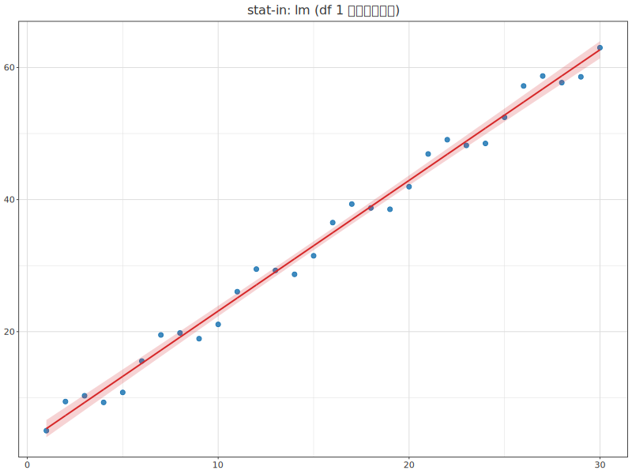 | 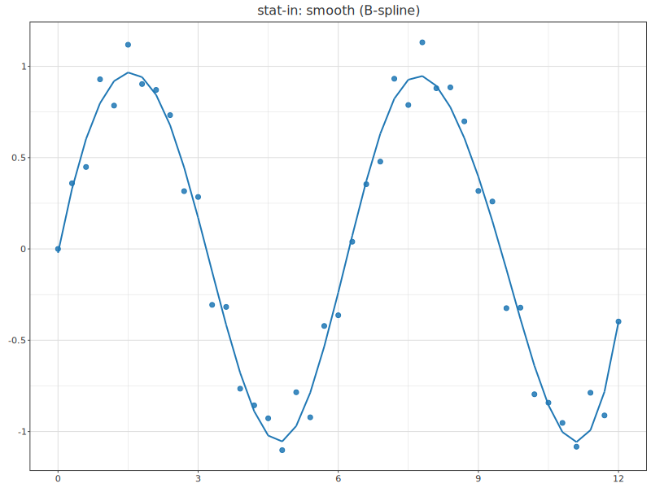 | 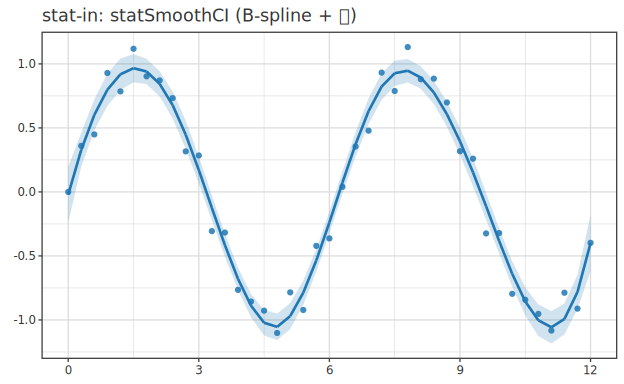 |

| statLmLevel 0.99 (広い帯) | statPoly deg=2 (二次 + 帯) | statResid (残差診断) | group 別 lm |
|---|---|---|---|
| 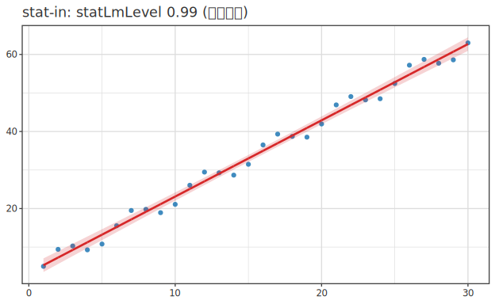 | 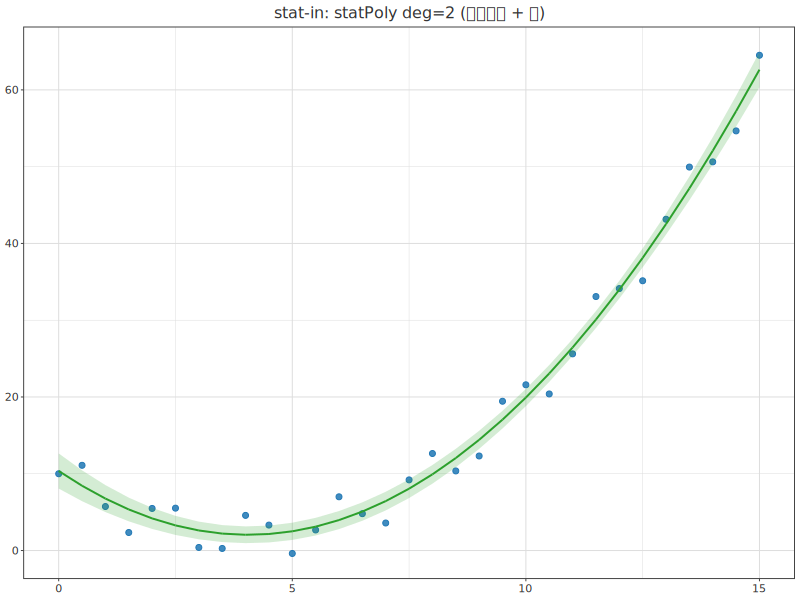 | 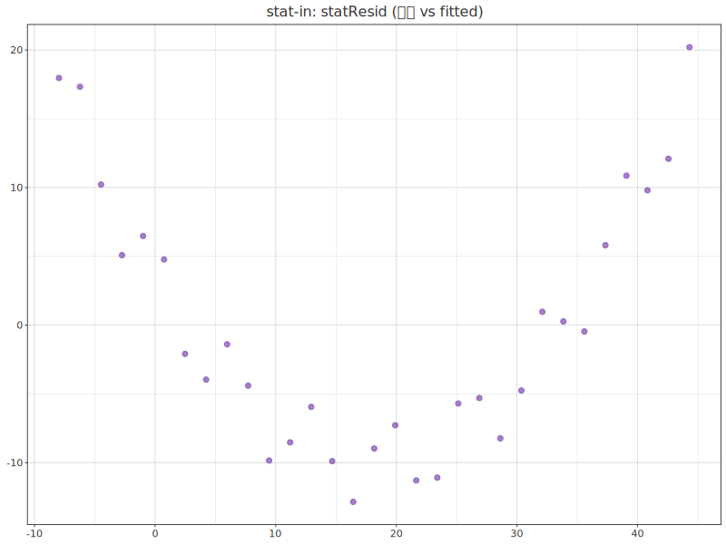 | 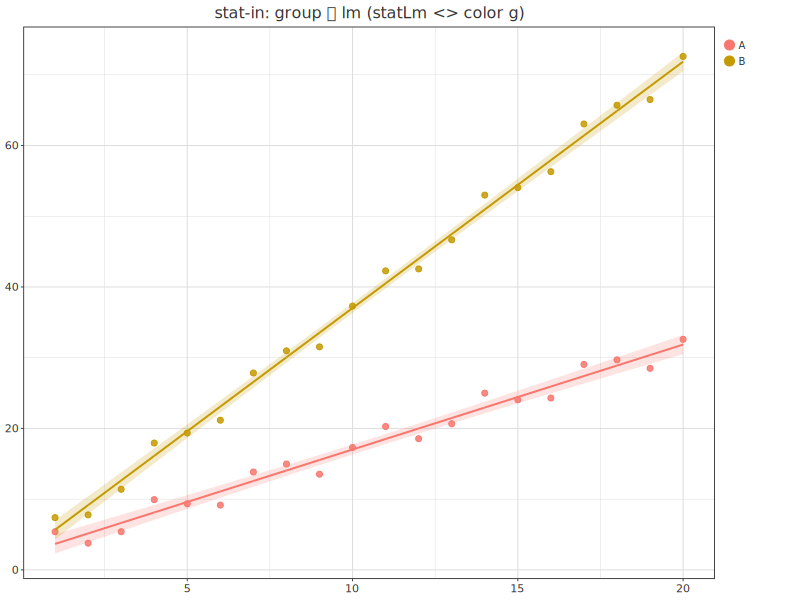 |

### 実例: 複数モデルを 1 枚に重ねる {#multi-overlay}

抽出子は普通の layer なので、 [04 decoration](04-decoration.ja.md) の装飾や [`subplots`](04-decoration.ja.md#subplots) と自由に組める。

**複数モデルの比較 ─ LM / GLM / spline を 1 図に重ねる**

学習は `df |-> spec`、 描画は `toPlot`。 各当てはめを **`statModel` でくるみ `statColor`**
(線色) と **`statLabel`** (凡例ラベル) を付けると、 モデルごとに色分けされ凡例も並ぶ:

```haskell
import Hanalyze.Plot      (toPlot, statModel, statColor, statLabel, (|->), lm, glm, spline)
import Hanalyze.Model.GLM (Family (..), LinkFn (..))
import Hanalyze.Model.Spline (SplineKind (..))
import Hgg.Plot.Color        (fromHex)   -- statColor は Color を受ける

df |>> ( layer (scatter "x" "y")
       <> toPlot (statModel (df |-> lm "x" "y")              <> statColor (fromHex "#1f77b4") <> statLabel "LM")      -- 青
       <> toPlot (statModel (df |-> glm Poisson Log "x" "y") <> statColor (fromHex "#ff7f0e") <> statLabel "GLM")     -- 橙
       <> toPlot (statModel (df |-> spline (BSpline 3) [4, 8] "x" "y") <> statColor (fromHex "#2ca02c") <> statLabel "spline") )  -- 緑
```

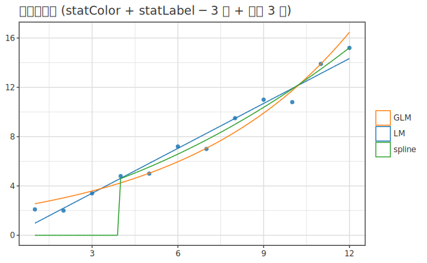

> **重畳時の色・凡例**: 異なるモデルを 1 図に重ねても、 各 `statLabel` の色と凡例が
> 併合され全カテゴリが並ぶ ── 上の例では **3 色 + 凡例 3 件** が出る。 群が**列**で分かれているなら
> [`grouped`](#群別フィット-grouped-群ごとに-1-本ずつ回帰線) でも 1 つの色スケールで凡例まで出る。

**HBM 診断ダッシュボード** ─ 確率モデルは 1 図に一意化できないので、 抽出子
(`forestOf`/`traceOf`/`epred`/`dagOf` …) を [`subplots`](04-decoration.ja.md#subplots) で 1 枚に束ねる。
構造 DAG + 事後分布 + trace + HDI・PPC + 事後予測を 1 行に並べた完全な作例は
[HBM 節のダッシュボード](#hbm-plotting)にある。
