# 3D ─ 応答曲面と汎用 3D プロット

> [📚 索引](README.md) ｜ [01 quickstart](01-quickstart.md) ｜ [02 layers](02-layers.md) ｜ [03 encoding & scale](03-encoding-scale.md) ｜ [04 decoration](04-decoration.md) ｜ [05 backends](05-backends.md) ｜ [06 dataframe](06-dataframe.md) ｜ [07 analyze](07-analyze.md) ｜ **08 3d** ｜ [09 appendix](09-appendix.md)

> ⚠️ **3D は 2D とは別の型系**。 合成単位は `Layer3D`・図は `VisualSpec3D`・mark は `Mark3DKind`
> (`scatter3D`/`surface3D`/…)、 保存は `saveSVG3D` 系。 layer の発想 (`purePlot3D <> layer3D (…)`) は
> 同じだが、 2D の `Layer`/`VisualSpec` ([02 layers](02-layers.md)) とは混ぜられない。

`hgg-3d` は 2D と同型の spec API (`purePlot3D <> layer3D (...)`) で 3D を組む
CPU 投影 backend (mplot3d 同等)。 DoE / RSM (応答曲面法) の曲面 (連続色・床面投影
contour・実測点重畳・群別並置) に加え、 **7-5 の汎用機能** (群色散布・bubble・3D 棒・
テキスト注釈・壁面 pane・box アスペクト・log 軸) まで 1 経路で出せる。

このページの構成:
**[核となる mark / builder 一覧](#core-3d)** ｜ **[曲面 + colormap + 投影 contour](#td-surface)** ｜
**[汎用 3D (群色・bubble・棒・注釈)](#td-general)** ｜ **[新 mark (stem3D / quiver3D / trisurf)](#td-newmarks)** ｜
**[interactive 3D (WebGL)](#td-webgl)** ｜ **[その他の builder](#more-3d)**

## 核となる mark / builder 一覧 (型) {#core-3d}

引数の `ColRef` は `inline [..]` か列名 (df 利用時)。 `grid :: [[Double]]` は行 = y の格子。

### mark (`Layer3D`)

| 関数 | 型 | 用途 |
|---|---|---|
| `scatter3D` / `line3D` / `stem3D` / `bar3D` | `ColRef -> ColRef -> ColRef -> Layer3D` | 散布 / 折れ線 / stem / 棒 (x, y, z) |
| `scatter3DPoints` / `line3DPoints` / `bar3DPoints` / `stem3DPoints` / `trisurf` | `[Point3] -> Layer3D` | 点列から各 mark |
| `surface3D` / `surface3DGrid` | `ColRef -> ColRef -> ColRef -> Layer3D` / `[[Double]] -> Layer3D` | (x, y, z 列) の long 形 / 格子行列から応答曲面 |
| `wireframe3D` | `[Point3] -> [(Int, Int)] -> Layer3D` | ワイヤフレーム (頂点, エッジ) |
| `quiver3D` | `[(Point3, Vec3)] -> Layer3D` | 3D ベクトル場 |
| `text3D` / `text3DPoints` / `annotate3D` | `ColRef -> ColRef -> ColRef -> ColRef -> Layer3D` / `[(Point3, Text)] -> Layer3D` / `Point3 -> Text -> Layer3D` | (x, y, z, ラベル列) / inline 点ラベル / 単点注釈 |

### mark のオプション (`Layer3D`・mark の中で `<>`)

| 関数 | 型 | 用途 |
|---|---|---|
| `color3D` | `Color -> Layer3D` | 単色 (`color3D (fromHex "#..")`) |
| `colorRGBA3D` | `Text -> Layer3D` | 8桁 RGBA hex の近道 (= `color3D (fromHex …) <> alpha3D …`・2D `colorRGBA` の双子) |
| `colorRGBA3DMaybe` | `Text -> Maybe Layer3D` | `colorRGBA3D` の total 版。不正な hex は `Nothing` |
| `colorBy3D` / `colorContinuousBy3D` / `sizeBy3D` | `ColRef -> Layer3D` | 群色 / 値連続色 / bubble (列) |
| `size3D` / `alpha3D` / `width3D` / `vecScale3D` | `Double -> Layer3D` | 点サイズ / 透明度 / 線幅 / 矢印倍率 |
| `sizeRange3D` / `xRange3D` / `yRange3D` | `(Double, Double) -> Layer3D` | bubble 半径 / x 範囲 / y 範囲 |
| `colormap3D` / `edgeOn` | `Layer3D` | surface/trisurf の z 連続色 / 面エッジ (引数なし) |
| `colormapWith3D` | `[Text] -> Layer3D` | colormap を色列で明示 |
| `contourZ` / `contourX` / `contourY` | `Int -> Layer3D` | 投影 contour 本数 (床=z 等値面 / 左右壁=x 断面 / 前後壁=y 断面・matplotlib `zdir` 相当・同 surface に `<>` 合成可・投影壁はカメラ遠側に自動) |
| `surfaceWire` | `Layer3D` | surface を**面なしの格子線メッシュ**で描く (matplotlib `plot_wireframe` 相当・引数なし・線色は `color3D`) |
| `shaded3D` | `Bool -> Layer3D` | surface/trisurf の面を Lambert シェーディング (wireframe は辺のみで無効) |
| `edgeColor3D` | `Color -> Layer3D` | エッジ色 |
| `errorBar3D` | `ColRef -> Layer3D` | 誤差棒列 |
| `barStyle3D` / `barWidth3D` / `stemBaseZ` | `BarStyle3D -> Layer3D` / `Double -> Layer3D` / `Double -> Layer3D` | 棒スタイル / 幅 / stem 底面 |

### 図全体 (`VisualSpec3D`・`layer3D` の外で `<>`)

| 関数 | 型 | 用途 |
|---|---|---|
| `layer3D` | `Layer3D -> VisualSpec3D` | mark を図に乗せる |
| `camera` | `Camera3D -> VisualSpec3D` | 視点 (`cameraIso`/`cameraTop`/`cameraFront`/`cameraSide` :: `Double -> Camera3D`) |
| `title3D` | `Text -> VisualSpec3D` | タイトル |
| `axisTitles3D` | `Text -> Text -> Text -> VisualSpec3D` | x/y/z 軸名 |
| `xAspect3D` / `yAspect3D` / `zAspect3D` | `Double -> VisualSpec3D` | box 縦横比 |
| `width3DV` / `height3DV` | `Int -> VisualSpec3D` | 出力 px サイズ |
| `pane3D` | `Bool -> VisualSpec3D` | 壁面 pane on/off |
| `logScale3D` | `Bool -> Bool -> Bool -> VisualSpec3D` | x/y/z を log に |
| `axes3D` / `projection` | `Axes3D -> VisualSpec3D` / `Projection3D -> VisualSpec3D` | 軸構成 / 投影 |

### 保存 (`IO`)

| 関数 | 型 | 用途 |
|---|---|---|
| `saveSVG3D` / `savePDF3D` / `savePNG3D` | `FilePath -> VisualSpec3D -> IO ()` | SVG / PDF / PNG 保存 |
| `saveSVG3DBound` | `FilePath -> BoundPlot3D -> IO ()` | df 連携 (`df \|>> spec`) |
| `saveSVG3DFacet` | `FilePath -> [(Text, VisualSpec3D)] -> IO ()` | 群別曲面の並置 |
| `showBrowser` / `saveHTML3D` | `VisualSpec3D -> IO ()` / `FilePath -> VisualSpec3D -> IO ()` | WebGL (7-7) |

> 関連型: `Layer3D` / `VisualSpec3D` / `BoundPlot3D` / `Camera3D` / `Projection3D` / `Axes3D` /
> `BarStyle3D` / `ContourDir` (`ContourX`/`ContourY`/`ContourZ`・投影 contour の軸) / `Point3` /
> `Vec3` / `Mat4`。 以下の 7-1〜7-8 で各機能を図つきで示す。

<a id="td-surface"></a>

### 7-1. 曲面 + colormap + 投影 contour

`surface3DGrid grid` に **`colormap3D`** (z 値の viridis 連続色) と **`contourZ n`**
(床面投影の等高線・plotly contours_z / matplotlib `zdir='z'` 相当) を `<>` で足すだけ。
`saveSVG3D` が colorbar を自動付与する。

```haskell
import Hgg.Plot.ThreeD.Spec
import Hgg.Plot.ThreeD.Easy  (saveSVG3D)
import Hgg.Plot.ThreeD.Types (cameraIso)

saveSVG3D "surface.svg"
  ( layer3D ( surface3DGrid grid              -- grid :: [[Double]] (行 = y)
           <> xRange3D (-3, 3) <> yRange3D (-3, 3)
           <> colormap3D                  -- z 連続色 + colorbar
           <> contourZ 8 )                -- 床面に z 等値面 8 本を投影
 <> camera (cameraIso 5)                  -- 視点 preset (iso/top/front/side)
 <> title3D "3D surface + floor contour" )
```

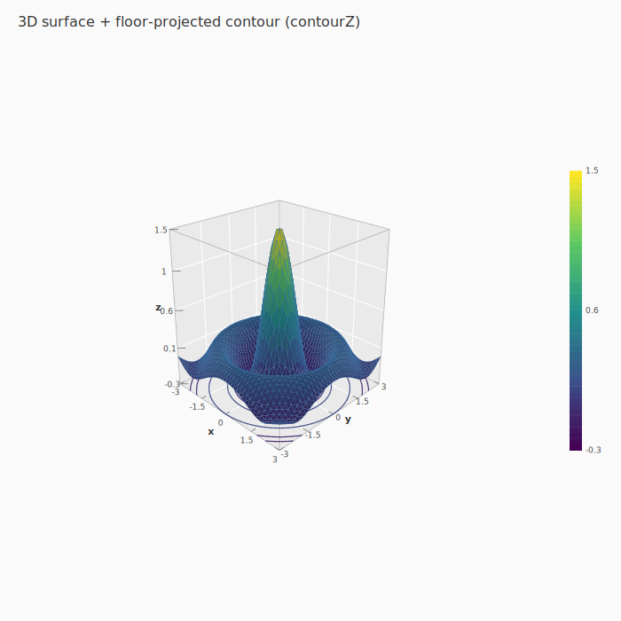

**壁面投影 contour (`contourX` / `contourY`)** ─ matplotlib `contour(..., zdir='x'/'y')` /
plotly `contours.x.project` 相当。`contourX n` は x 軸を n 等分した位置で曲面を切り、
各**断面プロファイル** `z = f(x_k, y)` を左右の壁に描く (`contourY` は y 断面を前後の壁へ)。
**同じ surface に `<>` で合成するだけ** ─ 投影壁は**カメラから遠い面に自動固定**される
(床 `contourZ` = 等値面と重ねると、上面・側面の両方から曲面形状を読める)。

```haskell
saveSVG3D "wall.svg"
  ( layer3D ( surface3DGrid grid <> xRange3D (-3,3) <> yRange3D (-3,3) <> colormap3D
           <> contourX 8 <> contourY 8 <> contourZ 8 )  -- 1 layer に 3 方向を合成
 <> axes3D wallAxes                        -- 軸を data より広く取ると壁が離れて見やすい
 <> camera (cameraIso 5) )
```

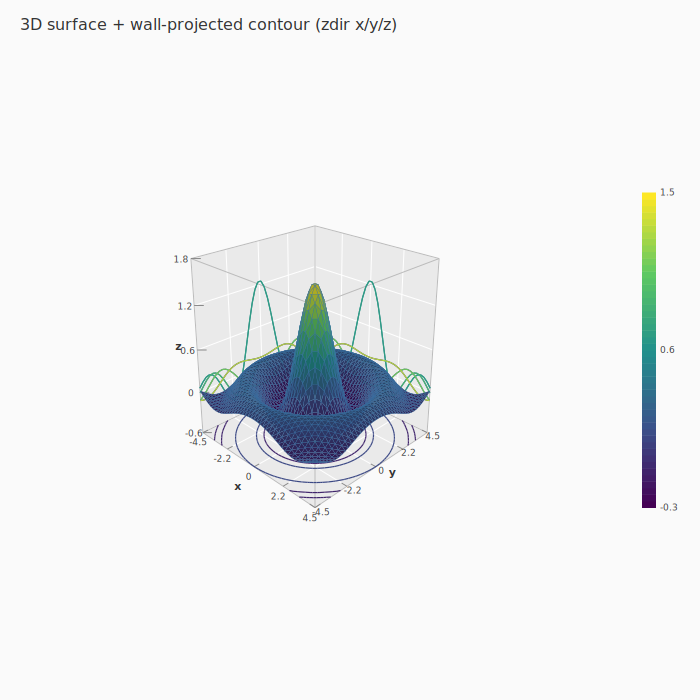

**面なしの格子線メッシュ (wireframe 曲面)** ─ `surfaceWire` を `<>` で足すと、 面を塗らず grid の
行/列を線メッシュで描く (matplotlib `plot_wireframe` 相当)。 同じ `surface3D` の grid・range を
使うので、 塗り曲面とフラグ 1 つで切り替わる。 線色は `color3D` (colormap/shaded は面用ゆえ無効):

```haskell
saveSVG3D "wire.svg"
  ( layer3D ( surface3DGrid grid <> surfaceWire <> color3D (fromHex "#2563eb")
           <> xRange3D (-3, 3) <> yRange3D (-3, 3) )
 <> camera (cameraIso 5) )
```

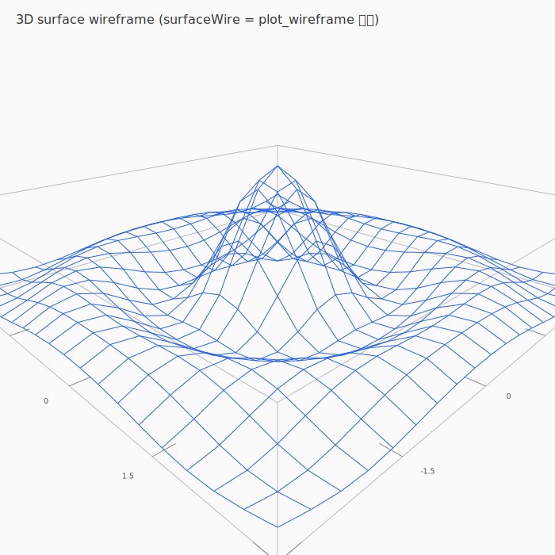

> ⚠️ これは `wireframe3D` ([7-8](#more-3d) の cube) とは別物。 `surfaceWire` は **grid から行/列の
> 線メッシュを自動生成**(曲面の wireframe)、 `wireframe3D` は **任意の頂点 + エッジ**を手で渡す汎用線。

### 7-2. 軸タイトル・z aspect・視点 preset

```haskell
 <> axisTitles3D "温度 [°C]" "圧力 [bar]" "収率 [%]"  -- 軸名 (既定 x/y/z)
 <> zAspect3D 1.6                                     -- z 軸を 1.6 倍に縦伸ばし
 <> camera (cameraIso 5)                              -- cameraTop/Front/Side も
```

軸の tick/軸名は視点に追従して周辺エッジ (前面下・左 silhouette) に配置される。

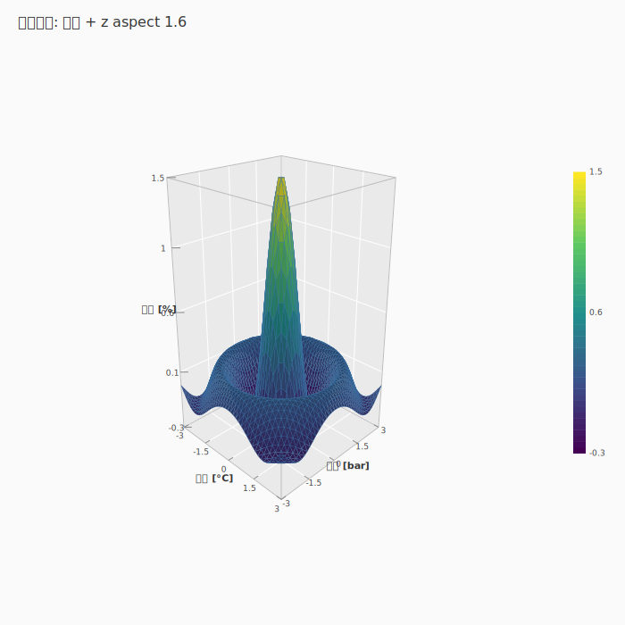

### 7-3. 群別曲面の並置 (facet) と PDF/PNG 出力

```haskell
import Hgg.Plot.ThreeD.Easy (saveSVG3DFacet, savePDF3D, savePNG3D)

-- 群ごとに spec を作って near-square グリッドにタイル配置
saveSVG3DFacet "facet.svg" [ ("group A", specA), ("group B", specB) ]

savePDF3D "out.pdf" spec     -- Latin ラベル
savePNG3D "out.png" spec     -- 日本語ラベル可 (Rasterific)
```

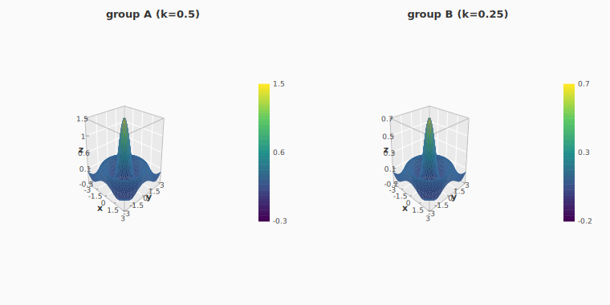

### 7-4. analyze 連携 ─ fit 済みモデルから曲面 (cross-repo)

`Hanalyze.Plot` の `surfaceOf` / `surfaceGrid` で、 fit 済みの 2 次モデル
(RSM) を 2 因子 grid 評価して曲面にできる (他因子は `HoldAgg` で固定)。 `I(x1^2)` 等の
多項式項は grid 評価時に再計算されるため、 真の曲率が出る。

```haskell
import Hanalyze.Plot (multiLMModel, surfaceGrid, defaultSurfaceOpts)

let m = either error id
          (multiLMModel "y ~ x1 + x2 + I(x1^2) + I(x2^2) + I(x1*x2)" df)
    (gxs, gys, grid) = surfaceGrid m "x1" "x2" defaultSurfaceOpts
saveSVG3D "rsm.svg"
  ( layer3D (surface3DGrid grid <> xRange3D (head gxs, last gxs)
                            <> yRange3D (head gys, last gys)
                            <> colormap3D <> contourZ 8)
 <> layer3D (scatter3DPoints obsPts <> color3D (fromHex "#d62728") <> size3D 7)  -- 実測点
 <> camera (cameraIso 5) )
```

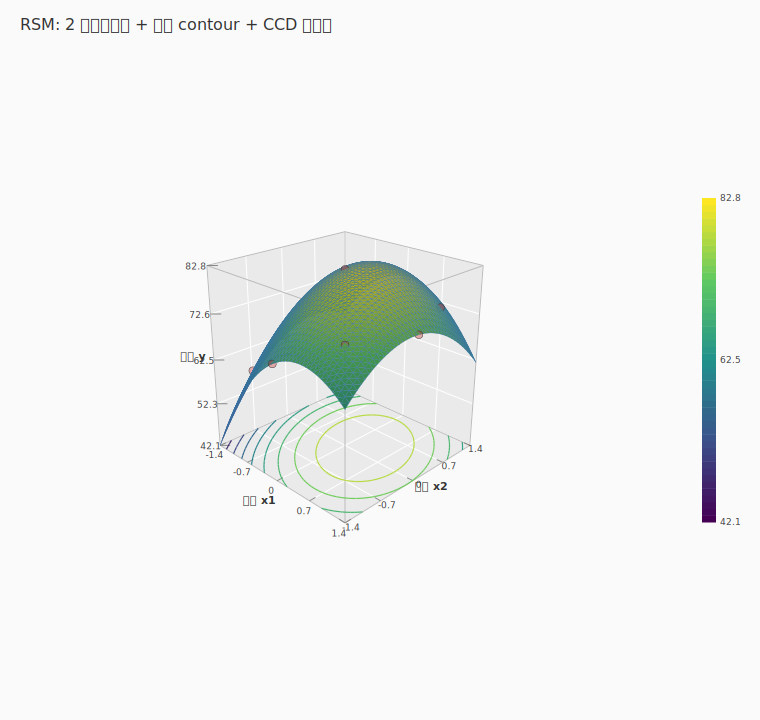

> 3D は SVG backend が先行。
> interactive WebGL backend も用意している (→ 7-7)。 ただし surface の z 連続色
> (colormap) は WebGL では未対応 (follow-up)。

<a id="td-general"></a>

### 7-5. 汎用 3D ─ 群色・bubble・棒・注釈・pane・log/aspect

surface 専用だった 3D を汎用統計プロットへ広げる builder 群 (`<>` で合成):

| builder | 型 (何を渡すか) | 効果 |
|---|---|---|
| `colorBy3D` | `ColRef -> Layer3D` | カテゴリ列で群色分け + 離散凡例 (scatter/line) |
| `colorContinuousBy3D` | `ColRef -> Layer3D` | 数値列で連続色 (viridis) + colorbar (scatter) |
| `sizeBy3D` | `ColRef -> Layer3D` | 数値列で点サイズ (bubble) |
| `sizeRange3D` | `(Double, Double) -> Layer3D` | bubble の半径 range |
| `bar3D` | `ColRef -> ColRef -> ColRef -> Layer3D` | 3D 棒 (x, y, z) |
| `barStyle3D` / `barWidth3D` | `BarStyle3D -> Layer3D` / `Double -> Layer3D` | 棒のスタイル (直方体/stick) / 幅 |
| `errorBar3D` | `ColRef -> Layer3D` | 誤差棒の列 (SE) |
| `text3DPoints` | `[(Point3, Text)] -> Layer3D` | 任意 3D 点にラベル (色=`color3D`・大きさ=`size3D`) |
| `annotate3D` | `Point3 -> Text -> Layer3D` | 1 点にラベル |
| `pane3D` | `Bool -> VisualSpec3D` | 壁面 pane + 格子 on/off (既定 ON = mplot3d 標準) |
| `xAspect3D` / `yAspect3D` / `zAspect3D` | `Double -> VisualSpec3D` | box 縦横比 (mplot3d `set_box_aspect`) |
| `logScale3D` | `Bool -> Bool -> Bool -> VisualSpec3D` | x/y/z 軸を log に (tick は 10 の冪) |

```haskell
-- 群色分け + 重心ラベル (クラスタ分類の 3D 可視化)
saveSVG3DBound "clusters.svg"
  ( df |>> ( layer3D (scatter3D "x" "y" "z" <> colorBy3D "cluster" <> size3D 5)
          <> layer3D (text3DPoints [(Point3 0 0 0.7, "A"), (Point3 2.2 1.5 1.7, "B")] <> size3D 16)
          <> camera (cameraIso 5) <> axisTitles3D "PC1" "PC2" "PC3" ) )
```

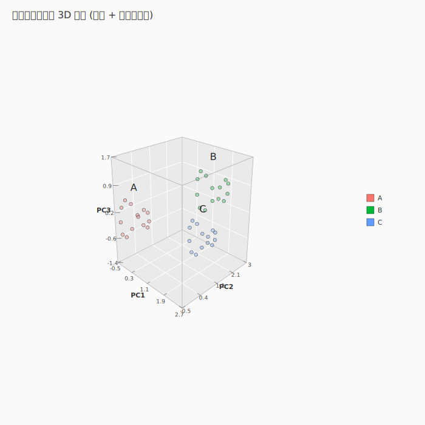

```haskell
-- 連続色 + bubble + log-x (用量反応)
 <> ( scatter3D "dose" "time" "resp"
       <> colorContinuousBy3D "effect" <> sizeBy3D "effect" <> sizeRange3D (5, 22) )
 <> logScale3D True False False    -- dose (x) を log
```

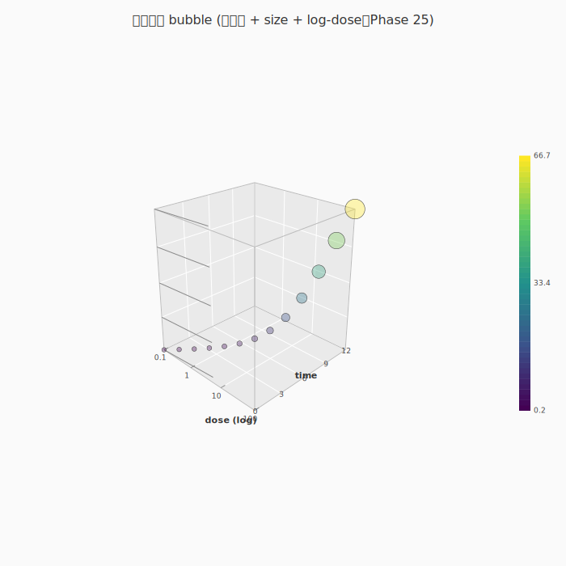

```haskell
-- DoE 棒 + 誤差棒 + 値ラベル
 <> layer3D (bar3D "fx" "fy" "r" <> barWidth3D 0.08 <> errorBar3D "se")
 <> layer3D (text3DPoints cellLabels <> size3D 10)
```

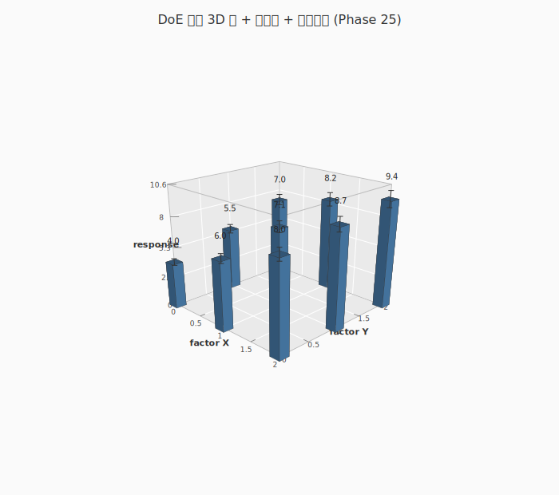

壁面 pane (既定 ON・`pane3D False` で従来) と box アスペクト (`xAspect3D 1.6 <> zAspect3D 0.6`):

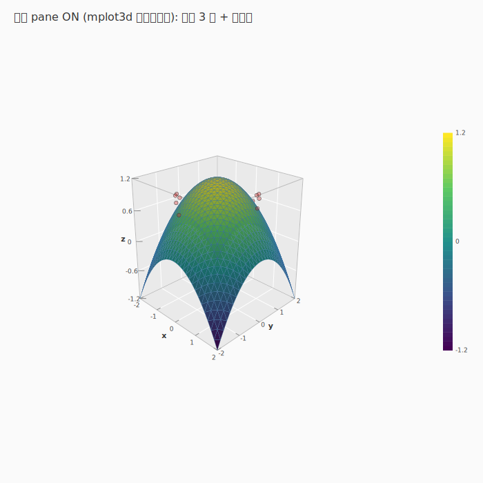
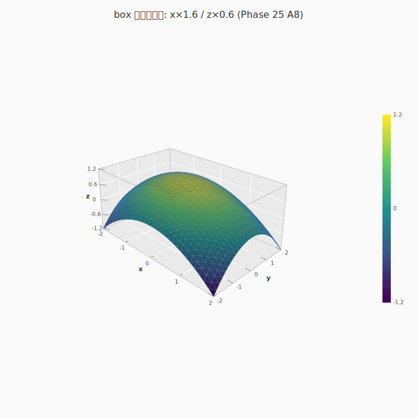

> 制限: surface の log-x/y は未対応 (point 系と surface-z は全軸 log 可)。 2 surface
> 交差の隠面は後続 Phase。 WebGL backend の汎用機能 (群色/値マップ/透過/pane/log/aspect)
> 追従済 (→ 7-7)。

<a id="td-newmarks"></a>

### 7-6. 新 mark ─ stem3D / quiver3D / trisurf

mplot3d の残りの mark を埋める 3 種。 いずれも `layer3D` で重ねられ、 camera /
axisTitles3D / pane3D 等 (7-5) と自由に組める:

| mark / builder | 型 (何を渡すか) | 効果 (比較先) |
|---|---|---|
| `stem3D` | `ColRef -> ColRef -> ColRef -> Layer3D` | 底面への垂線 + 先端 (3D lollipop・mplot3d `stem`) |
| `stem3DPoints` / `stemBaseZ` | `[Point3] -> Layer3D` / `Double -> Layer3D` | 点列から stem / 底面 z0 |
| `quiver3D` | `[(Point3, Vec3)] -> Layer3D` | 各点に成分ベクトルの矢印 (mplot3d `quiver`) |
| `vecScale3D` | `Double -> Layer3D` | 矢印長の倍率 (autoscale=cube の 35%) |
| `trisurf` | `[Point3] -> Layer3D` | 不規則点群を Delaunay 三角分割して曲面化 (mplot3d `plot_trisurf`) |

```haskell
-- stem3D (離散系列の 3D lollipop)
saveSVG3DBound "stem.svg"
  ( df |>> ( layer3D (stem3D "t" "series" "value" <> color3D (fromHex "#d62728") <> stemBaseZ 0)
          <> camera (cameraIso 5) ) )

-- quiver3D (3D vector field・回転流)
saveSVG3D "quiver3d.svg"
  ( layer3D (quiver3D [ (p, rotFlow p) | p <- gridPts ] <> vecScale3D 1.0)
  <> camera (cameraIso 5) )

-- trisurf (不規則サンプル点 → 曲面)
saveSVG3D "trisurf.svg"
  ( layer3D (trisurf samplePts <> colormap3D) <> camera (cameraIso 5) )
```

| stem3D | quiver3D | trisurf |
|---|---|---|
| 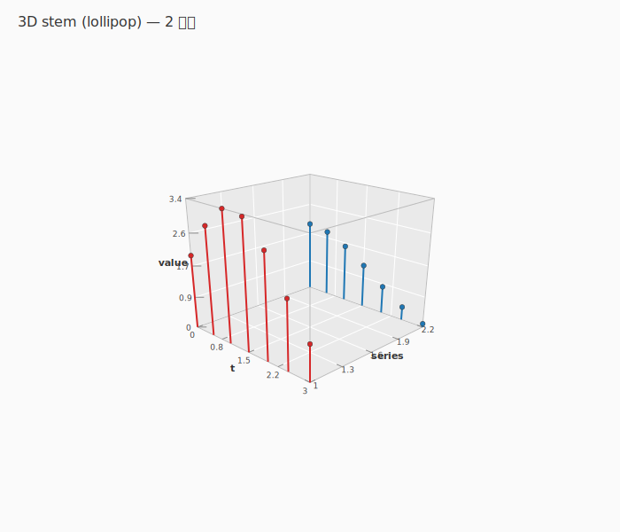 | 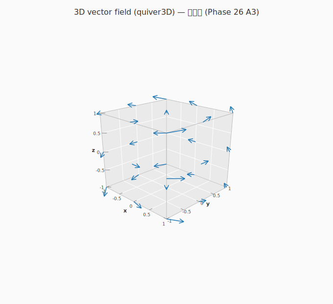 | 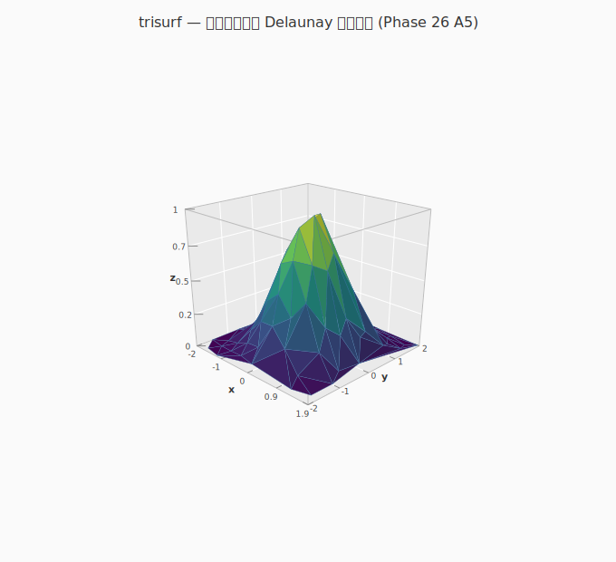 |

> trisurf の Delaunay 三角分割は純 Haskell 自前実装 (外部 lib/バイナリ依存ゼロ)。
> WebGL backend への追従済 (→ 7-7)。

<a id="td-webgl"></a>

### 7-7. interactive 3D ─ WebGL backend (ブラウザで orbit)

7-4〜7-6 の 3D は静的 SVG/PDF/PNG だけでなく、 **ブラウザで orbit/zoom/pan できる
WebGL backend** でも描ける。 spec はそのまま、 保存/表示関数を差し替えるだけ:

```haskell
import Hgg.Plot.ThreeD.Browser (showBrowser, saveHTML3D)
import Hgg.Plot.ThreeD.Bound   (showBrowser3DBound, saveHTML3DBound)

showBrowser   spec            -- tmp HTML 生成 + ブラウザ起動 (= 静的 saveSVG3D の interactive 版)
saveHTML3D    "out.html" spec -- self-contained HTML として配布 (外部依存なし)
saveHTML3DBound "out.html" b  -- df 連携版 (df |>> spec の BoundPlot3D を渡す・列参照 resolve 込み)
```

WebGL backend は SVG 経路と同等の mark/機能を持つ:

| カテゴリ | WebGL 対応 |
|---|---|
| mark | scatter / line / wireframe / surface + **bar+誤差棒 / text注釈 / stem / quiver / trisurf** |
| 色 | 群色 (`colorBy3D`) + 離散凡例 / 値マップ (`colorContinuousBy3D`) + colorbar / bubble (`sizeBy3D`) |
| 面 | surface/trisurf 透過 (`alpha3D`) ・壁面 pane + 格子 |
| 軸 | log 軸 (`logScale3D`・ラベルは 10^値) ・box アスペクト (`xAspect3D` 等) ・nice tick 数値ラベル |

```haskell
-- df から群色散布を interactive 表示 (凡例付き)
showBrowser3DBound (df |>> ( layer3D (scatter3D "x" "y" "z" <> colorBy3D "cluster" <> size3D 8)
                          <> camera (cameraIso 5) ))
```

> 背景は 2D/CPU plot と同じ白 (`tpBackground`)。 軸数値は 2D 同等の nice tick
> (`extendedBreaks`)。 **trisurf/surface の z 連続色 (colormap) は WebGL では未対応**
> (= scatter の値マップは対応・surface colormap は follow-up)。 WebGL の線は 1px 固定
> (quiver 矢/stem 垂線/格子)。

### 7-8. その他の 3D builder {#more-3d}

7-1〜7-7 で扱わなかった追加 mark / builder (型つき)。 いずれも `layer3D` / `VisualSpec3D` で `<>` 合成:

| 関数 | 型 (何を渡すか) | 用途 |
|---|---|---|
| `line3D` | `ColRef -> ColRef -> ColRef -> Layer3D` | 3D 折れ線 (x, y, z) |
| `line3DPoints` / `bar3DPoints` | `[Point3] -> Layer3D` | 点列から折れ線 / 棒 |
| `wireframe3D` | `[Point3] -> [(Int, Int)] -> Layer3D` | 頂点 + エッジ index で**辺だけ**の線メッシュ (面は持たない) |
| `shaded3D` | `Bool -> Layer3D` | **surface3D / trisurf の面**を Lambert シェーディング (wireframe には無効) |
| `edgeOn` | `Layer3D` | **surface/trisurf の面**にエッジ線を表示 (引数なし) |
| `edgeColor3D` / `edgeWidth` | `Color -> Layer3D` / `Double -> Layer3D` | エッジの色 / 幅 |
| `width3D` | `Double -> Layer3D` | 線幅 |
| `colormapWith3D` | `[Text] -> Layer3D` | colormap を色列で明示 |
| `contourZ` / `contourX` / `contourY` | `Int -> Layer3D` | 投影 contour 本数 (床=等値面 / 壁=断面・合成可・壁はカメラ遠側に自動) |
| `axes3D` | `Axes3D -> VisualSpec3D` | 軸の構成を指定 |
| `autoAxes3D` | `[Layer3D] -> Axes3D` | layer 群から軸を自動構成 |
| `projection` | `Projection3D -> VisualSpec3D` | 投影法 (`defaultPerspective`) |
| `width3DV` / `height3DV` | `Int -> VisualSpec3D` | 出力 px サイズ |
| `cameraTop` / `cameraFront` / `cameraSide` | `Double -> Camera3D` | 視点 preset (`cameraIso` と同系) |
| `defaultCameraZUp` / `defaultCameraYUp` | `Double -> Camera3D` | 既定カメラ (z-up / y-up) |
| `unBound3D` | `BoundPlot3D -> (Resolver, VisualSpec3D)` | df 束ねの分解 |

> 上方向ベクトルは `zUp` / `yUp :: Vec3` (既定 z-up)。 関連型: `Vec3` / `Mat4` / `Camera3D` /
> `Projection3D` / `BarStyle3D` / `Axes3D` / `Point3` / `Layer3D` / `VisualSpec3D`。

```haskell
-- ワイヤフレーム = 頂点 + エッジ index で辺だけを描く線メッシュ (例: 立方体 = 8 頂点 12 辺)。
-- 面を持たないので shaded3D/colormap3D は効かない (面の塗りが要るなら surface3D / trisurf)。
saveSVG3D "wire.svg"
  ( layer3D (wireframe3D verts edges <> color3D (fromHex "#2ca02c") <> width3D 1.5)
 <> camera (cameraFront 5) )      -- cameraIso/cameraTop/cameraSide も同系
```

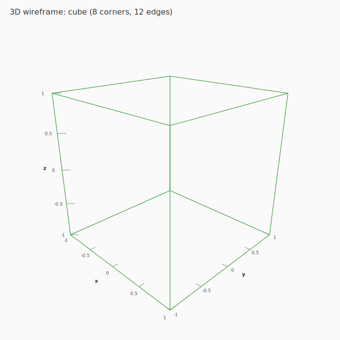

> ⚠️ `wireframe3D` は **辺だけ**を描く (= 枠線のみ)。 格子状の「ワイヤフレーム曲面」 が欲しい場合も
> 面の塗りは無く線メッシュになる。 塗り (連続色・シェーディング) を伴う曲面は `surface3D` (7-1) /
> `trisurf` (7-6) を使う。

