# 01. データ可視化 (R4DS 2e Ch.1 "Data visualization")

> 一次情報: **R for Data Science 2e, Ch.1 "Data visualization"**
> <https://r4ds.hadley.nz/data-visualize>
> データ: **palmerpenguins** の `penguins`(344 個体。 出所は
> [`../_data/_raw/SOURCE.md`](../_data/_raw/SOURCE.md))

R4DS 第 1 章が **本文で表示する図を、 順番どおり・全数(24 枚)** 再現します。
penguins 全量(344 行。 散布図系は欠損 2 行を R4DS と同様に除外)を使い、 R4DS の
geom / aes / 設定(binwidth・position・facet 等)をそのまま写しています。
以下は R4DS の流れに沿って、 **解説 → コード → 図** を順に並べた walkthrough です。
完全な実行コードは [`Visualize.hs`](Visualize.hs)。

```sh
cd docs/tutorials/01-visualize
cabal run tut-01-visualize    # 01-teaser.svg .. 24-facet-island.svg を生成
```

## 忠実性メモ(R4DS をそのまま再現するための約束)

- **配色**は ggplot2 既定の `scales::hue_pal()(n)`(群数 n 依存)。 色分け図
  (05–08, 17, 23, 24)は赤/緑/青の 3 色 hue。 colorblind パレット
  (`scale_color_colorblind()` = ggthemes Okabe-Ito、 先頭が黒)は R4DS が使う
  **teaser / final の 2 枚だけ**に適用(Adelie=黒・Chinstrap=橙・Gentoo=青)。
- **カテゴリ順**は ggplot の factor 既定 = **アルファベット順**(色・x 軸・点の形・
  facet すべて)。 件数降順(`fct_infreq`)は `scaleXDiscreteLimits` で水準順を明示。
- **軸ラベル**は R4DS 既定どおり変数名そのまま。 タイトル / 整形ラベルは R4DS が
  `labs()` を付ける teaser / final のみ。
- histogram は **`binWidth`**(= R4DS `binwidth`)で同じ bin 境界・棒高。

## 欠損値(最初に 1 つだけ)

`flipper_length_mm` と `body_mass_g` には欠損(2 行)があり、 dataframe では
`Maybe Int` として読まれます。 `DF.filterJust` で欠損行を除いて plain な `Int` 列に
します(= R4DS の *"removing 2 rows containing missing values"* と同じ箇所)。

```haskell
let p = raw |> DF.filterJust "flipper_length_mm"
            |> DF.filterJust "body_mass_g"
```

---

## §1.1 完成図(章扉の motivating plot)

R4DS は章の冒頭で「この章を終えると描けるようになる図」を見せます。 体重と
フリッパー長の関係を、 種で色分け・形分けし、 回帰直線(`method="lm"`)と
`labs()` / `scale_color_colorblind()` を添えた完成図です(`09-final.svg` と同一)。

```haskell
saveSVGBoundStats "01-teaser.svg" $
  p |>> layer (scatter "flipper_length_mm" "body_mass_g"
                 <> color "species" <> shapeBy "species" <> size 5 <> alpha 0.85)
      <> layer (statLm "flipper_length_mm" "body_mass_g" <> colorStatic smoothBlue <> stroke 2)
      <> palette okabeIto
      <> title "Body mass and flipper length"
      <> subtitle "Dimensions for Adelie, Chinstrap, and Gentoo Penguins"
      <> xLabel "Flipper length (mm)" <> yLabel "Body mass (g)"
      <> legendTitle "Species"
```

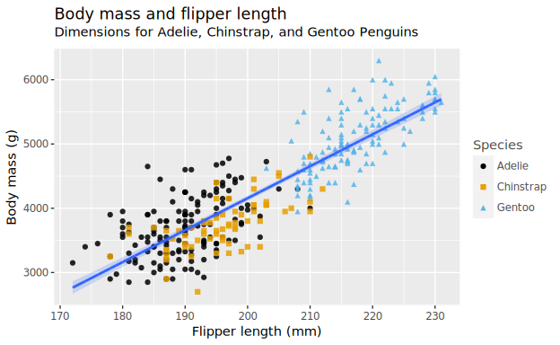

---

## §1.2 散布図を一歩ずつ組み立てる

R4DS は `ggplot()` の空パネルから始め、 aes → geom と層を重ねていきます。

**`ggplot(penguins)`** — まだ aes も geom も無いので、 空のグレーパネルだけ。

```haskell
saveSVGBound "02-empty.svg" $
  p |>> layer (scatter "flipper_length_mm" "body_mass_g" <> alpha 0.0)
      <> xAxis hideTicks <> yAxis hideTicks
      <> xLabel "" <> yLabel ""
```

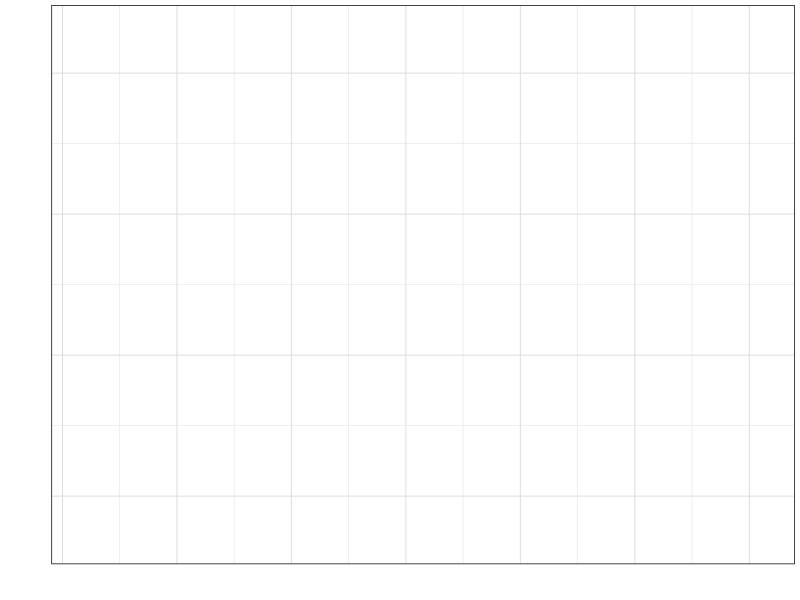

**`+ aes(x = flipper_length_mm, y = body_mass_g)`** — 軸(flipper 170–230 /
body_mass 3000–6000)が現れますが、 geom がまだ無いので点はありません。

```haskell
saveSVGBound "03-empty-axes.svg" $
  p |>> layer (scatter "flipper_length_mm" "body_mass_g" <> alpha 0.0)
      <> xLabel "flipper_length_mm" <> yLabel "body_mass_g"
```

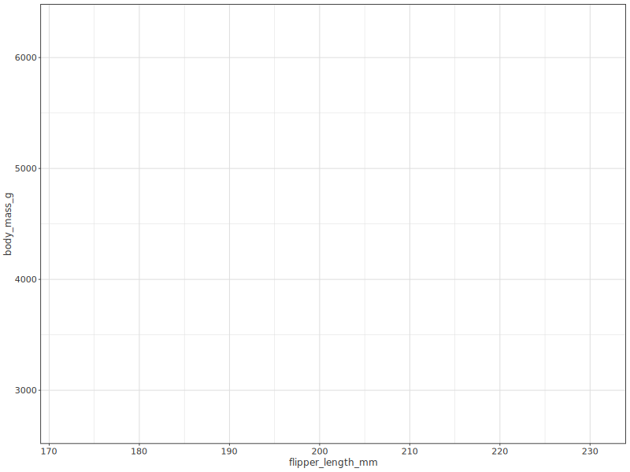

**`+ geom_point()`** — 最初の散布図。 体重とフリッパー長は正の相関。

```haskell
saveSVGBound "04-scatter.svg" $
  p |>> layer (scatter "flipper_length_mm" "body_mass_g" <> size 5 <> alpha 0.85)
      <> xLabel "flipper_length_mm" <> yLabel "body_mass_g"
```


**`aes(color = species)`** — 種ごとに色分け(ggplot 既定 hue の 3 色)。

```haskell
saveSVGBound "05-color.svg" $
  p |>> layer (scatter "flipper_length_mm" "body_mass_g"
                 <> color "species" <> size 5 <> alpha 0.85)
      <> xLabel "flipper_length_mm" <> yLabel "body_mass_g"
      <> legendTitle "species"
```


**`+ geom_smooth(method = "lm")`(global aes)** — `color=species` を `geom_point`
と `geom_smooth` の両方が継承するので、 **種ごとに 3 本**の回帰直線が引かれます。

```haskell
saveSVGBoundStats "06-smooth-species.svg" $
  p |>> layer (scatter "flipper_length_mm" "body_mass_g"
                 <> color "species" <> size 5 <> alpha 0.85)
      <> layer (statLm "flipper_length_mm" "body_mass_g" <> color "species" <> stroke 2)
      <> xLabel "flipper_length_mm" <> yLabel "body_mass_g"
      <> legendTitle "species"
```

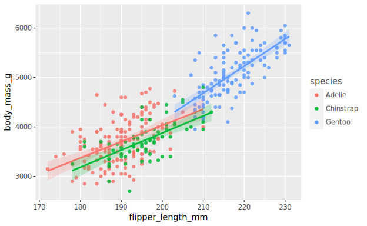

**color を `geom_point` だけに付ける** — 回帰直線は全データで **1 本**(ggplot 既定の青)。

```haskell
saveSVGBoundStats "07-smooth-global.svg" $
  p |>> layer (scatter "flipper_length_mm" "body_mass_g"
                 <> color "species" <> size 5 <> alpha 0.85)
      <> layer (statLm "flipper_length_mm" "body_mass_g" <> colorStatic smoothBlue <> stroke 2)
      <> xLabel "flipper_length_mm" <> yLabel "body_mass_g"
      <> legendTitle "species"
```

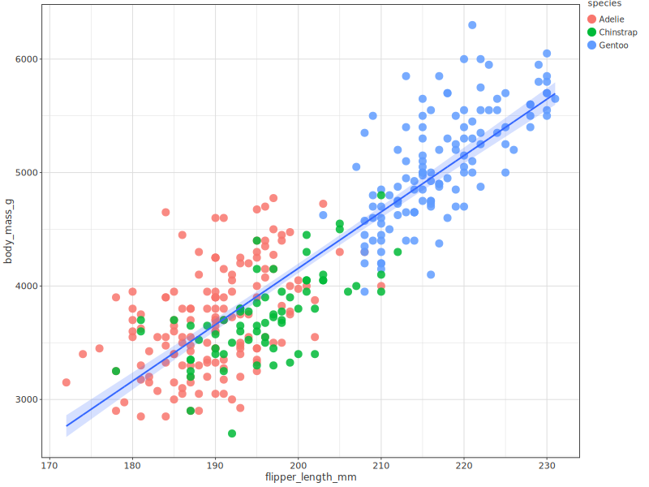

**`aes(color = species, shape = species)`** — 色に加えて点の形でも種を区別。

```haskell
saveSVGBoundStats "08-shape.svg" $
  p |>> layer (scatter "flipper_length_mm" "body_mass_g"
                 <> color "species" <> shapeBy "species" <> size 5 <> alpha 0.85)
      <> layer (statLm "flipper_length_mm" "body_mass_g" <> colorStatic smoothBlue <> stroke 2)
      <> xLabel "flipper_length_mm" <> yLabel "body_mass_g"
      <> legendTitle "species"
```

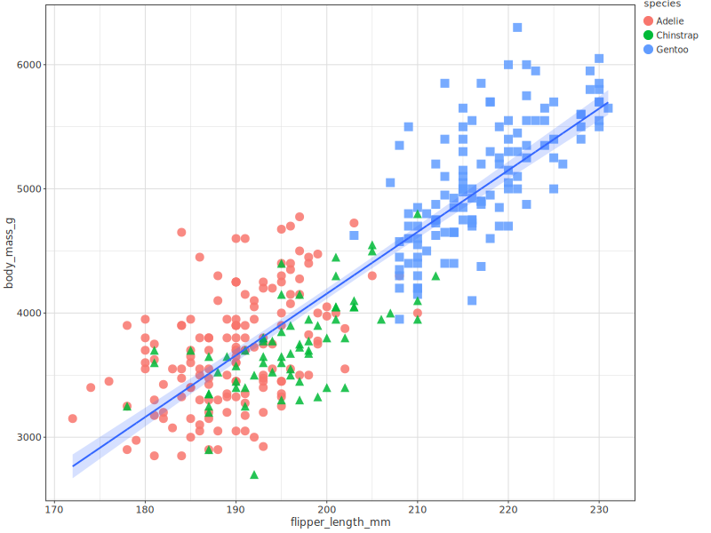

**`+ labs(...) + scale_color_colorblind()`** — ラベルを整え、 colorblind-safe
パレット(Okabe-Ito)で仕上げた完成図(= teaser)。

```haskell
saveSVGBoundStats "09-final.svg" $
  p |>> layer (scatter "flipper_length_mm" "body_mass_g"
                 <> color "species" <> shapeBy "species" <> size 5 <> alpha 0.85)
      <> layer (statLm "flipper_length_mm" "body_mass_g" <> colorStatic smoothBlue <> stroke 2)
      <> palette okabeIto
      <> title "Body mass and flipper length"
      <> subtitle "Dimensions for Adelie, Chinstrap, and Gentoo Penguins"
      <> xLabel "Flipper length (mm)" <> yLabel "Body mass (g)"
      <> legendTitle "Species"
```


---

## §1.4 1 変数の分布

**`geom_bar(aes(x = species))`** — カテゴリ変数の件数。 内部で `stat_count` が
行う集計を、 ここでは `DF.aggregate` で先に求めます(値は不変)。 x はアルファベット順。

```haskell
let bySpecies = raw |> DF.groupBy ["species"]
                    |> DF.aggregate [ F.count (F.col @Text "species") `F.as` "n" ]

saveSVGBound "10-bar-species.svg" $
  bySpecies |>> layer (bar "species" "n")
              <> xLabel "species" <> yLabel "count"
```

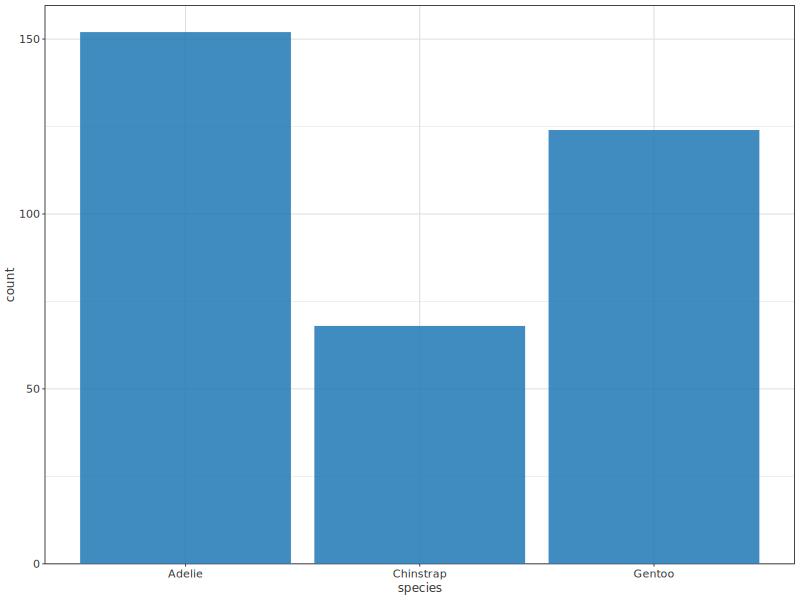

**`aes(x = fct_infreq(species))`** — 件数降順(Adelie 152 > Gentoo 124 >
Chinstrap 68)。 `scaleXDiscreteLimits` で水準順を明示します。

```haskell
saveSVGBound "11-bar-infreq.svg" $
  bySpecies |>> layer (bar "species" "n")
              <> scaleXDiscreteLimits ["Adelie", "Gentoo", "Chinstrap"]
              <> xLabel "fct_infreq(species)" <> yLabel "count"
```

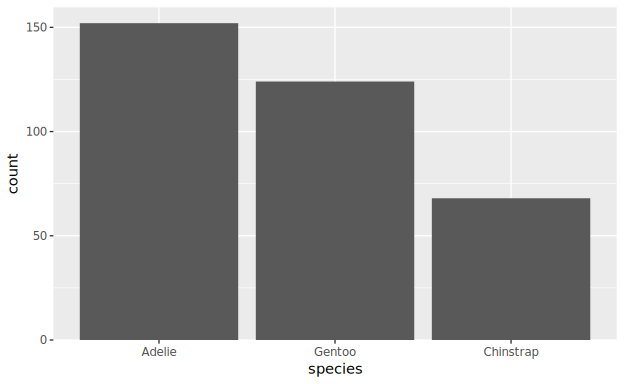

**`geom_histogram(binwidth = 200)`** — 連続変数(体重)の分布。

```haskell
let pm = raw |> DF.filterJust "body_mass_g"

saveSVGBound "12-histogram-bw200.svg" $
  pm |>> layer (histogram "body_mass_g" <> binWidth 200)
       <> xLabel "body_mass_g" <> yLabel "count"
```

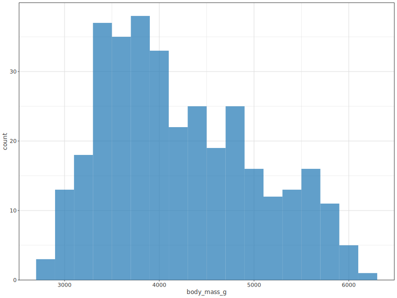

**`binwidth = 20`** — 細かすぎてギザギザ(過剰に解像)。

```haskell
saveSVGBound "13-histogram-bw20.svg" $
  pm |>> layer (histogram "body_mass_g" <> binWidth 20)
       <> xLabel "body_mass_g" <> yLabel "count"
```

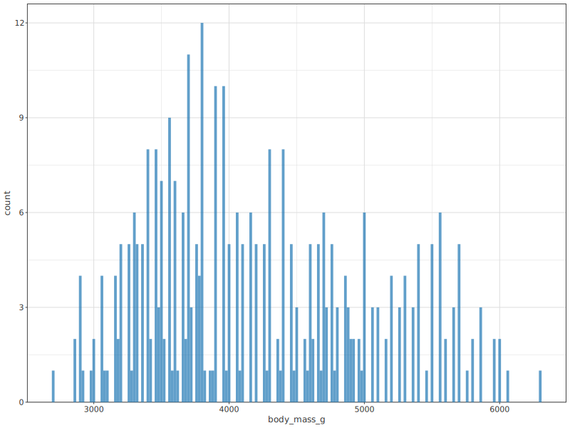

**`binwidth = 2000`** — 粗すぎて 3 bin(情報が潰れる)。

```haskell
saveSVGBound "14-histogram-bw2000.svg" $
  pm |>> layer (histogram "body_mass_g" <> binWidth 2000)
       <> xLabel "body_mass_g" <> yLabel "count"
```

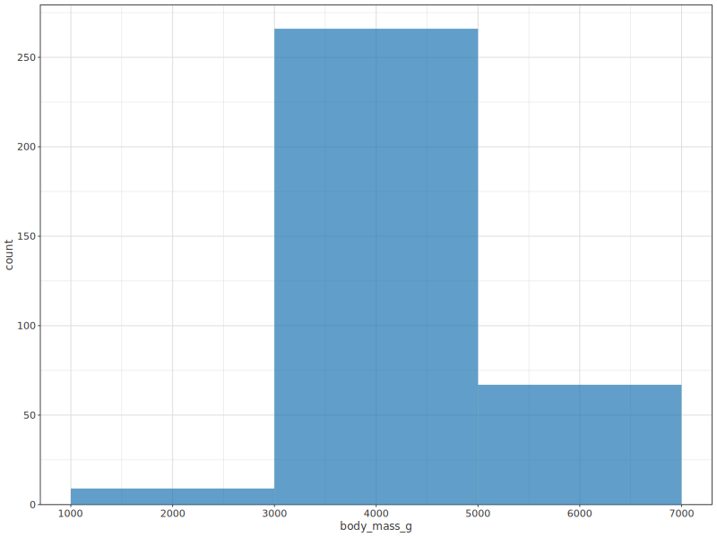

**`geom_density()`** — 分布を滑らかな曲線で。

```haskell
saveSVGBound "15-density.svg" $
  pm |>> layer (density "body_mass_g")
       <> xLabel "body_mass_g" <> yLabel "density"
```

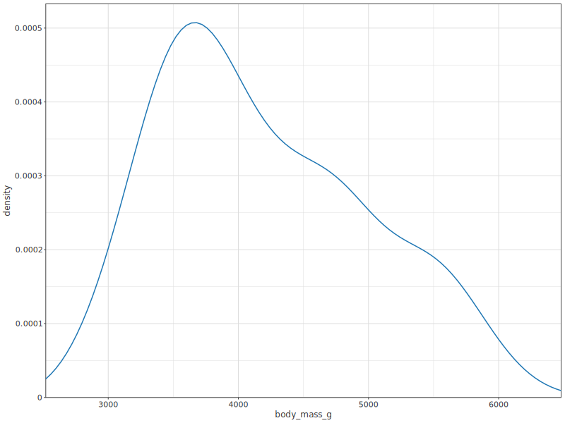

---

## §1.5 2 変数(以上)の関係

**`geom_boxplot(aes(x = species, y = body_mass_g))`** — カテゴリ × 連続。

```haskell
saveSVGBound "16-boxplot.svg" $
  pm |>> layer (boxplotBy "species" "body_mass_g")
       <> xLabel "species" <> yLabel "body_mass_g"
```

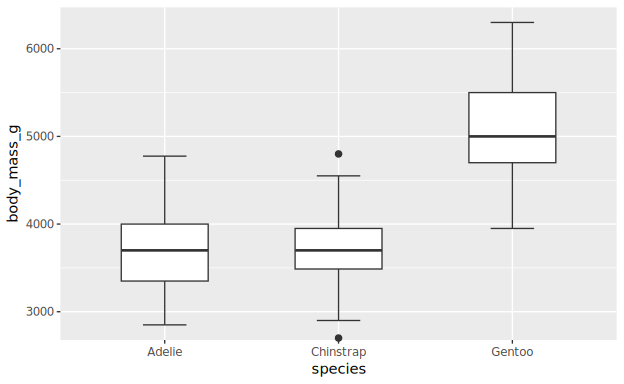

**`geom_density(aes(color = species))`** — 種ごとに 3 本の密度曲線。

```haskell
saveSVGBound "17-density-color.svg" $
  pm |>> layer (density "body_mass_g" <> color "species" <> stroke 1.5)
       <> xLabel "body_mass_g" <> yLabel "density"
       <> legendTitle "species"
```

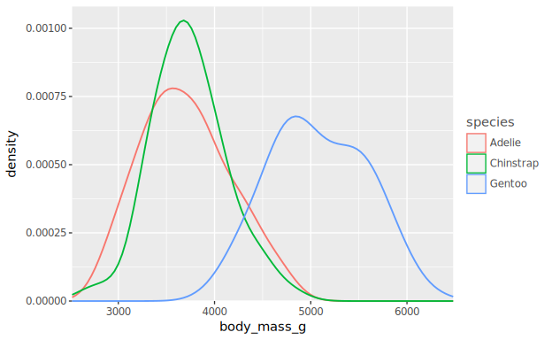

**`aes(color, fill = species), alpha = 0.5`** — 塗りつぶし付き密度曲線。

```haskell
saveSVGBound "18-density-fill.svg" $
  pm |>> layer (density "body_mass_g" <> color "species"
                 <> densityFill True <> alpha 0.5 <> stroke 1.5)
       <> xLabel "body_mass_g" <> yLabel "density"
       <> legendTitle "species"
```

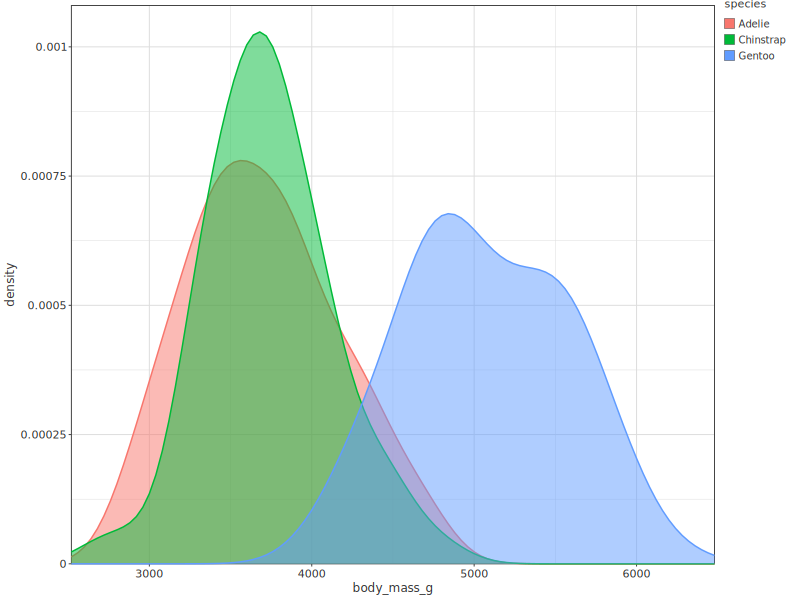

**`geom_bar(aes(x = island, fill = species))`** — 2 カテゴリ。 既定(stack)で
積み上げ。 第 1 水準(Adelie)を一番上に積みます。

```haskell
let byIslandSpecies = raw |> DF.groupBy ["island", "species"]
                          |> DF.aggregate [ F.count (F.col @Text "species") `F.as` "n" ]

saveSVGBound "19-bar-stack.svg" $
  byIslandSpecies |>> layer (bar "island" "n" <> color "species" <> position PosStack)
                    <> xLabel "island" <> yLabel "count"
                    <> legendTitle "species"
```

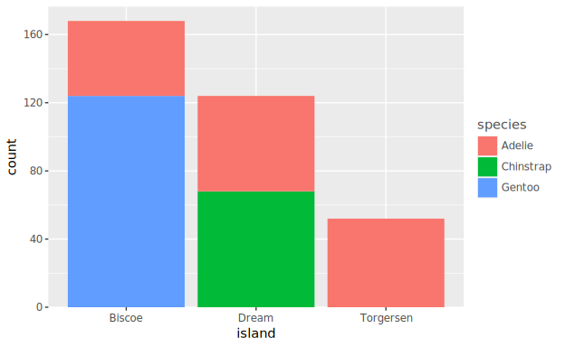

**`position = "fill"`** — 各島の合計を 1 に揃える(構成比)。 y 軸ラベルは既定のまま。

```haskell
saveSVGBound "20-bar-fill.svg" $
  byIslandSpecies |>> layer (bar "island" "n" <> color "species" <> position PosFill)
                    <> xLabel "island" <> yLabel "count"
                    <> legendTitle "species"
```

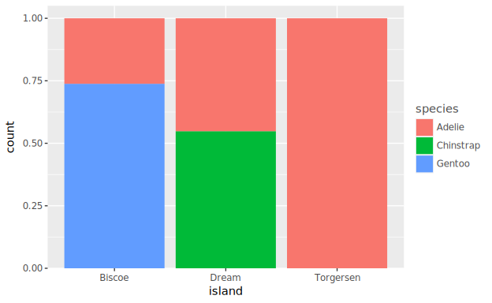

**`+ labs(y = "proportion")`** — y 軸ラベルを「proportion」に直す。

```haskell
saveSVGBound "21-bar-fill-proportion.svg" $
  byIslandSpecies |>> layer (bar "island" "n" <> color "species" <> position PosFill)
                    <> xLabel "island" <> yLabel "proportion"
                    <> legendTitle "species"
```

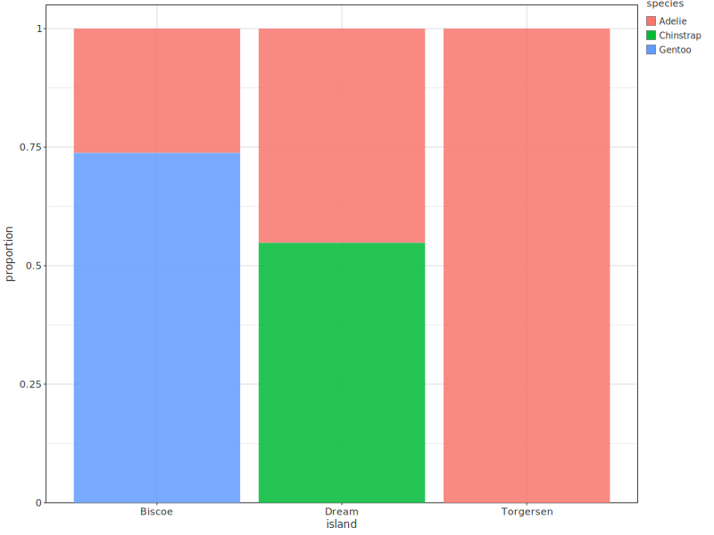

**素の散布図(§1.5.3 冒頭)** — 3 変数を加える前の出発点。

```haskell
saveSVGBound "22-scatter-plain.svg" $
  p |>> layer (scatter "flipper_length_mm" "body_mass_g" <> size 5 <> alpha 0.85)
      <> xLabel "flipper_length_mm" <> yLabel "body_mass_g"
```

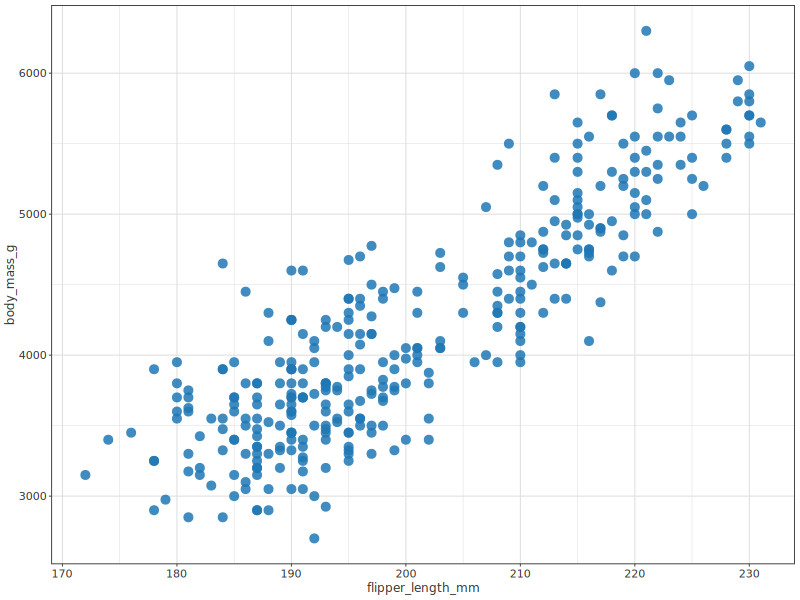

**`aes(color = species, shape = island)`** — 3 変数(色=種・形=島)。

```haskell
saveSVGBound "23-scatter-shape-island.svg" $
  p |>> layer (scatter "flipper_length_mm" "body_mass_g"
                 <> color "species" <> shapeBy "island" <> size 5 <> alpha 0.85)
      <> xLabel "flipper_length_mm" <> yLabel "body_mass_g"
      <> legendTitle "species"
```

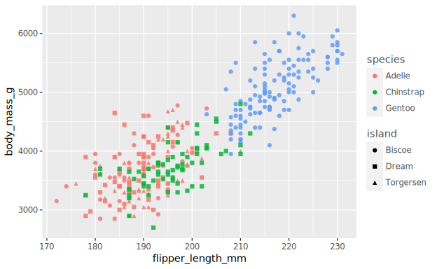

**`+ facet_wrap(~island)`** — 島ごとに小パネルへ分割(パネルもアルファベット順)。

```haskell
saveSVGBound "24-facet-island.svg" $
  p |>> layer (scatter "flipper_length_mm" "body_mass_g"
                 <> color "species" <> shapeBy "species" <> size 4 <> alpha 0.85)
      <> facetWrap "island" 3
      <> xLabel "flipper_length_mm" <> yLabel "body_mass_g"
      <> legendTitle "species"
```


---

## できないこと(改善点・近似や置換はしていません)

- **✗ 複数凡例(shape 凡例)**: 図 23 は R4DS では色凡例(species)と形凡例(island)の
  2 つが出ます。 本ライブラリの凡例は現状 **色エンコーディングのみ**対応のため、
  点の形(island)は描けていても **shape 凡例が出ません**。 複数凡例の描画は全章横断の
  機能のため別 Phase で実装予定。 図 23 自体はデータ・色・形とも R4DS と同じです。
