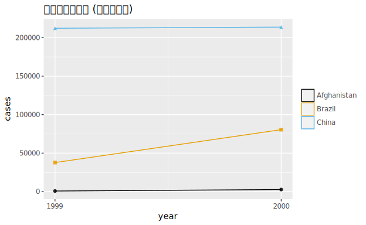
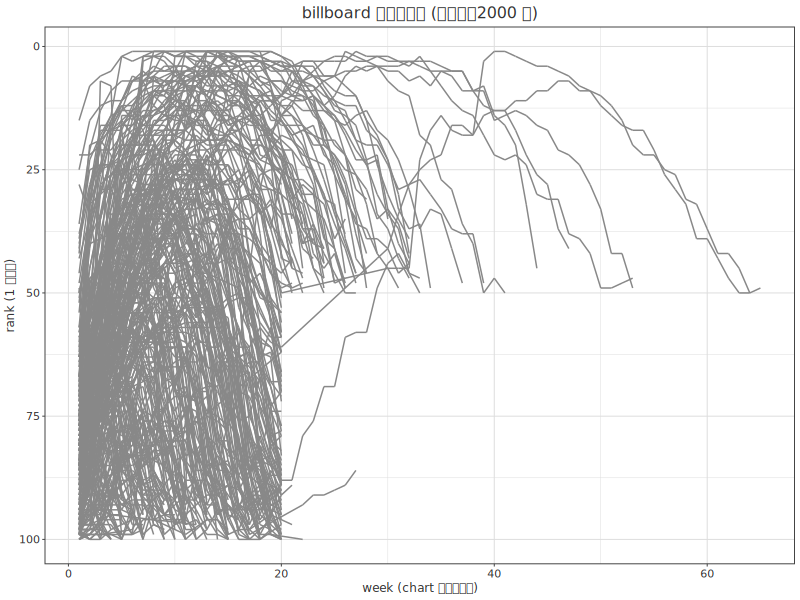

# 05. データの整然化 — tidy data と pivot

> 🌐 [English](README.ja.md) | **日本語**

> 一次情報: **R for Data Science 2e, Ch.5 "Data tidying"**
> <https://r4ds.hadley.nz/data-tidy>
>
> データ: **tidyr** の `table1`/`table2`/`table3`(結核の罹患者数)・`billboard`(2000 年の
> ヒットチャート)・`who2`(WHO 結核診断)・`household`(家族と子の生年)・
> `cms_patient_experience`(米 CMS 患者調査)。
> who2 / household / cms_patient_experience は tidyr パッケージの `.rda`(R serialization 形式)を
> **バイト列からそのまま CSV 化**(捏造・間引きなし。R 非依存の自前パーサで展開)。
> 出所一覧は [`../_data/_raw/SOURCE.md`](../_data/_raw/SOURCE.md)。

実行するコードは [`DataTidying.hs`](DataTidying.hs) です。

```sh
cd docs/tutorials/05-data-tidying
cabal run tut-05-data-tidying     # 各操作の結果を印字し、 tb-cases.svg / billboard-ranks.svg を生成
```

`dataframe` 1.3 には `pivot_longer` / `pivot_wider` がありません。**pivot が裏でやっていること**を、
列の型差を吸収する `Cell` 中間表現の上に汎用 helper として自前定義します
(`pivotLongerG` / `pivotLongerValueG` / `pivotWiderG`。特定の表にハードコードせず、列数・行数は
データから取ります)。

---

## 整然データ(tidy data)の 3 規則

1. **各列が 1 つの変数**(each variable is a column)
2. **各行が 1 つの観測**(each observation is a row)
3. **各セルが 1 つの値**(each cell is a single value)

同じ結核データを 3 通りに持てます。`table1` は整然(国×年が 1 行・`cases`/`population` が列)。

```
  country   | year | cases  | population
Afghanistan | 1999 | 745    | 19987071
Afghanistan | 2000 | 2666   | 20595360
Brazil      | 1999 | 37737  | 172006362
...
```

`table2` は `cases` と `population` が `type`/`count` の **縦持ち**に分かれていて非整然:

```
  country   | year |    type    |   count
Afghanistan | 1999 | cases      | 745
Afghanistan | 1999 | population | 19987071
...
```

`table3` は `rate` セルに **2 値が詰まっている**(`745/19987071`)ので非整然です。

> R4DS の挿絵 `tidy-1.png` / `variables.png` 等は R コードの出力ではなく **手描きの解説図**
> のため、本チュートリアルでは再現対象外です(コード出力の図だけを忠実に再現します)。

## 整然だと計算しやすい

`table1` は整然なので、そのまま `mutate` / `group_by` で計算できます。

| R | hgg / dataframe |
|---|---|
| `mutate(rate = cases / population * 10000)` | `DF.derive "rate" (F.toDouble (F.col @Int "cases") / F.toDouble (F.col @Int "population") * 10000)` |
| `group_by(year) \|> summarize(total = sum(cases))` | `DF.groupBy ["year"] \|> DF.aggregate [F.sum (F.col @Int "cases") \`F.as\` "total_cases"]` |

年ごとの合計は **1999 年 250,740 件 / 2000 年 296,920 件**(R4DS と一致)。

### 図1 — 結核罹患者数の年次推移(`tb-cases.svg`)

整然な `table1` をそのまま折れ線+点で描きます。国ごとに色分けした線と、色+形で区別した点を
重ね、`scale_x_continuous(breaks=c(1999,2000))` 相当の `xAxis (axisBreaksAt [1999,2000])` で
目盛を 1999/2000 のみにします。

```haskell
table1 |>> theme ThemeGrey <> layer (line "year" "cases" <> colorBy "country")
       <> layer (scatter "year" "cases" <> colorBy "country" <> shapeBy "country")
       <> palette okabeIto
       <> xAxis (axisBreaksAt [1999, 2000])
```



中国が突出して多く(両年とも 20 万超)、ブラジルは約 4 万→8 万に増加、アフガニスタンは
このスケールではほぼ 0、と R4DS の観察がそのまま見えます。

| R | hgg |
|---|---|
| `geom_line(aes(group = country))` | `layer (line "year" "cases" <> colorBy "country")` |
| `geom_point(aes(color = country, shape = country))` | `layer (scatter "year" "cases" <> colorBy "country" <> shapeBy "country")` |
| `scale_x_continuous(breaks = c(1999, 2000))` | `xAxis (axisBreaksAt [1999, 2000])` |

---

## `pivot_longer` — 横持ちを縦に

実データの多くは非整然です。**列名が変数の値になっている**ときは `pivot_longer` で縦に畳みます。

### 列名にデータがある — `billboard`

`billboard` は 1 曲 1 行で、第 1〜76 週の順位が `wk1`〜`wk76` の **76 列**に横に並ぶ
非整然データ(317 曲)。これを「1 曲×1 週 = 1 行」に縦に畳みます。

```haskell
let wkCols  = filter ("wk" `T.isPrefixOf`) (DF.columnNames billboardRaw)
    parseWk = read . T.unpack . T.drop 2          -- "wk12" -> 12 (parse_number 相当)
    bbLong  = pivotLongerG (\c -> [("week", CI (parseWk c))]) "rank" True
                           ["artist","track"] wkCols billboardRaw
```

結果は **(317, 80) → (5,307, 4)**(R4DS と一致)。`values_drop_na = TRUE` 相当で `NA`
(チャート外の週)は落とします。`dataframe` は空セルを validity bitmap で持つため、helper は
列を **`@(Maybe Int)` で先に読んで** NA を `Nothing` として正しく拾います
(`@Int` 直読みだと validity を無視して 0 を返してしまう。後述の罠)。

| R | hgg |
|---|---|
| `pivot_longer(starts_with("wk"), names_to="week", values_to="rank", values_drop_na=TRUE)` | `pivotLongerG (\c -> [("week", CI (parseWk c))]) "rank" True ["artist","track"] wkCols` |
| `mutate(week = parse_number(week))` | helper の `parseWk`(`"wk12" → 12`) |

### 図2 — 順位推移(`billboard-ranks.svg`)

縦持ちにすると「週ごとの順位」を 1 本の線で描けます。曲ごとに灰色の線を重ね、
`reverseY`(= `scale_y_reverse()`)で 1 位を上にします。

```haskell
bbLong |>> theme ThemeGrey <> layer (line "week" "rank" <> linetypeBy "track" <> color (fromHex "#888888") <> alpha (85/255))
       <> reverseY
```



多くの曲は **20 週以内に top100 から消える**、という R4DS の観察がそのまま見えます。

> 317 曲を色分けすると煩雑なので、群分割には `linetypeBy "track"`(色は灰色固定)を
> 使っています。R の `geom_line(aes(group = track))` 相当です。

### pivoting の仕組み(toy df)

小さな例で「何が起きているか」を確認します。`id` は value 列の数だけ繰り返され、列名は
新しい変数の値に、セル値はそのまま縦に並びます。

```haskell
let toyL = DF.fromNamedColumns [("id", …["A","B","C"]), ("bp1", …[100,140,120]), ("bp2", …[120,115,125])]
pivotLongerG (\c -> [("measurement", CT c)]) "value" False ["id"] ["bp1","bp2"] toyL
-- id  measurement value
-- A   bp1         100
-- A   bp2         120
-- B   bp1         140  …
```

### 列名に複数の変数 — `who2`(`names_sep`)

`who2`(7,240 行 × 58 列)の列名 `sp_m_014` は **3 情報**(診断法 `sp`/性別 `m`/年齢層 `014`)を
`_` で繋いだものです。`names_sep` で 3 つの変数に割ります。

```haskell
let who2Vals = filter (`notElem` ["country","year"]) (DF.columnNames who2)
who2Long = pivotLongerG (\c -> zip ["diagnosis","gender","age"] (map CT (T.splitOn "_" c)))
                        "count" False ["country","year"] who2Vals who2
```

結果は **(7,240, 58) → (405,440, 6)**(R4DS と一致)。ここでは `values_drop_na` を **使わない**ので
(R4DS の例どおり)、未報告の年は `count = NA` のまま残ります(先頭 Afghanistan 1980 は全 NA)。

| R | hgg |
|---|---|
| `names_to = c("diagnosis","gender","age"), names_sep = "_"` | `\c -> zip ["diagnosis","gender","age"] (map CT (T.splitOn "_" c))` |

### 列名に変数名と変数値が混在 — `household`(`.value` sentinel)

`household`(5 家族)の列名 `dob_child1` は **変数名 `dob`** と **変数値 `child1`** が混ざっています。
`names_to = c(".value", "child")` の特殊値 `".value"` を使うと、第 1 片(`dob`/`name`)は
**出力列名**に、第 2 片(`child1`/`child2`)は `child` 列の値になります。

```haskell
pivotLongerValueG "_" "child" True ["family"]
  ["dob_child1","dob_child2","name_child1","name_child2"] household
-- family child  dob        name
-- 1      child1 1998-11-26 Susan
-- 1      child2 2000-01-29 Jose
-- 2      child1 1996-06-22 Mark   ← family 2 は子が 1 人。child2 行は NA なので落とす
-- …                                  (5×2 − 1 = 9 行)
```

`values_drop_na = TRUE` で、子が 1 人の家族の `child2` 行(全 `.value` が NA)を落とし、
**9 行**になります(R4DS と一致)。

| R | hgg |
|---|---|
| `names_to = c(".value", "child"), names_sep = "_", values_drop_na = TRUE` | `pivotLongerValueG "_" "child" True ["family"] …` |

---

## `pivot_wider` — 縦持ちを横に

1 観測が複数行に散っているときは `pivot_wider` で横に広げます。

### 整然形へ戻す — `table2`

`table2`(`country, year, type, count`)の `type`(cases/population)を列に展開すると、
`table1` と同じ整然形になります。

```haskell
pivotWiderG ["country","year"] "type" "count" table2
-- → country year cases population  (= table1)
```

### `id_cols` を指定 — `cms_patient_experience`

`cms_patient_experience`(500 行)は 1 組織が 6 行(調査項目ごと)に散っています。
`distinct(measure_cd, measure_title)` で項目は 6 種(`CAHPS_GRP_1`/`_2`/`_3`/`_5`/`_8`/`_12`)。
`id_cols = starts_with("org")` で組織を一意に決め、`measure_cd` を列に、`prf_rate` を値にします。

```haskell
pivotWiderG ["org_pac_id","org_nm"] "measure_cd" "prf_rate" cms
```

結果は **(500, 5) → (95, 8)**(R4DS と一致。組織 95・id 2 列 + 項目 6 列)。
`org_pac_id` は **先頭ゼロ付き ID**(`0446157747`)なので、CSV 読込時にスキーマで `Text` を
明示して桁落ちを防いでいます(`readCsvWithSchema` + `schemaType @Text`)。

| R | hgg |
|---|---|
| `pivot_wider(id_cols=starts_with("org"), names_from=measure_cd, values_from=prf_rate)` | `pivotWiderG ["org_pac_id","org_nm"] "measure_cd" "prf_rate" cms` |

### `pivot_wider` の仕組みと重複セル(toy df)

入力に無い `(id, name)` の組は `NA` になります(`B` の `bp3` は欠損)。

```haskell
pivotWiderG ["id"] "measurement" "value" toyW
-- id  bp1 bp2 bp3
-- A   100 120 105
-- B   140 115 NA
```

`(id, measurement)` の組に **複数行**があると、R の `pivot_wider` は list-column 警告を出します。
本実装は **型付き列**なので list-column を作れません。R4DS が推奨するとおり
`group_by(id, measurement) |> summarize(n = n()) |> filter(n > 1)` で重複箇所を検出して示します
(`A`/`bp1` が `n=2`)。

---

## この章で出てきた対応表(まとめ)

| tidyr / dplyr | dataframe / hgg |
|---|---|
| 整然データの 3 規則 | (設計指針。列=変数・行=観測・セル=値) |
| `pivot_longer(names_to=…, values_to=…)` | 自前 `pivotLongerG`(wide → long) |
| `pivot_longer(names_sep="_")` | `pivotLongerG` の `nameExpand` で `T.splitOn "_"` |
| `pivot_longer(names_to=c(".value", …))` | 自前 `pivotLongerValueG`(.value sentinel) |
| `pivot_wider(names_from=…, values_from=…, id_cols=…)` | 自前 `pivotWiderG` |
| `values_drop_na = TRUE` | helper の `dropNA` 引数 |
| `parse_number("wk12")` | `read . T.unpack . T.drop 2` |
| `scale_y_reverse()` | `reverseY` |
| `scale_x_continuous(breaks=…)` | `xAxis (axisBreaksAt […])` |
| `geom_line(aes(group = g))` | `line … <> colorBy "g"`(色分け)/ `<> linetypeBy "g"`(灰色) |

## 忠実再現にあたっての相違(正直な記録)

- **NA の表示**: `dataframe` は欠損列を `Maybe a` として印字するため、R が `NA` と出す箇所を
  `Nothing`、`63` を `Just 63.0` と出します(**値は同一**。型付き nullable 列の表示流儀の差)。
- **空セルの読み取り(罠)**: `dataframe` は空セルを validity bitmap で持ち、`@Int` 直読みは
  validity を無視して `0` を返します。NA を正しく落とす/残すには `@(Maybe Int)` を**先に**読む
  必要があります(`readCells`)。billboard が `5,307` でなく `20,605` 行になる回帰でこれに気づきました。
- **先頭ゼロ ID**: `org_pac_id` は数値に見えて文字列(`0446157747`)。型推論に任せると桁落ちするため、
  `readCsvWithSchema` で `Text` を明示しています。
- **list-column**: 重複セルの `pivot_wider` は R では list-column になりますが、型付き列の本実装では
  作れないため、R4DS 推奨の重複検出(`group_by/summarize/filter`)で代替しています。

---

前章 → [`04-workflow-style`](../04-workflow-style/README.ja.md)(Ch4 Workflow: code style)。
次章 → R4DS Ch6 "Workflow: scripts and projects"(図なし・コード tutorial として後続予定)。
