# 09. 層 (R4DS 2e Ch.9 "Layers")

> 一次情報: **R for Data Science 2e, Ch.9 "Layers"**
> <https://r4ds.hadley.nz/layers>
> データ: **mpg**(234 台。 `../_data/mpg.csv`)と **diamonds**(53,940 個。
> `../_data/_raw/diamonds.csv`)。 いずれも ggplot2 同梱。

R4DS 第 9 章 "Layers" が **本文で表示する図を、 順番どおり・全数(32 枚)** 再現します。
本章は Visualize パートの中核で、 layered grammar of graphics を深掘りします
(aesthetic mappings / geometric objects / facets / statistical transformations /
position adjustments / coordinate systems)。 以下は R4DS の流れに沿って
**解説 → コード → 図** を並べた walkthrough です。 完全な実行コードは
[`Layers.hs`](Layers.hs)。

```sh
cd docs/tutorials/09-layers
cabal run tut-09-layers    # 01-aes-color.svg .. 32-coord-polar.svg を生成
```

## 忠実性メモ(R4DS との差異を実測して honest 記録)

hgg は ggplot2 のクローンではないので、 いくつかの図は R と完全一致しません。
**近似・省略・置換でごまかさず**、 差異を実測して以下に明記します(各図の注にも再掲)。

- **geom_smooth**: R 既定は loess(n<1000)。 hgg の `statSmooth` は **B-spline**
  平滑(knot 数 6)。 曲線形状はおおむね一致しますが loess とビット一致はしません。
- **stat の群分割は color aesthetic のみ**で駆動します(`Bridge.Stat.groupColumn` が
  `ColorByCol` だけを判定)。 R の「`linetype=drv` で 3 本」「`group=drv` で灰色 3 本」は
  未対応のため、 群分割した平滑は **color 版で代表**させます(§9.3)。
- **shape**: R の 26 種 pch 参照図(`fig-shapes`)は R 内部仕様。 hgg の `MarkShape`
  は **8 種**(circle/square/triangle/diamond/cross/spade/heart/club)なので、 使える 8 種の
  一覧図に置換します(§9.2)。
- **alpha を変数にマップする aesthetic は未対応**(R も discrete への alpha は非推奨)。
  §9.2 の size/alpha 対の図は size 版だけを示します。
- **bar の color(枠)と fill(面)は分離しません**(`color` = 面色)。 §9.6 の
  「color vs fill」 は 1 図に集約します。
- **地図**(`map_data("nz")` + `geom_polygon` + `coord_quickmap`)は未実装です。 R4DS 自身
  「本書では地図を扱わない」 と断る節なので、 概念のみ対応表で触れます(§9.7)。
- **カテゴリ順**は ggplot factor 既定 = アルファベット順。 ordered factor(cut / clarity)は
  `scaleXDiscreteLimits` / `colorCats` で水準順を明示します。

---

## 9.2 Aesthetic mappings

`mpg` は車 234 台の燃費データです。 `displ`(排気量)と `hwy`(高速燃費)の関係を、
カテゴリ変数 `class`(車種)で色分けして見ます。 変数を `aes()` 内のエステティック
(`color` / `shape` / `size` / `alpha`)にマップすると、 ggplot2 が尺度と凡例を作ります。

```haskell
mpg |>> layer (scatter "displ" "hwy" <> color "class" <> size 4 <> alpha 0.9)
      <> xLabel "displ" <> yLabel "hwy" <> legendTitle "class"
```

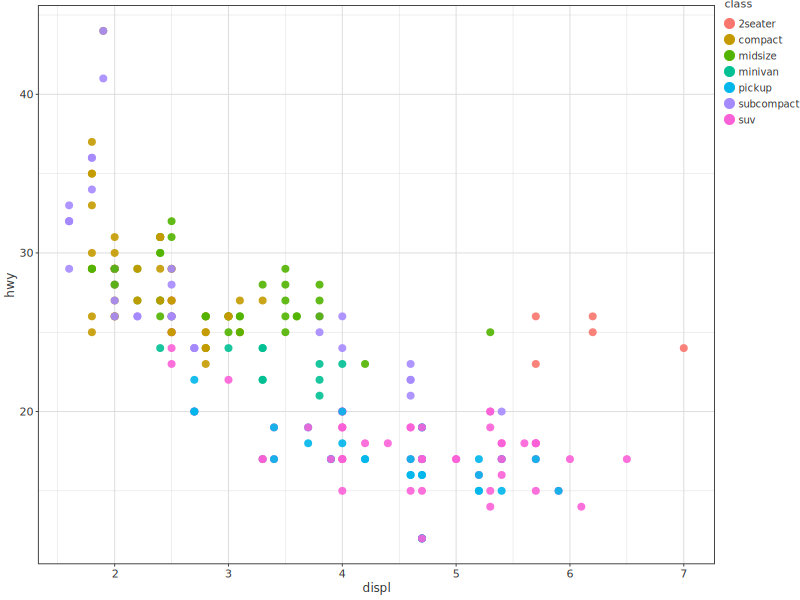

`color` を `shape`(形状)に替えると、 各 class が別々のプロット文字になります。 R では
shape は最大 6 種までで 7 番目(suv)は描かれず警告が出ますが、 **hgg の `MarkShape`
は 8 種なので 7 class すべてに形状が付きます**(R より多く描ける。 honest 記録)。

```haskell
mpg |>> layer (scatter "displ" "hwy" <> shapeBy "class" <> size 4 <> alpha 0.9)
```

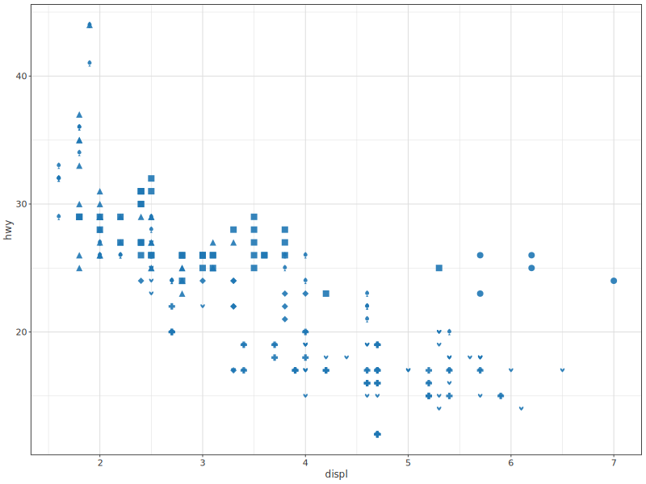

同様に `size`(点の大きさ)にもマップできます。 順序のないカテゴリを順序エステティックに
マップするのは、 実在しない順位を示唆するので一般に良くありません(R は警告)。

```haskell
mpg |>> layer (scatter "displ" "hwy" <> sizeBy "class" <> alpha 0.6)
```

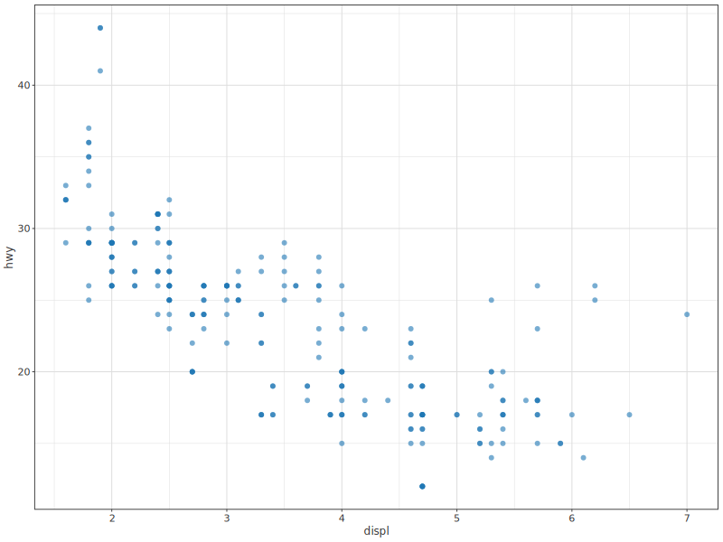

> **honest 記録**: R はこの後 `aes(alpha = class)`(透明度にマップ)も示しますが、
> **alpha を変数にマップする aesthetic は hgg 未対応**です(R も discrete への
> alpha は非推奨)。 順序エステティックにカテゴリをマップする例は上の size 版が担います。

エステティックは **`aes()` の外**(geom 関数の引数)で**値を固定**することもできます。
このとき色は変数の情報を持たず、 見た目だけを変えます。

```haskell
mpg |>> layer (scatter "displ" "hwy" <> colorStatic "blue" <> size 4 <> alpha 0.9)
```

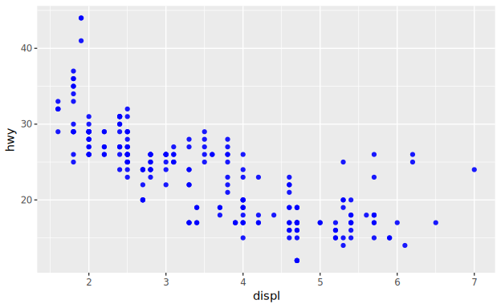

> **honest 記録 (fig-shapes)**: R はここで 26 種の番号付き shape(pch 0–25)の参照図を
> 示します。 これは R 内部の pch 体系の解説で、 hgg の `MarkShape` は 8 種です。
> 使える 8 種を一覧にしました(形状は `shapeMapEntry` で名前に固定)。

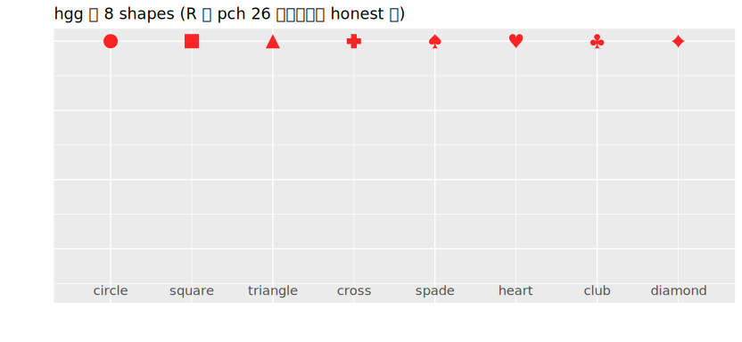

---

## 9.3 Geometric objects

同じ x・y・データでも、 **geom(幾何オブジェクト)**を変えると見え方が変わります。
点(`geom_point`)と平滑曲線(`geom_smooth`)を比べます。

```haskell
-- 点
mpg |>> layer (scatter "displ" "hwy" <> size 4 <> alpha 0.9)
-- 平滑 (信頼帯つき)
mpg |>> layer (statSmoothCI "displ" "hwy" 6 <> colorStatic "#3366FF" <> stroke 2)
```

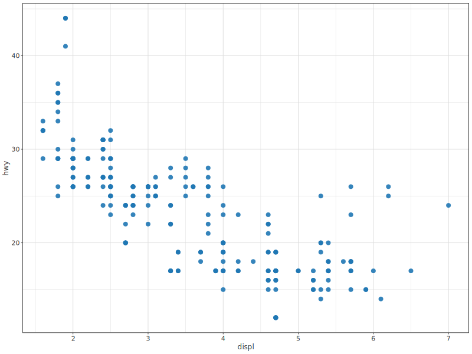
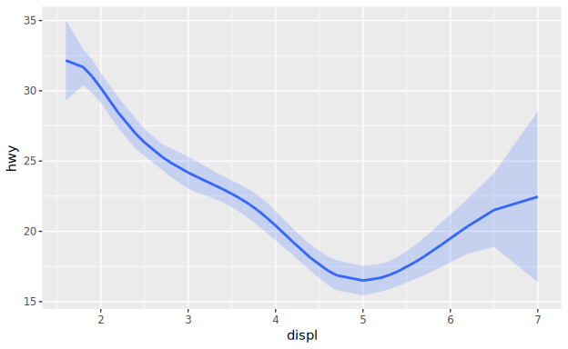

> **honest 記録**: R の `geom_smooth` 既定は loess。 hgg の `statSmooth` は
> **B-spline**(knot 6)なので、 端での曲がり方が loess と少し異なります。

平滑曲線は群ごとに分けられます。 R は `linetype=drv` で線種を変え 3 本に分けますが、
**hgg の stat 群分割は color aesthetic で駆動**するので、 `color "drv"` で 3 本に
分けます(色で区別。 honest 記録)。

```haskell
mpg |>> layer (statSmoothCI "displ" "hwy" 6 <> color "drv" <> stroke 2)
```

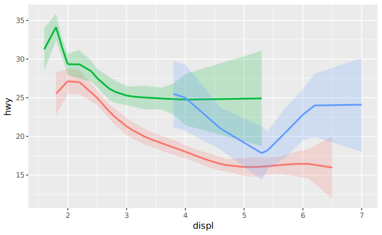

geom を**重ねる**と、 1 つのグラフに複数の層を置けます。 層ごとに局所マッピングを
持てるのが grammar of graphics の要です。 点と平滑を両方 `drv` で色分けします
(R は点=color・平滑=linetype。 ここは両方 color)。

```haskell
mpg |>> layer (scatter "displ" "hwy" <> color "drv" <> size 4 <> alpha 0.9)
      <> layer (statSmoothCI "displ" "hwy" 6 <> color "drv" <> stroke 2)
```

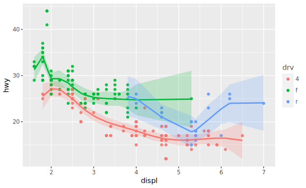

局所マッピングの典型例: 点だけを `class` で色分けし、 平滑は**全体で 1 本**にします。
`geom_point` のマッピングはその層だけに効き、 `geom_smooth` には伝わりません。

```haskell
mpg |>> layer (scatter "displ" "hwy" <> color "class" <> size 4 <> alpha 0.9)
      <> layer (statSmoothCI "displ" "hwy" 6 <> colorStatic "#3366FF" <> stroke 2)
```

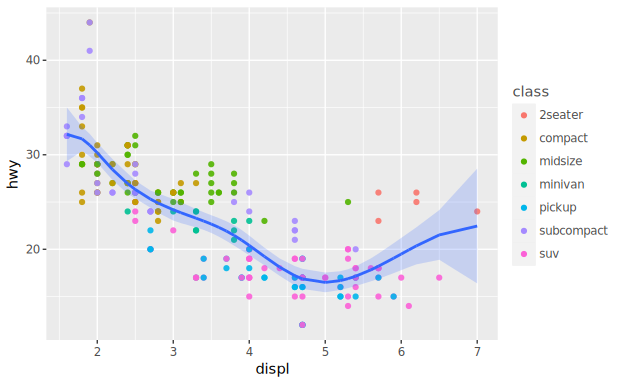

層ごとに**別データ**も使えます。 全点を描いた上に、 2 人乗り(`class == "2seater"`)だけを
赤点と赤い中抜き円で強調します(局所 `data` 引数の相当)。

```haskell
let twoSeater = mpg |> DF.filterBy (== "2seater") (F.col @Text "class")
mpg |>> layer (scatter "displ" "hwy" <> size 4 <> alpha 0.9)
      <> layer (scatter (inline displ2) (inline hwy2) <> colorStatic "red" <> size 4)
      <> layer (scatter (inline displ2) (inline hwy2)
                 <> shapeBy (inlineCat circles) <> colorStatic "red" <> size 7)
```

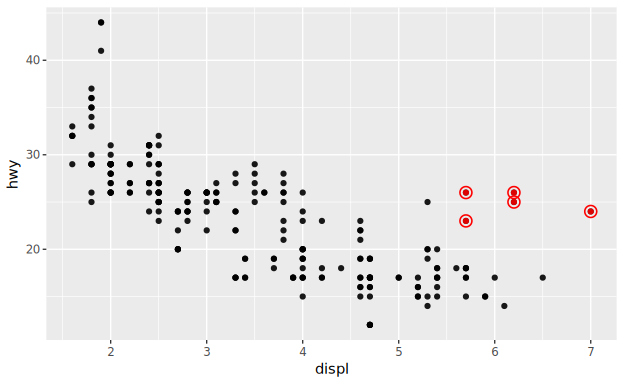

geom を変えると分布の別の側面が見えます。 `hwy` の分布を histogram / density / boxplot で。

```haskell
mpg |>> layer (histogram "hwy" <> binWidth 2)   -- 二峰性・右裾
mpg |>> layer (density "hwy")
mpg |>> layer (boxplot "hwy")                    -- 外れ値 2 つ
```

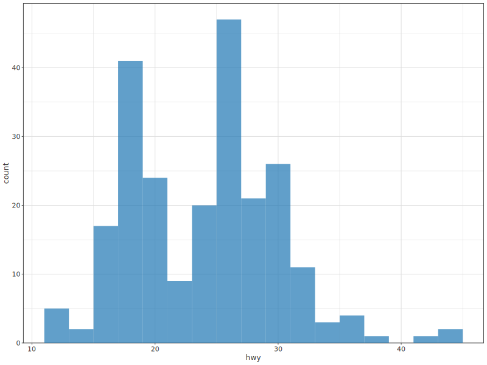
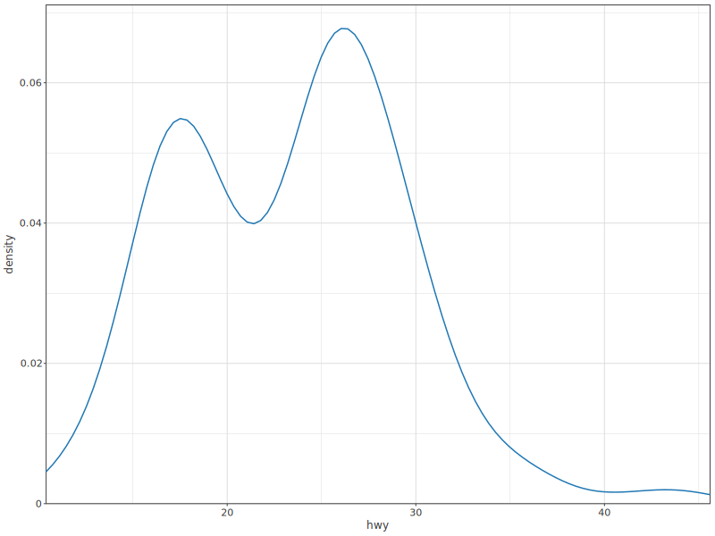
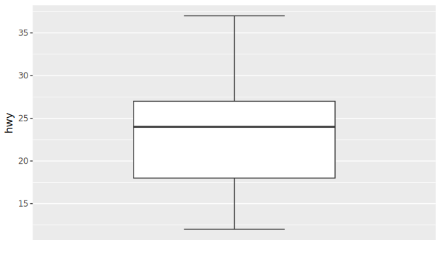

拡張パッケージの geom も使えます。 R は **ggridges** の `geom_density_ridges` で、
カテゴリ別の density を縦に積みます。 hgg は `ridge` で同等です
(同じ `drv` を `y` / `fill` / `color` にマップし、 `alpha 0.5` で半透明に)。

```haskell
mpg |>> layer (ridge "hwy" "drv" <> color "drv" <> alpha 0.5) <> legendOff
```

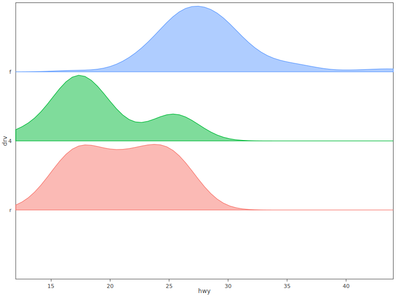

---

## 9.4 Facets

**facet** はカテゴリ変数でプロットを小さなサブプロットに分割します。 `facet_wrap(~cyl)` は
1 変数で折り返します(R は `cyl` を離散ラベル "4".."8" で表示。 ここも `cyl` を Text 化)。

```haskell
mpg |>> layer (scatter "displ" "hwy" <> size 3 <> alpha 0.9)
      <> facetWrap "cyl_f" 2
```

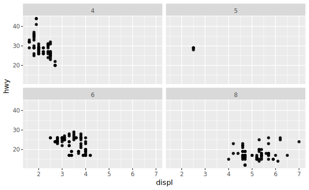

2 変数の組み合わせには `facet_grid(rows ~ cols)`。 行=`drv`・列=`cyl` の 2 次元 grid に
なります(観測のない組は空セル: 5 気筒×4WD、 4/5 気筒×FF 等)。

```haskell
mpg |>> layer (scatter "displ" "hwy" <> size 3 <> alpha 0.9)
      <> facetGrid "drv" "cyl_f"
```

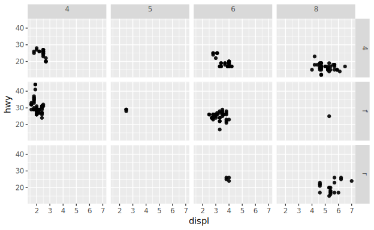

既定では全 facet が同じスケールを共有します。 `scales="free"` で行ごとに y・列ごとに x の
スケールを自由化できます(`facetScales FacetFree`)。

```haskell
mpg |>> layer (scatter "displ" "hwy" <> size 3 <> alpha 0.9)
      <> facetGrid "drv" "cyl_f" <> facetScales FacetFree
```

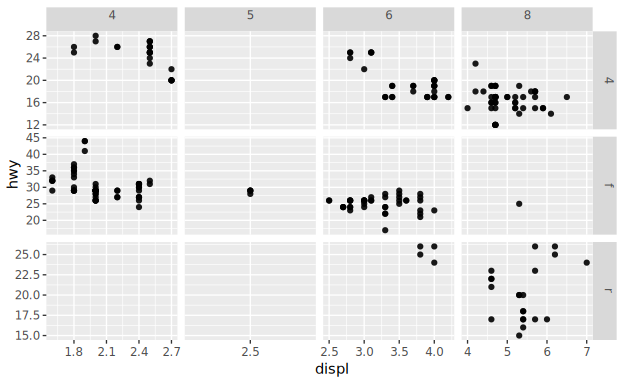

---

## 9.5 Statistical transformations

棒グラフは生データでなく**新しい値を計算**して描きます。 `geom_bar(aes(x=cut))` は
`diamonds` の `cut` ごとの**件数**(`count`)を計算します。 hgg の `bar` は
集計済の y を高さに取るので、 `geom_bar` の `stat_count` 相当を `groupBy + countAll` で
先に行います(値は不変。 Fair 1610 .. Ideal 21551)。

```haskell
let byCut = diamonds |> DF.groupBy ["cut"] |> DF.aggregate [ F.countAll `F.as` "n" ]
byCut |>> layer (bar "cut" "n") <> scaleXDiscreteLimits cutOrder
```

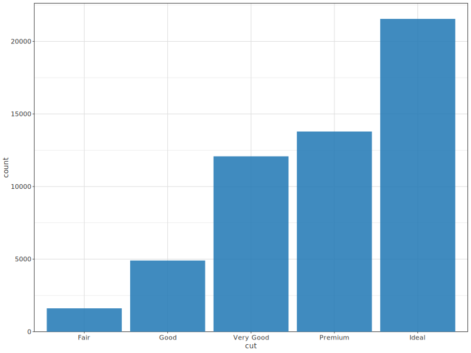

「生データ → 集計(stat)→ プロット」 の流れを R4DS は次の図で説明します(R4DS 原典の
説明図をそのまま引用):


**stat を明示する 3 つの理由**:

1. 既定の stat を上書きする。 R は `count(cut)` で集計してから `geom_bar(stat="identity")` で
   生の `n` を棒高にします。 hgg の `bar` は元々「集計済 y を高さに」 取るので、
   同じ集計を `y=n` で描けば等価です。

   ```haskell
   byCut |>> layer (bar "cut" "n") <> scaleXDiscreteLimits cutOrder
   ```

   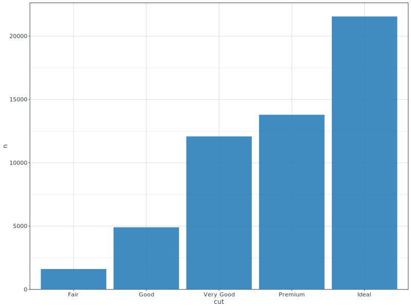

2. 計算変数→エステティックの既定マッピングを上書きする。 件数でなく**割合**
   (`after_stat(prop)`)を棒高にします。 `prop = n / 総数` を派生列で作ります。

   ```haskell
   let byProp = byCut |> DF.derive "prop"
                  (F.lift (\k -> fromIntegral k / total) (F.col @Int "n"))
   byProp |>> layer (bar "cut" "prop") <> scaleXDiscreteLimits cutOrder
   ```

   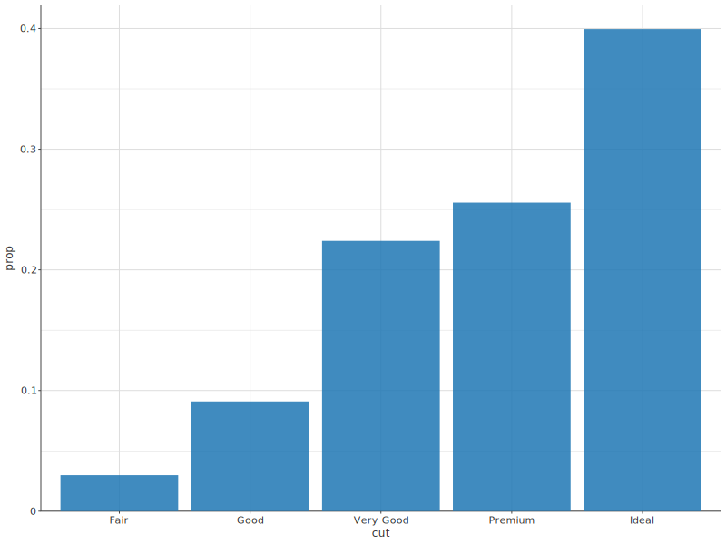

3. 統計変換を前面に出す。 R の `stat_summary` は cut ごとに `depth` の最小〜最大の縦線と
   中央値の点を描きます。 dataframe には median 集約がないので、 cut ごとに `depth` を
   抽出して Haskell で厳密計算し、 `lineRange`(縦線)+ `scatter`(中央値点)で再現します
   (`lineRange` は連続 x を取るので cut を 0..4 の数値位置にして目盛ラベルを差し替え)。

   ```haskell
   let depthStats = [ (minimum ds, median ds, maximum ds) | c <- cutOrder, let ds = ... ]
   DF.empty |>> layer (lineRange (inline cutXs) (inline mids) (inline halves) <> stroke 1.5)
            <> layer (scatter (inline cutXs) (inline meds) <> size 7)
            <> xAxis (axisBreaksLabeled (zip cutXs cutOrder))
   ```

   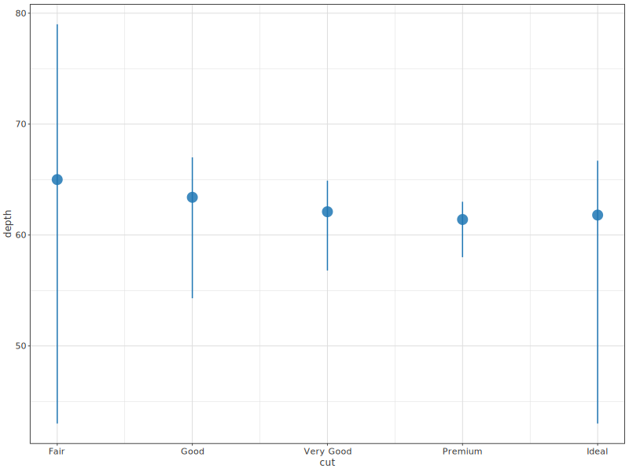

---

## 9.6 Position adjustments

棒グラフは `color`(枠)/ `fill`(面)で色を付けられます。 **hgg は枠と面を
分離せず `color` = 面色**なので、 R の `color=drv` と `fill=drv` は同一図になります
(honest 記録)。 ここは面色版を示します。

```haskell
let byDrv = mpg |> DF.groupBy ["drv"] |> DF.aggregate [ F.countAll `F.as` "n" ]
byDrv |>> layer (bar "drv" "n" <> color "drv") <> legendOff
```

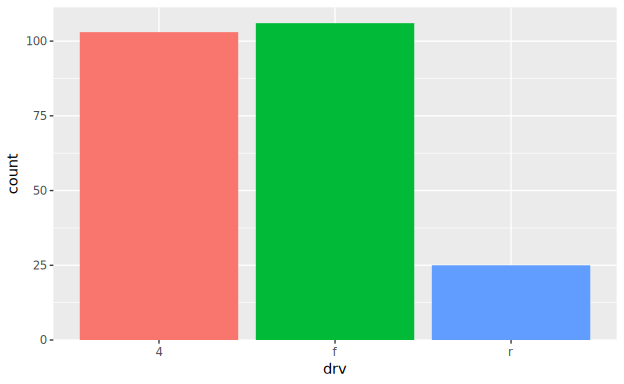

`fill` を別変数(`class`)にマップすると、 棒が自動で**積み上がり**ます(既定 = stack)。
各色の矩形が `drv` × `class` の組み合わせを表します。

```haskell
let byDrvClass = mpg |> DF.groupBy ["drv","class"] |> DF.aggregate [ F.countAll `F.as` "n" ]
byDrvClass |>> layer (bar "drv" "n" <> color "class" <> position PosStack)
```

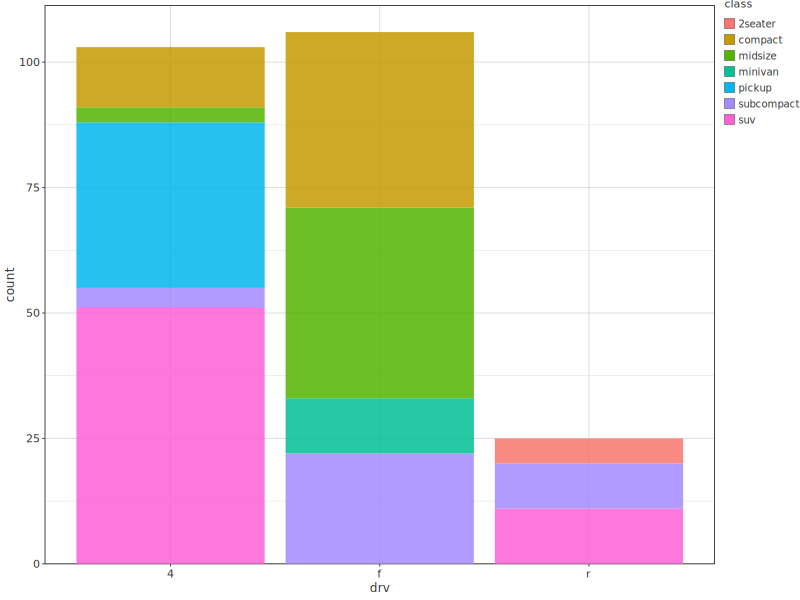

積み上げ以外に `"identity"` / `"fill"` / `"dodge"` の 3 つの `position` があります。

- `position = "identity"` は各オブジェクトをそのままの位置に置きます。 棒では重なるので、
  `alpha` を下げて半透明にして重なりを見せます。

  ```haskell
  byDrvClass |>> layer (bar "drv" "n" <> color "class" <> position PosIdentity <> alpha 0.2)
  ```

  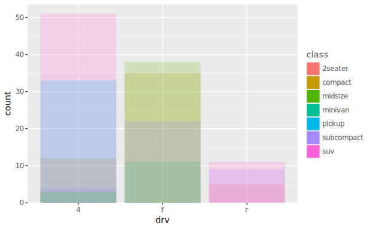

- `position = "fill"` は各積み上げを高さ 1 に揃え、 割合を比較しやすくします。

  ```haskell
  byDrvClass |>> layer (bar "drv" "n" <> color "class" <> position PosFill)
  ```

  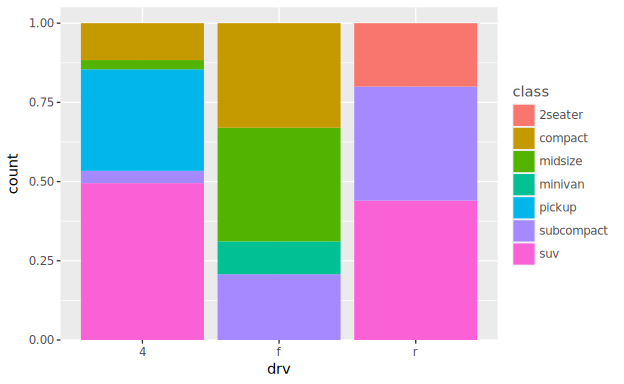

- `position = "dodge"` は重なるオブジェクトを横に並べ、 個別値を比較しやすくします。

  ```haskell
  byDrvClass |>> layer (bar "drv" "n" <> color "class" <> position PosDodge)
  ```

  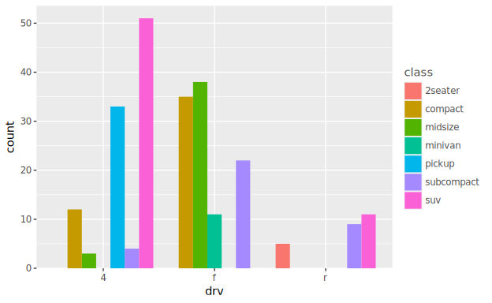

散布図には `"jitter"` が有効です。 最初の散布図は 234 観測のうち 126 点しか見えません
(値が丸められ点が重なる = **overplotting**)。

```haskell
mpg |>> layer (scatter "displ" "hwy" <> size 4)
```

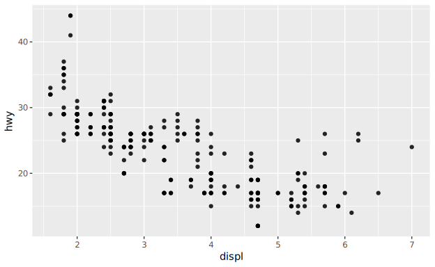

`position = "jitter"` は各点に微小ノイズを足して重なりを散らします(`jitterX`/`jitterY`)。
小さなスケールでは不正確になりますが、 大きなスケールでは分布がよく見えます。

```haskell
mpg |>> layer (scatter "displ" "hwy" <> size 4 <> jitterX 0.02 <> jitterY 0.02)
```

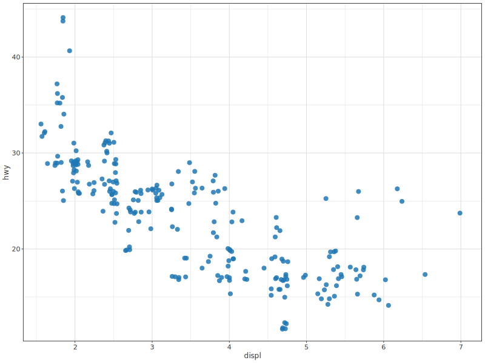

---

## 9.7 Coordinate systems

既定の座標系は直交座標(Cartesian)です。 ここでは `clarity`(透明度)の棒グラフを基に
座標系を変えます。

```haskell
let byClarity = diamonds |> DF.groupBy ["clarity"] |> DF.aggregate [ F.countAll `F.as` "n" ]
byClarity |>> layer (bar "clarity" "n" <> color "clarity" <> colorCats clarityOrder)
            <> scaleXDiscreteLimits clarityOrder <> legendOff
```

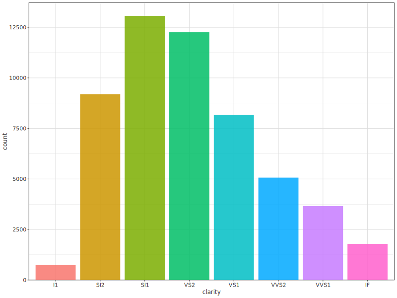

`coord_flip()` は x と y を入れ替え、 横棒にします(`coordFlip`)。

```haskell
byClarity |>> layer (bar "clarity" "n" <> color "clarity" <> colorCats clarityOrder)
            <> scaleXDiscreteLimits clarityOrder <> coordFlip <> legendOff
```

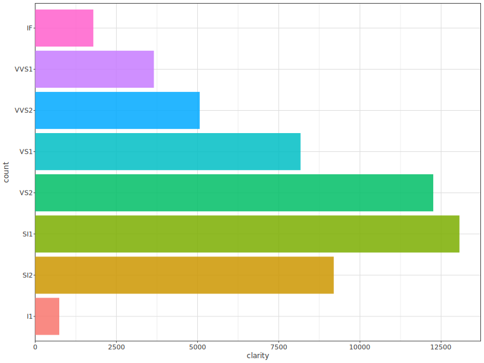

`coord_polar()` は極座標を使い、 棒グラフと **Coxcomb chart** の関係を見せます(`coordPolar`)。

```haskell
byClarity |>> layer (bar "clarity" "n" <> color "clarity" <> colorCats clarityOrder)
            <> scaleXDiscreteLimits clarityOrder <> coordPolar <> legendOff
```

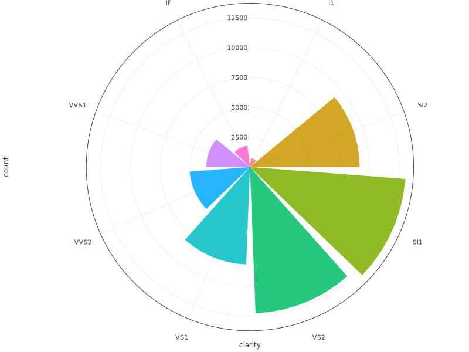

> **honest 記録 (地図)**: R はもう 1 つ `coord_quickmap()`(地図のアスペクト比補正)を
> `map_data("nz")` + `geom_polygon` で示します。 **hgg には polygon geom も地図投影も
> 未実装**です(R4DS 自身「本書では地図を深入りしない」)。 概念だけ対応表で示します:
>
> | R | 役割 | hgg |
> |---|---|---|
> | `map_data("nz")` | 地図境界データ | 未実装(地理データ取得なし) |
> | `geom_polygon` | 閉路の塗り | 未実装(将来候補) |
> | `coord_quickmap()` | 緯度経度のアスペクト比補正 | 未実装 |

---

## 9.8 The layered grammar of graphics

grammar of graphics は、 **データ・geom・マッピング・stat・position・座標系・facet・theme**
の組み合わせで *任意の* プロットを一意に記述できる、 という洞察に基づきます。 生データから
プロットへ至る流れを R4DS は次の図で説明します(R4DS 原典の説明図をそのまま引用):

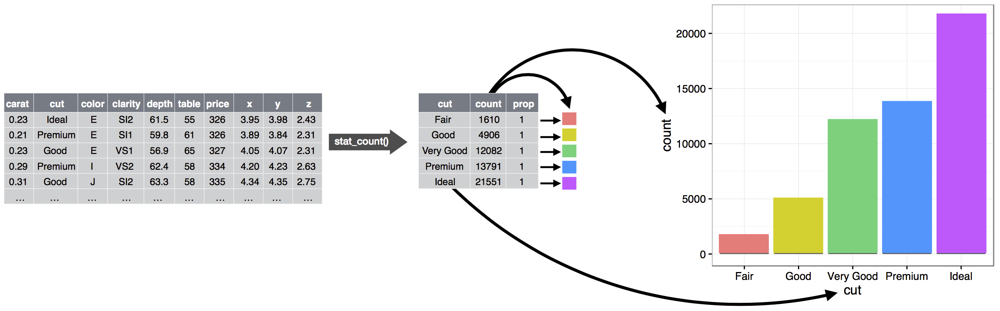

テンプレートに position・stat・座標系・facet を加えると、 数十万通りの図を組み立てられます:

```
ggplot(data = <DATA>) +
  <GEOM_FUNCTION>(mapping = aes(<MAPPINGS>), stat = <STAT>, position = <POSITION>) +
  <COORDINATE_FUNCTION> +
  <FACET_FUNCTION>
```

hgg では `layer (mark <> aes... <> position ...) <> coord... <> facet...` を `<>` で
合成し、 `df |>> spec` でデータに束ねます(本章の各図がその実例)。

---

## 関連

- 完全コード: [`Layers.hs`](Layers.hs)
- R4DS 原典: <https://r4ds.hadley.nz/layers>
- 前章: [`../08-getting-help`](../08-getting-help)(Whole Game の締め)
