# 10. 探索的データ分析 — Exploratory data analysis

> 一次情報: **R for Data Science 2e, Ch.11 "Exploratory data analysis"**
> <https://r4ds.hadley.nz/eda>
> データ: **diamonds**(53,940 行)・**mpg**(234 行)・**nycflights13::flights**(336,776 行)

変数の **変動(variation)** と変数間の **共変動(covariation)** を、図を描きながら
探っていく章です。histogram / freqpoly / boxplot / geom_count / geom_tile /
geom_bin2d を題材に、外れ値の発見からモデルによるパターン抽出までを扱います。
実行コードは [`Eda.hs`](Eda.hs)。整数値のみの列(`price` / `hwy` 等)は dataframe が
Int 列に推論するため、`Double` で取り出す `numCol` を自前で用意しています。

## 実行

```sh
cd docs/tutorials/10-eda
cabal run tut-10-eda
```

---

## §1 変動 — 1 変数の分布

数値変数の分布は **histogram** で見ます。`diamonds$carat` を幅 0.5 で区切ると、
右に長く裾を引いた分布だと分かります。

```haskell
diamonds |>> theme ThemeGrey <> layer (histogram "carat" <> binWidth 0.5)
```

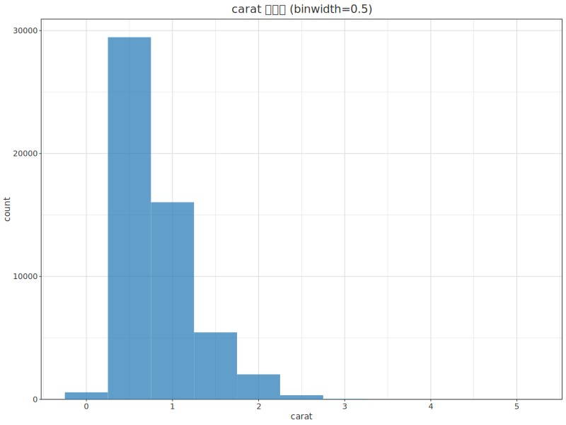

### 典型値 — 細かい bin で見る

`carat < 3` の小さい diamond だけを取り出し、幅 0.01 の細かい bin で描くと、
**1 カラットや切りの良い分数のところに山**が立つことが見えてきます。

```haskell
let smallerDF = ... filter (carat < 3) ...
smallerDF |>> theme ThemeGrey <> layer (histogram "carat" <> binWidth 0.01)
```

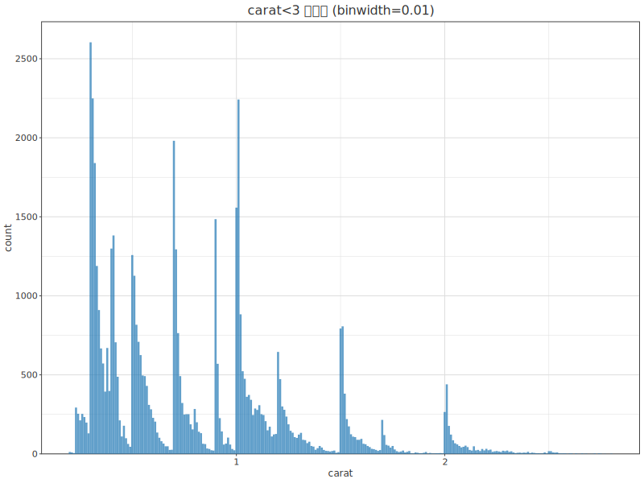

---

## §2 異常値 — histogram で外れ値を探す

`y`(幅 mm)の分布を見ると、データは 5 付近に固まっているのに **x 軸が 0〜60 まで
広がっている**のが唯一の手がかりです。

```haskell
diamonds |>> theme ThemeGrey <> layer (histogram "y" <> binWidth 0.5)
```

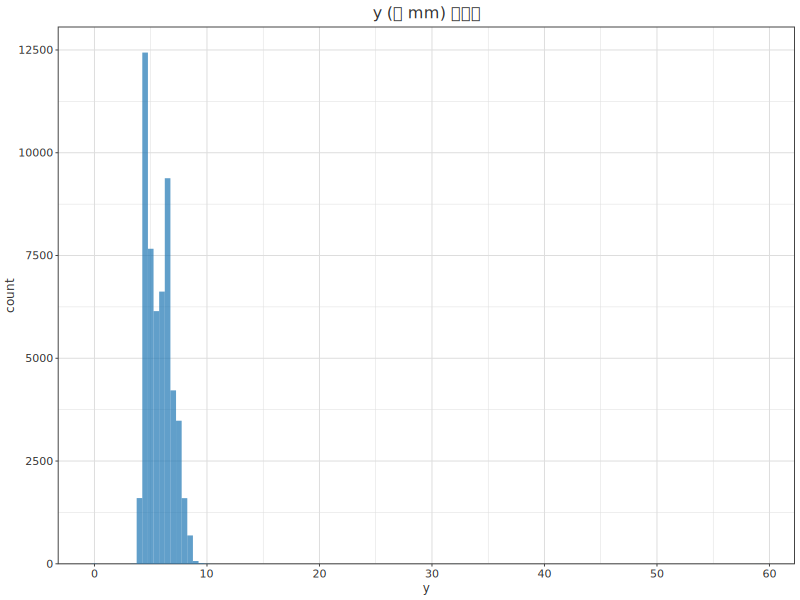

頻度の高い bin が高すぎて稀な bin が潰れています。`coord_cartesian` で
**y 軸を 0〜50 にズーム**すると、0・約 30・約 60 の位置に低い bar が見えます。

```haskell
diamonds |>> theme ThemeGrey <> layer (histogram "y" <> binWidth 0.5)
         <> coordCartesianY 0 50
```

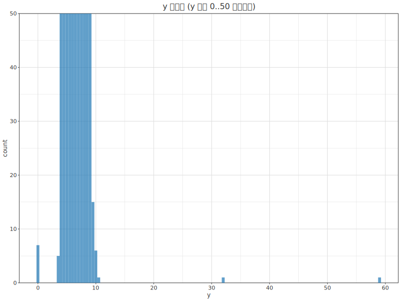

> `coordCartesianY lo hi` は **データを捨てずに表示範囲だけ**を変えます
> (ggplot の `coord_cartesian(ylim=)` と同じ。`ylim()` は範囲外を捨てる別物)。

異常値を dplyr 風に抜き出します(`y < 3 | y > 20`)。`y = 0` が 7 件 —
幅 0mm の diamond はあり得ず、**0 でコード化された欠損**だと分かります。

```
── 異常値 (y<3 | y>20)、 y 昇順 ──
  price      x      y      z
5139.00   0.00   0.00   0.00
6381.00   0.00   0.00   0.00
12800.00   0.00   0.00   0.00
15686.00   0.00   0.00   0.00
18034.00   0.00   0.00   0.00
2130.00   0.00   0.00   0.00
2130.00   0.00   0.00   0.00
2075.00   5.15  31.80   5.12
12210.00   8.09  58.90   8.06
```

---

## §3 欠損値 — その扱い

異常な `y`(`y < 3 | y > 20`)を `NA` に置き換えてから `x` 対 `y` を散布すると、
`NA` の行は描かれません(ここでは該当行を除外して同じ結果を得ます)。

```haskell
let xyKept = [ (x,y) | (x,y) <- zip xv yv, y >= 3 && y <= 20 ]
diamonds2DF |>> theme ThemeGrey <> layer (scatter "x" "y" <> alpha 0.4)
```


欠損そのものが意味を持つこともあります。`flights` の `dep_time` 欠損は **欠航** を
表します。`cancelled = is.na(dep_time)` で群を作り、予定出発時刻の
**頻度多角形(`geom_freqpoly`)** を欠航別に重ねます。

```haskell
let cancelled = map isNothing depTime
    schedDec  = [ h + m/60 | ... ]   -- sched_dep_time を時刻(時)に
flightsDF |>> theme ThemeGrey <> layer (freqpoly "sched_dep_time" <> binWidth 0.25 <> colorBy "cancelled")
```

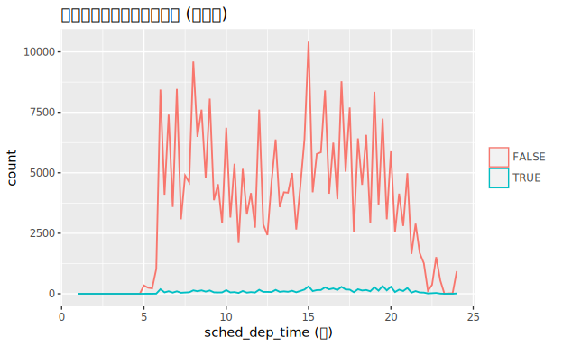

> 欠航便は非欠航便に比べて圧倒的に少ないため、この素の頻度では比較しにくい —
> 次節の density 正規化につながります。

---

## §4 共変動 — カテゴリ変数 × 数値変数

`cut`(品質)別に `price` の分布を **頻度多角形** で比べます。まず素の count では、
件数そのものが `cut` で大きく違うため形の比較が難しいです。

```haskell
diamonds |>> theme ThemeGrey <> layer (freqpoly "price" <> binWidth 500 <> colorBy "cut"
                   <> colorCats cutOrder)
```

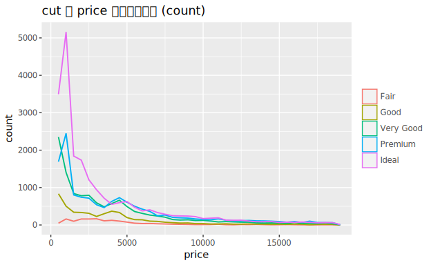

`after_stat(density)`(`histogramDensity True`)で**面積を 1 に正規化**すると
形を比較できます。**Fair だけが平坦で平均が高め**、他は price≈1500 に鋭い山 —
R4DS の記述どおりです。

```haskell
diamonds |>> theme ThemeGrey <> layer (freqpoly "price" <> binWidth 500 <> colorBy "cut"
                   <> colorCats cutOrder <> histogramDensity True)
```

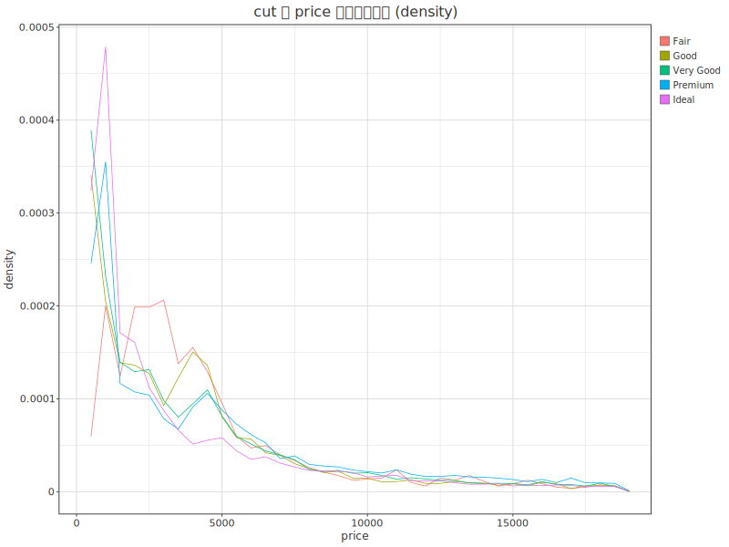

**箱ひげ図(`boxplot "y" <> groupBy "g"`)** だと分布の要約を一目で並べられます。
中央値は意外にも **Ideal が最も低く Fair が最も高い**(carat と交絡)。

```haskell
diamonds |>> theme ThemeGrey <> layer (boxplot "price" <> groupBy "cut") <> scaleXDiscreteLimits cutOrder
```

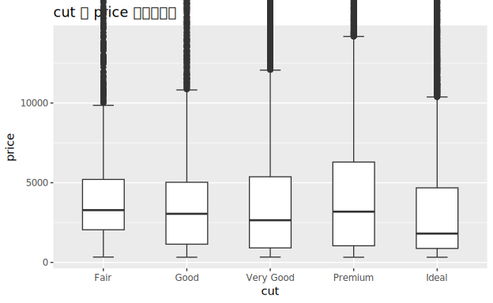

`mpg` で `class` 別 `hwy`(高速燃費)を箱ひげ図に。`class` はアルファベット順です。

```haskell
mpg |>> theme ThemeGrey <> layer (boxplot "hwy" <> groupBy "class")
```

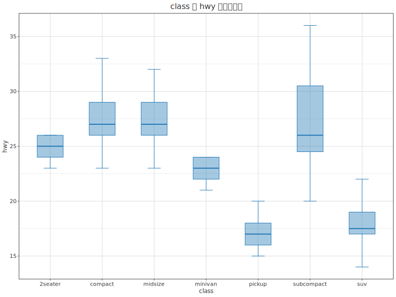

順序のないカテゴリは **中央値で並べ替える**(`fct_reorder`)と読みやすくなります。
ここでは `hwy` 中央値の昇順で `scaleXDiscreteLimits` に渡します。

```haskell
let classByMedian = sortOn classMedian (nub mpgClass)
mpg |>> theme ThemeGrey <> layer (boxplot "hwy" <> groupBy "class") <> scaleXDiscreteLimits classByMedian
```

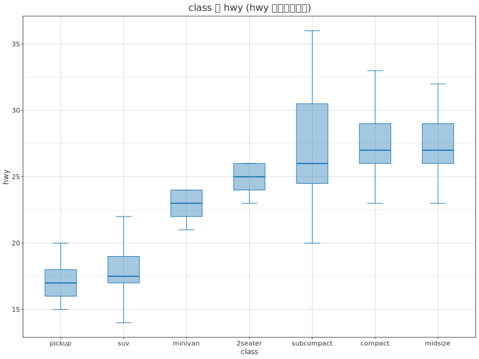

カテゴリ名が長いときは **横向き(`coordFlip`)** にすると収まりが良いです。

```haskell
mpg |>> theme ThemeGrey <> layer (boxplot "hwy" <> groupBy "class") <> scaleXDiscreteLimits classByMedian
    <> coordFlip <> xLabel "hwy" <> yLabel "class"
```

> `coordFlip` はデータ軸を反転しますが軸タイトルは物理軸(底=x / 左=y)に
> 固定されるため、反転後の表示に合わせて `xLabel`/`yLabel` を入れ替えています。

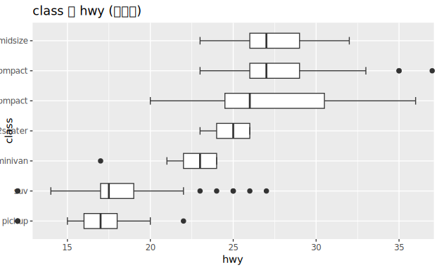

---

## §5 共変動 — カテゴリ変数 × カテゴリ変数

2 つのカテゴリの共起は **`geom_count`(`countXY`)** で、各組合せの件数を
**点の面積**(面積 ∝ 件数)で表します。最大は **Ideal × color G**。

```haskell
diamonds |>> theme ThemeGrey <> layer (countXY "cut" "color") <> scaleXDiscreteLimits cutOrder
```

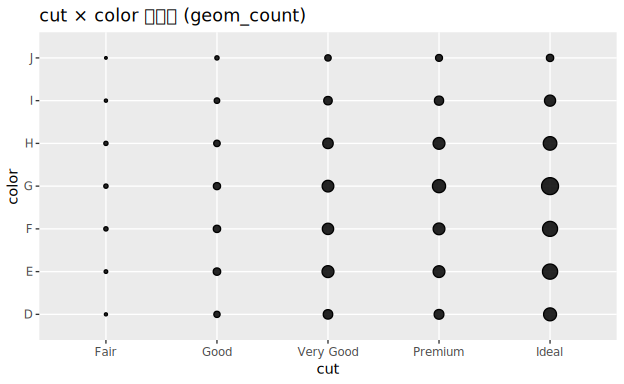

同じ集計を `count(color, cut)` の表で持ち、**`geom_tile`(`heatmap`)** で
`fill = n` の塗りにすると、やはり **color G × Ideal が最大**(最も明るい)と分かります。

```haskell
let tileDF = ... color, cut, n = comboCount ...
tileDF |>> theme ThemeGrey <> layer (heatmap "color" "cut" "n") <> scaleYDiscreteLimits cutOrder
```

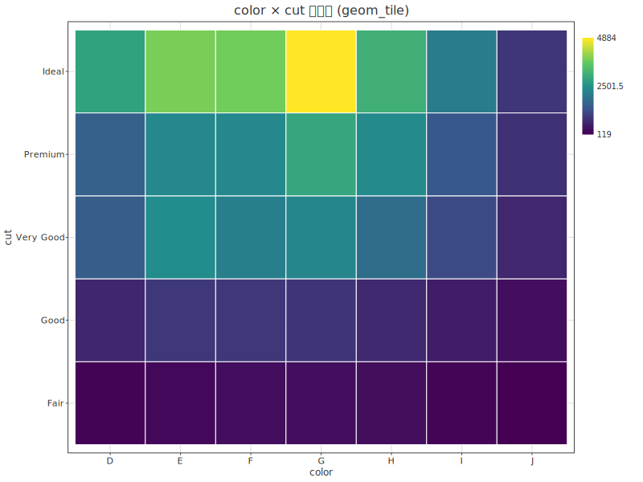

---

## §6 共変動 — 数値変数 × 数値変数

`carat` 対 `price` の散布図。正で、強く、指数的な関係です(`carat < 3`)。

```haskell
smallerDF |>> theme ThemeGrey <> layer (scatter "carat" "price")
```


点が多すぎて重なるときは **透明度(`alpha`)** を下げます。`alpha = 1/100` にすると
1・1.5・2 カラット付近の **クラスタ** が浮かび上がります。

```haskell
smallerDF |>> theme ThemeGrey <> layer (scatter "carat" "price" <> alpha 0.01)
```


1 次元の bin を 2 次元に拡張したのが **`geom_bin2d`(`bin2dCount`)**。平面を矩形 bin に
区切り、各セルの **件数** を連続色で塗ります(低 carat・低 price に集中)。

```haskell
smallerDF |>> theme ThemeGrey <> layer (bin2dCount "carat" "price")
```

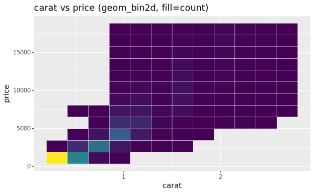

> **正直な制約**: R4DS は六角形 bin の `geom_hex` も並べますが、hgg は
> **六角形 binning を未実装**です。下図は **矩形 bin2d で代替**しています
> (分布の要点は同じ・形のみ六角でない)。

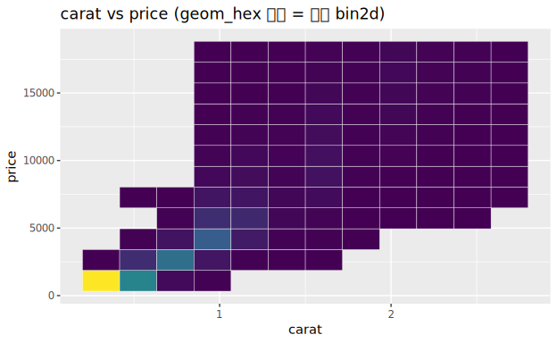

連続変数を**区間に切って**カテゴリのように扱うこともできます。`cut_width(carat, 0.1)`
相当で `carat` を 0.1 刻みに丸め、その bin 別に `price` を箱ひげ図に。
carat が増すと中央値も上がり、裾の歪みも変化します。

```haskell
let caratBin c = 0.1 * fromIntegral (round (c / 0.1) :: Int)
cwDF |>> theme ThemeGrey <> layer (boxplot "price" <> groupBy "carat_bin") <> scaleXDiscreteLimits cwLabels
```

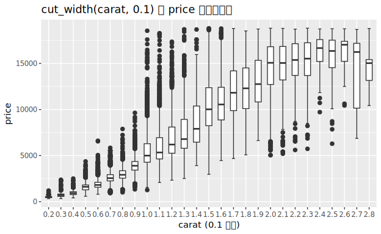

> **正直な制約**: hgg の箱ひげ図はひげの外側の**外れ値を個別の点として
> 描きません**(ひげで打ち切り)。R4DS の図に見える上側の多数の外れ点は省かれます。

---

## §7 パターンとモデル — 強い関係を除いて見る

`cut` と `price` の関係は、`cut`・`carat`・`price` が互いに絡むため見えにくいです。
**モデルで carat の効果を除去**します。`log(price) ~ log(carat)` を最小二乗で当て、
残差を `exp` で価格スケールに戻します(`carat` の効果を取り除いた価格)。

```haskell
let b = sxy / sxx; a = my - b*mx                 -- log-log の OLS
    resid = [ exp (y - (a + b*x)) | (x,y) <- zip lcarat lprice ]
residDF |>> theme ThemeGrey <> layer (scatter "carat" "resid" <> alpha 0.2)
```

残差を `carat` に対して散布すると、carat 増加に伴い残差が減る **明確な曲線パターン**が
残ります。


carat の効果を除いたうえで `cut` 別に残差を箱ひげ図にすると、期待どおり
**品質が良いほど(相対的に)高価** — Fair → Ideal で中央値が単調に上がります。

```haskell
residDF |>> theme ThemeGrey <> layer (boxplot "resid" <> groupBy "cut") <> scaleXDiscreteLimits cutOrder
```

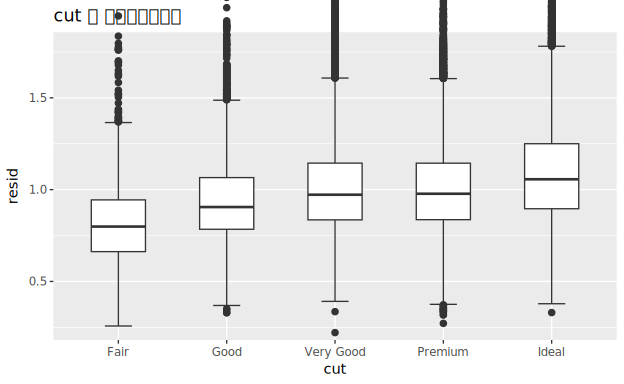

---

## まとめ

| R4DS の geom | hgg | 備考 |
|---|---|---|
| `geom_histogram` | `histogram <> binWidth` | |
| `coord_cartesian(ylim=)` | `coordCartesianY` | データを捨てない zoom |
| `geom_freqpoly` | `freqpoly`(`histogramDensity` で density) | 本章で新規実装 |
| `geom_boxplot` | `boxplot` + `groupBy` | 外れ点は非表示(ひげ打切り) |
| `fct_reorder` | `scaleXDiscreteLimits`(中央値順) | 前処理で順序を計算 |
| `coord_flip` | `coordFlip` | 軸タイトルは物理軸固定 |
| `geom_count` | `countXY` | 本章で新規実装(面積 ∝ 件数) |
| `geom_tile(fill=n)` | `heatmap` | 件数を事前集計 |
| `geom_bin2d` | `bin2dCount` | 本章で count モード追加 |
| `geom_hex` | （`bin2dCount` で代替） | 六角 binning 未実装 |

変動と共変動という EDA の二本柱を、1 変数・カテゴリ×数値・カテゴリ×カテゴリ・
数値×数値・モデル残差の順に一通り描きました。
