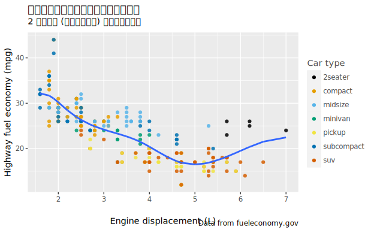
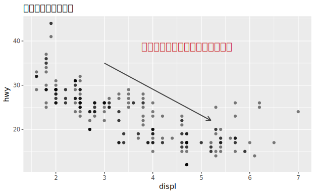
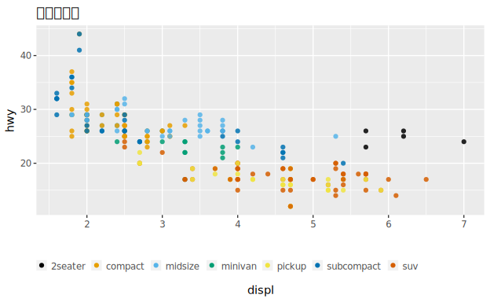
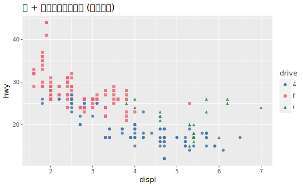
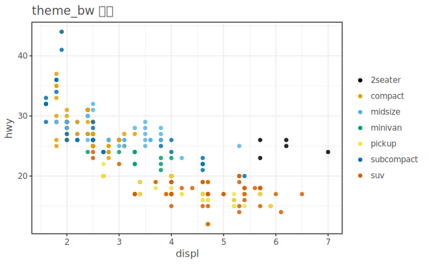
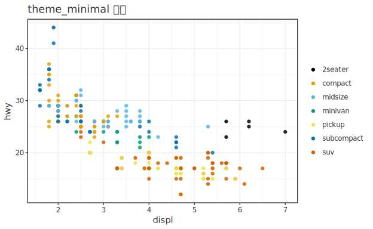
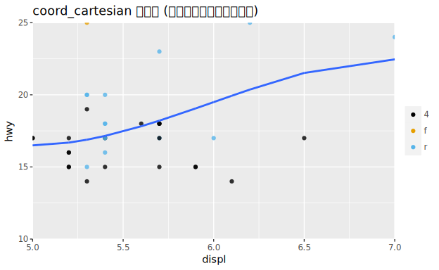
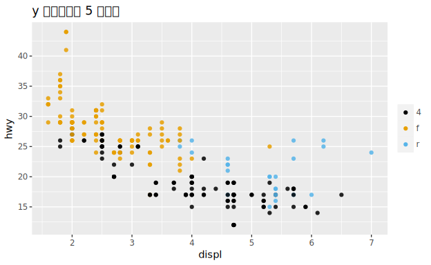

# 11. 伝わる図にする — Communication

> 🌐 [English](README.ja.md) | **日本語**

> 一次情報: **R for Data Science 2e, Ch.11 "Communication"**
> <https://r4ds.hadley.nz/communication>
> データ: **mpg**(ggplot2)

探索用の図を「人に見せる図」 に仕上げます。ラベル・注釈・凡例位置・配色・テーマ・
ズーム・軸目盛りといった**データ以外の要素**を整えます。実行コードは
[`Communication.hs`](Communication.hs)。

## 実行

```sh
cd docs/tutorials/11-communication
cabal run tut-11-communication
```

---

## 1. ラベル(= `labs(...)`)

タイトル・サブタイトル・キャプション・軸名・凡例名を付けます。

| R | hgg |
|---|---|
| `labs(title=, subtitle=, caption=)` | `title` / `subtitle` / `caption` |
| `labs(x=, y=, color=)` | `xLabel` / `yLabel` / `legendTitle` |



## 2. 注釈(= `annotate()` / `geom_text`)

データ座標にテキストや矢印を置いて要点を示します。

| R | hgg |
|---|---|
| `annotate("label", x, y, label=)` | `annotText x y "…"` |
| `annotate("segment", …, arrow=)` | `annotArrow x1 y1 x2 y2` |



## 3. 凡例の位置(= `theme(legend.position=)`)

| R | hgg |
|---|---|
| `theme(legend.position = "bottom")` | `legendPos LegendBottom` |
| `theme(legend.position = "none")` | `legendOff` |



`LegendPosition` には `LegendRight`(既定)/`LegendBottom`/`LegendNone` のほか、
プロット内に置く `LegendInsideTopRight` などもあります。

## 4. 配色 + 形の冗長符号化(色覚配慮)

色だけでなく形も同じ変数に割り当てると、色を見分けにくい人にも伝わります
(R4DS の `scale_color_brewer` + `aes(shape=)`)。

| R | hgg |
|---|---|
| `scale_color_brewer(palette = "Set1")` | `palette tolBright`(色覚安全パレット) |
| `aes(color = drv, shape = drv)` | `colorBy "drv" <> shapeBy "drv"` |



選べるパレット: `okabeIto` / `tolBright` / `brewerSet2` / `brewerDark2`(いずれも
色覚バリアフリー寄り)。

## 5. テーマ(= `theme_bw()` / `theme_minimal()` …)

データ以外の見た目(背景・グリッド・枠)をまとめて切り替えます。

| R | hgg |
|---|---|
| `theme_bw()` | `theme ThemeBW` |
| `theme_minimal()` | `theme ThemeMinimal` |




`ThemeName` は `ThemeDefault` / `ThemeBW` / `ThemeMinimal` / `ThemeClassic` /
`ThemeGrey` / `ThemeLight` / `ThemeDark` / `ThemeVoid` / `ThemeLinedraw` などがあります。

## 6. ズーム(= `coord_cartesian()`)

表示範囲だけを絞ります。**データは捨てない**ので、平滑線は全データから計算されたまま
拡大されます(`filter` で絞ると平滑線そのものが変わってしまう、という R4DS の論点)。

| R | hgg |
|---|---|
| `coord_cartesian(xlim = c(5,7), ylim = c(10,25))` | `coordCartesianX 5 7 <> coordCartesianY 10 25` |



## 7. 軸目盛りの指定(= `scale_y_continuous(breaks=)`)

| R | hgg |
|---|---|
| `scale_y_continuous(breaks = seq(15, 40, by = 5))` | `yAxis (axisBreaksAt [15,20,25,30,35,40])` |



---

## この章で出てきた対応表(まとめ)

| ggplot2 | hgg |
|---|---|
| `labs(title/subtitle/caption=)` | `title` / `subtitle` / `caption` |
| `labs(x/y/color=)` | `xLabel` / `yLabel` / `legendTitle` |
| `annotate("label"/"segment")` | `annotText` / `annotArrow` |
| `theme(legend.position=)` | `legendPos LegendBottom` / `legendOff` |
| `scale_color_brewer()` | `palette tolBright` ほか |
| `aes(shape=)`(冗長符号化) | `shapeBy "g"` |
| `theme_bw()` / `theme_minimal()` | `theme ThemeBW` / `theme ThemeMinimal` |
| `coord_cartesian(xlim/ylim=)` | `coordCartesianX` / `coordCartesianY` |
| `scale_y_continuous(breaks=)` | `yAxis (axisBreaksAt […])` |

前章 → [`10-eda`](../10-eda/)。
次章 → [`17-datetimes`](../17-datetimes/)(Ch17 Dates and times・flights)。
