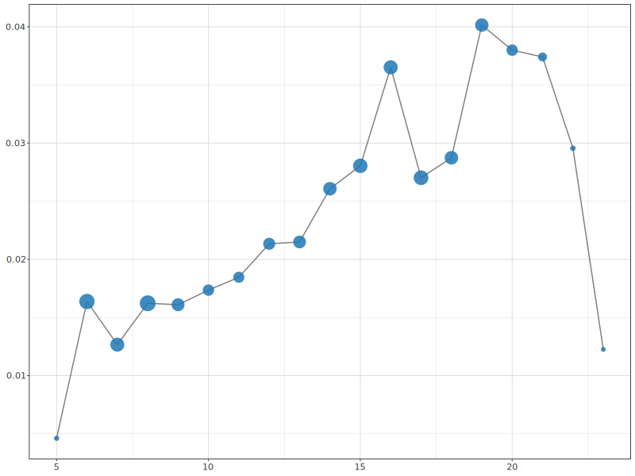
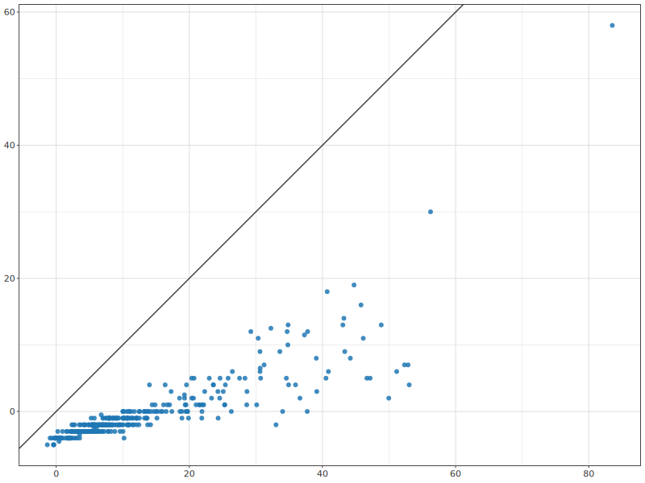
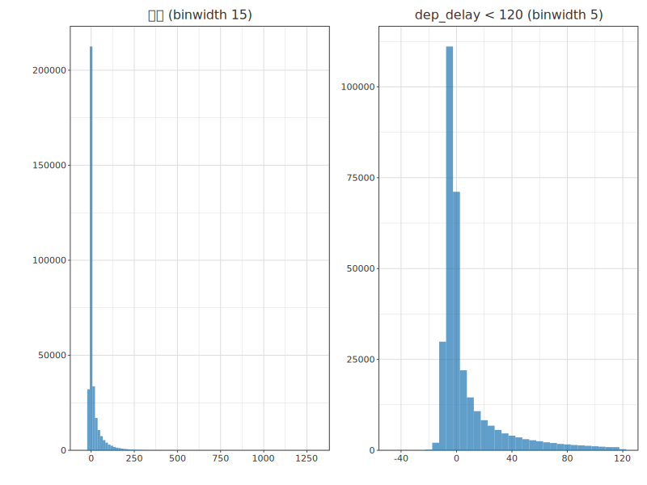
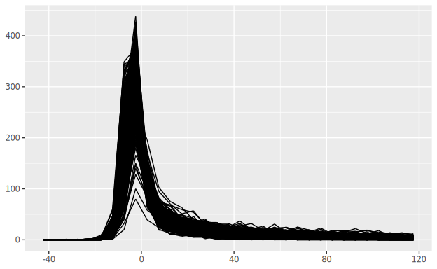

# 13. 数値ベクトル — Numbers

> 一次情報: **R for Data Science 2e, Ch.13 "Numbers"**
> <https://r4ds.hadley.nz/numbers>
> データ: **nycflights13** の `flights`(全 336,776 行)+ ダミーベクトル。

数値ベクトルでできることを体系的に概観します。文字列→数値・`count()`・数値変換
(リサイクル・剰余算・丸め・区間化・累積)・汎用変換(順位・オフセット・連続識別子)・
数値要約(中心・分位点・分散・分布・位置)を扱います。実行コードは
[`Numbers.hs`](Numbers.hs)。

```sh
cd docs/tutorials/13-numbers
cabal run tut-13-numbers
```

> **★高レベル API を既定で使用。** R4DS の数値関数は **hanalyze の公開 API**
> として実装しました(デモコードに毎回自前実装しない方針):
> - **記述統計** `mean`/`median`/`quantile`(R type-7)/`sd`/`var`/`IQR` →
>   `Hanalyze.Stat.Descriptive`(Phase 65)
> - **dplyr 動詞** `min_rank`/`lag`/`lead`/`cumsum`/`cut`/`consecutive_id` →
>   `Hanalyze.Data.Transform`(Phase 66)
> - **`summarise`/`mutate`/`groupBy`**(DataFrame 直結・plot の `df |>>` と対称)→
>   `Hanalyze.Data.Wrangle`(Phase 67)
>
> 文字列→数値 (`parse_number`) や `pmin/pmax` 等の小物のみチュートリアル local。

---

## 13.1 数を作る

文字列を数値にする 2 関数(`Numbers.hs` の local helper)。`parseDouble` は数値文字列を
そのまま(`read`・科学表記 `1e3` も)、`parseNumber` は通貨記号・カンマ・% 等の非数値を
除いて数値部分を取り出します。

```haskell
map (show . parseDouble) ["1.2", "5.6", "1e3"]          -- R parse_double
map (show . parseNumber) ["$1,234", "USD 3,513", "59%"]  -- R parse_number
```

出力:

```
parse_double(c("1.2","5.6","1e3"))          = 1.2 5.6 1000.0
parse_number(c("$1,234","USD 3,513","59%")) = 1234.0 3513.0 59.0
```

## 13.2 カウント

`count()` は探索の定番です。`groupBy [...] |> summarise [ "n" =: nOf ]` で再現できます。

```haskell
flights |> groupBy ["dest"] |> summarise [ "n" =: nOf ]                  -- count(dest)
flights |> groupBy ["dest"] |> summarise [ "n" =: nOf, "delay" =: meanOf "arr_delay" ]
```

`sort = TRUE` 相当は `n` 降順に並べ替え。最頻の就航先は ORD(17,283)・ATL(17,215)・
LAX(16,174)…。`n_distinct(carrier)`(就航社数)・加重カウント `sum(distance)`・
欠損カウント `sum(is.na(dep_time))`(=キャンセル便数)も同様です。

| R | hgg |
|---|---|
| `count(dest)` | `groupBy ["dest"] \|> summarise ["n" =: nOf]` |
| `summarize(delay = mean(arr_delay, na.rm=T))` | `meanOf "arr_delay"`(na.rm 既定) |
| `summarize(carriers = n_distinct(carrier))` | Text 列は `Set` で distinct 数(Wrangle v1 の `nDistinctOf` は数値専用) |
| `count(tailnum, wt = distance)` | `summarise ["miles" =: sumOf "distance"]` |

## 13.3 数値変換

### 13.3.1 算術とリサイクル規則

長さの違うベクトルは短い方を**リサイクル**(繰り返し)します。`x / 5` は `5` を
4 回使うのと同じ。`==` でもリサイクルされるため `filter(month == c(1,2))` は罠で、
奇数行=1月・偶数行=2月 だけを拾います(正しくは `month %in% c(1,2)`)。

### 13.3.2 pmin / pmax(行ごと)vs min / max(要約)

`pmin(x, y)` は**行ごと**の最小(`Numbers.hs` の local helper `pmin'`/`pmax'` =
`zipWith`)、`min(x, y)` は**全体の単一値**です。出力:

```
pmin(x,y,na.rm=T) = 1.0 2.0 7.0      pmax(x,y,na.rm=T) = 3.0 5.0 7.0
min(x,y,na.rm=T)  = 1.0              max(x,y,na.rm=T)  = 7.0   (= 取り違え注意)
```

### 13.3.3 剰余算 `%/%` `%%`

R の `%/%`(整数除算)・`%%`(剰余)は Haskell の `div` / `mod` です。`sched_dep_time` を
時・分に分解します(R `mutate(hour = …, minute = …)` 相当・実コードは `insertVector`):

```haskell
let schedV  = colPlain @Int "sched_dep_time" flights
    hourMin = DF.insertVector "minute" (V.fromList (map (`mod` 100) schedV))
            $ DF.insertVector "hour"   (V.fromList (map (`div` 100) schedV))
            $ DF.select ["sched_dep_time"] flights
```

R `1:10 %/% 3` / `1:10 %% 3` は次のとおり:

```haskell
map (`div` 3) [1..10]   -- %/%
map (`mod` 3) [1..10]   -- %%
```

これとキャンセル率 `is.na(dep_time)` の割合を時刻ごとに集計し、**時刻ごとのキャンセル率**を
見ます(`fig1`)。



キャンセル率は朝 0.5% 程度から 19 時頃の 4% へ増え、その後深夜にかけて急減します
(点の大きさ = 便数)。

### 13.3.4 丸め(Banker's rounding)

`round(x)` は最近接整数へ。第 2 引数で桁を指定(`round(x,-1)` は十の位)。`round` は
**半偶数丸め**(round half to even)で、`round(c(1.5, 2.5))` = `2 2`(両方偶数へ)。
Haskell の `round` は既に半偶数丸め・桁指定は local helper `roundTo`。出力:

```
round(123.456)=123  round(.,2)=123.46  round(.,1)=123.5  round(.,-1)=120  round(.,-2)=100
floor(123.456)=123  ceiling(123.456)=124
```

### 13.3.5 区間化 `cut`

数値ベクトルを離散の箱に分けます(`Data.Transform` の `cut`/`cutLabels`・既定は
右閉区間 `(a, b]`・範囲外は `Nothing`=NA)。

```haskell
Tr.cut [0,5,10,15,20] [1,2,5,10,15,20]                       -- bin index
Tr.cutLabels ["sm","md","lg","xl"] [0,5,10,15,20] [1,2,5,10,15,20]
```

出力:

```
cut(x, breaks=c(0,5,10,15,20)) = bin 1 1 1 2 3 4
ラベル付き (sm/md/lg/xl)         = sm sm sm md lg xl
```

### 13.3.6 累積 `cumsum`

`Data.Transform` の `cumsum`/`cumprod`/`cummin`/`cummax`/`cummean`。
`Tr.cumsum [1..10]` = `1 3 6 … 55`。

## 13.4 汎用変換

### 13.4.1 順位

`minRank` が基本(tie は 1,2,2,4)。降順は `Data.Ord.Down` を被せます。`rowNumber`/
`denseRank`/`percentRank`/`cumeDist` も。`*NA` 変種は NA(`Nothing`)を保ったまま順位付け
(`Data.Transform`):

```haskell
let xrk = [Just 1, Just 5, Just 5, Just 17, Just 22, Nothing] :: [Maybe Int]
Tr.minRankNA xrk                       -- min_rank(x)
Tr.minRankNA (map (fmap Down) xrk)     -- min_rank(desc(x))
Tr.rowNumberNA xrk                     -- row_number(x)  ほか denseRankNA / percentRankNA / cumeDistNA
```

出力:

```
x = c(1,5,5,17,22,NA)
min_rank(x)   = 1 2 2 4 5 NA      min_rank(desc(x)) = 5 3 3 2 1 NA
row_number(x) = 1 2 3 4 5 NA      dense_rank(x)     = 1 2 2 3 4 NA
percent_rank  = 0 .25 .25 .75 1 NA  cume_dist       = .2 .6 .6 .8 1 NA
```

`row_number()` を `%%` / `%/%` と組み合わせると、データを同サイズの群に分けられます。

### 13.4.2 オフセット `lag` / `lead`

直前/直後の値を参照(端は NA で埋める)。`x - lag(x)` で前との差、`x == lag(x)` で
変化点が分かります。

### 13.4.3 連続識別子 `consecutive_id`

引数が変わるたびに新しい群 id を振ります。`c("a","a","a","b","c","c",…)` →
`1 1 1 2 3 3 …`。

## 13.5 数値要約

### 13.5.1 中心 — mean vs median

平均は外れ値に敏感、中央値は頑健です。日ごとの出発遅延の平均と中央値を比べます。

```haskell
flights |> groupBy ["year","month","day"]
        |> summarise [ "mean"   =: meanOf "dep_delay"
                     , "median" =: medianOf "dep_delay"
                     , "n"      =: nOf ]
```



すべての点が対角線 `y = x` の**下**に来ます(中央値 < 平均)。便は数時間遅れること
はあっても数時間早く出ることはないため、分布が右に歪み平均が引き上げられるからです。

R4DS の `geom_abline(slope=1, intercept=0)`(= `y=x` 参照線)は、plot の公開 API
`refIdentity` でそのまま描けます(`<>` で重ねるだけ・[api-guide 04-decoration の参照線](../../api-guide/04-decoration.md#guides)):

```haskell
dayDelay |>> theme ThemeGrey <> layer (scatter "mean" "median") <> refIdentity
```

> 参照線は `refIdentity`(=`y=x`)/`refHorizontal c`(=`geom_hline`)/`refVertical x`
> (=`geom_vline`)/`refLine (RefLinear slope intercept)`(=任意の `geom_abline`)。
> いずれもデータでなく**プロット領域全体**に線を引きます。

### 13.5.2 最小・最大・分位点

`quantile(x, 0.95)` は値の 95% 点。極端な遅延 5% を無視できます(R type-7 で R 一致)。

```haskell
flights |> groupBy ["year","month","day"]
        |> summarise [ "max" =: maxOf "dep_delay", "q95" =: quantileOf 0.95 "dep_delay" ]
```

### 13.5.3 散布 — `sd` / `IQR`

`IQR(x)` = `quantile(x,.75) - quantile(x,.25)`。空港間距離は一定のはずですが、
`group_by(origin, dest)` の距離 IQR(`D.iqrL`)を見ると **EGE**(EWR/JFK 発)だけ
IQR > 0 というデータの奇妙な点が見つかります。出力(`iqr > 0` で絞った 2 行):

```
EWR EGE  distance_iqr 1.0  n 110
JFK EGE  distance_iqr 1.0  n 103
```

### 13.5.4 分布

要約に頼る前に分布を見るべきです。出発遅延の分布は極端に右に歪むため拡大が必要です。
**本流**で `flights` を直接束縛し、列名 `"dep_delay"` で `histogram` を描きます
(`dep_delay` は `Maybe Int` で欠損を含みますが、resolver が NA を内部処理するので
生列の取り出しは不要)。拡大側は ggplot の `filter |> ggplot` と同じく **DataFrame を
`DF.filterJust` + `DF.filterWhere` で絞ってから**束縛します:

```haskell
let ddZoom = flights |> DF.filterJust  "dep_delay"
                     |> DF.filterWhere (F.col @Int "dep_delay" .< (120 :: DF.Expr Int))
saveSVG "fig3-dist.svg" $ subplots
  [ bakeSpec (toResolver flights) (theme ThemeGrey <> layer (histogram "dep_delay" <> binWidth 15) <> title "全体 (binwidth 15)")
  , bakeSpec (toResolver ddZoom)  (theme ThemeGrey <> layer (histogram "dep_delay" <> binWidth 5)  <> title "dep_delay < 120 (binwidth 5)") ]
  <> subplotCols 2
```



左は極端な右歪み(0 付近に巨大なスパイク)、右(<120 拡大)はピークが 0 の少し下
(=ほとんどの便は数分早発)で、その後急減します。

> **patchwork 相当**: 各 panel に別データを与えるには、各 panel を `bakeSpec
> (toResolver df) spec` で「自分のデータを焼き込んだ完結図」にして `subplots`/`hconcat`
> に並べる(= ggplot で各 plot を作り patchwork で合成するのと同型)。並置は
> `hconcat`(横)/`vconcat`(縦)、または `a <-> b`(横)/ `a <:> b`(縦)。
>
> **欠損列**: `dep_delay` のような `Maybe` 列も `histogram "dep_delay"` で直接描けます
> (resolver が NA を NaN で運び消費側で除外 = ggplot の `na.rm` 相当・plot 改修で対応)。

サブグループが全体と似た形かも確認します。365 日ぶんの頻度ポリゴンを重ねると:



365 本がほぼ重なり**太い黒帯**を成し、共通のパターン(0 直下の鋭いピーク + 右の裾)を
示します = どの日も同じ要約で良さそう、と分かります。

### 13.5.5 位置 — `first` / `last` / `nth`

特定位置の値(`Numbers.hs` で群ごとに非 NA の 1/5/最後を取る helper)。日ごとの
最初・5 番目・最後の出発時刻。出力(1/1 の行):

```
2013-01-01  first_dep 517  fifth_dep 554  last_dep 2356
```

### 13.5.6 mutate との組合せ(群標準化)

要約関数はリサイクル規則により `mutate()` とも組めます。`(x - mean(x)) / sd(x)` で
Z スコア(`Data.Wrangle` の `mutate` + `zscoreOf`):

```haskell
DF.fromNamedColumns [ ("x", DF.fromList ([2,4,4,4,5,5,7,9] :: [Double])) ]
  |> mutate [ "zscore" =: zscoreOf "x" ]
```

他に `x / sum(x)`(割合)・`(x - min(x)) / (max(x) - min(x))`(\[0,1\] 化)・
`x / first(x)`(指数化)も書けます。

---

## 演習(R4DS Ch13)

R4DS の演習も本章の道具で解けます(`Numbers.hs` の API で再現可能):

1. `near()` の仕組み・`sqrt(2)^2` は 2 に near か。
2. `count()` を `group_by`+`summarize`+`arrange` に展開。
3. 連続時刻への変換(`%/%` `%%` で分数時間 or 真夜中からの分)。
4. `dep_time`/`arr_time` を 5 分単位に丸める。
5. 最も遅延した 10 便を順位関数で。
6. `lag()` で前の時間帯の平均遅延との相関を探る。

---

## まとめ

数値ベクトルの作成(`parse_number`)・カウント(`count`/`n_distinct`)・変換
(リサイクル・`%/%`・丸め・`cut`・`cumsum`・順位・`lag`/`lead`)・要約
(`mean`/`median`/`quantile`/`sd`/`IQR`/`first`/`last`/`nth`)を学びました。
記述統計と dplyr 動詞は hanalyze の公開 API(`Stat.Descriptive` /
`Data.Transform` / `Data.Wrangle`)として実装し、DataFrame 直結で
`summarise`/`mutate`/`groupBy` を書けます。
