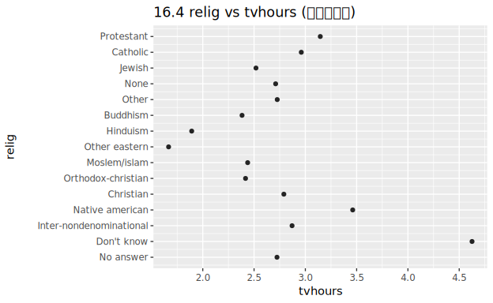
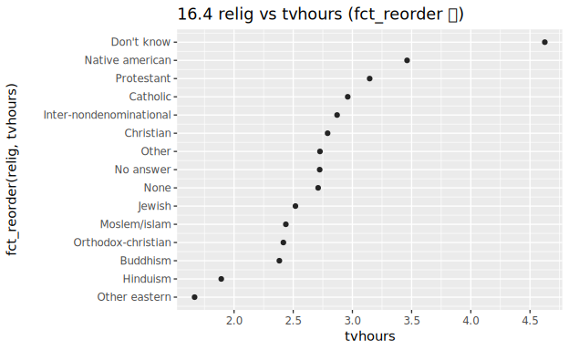
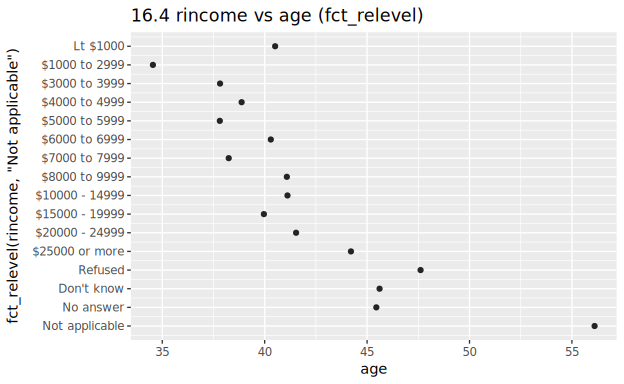
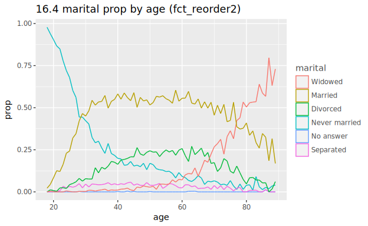
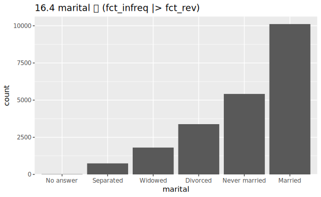

# 16. Factors (R4DS 2e Ch.16 "Factors")

> 🌐 **English** | [日本語](README.ja.md)

> Primary source: **R for Data Science 2e, Ch.16 "Factors"**
> <https://r4ds.hadley.nz/factors>
> Data: **gss_cat** (General Social Survey sample · 21,483 rows × 9 columns · `../_data/_raw/gss_cat.csv`).

A factor is a type representing a categorical variable with fixed possible values. R's **forcats** (tidyverse) `fct_*` functions manipulate factor **levels** (the categories' order and content). This chapter faithfully reproduces all sections of R4DS Ch.16 (16.2 basics / 16.3 GSS / 16.4 reordering / 16.5 modifying levels / 16.6 ordered factors) with real data. It's a **explanation → code → plot** walkthrough. Complete code: [`Factors.hs`](Factors.hs).

forcats's `fct_*` are implemented in analyze-side module **`Hanalyze.Data.Factor`** (Phase 28 Ch16). The `Factor` type holds `facLevels` (ordered list of level labels) + `facCodes` (0-indexed code per observation; NA = `-1`), representing the same "level order" concept as forcats.

```sh
cd docs/tutorials/16-factors
cabal run tut-16-factors   # generates 01-…svg .. 05-marital-bar.svg + table output per section
```

## Fidelity notes (documented differences from R4DS via measurement)

- **Horizontal dot plot** (`aes(x=value, y=category)`): hgg's `scatter` can't directly position categoricals, so we convert levels to numeric indices and use `axisBreaksLabeled` for y-axis labels (via `saveDotH` helper). Visually identical to R's `geom_point` + discrete y-axis.
- **Line colors**: R4DS §16.4 uses `scale_color_brewer(palette="Set1")`. We use hgg's default hue palette (colors differ but **series order** matches R via `fct_reorder2`).
- **count() zero-level behavior**: R's `count()` drops empty levels by default (we match this). `fctCount` itself returns empty levels (like `scale_x_discrete(drop=FALSE)`).
- **No fabricated numbers**: count tables, reorder level orders, and lump results all computed from gss_cat real data, cross-checked against R4DS outputs (values shown per section).

---

## 16.2 Factor basics

Character vectors have two problems: (1) typos go unnoticed, (2) they sort alphabetically. Factors fix this by **fixing possible levels**.

```r
# R (forcats)
x1 <- c("Dec", "Apr", "Jan", "Mar")
month_levels <- c("Jan","Feb","Mar","Apr","May","Jun",
                  "Jul","Aug","Sep","Oct","Nov","Dec")
factor(x1)                      # levels sorted alphabetically
factor(x1, levels = month_levels)   # meaningful order
fct(x1)                         # order of appearance (forcats · safe version)
```

```haskell
-- hgg (Hanalyze.Data.Factor)
levels (factor x1)                    -- ["Apr","Dec","Jan","Mar"]  (sorted)
levels (factorWith monthLevels x1)    -- preserves monthLevels order
levels (fct x1)                       -- ["Dec","Apr","Jan","Mar"]  (appearance order)
asTexts (factorWith monthLevels x1)   -- ["Dec","Apr","Jan","Mar"]  (back to values)
```

`factor` sorts levels, `factorWith` uses explicit levels, `fct` (forcats) uses appearance order. `facCodes` are 0-indexed integers; `asTexts` converts back to labels (NA → `Nothing`).

## 16.3 General Social Survey

gss_cat is a GSS sample with 6 factor columns (marital / race / rincome / partyid / relig / denom) and 3 integer columns (year / age / tvhours). Level frequencies are seen via `count()`.

```r
gss_cat |> count(race)
```

```haskell
fctCount (factorWith raceLevels race)   -- (level, count). empty levels dropped
```

Real data output (matches R4DS):

```
Other   1959
Black   3129
White  16395            -- Not applicable has 0 count, dropped
```

Most frequent levels: **relig = Protestant (10,846)** · **partyid = Independent (4,119)**.

## 16.4 Modifying factor order

### Before reordering — hard to interpret

Plot mean `tvhours` (daily TV viewing) by `relig`. Points scatter up and down without clear trend when levels keep gss_cat's default order.

```r
relig_summary <- gss_cat |>
  group_by(relig) |>
  summarize(tvhours = mean(tvhours, na.rm = TRUE), n = n())
ggplot(relig_summary, aes(x = tvhours, y = relig)) + geom_point()
```

```haskell
-- plot mean tvhours by relig in Data.Factor default level order
saveDotH "01-…svg" religPresent religMeanMap "tvhours" "relig" "…"
```



### Reordering with `fct_reorder`

`fct_reorder(relig, tvhours)` reorders levels **ascending** by `tvhours` value. Trend is now obvious — "Don't know" views most, Hindu and Other eastern least.

```r
ggplot(relig_summary, aes(x = tvhours, y = fct_reorder(relig, tvhours))) +
  geom_point()
```

```haskell
-- fctReorder levels by mean tvhours ascending (summary aggregates to median = one value per level, identity)
let religReord = levels (fctReorder medianD (factorWith religPresent religPresent) religMeans)
saveDotH "02-…svg" religReord religMeanMap "tvhours" "fct_reorder(relig, tvhours)" "…"
```



### Moving a level to front with `fct_relevel`

Plotting mean age by `rincome`: default order (amount) makes sense, except "Not applicable" isn't an amount, so we use `fct_relevel` to move it **to the front** (y-axis bottom).

```r
ggplot(rincome_summary,
       aes(x = age, y = fct_relevel(rincome, "Not applicable"))) + geom_point()
```

```haskell
let rincomeReleveled = levels (fctRelevel ["Not applicable"]
                                 (factorWith rincomePresent rincomePresent))
saveDotH "03-…svg" rincomeReleveled rincomeMeanMap "age" "fct_relevel(…)" "…"
```



### Legend order matches line endpoint with `fct_reorder2`

Plot `marital` (marital status) composition over age as line chart. `fct_reorder2(marital, age, prop)` reorders levels **descending** by `prop` at **max `age`**, so legend color order matches the line heights at graph right, improving readability.

```r
by_age <- gss_cat |> filter(!is.na(age)) |> count(age, marital) |>
  group_by(age) |> mutate(prop = n / sum(n))
ggplot(by_age, aes(x = age, y = prop,
                   color = fct_reorder2(marital, age, prop))) +
  geom_line(linewidth = 1) + labs(color = "marital")
```

```haskell
let maritalReord2 = levels (fctReorder2 (factorWith maritalPresent longCat) longAge longProp)
DF.empty |>> theme ThemeGrey <> layer (line (inline longAge) (inline longProp)
                      <> colorBy (inlineCat longCat) <> colorCats maritalReord2)
   <> xLabel "age" <> yLabel "prop" <> legendTitle "marital"
```



> Colors differ from R's Set1, but legend order (Widowed → Married → …) matches R's line heights at right endpoint.

### Frequency order with `fct_infreq` |> `fct_rev`

Bars are easier to read in frequency order. `fct_infreq` sorts **descending** by frequency; then `fct_rev` reverses to **ascending**.

```r
gss_cat |> mutate(marital = marital |> fct_infreq() |> fct_rev()) |>
  ggplot(aes(x = marital)) + geom_bar()
```

```haskell
let maritalOrder = levels (fctRev (fctInfreq (factorWith maritalLevels marital)))
DF.empty |>> theme ThemeGrey <> layer (bar (inlineCat names) (inline counts))
   <> scaleXDiscreteLimits maritalOrder
```



## 16.5 Modifying factor levels

### Relabel with `fct_recode`

`fct_recode` renames level labels for clarity. Mapping multiple old labels to one new label **merges** them.

```r
gss_cat |> mutate(partyid = fct_recode(partyid,
  "Republican, strong" = "Strong republican",
  "Republican, weak"   = "Not str republican",
  "Independent, near rep" = "Ind,near rep",
  "Independent, near dem" = "Ind,near dem",
  "Democrat, weak"     = "Not str democrat",
  "Democrat, strong"   = "Strong democrat")) |> count(partyid)
```

```haskell
fctRecode [ ("Republican, strong", "Strong republican")
          , ("Republican, weak",   "Not str republican")
          , ("Independent, near rep", "Ind,near rep")
          , ("Independent, near dem", "Ind,near dem")
          , ("Democrat, weak",     "Not str democrat")
          , ("Democrat, strong",   "Strong democrat") ] partyFac
```

Output (matches R4DS): No answer 154 / Don't know 1 / Other party 393 /
Republican, strong 2314 / Republican, weak 3032 / Independent, near rep 1791 /
Independent 4119 / Independent, near dem 2499 / Democrat, weak 3690 / Democrat, strong 3490.

### Combine levels with `fct_collapse`

```r
gss_cat |> mutate(partyid = fct_collapse(partyid,
  "other" = c("No answer","Don't know","Other party"),
  "rep" = c("Strong republican","Not str republican"),
  "ind" = c("Ind,near rep","Independent","Ind,near dem"),
  "dem" = c("Not str democrat","Strong democrat"))) |> count(partyid)
```

```haskell
fctCollapse [ ("other", ["No answer","Don't know","Other party"])
            , ("rep",   ["Strong republican","Not str republican"])
            , ("ind",   ["Ind,near rep","Independent","Ind,near dem"])
            , ("dem",   ["Not str democrat","Strong democrat"]) ] partyFac
```

Output (matches R4DS): **other 548 / rep 5346 / ind 8409 / dem 7180**.

### Lump small levels into "Other" with `fct_lump_*`

`fct_lump_lowfreq` combines rare levels while keeping "Other" as the smallest level.
For relig, everything except Protestant becomes Other.

```r
gss_cat |> mutate(relig = fct_lump_lowfreq(relig)) |> count(relig)
#> Protestant 10846 / Other 10637
```

```haskell
fctCount (fctLumpLowfreq (factorWith religLevels relig))   -- Protestant 10846 / Other 10637
```

`fct_lump_n(relig, n = 10)` keeps top-10 frequent levels. However, relig **already has an "Other" level** (224), which merges with the lump target, yielding "9 distinct + merged Other" (R4DS exercise 16.5.1 Q3 point).

```haskell
sortBy (Down . snd) (fctCount (fctLumpN 10 (factorWith religLevels relig)))
```

Output (matches R4DS): Protestant 10846 / Catholic 5124 / None 3523 / Christian 689 /
**Other 458** (= original 224 + lumped 234) / Jewish 388 / Buddhism 147 /
Inter-nondenominational 109 / Moslem/islam 104 / Orthodox-christian 95.

## 16.6 Ordered factors

`ordered()` creates a factor with `<` ordering between levels. ggplot2 uses viridis continuous colors; linear models apply polynomial contrasts (implementation holds `facOrdered` flag; color/contrast linkage is conceptual only).

```r
ordered(c("a", "b", "c"))    #> Levels: a < b < c
```

```haskell
let oz = ordered ["a","b","c"] ["a","b","c"]
levels oz     -- ["a","b","c"]   (a < b < c)
isOrdered oz  -- True
```

## 16.7 Summary

forcats provides a complete toolkit for handling factor levels (order and content). Reordering (`fct_reorder` / `fct_relevel` / `fct_reorder2` / `fct_infreq` / `fct_rev`) and level modification (`fct_recode` / `fct_collapse` / `fct_lump_*`) are all reproducible with `Hanalyze.Data.Factor` equivalents. For further study, McNamara & Horton's categorical data wrangling paper is recommended.

---

## Exercises

### 16.3.1

1. **Explore `rincome` distribution; what's wrong with the default bar plot?** — `rincome` is an ordered amount factor, but default bars have long overlapping labels. Use `coordFlip` (horizontal bars) or rotate labels. Also "Not applicable" mixes with amounts; `fct_relevel` moves it to the edge.
2. **Most frequent `relig` / `partyid`?** — relig = **Protestant** (10,846) · partyid = **Independent** (4,119). Confirm by max element of `fctCount`.
3. **Which `relig` corresponds to `denom`?** — `denom` (denomination) applies only to Christian groups (relig = Protestant / Catholic etc.). Cross-tabulating relig×denom shows non-Christian `denom` concentrated in "Not applicable".

### 16.4.1

1. **Suspicious `tvhours` values? Is mean reasonable?** — Extreme values near 24 hours/day appear. Mean is outlier-sensitive; **median** (change `fctReorder` aggregation to `medianD`) is more robust. This chapter uses `summarizeMean`, but swapping the aggregation function gives median version.
2. **Is each factor's level order arbitrary or principled?** — `marital` (No answer→Married), `rincome` (amount order), `partyid` (political spectrum) are **principled**. `relig` / `denom` are mostly arbitrary (worth reordering by frequency or meaning).
3. **Why does moving "Not applicable" to front place it at the graph bottom?** — Discrete axes pin **level 1 at the origin (bottom)**. `fct_relevel(…, "Not applicable")` makes it level 1, so it plots at the y-axis bottom.

### 16.5.1

1. **How do Democrat/Republican/Independent shares trend over time?** — Collapse `partyid` via `fct_collapse` into 3 groups (dem/rep/ind), compute proportions per `year`, plot as line. Trend becomes visible (same approach as §16.4's `by_age`, replacing x with `year`).
2. **How to lump `rincome` into few categories?** — Use `fct_collapse` to group "$20000–24999"–"$25000 or more" as "High", low amounts as "Low", rest as "Other/NA". Keep amount order intact by grouping coherently.
3. **Why 9 levels instead of 10 in the `fct_lump` example?** — `fct_lump_n(relig, n=10)` lump target is "Other", which merges with relig's **existing "Other" level** (224). Result is "9 distinct + merged Other" (see §16.5 above).

---

Previous → [`15-regexps`](../15-regexps/).
Next → [`17-datetimes`](../17-datetimes/) (Ch17 Dates and times).
