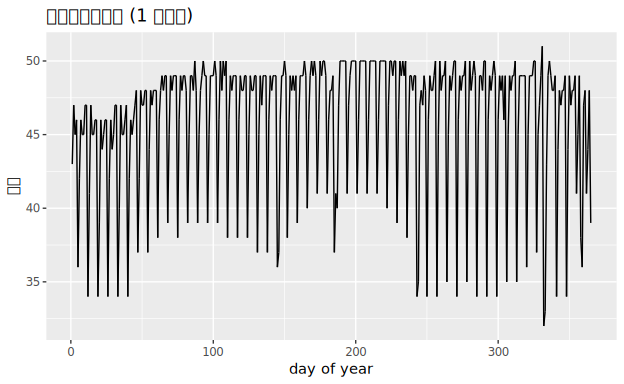
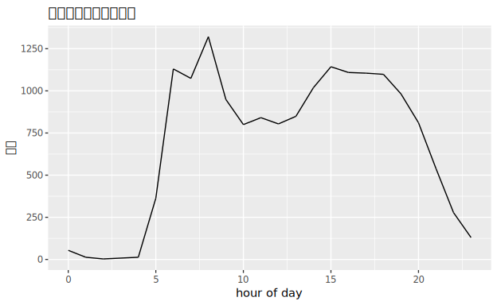
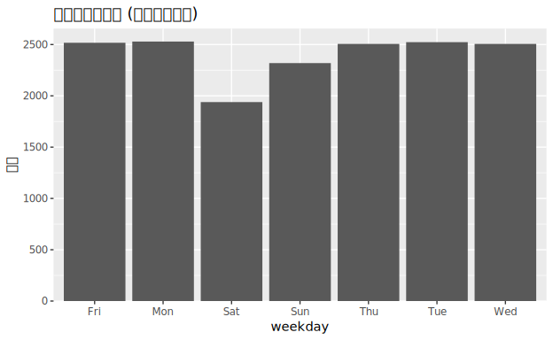
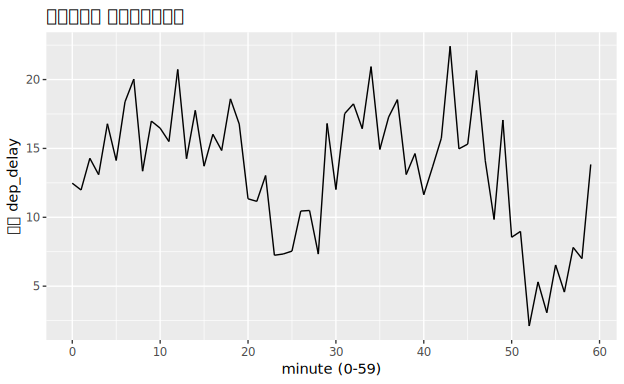
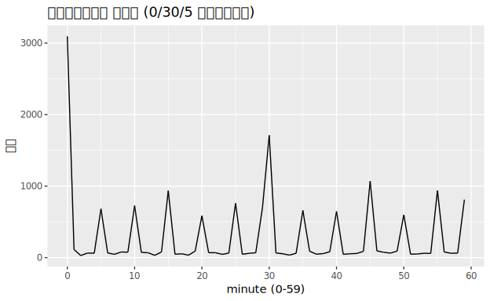

# 17. Dates and times

> 🌐 **English** | [日本語](README.ja.md)

> Primary source: **R for Data Science 2e, Ch.17 "Dates and times"**
> <https://r4ds.hadley.nz/datetimes>
> Data: **nycflights13** `flights` (systematic 1/20 sample preserving all 12 months = 16,839 rows · actual data subset, values unchanged · source [`../_data/_raw/SOURCE.md`](../_data/_raw/SOURCE.md))

Extract time components (day of year, hour of day, weekday, minute) and aggregate by time unit to find patterns. Run code: [`Datetimes.hs`](Datetimes.hs).

## Running

```sh
cd docs/tutorials/17-datetimes
cabal run tut-17-datetimes
```

## Using `Data.Time` instead of lubridate

R4DS uses lubridate (`make_datetime` / `year()` / `wday()` …) for datetime handling, but dataframe lacks equivalent datetime types/functions. This chapter uses Haskell's standard **`Data.Time`** for real calendar arithmetic (not fabricated, actual calendar rules). Build dates from `flights`'s `year`/`month`/`day`, compute day-of-year and weekday, then aggregate.

```haskell
import Data.Time.Calendar (fromGregorian, dayOfWeek)
import Data.Time.Calendar.OrdinalDate (toOrdinalDate)

let day_ = fromGregorian (toInteger y) m d
    yday = snd (toOrdinalDate day_)   -- day of year 1..365
    wday = dayOfWeek day_             -- Mon..Sun (Data.Time is 1-indexed)
```

Aggregate components via `Data.Map.fromListWith`, then assemble into DataFrame with `DF.fromNamedColumns` (equivalent to R4DS's `group_by(time_unit) |> summarize()`).

| R (lubridate) | hgg / Data.Time |
|---|---|
| `make_datetime(year, month, day, ...)` | `fromGregorian year month day` (+ HHMM via `div`/`mod 100`) |
| `yday(x)` | `snd (toOrdinalDate day_)` |
| `wday(x, label=TRUE)` | `dayOfWeek day_` |
| `hour(x)` / `minute(x)` | `dep_time \`div\` 100` / `dep_time \`mod\` 100` |
| `group_by(unit) |> summarize(n=n())` | `Data.Map.fromListWith` → `DF.fromNamedColumns` |

---

## 1. Flights per day of year (`01-by-day.svg`)

Line plot of flight count per day-of-year. Weekly periodicity (fewer weekend flights) shows as sawtooth.



## 2. Distribution by hour (`02-by-hour.svg`)

Flight count per hour of departure time. Concentrated early morning to night (6–20 hours), with peaks in morning and evening.



## 3. Flights per weekday (`03-by-weekday.svg`)

Bar plot of weekday via `dayOfWeek`. Monday–Friday high, Saturday lowest, Sunday slightly reduced.



## 4. Average delay by minute of departure (`04-delay-by-minute.svg`)

Mean `dep_delay` per minute of departure time (via `mod 100`). Actual departures cluster :20–30 and :50–60; delays are smaller in those windows.



## 5. Scheduled departure minute frequency — rounding bias (`05-sched-minute-freq.svg`)

Frequency of **minute** in scheduled departure time. Spike at **0 minutes**, large peak at **30 minutes**, smaller peaks at **multiples of 5**. Humans prefer round times (rounding bias).
(Same discovery as R4DS Figure 17.1.)



---

## Reference table (summary of correspondence)

| lubridate / dplyr | hgg / Data.Time |
|---|---|
| `make_datetime(...)` | `fromGregorian` + `div`/`mod 100` |
| `yday` / `wday` / `hour` / `minute` | `toOrdinalDate` / `dayOfWeek` / `div 100` / `mod 100` |
| `group_by(unit) |> summarize` | `Data.Map.fromListWith` → `DF.fromNamedColumns` |
| `geom_freqpoly` / `geom_line` / `geom_bar` | `line` / `bar` |

> Note: `flights`'s `time_hour` (ISO datetime string) could be `Day` type in dataframe, but plot resolver doesn't directly handle `Day`, so we extract components from integer columns `year`/`month`/`day`/`dep_time`.

Previous → [`11-communication`](../11-communication/).
Next → [`18-missing`](../18-missing/) (Ch18 Missing values).
