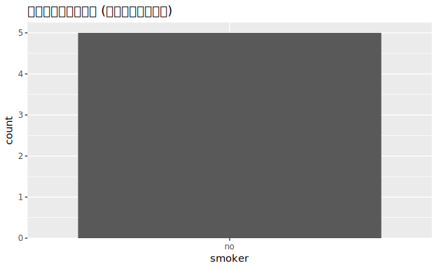
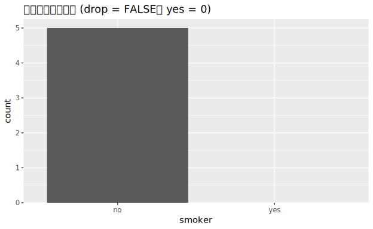

# 18. Missing values

> 🌐 **English** | [日本語](README.ja.md)

> Primary source: **R for Data Science 2e, Ch.18 "Missing values"**
> <https://r4ds.hadley.nz/missing-values>
> Data: R4DS text examples **treatment / stocks / health** (CSV versions of textbook values).

Learn handling **explicit missing** (`NA`) and **implicit missing** (rows that don't exist). Table operations dominate; R4DS has only 2 figures (factor empty groups presence/absence). Run code: [`Missing.hs`](Missing.hs). dataframe lacks `fill`/`complete` etc., so we compute in Haskell and assemble with `DF.fromNamedColumns`.

## Running

```sh
cd docs/tutorials/18-missing
cabal run tut-18-missing
```

---

## 1. Explicit missing — `fill` (forward fill)

In `treatment`, `person` is `NA` where it continues for the same person. Fill with preceding value ("last observation carried forward").

| R | hgg |
|---|---|
| `treatment |> fill(person)` | Custom `fillForward :: [Maybe a] -> [Maybe a]` |

```
person            treatment response        person (after fill)
Derrick Whitmore  1         7          →     Derrick Whitmore
NA                2         10               Derrick Whitmore
NA                3         NA               Derrick Whitmore
Katherine Burke   1         4                Katherine Burke
```

## 2. Replace with constant — `coalesce`

Replace `NA` with a fixed value (here, 0).

| R | hgg |
|---|---|
| `coalesce(response, 0)` | `map (fromMaybe 0) responseVals` |

## 3. Implicit missing — make explicit with `pivot_wider`

`stocks` has **2020 Q4 explicitly `NA`** and **2021 Q1 missing entirely** (implicit).
Pivoting `qtr` to columns exposes missing combinations as `NA`.

| R | hgg |
|---|---|
| `stocks |> pivot_wider(names_from=qtr, values_from=price)` | Custom pivot (qtr→cols · missing is `Nothing`) |

```
year   q1       q2     q3     q4
2020   1.88     0.59   0.35   NA      ← 2020 Q4 explicit NA
2021   NA       0.92   0.17   2.66    ← 2021 Q1 row missing → NA
```

## 4. Fill all combinations — `complete`

Generate all 8 `(year × qtr)` pairs, fill missing rows with `NA`.

| R | hgg |
|---|---|
| `stocks |> complete(year, qtr)` | Generate all pairs, fetch `price` per pair (missing → `Nothing`) |

Now `2021 Q1 = NA` appears as one explicit row.

## 5. Factors and empty groups (2 figures)

In `health`, `smoker` has levels `{yes, no}`, but everyone is `no`. `yes` is an **empty group**.

### Drop empty groups (default) (`01-drop-empty.svg`)

Counting only observed values shows only `no` bars.



### Keep empty groups (`drop = FALSE`) (`02-keep-empty.svg`)

Keeping all levels shows `yes = 0` as a zero-height bar on x-axis.

| R | hgg |
|---|---|
| `geom_bar()` (default) | Aggregate observed only, then `bar` |
| `scale_x_discrete(drop = FALSE)` | Explicitly include all levels in `bar` (`yes=0` included) |



> dataframe lacks factor types, so "empty groups" don't auto-appear. We reproduce R4DS's `drop = FALSE` intent (show all possible levels) by explicitly adding `yes=0`.

---

## Reference table (summary of correspondence)

| tidyr / dplyr | hgg |
|---|---|
| `fill(col)` | Custom `fillForward` (forward fill) |
| `coalesce(x, v)` | `map (fromMaybe v)` |
| `pivot_wider` | Custom pivot (missing is `Nothing`) |
| `complete(a, b)` | Generate all pairs + fetch values per pair |
| `scale_x_discrete(drop=FALSE)` | Explicitly include all levels in `bar` |

Previous → [`17-datetimes`](../17-datetimes/).
Next → [`19-joins`](../19-joins/) (Ch19 Joins).
