# Vega-Lite Gallery Examples — hgg Recreation

> 🌐 **English** | [日本語](vega-lite-gallery.ja.md)

Code collection recreating representative examples from each section of the [Vega-Lite examples gallery](https://vega.github.io/vega-lite/examples/). Implemented and render-verified as a working executable `hgg-svg/examples/VegaLiteGallery.hs`.

```sh
cabal run vega-lite-gallery   # → generates design/vega-lite-gallery/*.svg (28 images)
```

> Comprehensive comparison and 5-axis evaluation: [comparison-vega-lite.md](comparison-vega-lite.md).
> This guide follows the principle: **show working code for examples we can draw; clearly mark those we cannot**.

## Reproducible examples (with code)

All self-contained with inline data (facet uses Resolver only). Built with `purePlot <> layer (...) <> …` and output with `saveSVG`.

### Bar Charts

```haskell
-- Simple Bar Chart
purePlot <> layer (bar (inlineCat ["A","B","C","D","E"]) (inline [28,55,43,91,81]))

-- Grouped Bar Chart (dodge) / Stacked / Normalized switch by position
let gcat = inlineCat (concatMap (replicate 3) ["A","B","C"])
    ggrp = inlineCat (take 9 (cycle ["x","y","z"]))
    gval = inline [3,5,2, 4,1,6, 2,3,4]
purePlot <> layer (bar gcat gval <> color ggrp <> position PosDodge)   -- side-by-side
purePlot <> layer (bar gcat gval <> color ggrp <> position PosStack)   -- stacked
purePlot <> layer (bar gcat gval <> color ggrp <> position PosFill)    -- 100% stacked
```

| Simple | Grouped (dodge) | Stacked | Normalized |
|---|---|---|---|
| 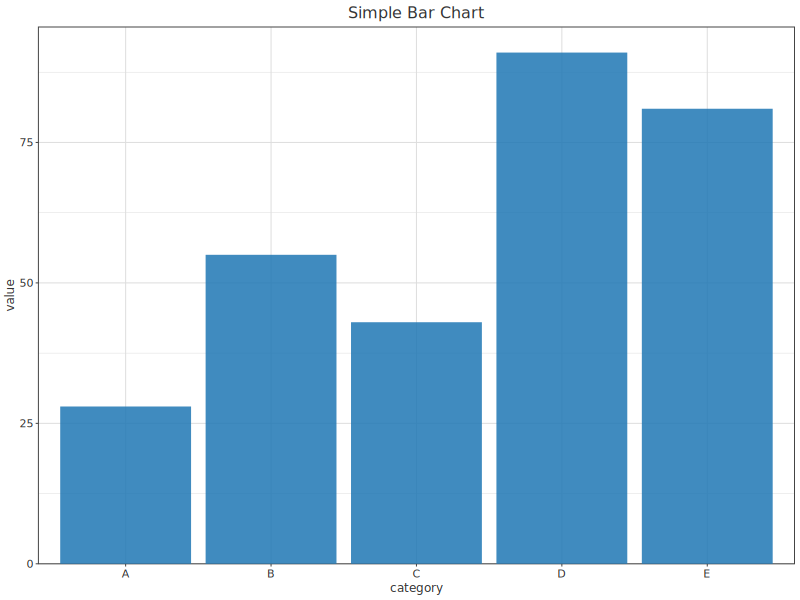 | 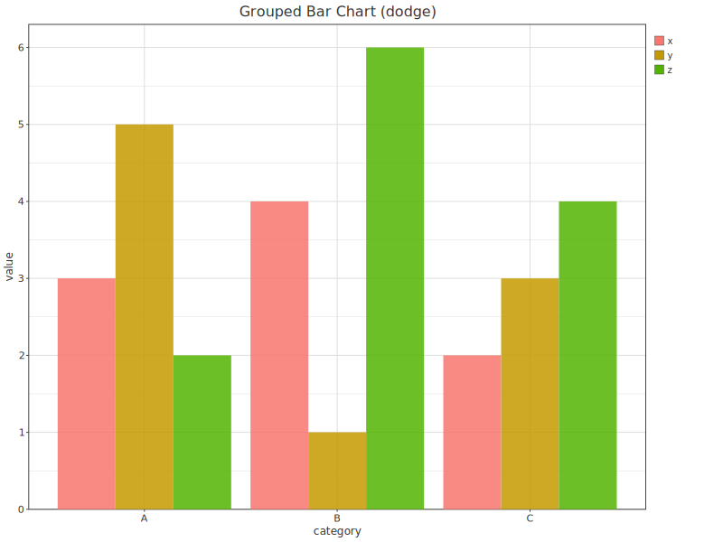 | 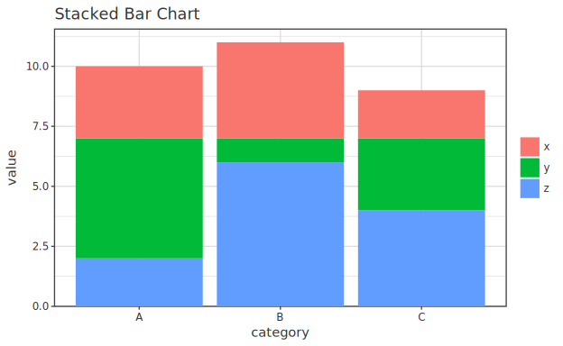 | 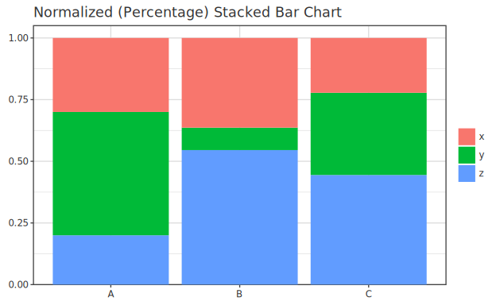 |

### Histograms / Density / Cumulative

```haskell
purePlot <> layer (histogram (inline vals))   -- Histogram
purePlot <> layer (density   (inline vals))   -- Density Plot
purePlot <> layer (ecdf      (inline vals))   -- Cumulative Frequency Distribution
```

| Histogram | Density Plot | ECDF |
|---|---|---|
| 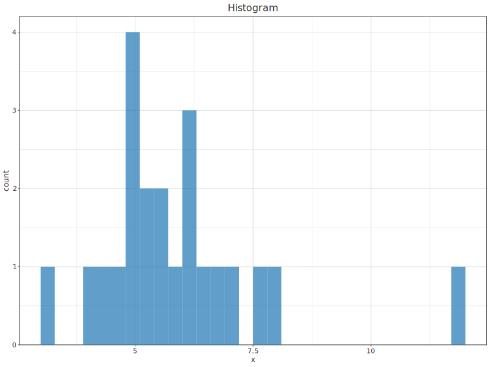 | 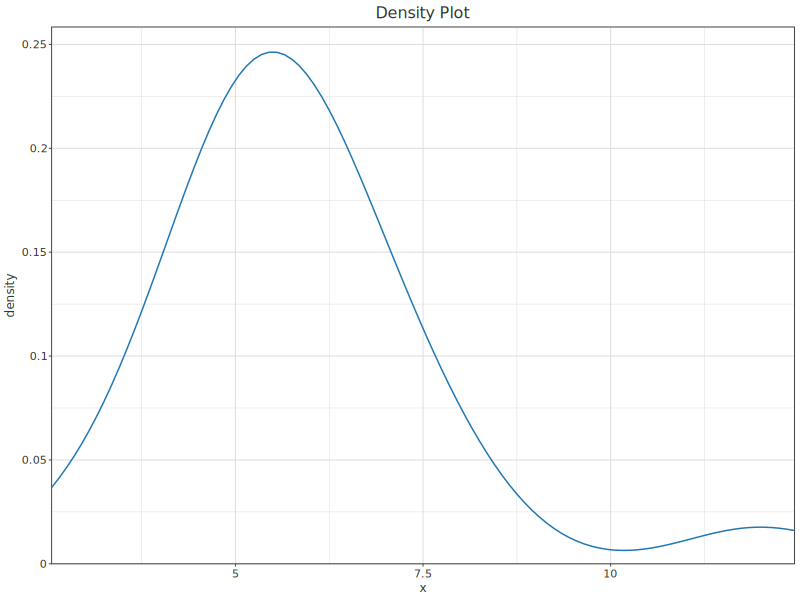 | 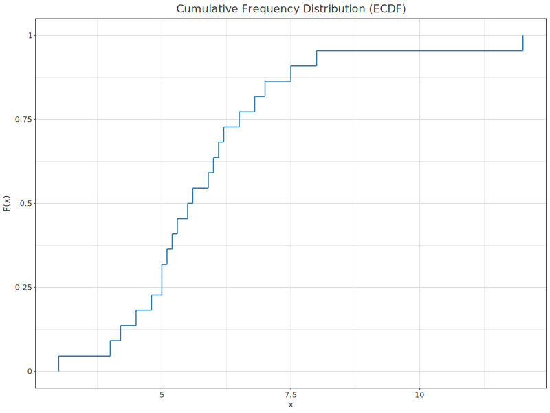 |

### Scatter & Strip

```haskell
purePlot <> layer (scatter (inline sx) (inline sy) <> size 6)                     -- Scatterplot
purePlot <> layer (scatter (inline sx) (inline sy) <> color grp <> sizeBy sz)     -- Bubble Plot
purePlot <> layer (strip (inlineCat (replicate n "v")) (inline vals))             -- 1D Strip Plot
```

| Scatterplot | Bubble Plot | Strip Plot |
|---|---|---|
| 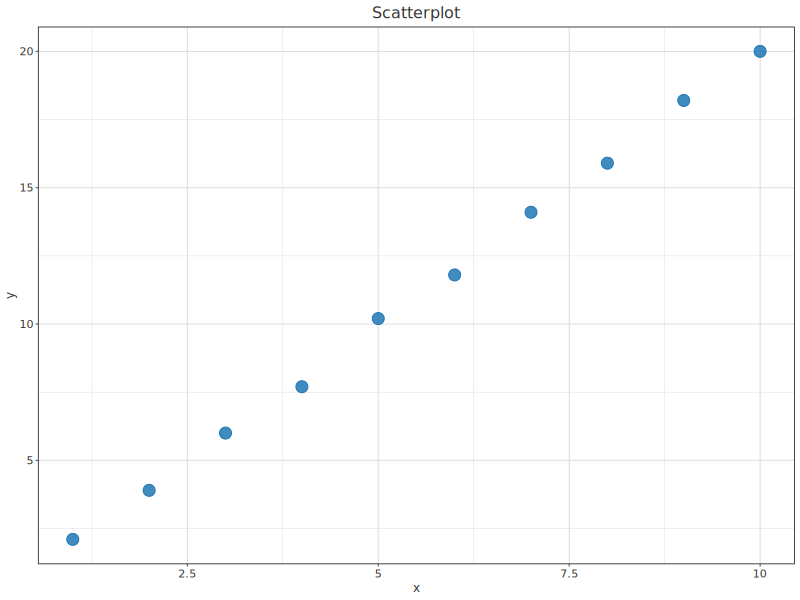 | 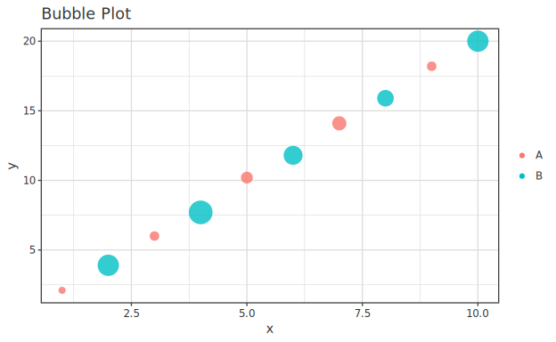 | 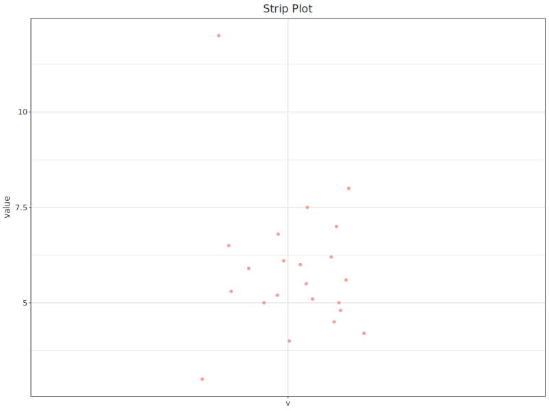 |

### Line Charts

```haskell
purePlot <> layer (line (inline lx) (inline ly) <> stroke 2)                      -- Line Chart
-- Multi Series = overlay multiple line layers
purePlot <> layer (line lx l1 <> colorStatic "#1f77b4") <> layer (line lx l2 <> colorStatic "#d62728")
purePlot <> layer (step (inline lx) (inline sy) <> stroke 2)                      -- Step Chart
```

| Line Chart | Multi Series | Step Chart |
|---|---|---|
| 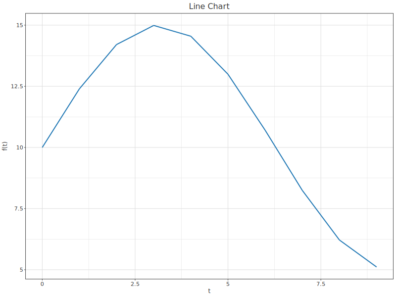 | 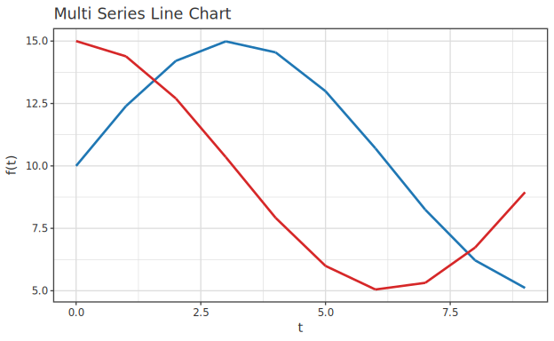 | 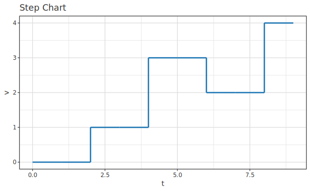 |

### Area Charts

```haskell
-- Area Chart = band from 0..y with line overlay
purePlot <> layer (band (inline ax) (inline (replicate n 0)) (inline ay) <> alpha 0.5)
         <> layer (line (inline ax) (inline ay) <> stroke 2)
```

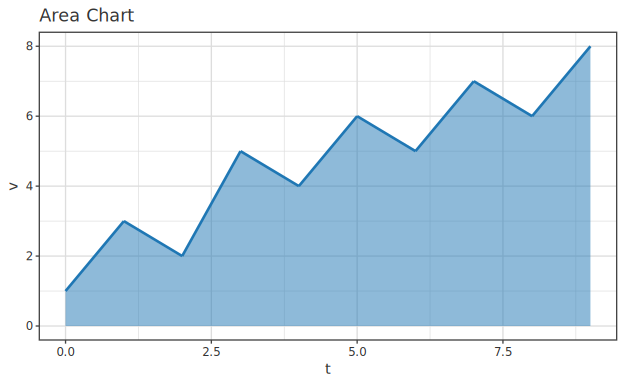

#### Streamgraph (centered stacked area)

```haskell
-- Series split by color aes. Each x: stacked series, baseline=-(Σy)/2 (silhouette centering)
purePlot <> layer (stream (inline t) (inline value) <> color (inlineCat series) <> alpha 0.85)
```

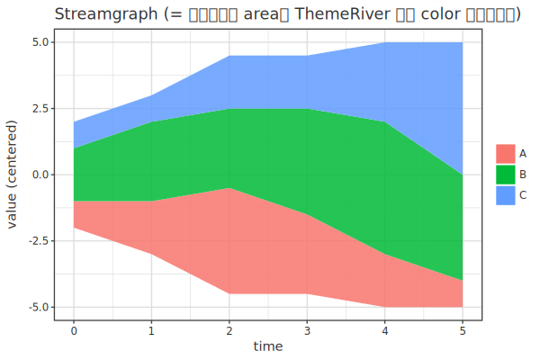

### Table-based / Circular

```haskell
purePlot <> layer (heatmap hx hy hv)                          -- Table Heatmap (x/y categorical)
purePlot <> layer (pie (inlineCat cats) (inline vals))        -- Pie Chart
purePlot <> layer (bar cats vals <> color cats) <> coordPolar -- Radial Plot (polar bar)
```

| Table Heatmap | Pie Chart | Radial Plot |
|---|---|---|
| 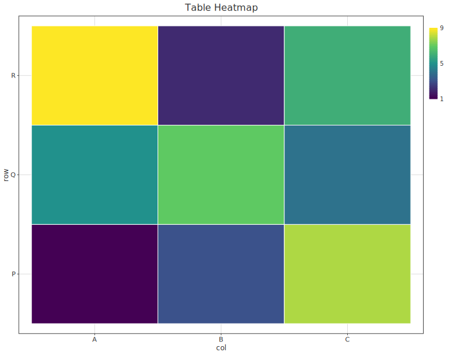 | 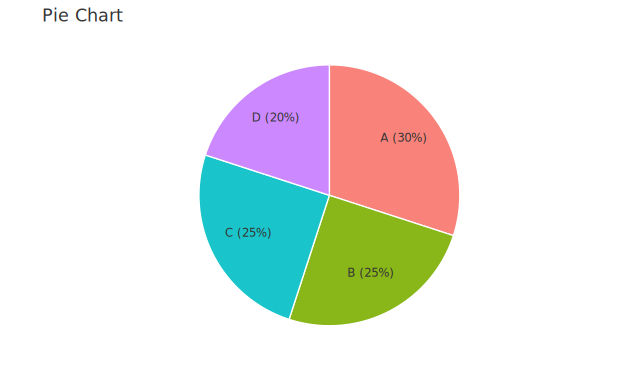 | 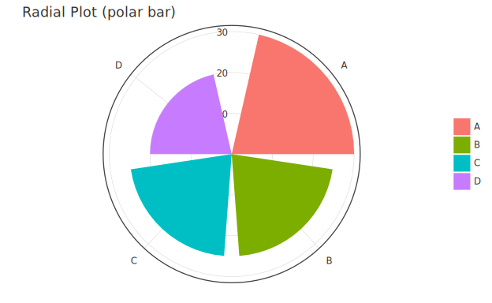 |

### Advanced Calculations

```haskell
-- Linear Regression (core has built-in OLS. CI bands and GLM/GP via hanalyze toPlot)
purePlot <> layer (scatter (inline sx) (inline sy))
         <> layer (regressionLine (inline sx) (inline sy) <> colorStatic "#d62728")

purePlot <> layer (geomQQ (inline vals))                                   -- QQ Plot
purePlot <> layer (parallelCoords [inline c1, inline c2, inline c3])       -- Parallel Coordinates
purePlot <> layer (waterfall (inlineCat steps) (inline deltas))            -- Waterfall Chart
```

| Linear Regression | QQ Plot | Parallel Coordinates | Waterfall |
|---|---|---|---|
| 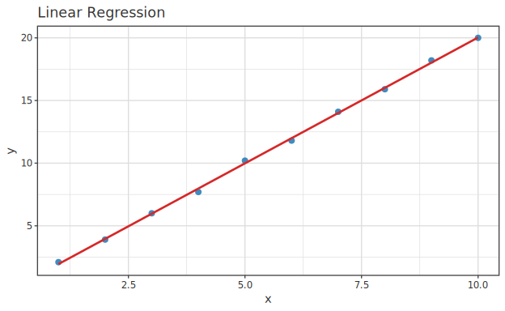 | 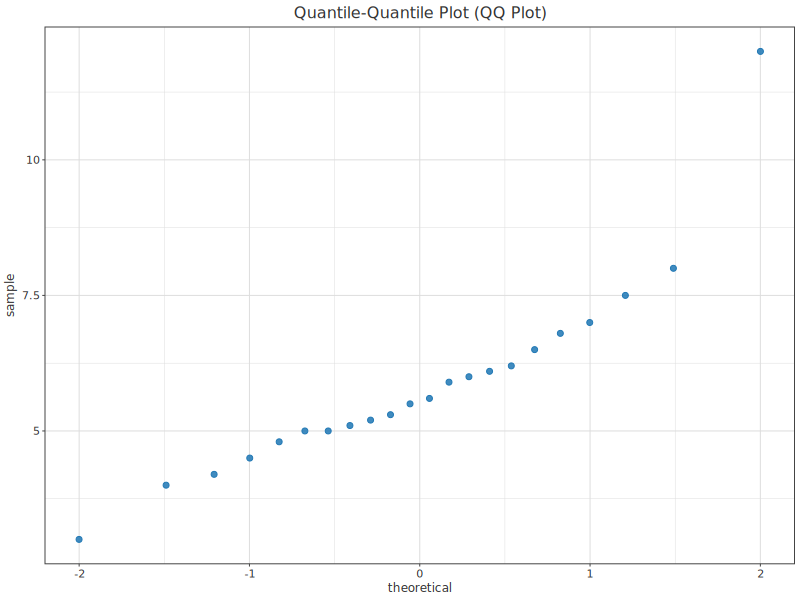 | 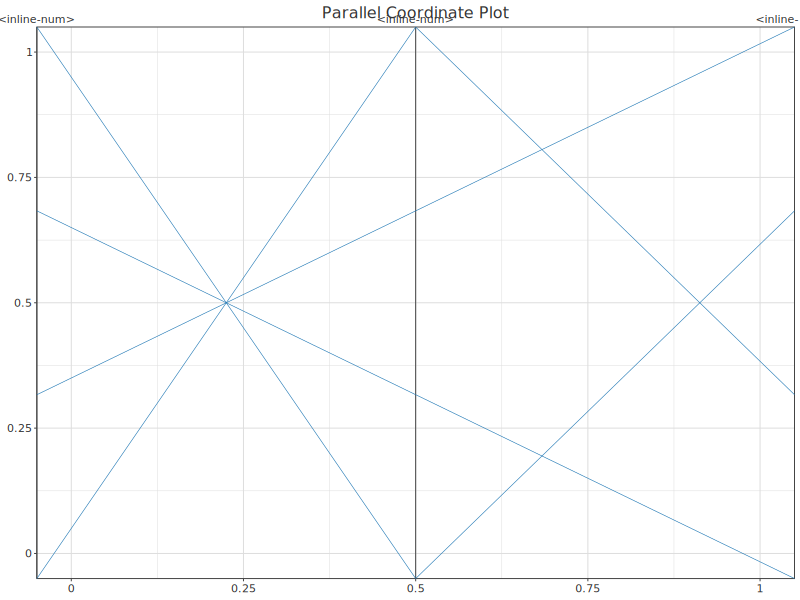 | 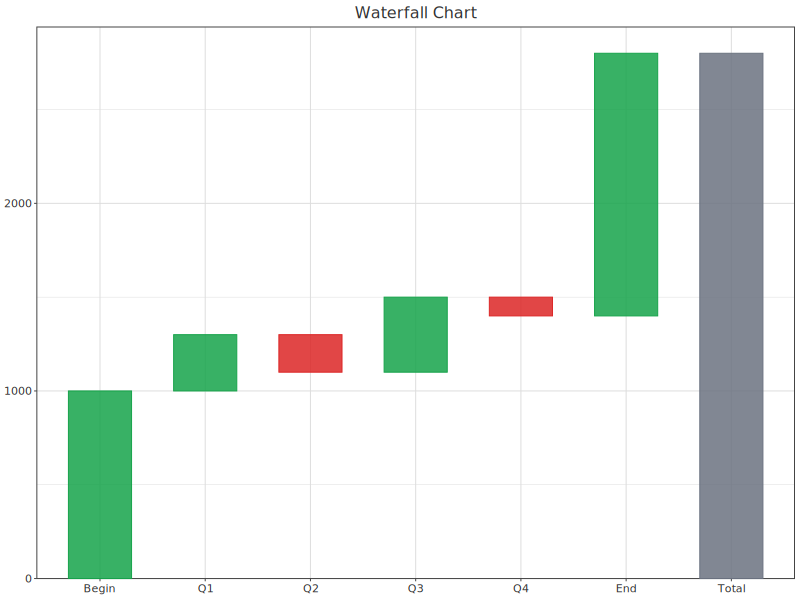 |

### Error Bars & Box Plots

```haskell
-- Error Bars Showing Confidence Interval (pointRange = x, y, error)
purePlot <> layer (pointRange (inline xs) (inline ys) (inline errs))
purePlot <> layer (boxplot (inline vals))                                  -- Box Plot (Tukey 1.5 IQR)
```

| Error Bars (CI) | Box Plot |
|---|---|
| 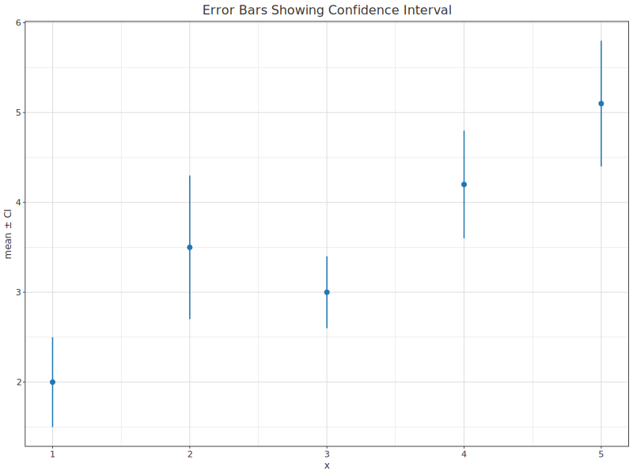 | 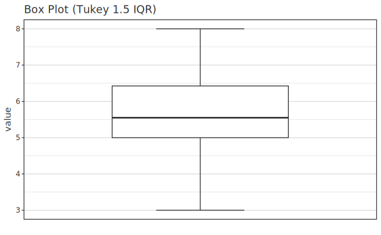 |

### Distributions

```haskell
purePlot <> layer (violin    cat val)     -- Violin Plot
purePlot <> layer (swarm     cat val)     -- Swarm (beeswarm)
purePlot <> layer (raincloud cat val)     -- Raincloud
purePlot <> layer (ridge     cat val)     -- Ridgeline
```

| Violin | Swarm | Raincloud | Ridgeline |
|---|---|---|---|
| 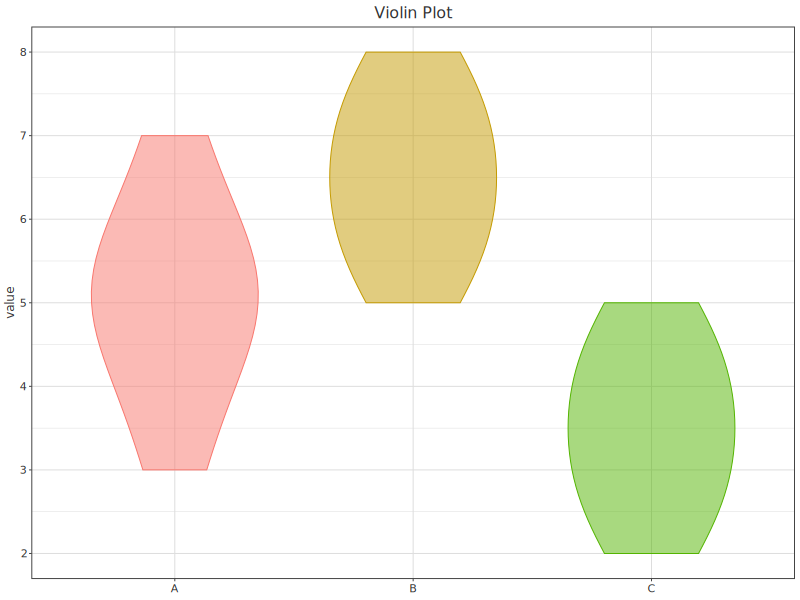 | 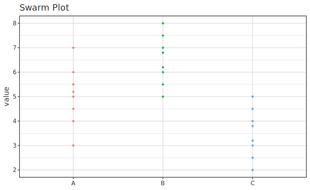 | 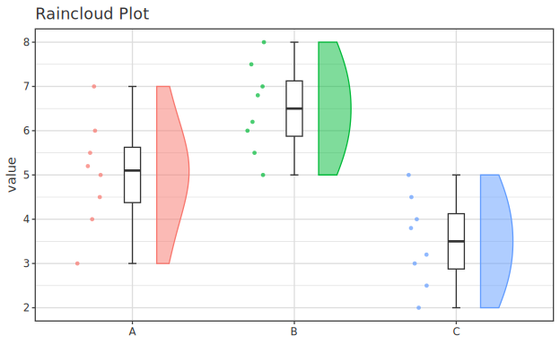 | 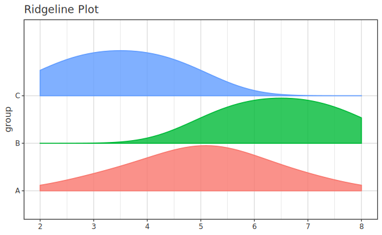 |

### Faceting (Trellis)

```haskell
-- Column name reference requires Resolver and saveSVGWith
saveSVGWith "trellis.svg" resolver $
  purePlot <> layer (scatter "x" "y" <> color "g" <> size 6) <> facet "g"
```

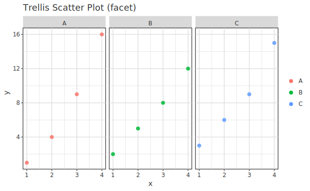

**28 examples render-verified in total**. Images embedded above in `docs/images/vega-lite/01..28-*.svg`. SVG source can be regenerated in `design/vega-lite-gallery/` by running `cabal run vega-lite-gallery`.

## Unimplemented examples — categorized

Vega-Lite gallery examples we haven't reproduced, split into two categories.

### A. Out of spec by design (intentionally out-of-scope)

**These 3 families have no implementation planned** (users don't need them). We don't carry them in the spec.

| Family | Vega-Lite examples | Reason |
|---|---|---|
| **Geography / Maps** | Entire Maps section (Choropleth / Zipcode·Airport dots / Tube Lines / Projection explorer / Earthquakes / Wind Vector Map …) | geoshape / projection not in spec design |
| **Interactivity** | Entire Interactive / Interactive Multi-View sections (Hover / Brush / Pan-Zoom / Crossfilter / Widgets / Minimap / Dynamic Legend …) | Focus on static output. selection/params interactive grammar not in design |
| **Images / Isotypes** | Image-based Scatter Plot / Isotype Dot Plot (image·emoji) / Isotype Grid | image mark not in spec design |

### B. Future work (genuinely missing, room for implementation)

Excluding the out-of-scope A above, things currently not natively supported but could be:

| Missing feature | Vega-Lite examples | Notes |
|---|---|---|
| **repeat operator only** | Repeat-and-Layer | ★concat family (Vertical/Horizontal/Nested View Concatenation) **already implemented via `subplots`/`subplotCols`** (mixed spec arbitrary grid, **nestable**). Only missing: `repeat` (auto-expand field list) dedicated operator (currently hand-place in `subplots`) |
| ~~**Streamgraph**~~ | Streamgraph | ✅ **implemented with `stream x y <> color "series"`** (Phase 52.D2). Centered stacked area (silhouette, baseline=-Σy/2). Wiggle minimization (ThemeRiver) not yet |
| **Horizon Graph** | Horizon Graph | No dedicated wrapped-band rendering |
| **Trail mark (variable-width line)** | Line Chart with Varying Size (trail) | No line width encoding (WebGL fixed at 1px) |
| **Mosaic Chart** | Mosaic Chart with Labels | No variable-width stacked bar |
| **Ternary chart** | Ternary chart | No barycentric coordinates |
| **Candlestick / Bullet** | Candlestick Chart / Bullet Chart | No dedicated mark (layered workaround needs hand-composition) |
| **Gantt (ranged bar)** | Gantt Chart | Intervals approximate with `lineRange`/`crossbar`, but ranged **bar** not native |

> These correspond to "gaps" in [comparison-vega-lite.md](comparison-vega-lite.md). Group B has room for mark additions and composition operator extensions — candidates for future Phases.

## Bonus: hgg-unique strengths (not in Vega-Lite)

Conversely, things in hgg not in the Vega-Lite gallery: **MCMC trace / ESS / autocorrelation** (Bayesian diagnostics), **model DAG** (HBM structure), **forest / funnel** (meta-analysis), **wafer map** (semiconductor), **3D scatter**, plus **hanalyze integration's `toPlot`** (draw GLM/GP/survival/forecasting with statistically correct uncertainty). Details: [comparison-vega-lite.md Axis 4](comparison-vega-lite.md).
